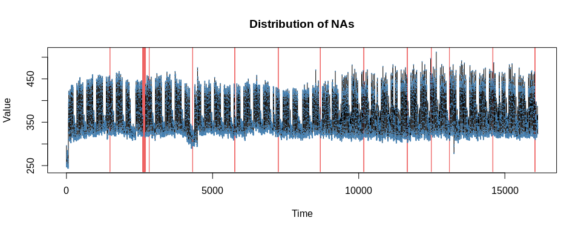
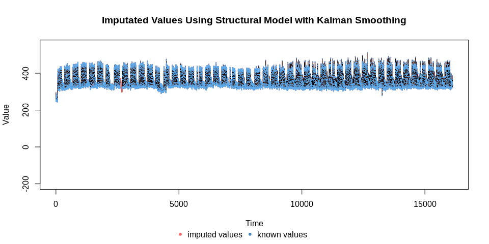
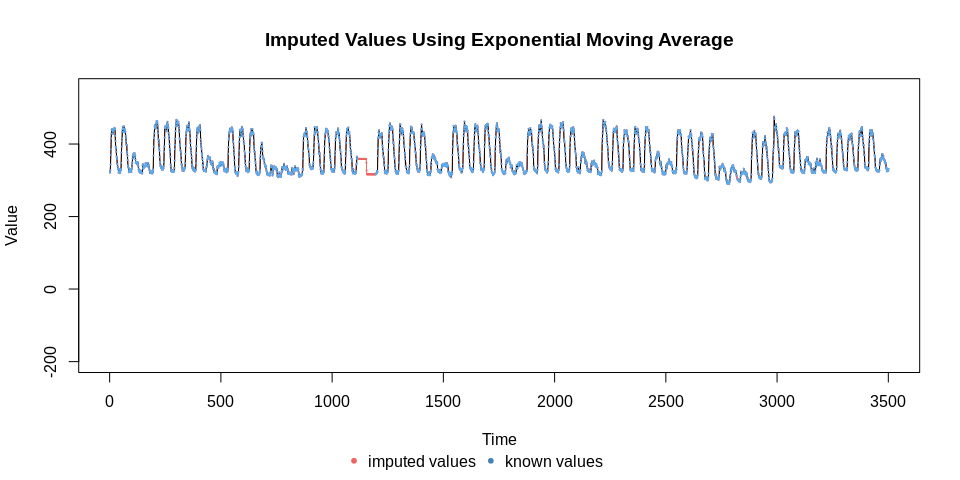

KE5105 - Building Electrical Consumption Forecasting
================

Extract, Transform and Load Data 5 - Data Imputation MD1 & MD6
==============================================================

Summary of Findings
===================

-   Missing data occurs periodically at the end of each month.
-   All methods perform similarly for small gaps.
-   Test for missing completely at random (MCAR) patterns show some evidence that the missing data is not MCAR in MD1.

Load libraries
==============

``` r
library(ggplot2)
library(xts)
```

    ## Loading required package: zoo

    ## 
    ## Attaching package: 'zoo'

    ## The following objects are masked from 'package:base':
    ## 
    ##     as.Date, as.Date.numeric

``` r
library(imputeTS)
```

    ## 
    ## Attaching package: 'imputeTS'

    ## The following object is masked from 'package:zoo':
    ## 
    ##     na.locf

``` r
library(MissMech)
```

MD1
===

Load data
=========

``` r
md1_agg_df <- read.csv("/home/tkokkeng/Documents/KE5105/ETL/source/processed_bldg_data/MD1.csv", header = TRUE, stringsAsFactors = FALSE)
head(md1_agg_df)
```

Convert the Pt\_timeStamp strings to POSIX time
-----------------------------------------------

``` r
md1_agg_df$Pt_timeStamp <- strptime(md1_agg_df$Pt_timeStamp, format = "%Y-%m-%d %H:%M:%S", tz="GMT")
head(md1_agg_df)
```

``` r
str(md1_agg_df$Pt_timeStamp[2])
```

    ##  POSIXlt[1:1], format: "2016-12-01 20:30:00"

Convert the time series data for plotting
-----------------------------------------

``` r
ts <- xts(md1_agg_df$PWM_30min_avg, as.Date(md1_agg_df$Pt_timeStamp))
head(ts)
```

    ##            [,1]
    ## 2016-12-01   NA
    ## 2016-12-01   NA
    ## 2016-12-01   NA
    ## 2016-12-01   NA
    ## 2016-12-01   NA
    ## 2016-12-01   NA

Plot the time series data
-------------------------

``` r
autoplot(ts, ylab = "Aggregated PWM", xlab = "Time") + ggtitle("SDE-3 Aggregated PWM")
```

    ## Warning: Removed 1842 rows containing missing values (geom_path).


Get the time series data after the data outage
----------------------------------------------

``` r
md1_less_df = md1_agg_df[md1_agg_df$Pt_timeStamp > as.POSIXct("2018-01-01 00:00:00", tz = "GMT") &
                           md1_agg_df$Pt_timeStamp < as.POSIXct("2018-12-02 23:30:00", tz = "GMT"),]
head(md1_less_df)
```

``` r
ts_less <- xts(md1_less_df$PWM_30min_avg, as.Date(md1_less_df$Pt_timeStamp))
head(ts_less)
```

    ##              [,1]
    ## 2018-01-01 295.75
    ## 2018-01-01 265.75
    ## 2018-01-01 254.50
    ## 2018-01-01 247.00
    ## 2018-01-01 253.00
    ## 2018-01-01 257.75

Plot the time series data
-------------------------

``` r
autoplot(ts_less, ylab = "Aggregated PWM", xlab = "Time") +
  ggtitle("MD1 Aggregated PWM from 1 Jan 2018")
```


Plot the missing data
---------------------

``` r
plotNA.distribution(md1_less_df$PWM_30min_avg, cex=.1)
```



Many of the NAs appear at the end of each month (below) for the time period 2300H to 0000H (3 observations).

``` r
md1_less_df[is.na(md1_less_df$PWM_30min_avg) & (md1_less_df$Pt_timeStamp > as.POSIXct("2018-03-25 00:00:00")),
            "Pt_timeStamp"]
```

    ##  [1] "2018-03-31 23:00:00 GMT" "2018-03-31 23:30:00 GMT"
    ##  [3] "2018-04-01 00:00:00 GMT" "2018-04-30 23:00:00 GMT"
    ##  [5] "2018-04-30 23:30:00 GMT" "2018-05-01 00:00:00 GMT"
    ##  [7] "2018-05-31 23:00:00 GMT" "2018-05-31 23:30:00 GMT"
    ##  [9] "2018-06-01 00:00:00 GMT" "2018-06-30 23:00:00 GMT"
    ## [11] "2018-06-30 23:30:00 GMT" "2018-07-01 00:00:00 GMT"
    ## [13] "2018-07-31 23:00:00 GMT" "2018-07-31 23:30:00 GMT"
    ## [15] "2018-08-01 00:00:00 GMT" "2018-08-31 23:00:00 GMT"
    ## [17] "2018-08-31 23:30:00 GMT" "2018-09-01 00:00:00 GMT"
    ## [19] "2018-09-18 02:00:00 GMT" "2018-09-18 02:30:00 GMT"
    ## [21] "2018-09-30 23:00:00 GMT" "2018-09-30 23:30:00 GMT"
    ## [23] "2018-10-01 00:00:00 GMT" "2018-10-31 23:00:00 GMT"
    ## [25] "2018-10-31 23:30:00 GMT" "2018-11-01 00:00:00 GMT"
    ## [27] "2018-11-30 23:00:00 GMT" "2018-11-30 23:30:00 GMT"
    ## [29] "2018-12-01 00:00:00 GMT"

Plot the distribution of the missing data
-----------------------------------------

``` r
plotNA.distributionBar(md1_less_df$PWM_30min_avg, breaks = 11)
```


Plot the distribution of the missing data by gap size
-----------------------------------------------------

``` r
plotNA.gapsize(md1_less_df$PWM_30min_avg, byTotalNA = TRUE)
```


Missing data statistics
-----------------------

``` r
statsNA(md1_less_df$PWM_30min_avg, bins = 11)
```

    ## [1] "Length of time series:"
    ## [1] 16126
    ## [1] "-------------------------"
    ## [1] "Number of Missing Values:"
    ## [1] 117
    ## [1] "-------------------------"
    ## [1] "Percentage of Missing Values:"
    ## [1] "0.726%"
    ## [1] "-------------------------"
    ## [1] "Stats for Bins"
    ## [1] "  Bin 1 (1466 values from 1 to 1466) :      0 NAs (0%)"
    ## [1] "  Bin 2 (1466 values from 1467 to 2932) :      88 NAs (6%)"
    ## [1] "  Bin 3 (1466 values from 2933 to 4398) :      3 NAs (0.205%)"
    ## [1] "  Bin 4 (1466 values from 4399 to 5864) :      3 NAs (0.205%)"
    ## [1] "  Bin 5 (1466 values from 5865 to 7330) :      3 NAs (0.205%)"
    ## [1] "  Bin 6 (1466 values from 7331 to 8796) :      3 NAs (0.205%)"
    ## [1] "  Bin 7 (1466 values from 8797 to 10262) :      3 NAs (0.205%)"
    ## [1] "  Bin 8 (1466 values from 10263 to 11728) :      3 NAs (0.205%)"
    ## [1] "  Bin 9 (1466 values from 11729 to 13194) :      5 NAs (0.341%)"
    ## [1] "  Bin 10 (1466 values from 13195 to 14660) :      3 NAs (0.205%)"
    ## [1] "  Bin 11 (1466 values from 14661 to 16126) :      3 NAs (0.205%)"
    ## [1] "-------------------------"
    ## [1] "Longest NA gap (series of consecutive NAs)"
    ## [1] "82 in a row"
    ## [1] "-------------------------"
    ## [1] "Most frequent gap size (series of consecutive NA series)"
    ## [1] "3 NA in a row (occuring 11 times)"
    ## [1] "-------------------------"
    ## [1] "Gap size accounting for most NAs"
    ## [1] "82 NA in a row (occuring 1 times, making up for overall 82 NAs)"
    ## [1] "-------------------------"
    ## [1] "Overview NA series"
    ## [1] "  2 NA in a row: 1 times"
    ## [1] "  3 NA in a row: 11 times"
    ## [1] "  82 NA in a row: 1 times"

Impute the missing values using different imputation methods
============================================================

``` r
# Impute the missing values using structural model and Kalman smoothing
imp <- na.kalman(md1_less_df["PWM_30min_avg"])

# Impute the missing values using ARIMA model and Kalman smoothing
imp_arima <- na.kalman(md1_less_df["PWM_30min_avg"], model = "auto.arima")

# Impute the missing values using spline interpolation
imp_spline <- na.interpolation(md1_less_df["PWM_30min_avg"], option = "spline")

# Impute the missing values using moving average
imp_ma <- na.ma(md1_less_df["PWM_30min_avg"], k=4, weighting="exponential")
```

Plot the imputed data
---------------------

``` r
# structural model with kalman smoothing
plotNA.imputations(x.withNA = md1_less_df$PWM_30min_avg,
                   x.withImputations = imp$PWM_30min_avg,
                   main = "Imputated Values Using Structural Model with Kalman Smoothing",
                   ylim = c(-200, 550), cex = .1)
```



``` r
# arima model with kalman smoothing 
plotNA.imputations(x.withNA = md1_less_df$PWM_30min_avg,
                   x.withImputations = imp_arima$PWM_30min_avg,
                   main = "Imputed Values Using Arima Model with Kalman Smoothing",
                   ylim = c(-200, 550), cex = .1)
```


``` r
# spline interpolation
plotNA.imputations(x.withNA = md1_less_df$PWM_30min_avg,
                   x.withImputations = imp_spline$PWM_30min_avg,
                   main = "Imputated Values Using Spline Interpolation",
                   ylim = c(-200, 550), cex = .1)
```


``` r
# exponential moving average
plotNA.imputations(x.withNA = md1_less_df$PWM_30min_avg,
                   x.withImputations = imp_ma$PWM_30min_avg,
                   main = "Imputed Values Using Exponential Moving Average",
                   ylim = c(-200, 550), cex = .1)
```


Imputation missing data in the larger gaps appear wildly inaccurate for the arima model.

Plot the imputed data for the 1st 5000 observations
---------------------------------------------------

``` r
plotNA.imputations(x.withNA = md1_less_df[1500:5000, "PWM_30min_avg"],
                   x.withImputations = imp[1500:5000, "PWM_30min_avg"],
                   main = "Imputed Values Using Structural Model With Kalman Smoothing",
                   ylim = c(-200, 550), cex=.1)
```


``` r
plotNA.imputations(x.withNA = md1_less_df[1500:5000, "PWM_30min_avg"],
                   x.withImputations = imp_arima[1500:5000, "PWM_30min_avg"],
                   main = "Imputed Values Using Arima Model with Kalman Smoothing", ylim = c(-200, 550), cex = .1)
```


Imputation of missing date in the large gaps fail to capture the variability seen in the time series data.

``` r
plotNA.imputations(x.withNA = md1_less_df[1500:5000, "PWM_30min_avg"],
                   x.withImputations = imp_spline[1500:5000, "PWM_30min_avg"],
                   main = "Imputed Values Using Spline Interpolation", ylim = c(-200, 550), cex = .1)
```


Imputation of missing date in the large gaps by spline interpolation captures better the variability seen in the time series data than the other methods.

``` r
plotNA.imputations(x.withNA = md1_less_df[1500:5000, "PWM_30min_avg"],
                   x.withImputations = imp_ma[1500:5000, "PWM_30min_avg"],
                   main = "Imputed Values Using Exponential Moving Average", ylim = c(-200, 550), cex = .1)
```



Plot the imputed data for a large gap
-------------------------------------

``` r
plotNA.imputations(x.withNA = md1_less_df[2550:2800, "PWM_30min_avg"],
                   x.withImputations = imp[2550:2800, "PWM_30min_avg"],
                   main = "Imputed Values Using Structural Model With Kalman Smoothing",
                   ylim = c(-200, 550), cex = .1)
```


In addition, imputation of data in the large gap fails to capture the variation in the data.

``` r
plotNA.imputations(x.withNA = md1_less_df[2550:2800, "PWM_30min_avg"],
                   x.withImputations = imp_arima[2550:2800, "PWM_30min_avg"],
                   main = "Imputed Values Using Arima Model With Kalman Smoothing",
                   ylim = c(-200, 550), cex = .1)
```


``` r
plotNA.imputations(x.withNA = md1_less_df[2550:2800, "PWM_30min_avg"],
                   x.withImputations = imp_spline[2550:2800, "PWM_30min_avg"],
                   main = "Imputed Values Using Spline Interpolation",
                   ylim = c(-200, 550), cex = .1)
```


``` r
plotNA.imputations(x.withNA = md1_less_df[2550:2800, "PWM_30min_avg"],
                   x.withImputations = imp_ma[2550:2800, "PWM_30min_avg"],
                   main = "Imputed Values Using Exponential Moving Average",
                   ylim = c(-200, 550), cex = .1)
```


Imputation of missing data in the smaller gaps appear to be quite accurate (below).

Plot the imputed data at around the 4000th observation
------------------------------------------------------

``` r
plotNA.imputations(x.withNA = md1_less_df[4300:4400, "PWM_30min_avg"], x.withImputations = imp[4300:4400, "PWM_30min_avg"])
```


``` r
plotNA.imputations(x.withNA = md1_less_df[4300:4400, "PWM_30min_avg"], x.withImputations = imp_arima[4300:4400, "PWM_30min_avg"])
```


``` r
plotNA.imputations(x.withNA = md1_less_df[4300:4400, "PWM_30min_avg"], x.withImputations = imp_spline[4300:4400, "PWM_30min_avg"])
```


``` r
plotNA.imputations(x.withNA = md1_less_df[4300:4400, "PWM_30min_avg"], x.withImputations = imp_ma[4300:4400, "PWM_30min_avg"])
```


Prepare the data for MCAR test.
-------------------------------

``` r
md1_less_df$time <- as.numeric(rownames(md1_less_df))
head(md1_less_df)
```

    ##              Pt_timeStamp PWMMSB1AINCOMING PWMMSB1BINCOMING
    ## 18970 2018-01-01 00:30:00          5623948          4632938
    ## 18971 2018-01-01 01:00:00          5624042          4632996
    ## 18972 2018-01-01 01:30:00          5624134          4633052
    ## 18973 2018-01-01 02:00:00          5624226          4633108
    ## 18974 2018-01-01 02:30:00          5624316          4633162
    ## 18975 2018-01-01 03:00:00          5624409          4633218
    ##       PWMMSB2AINCOMING PWMMSB2BINCOMING BTU8.Header.
    ## 18970          3888187          4026770     12033103
    ## 18971          3888226          4026846     12033103
    ## 18972          3888261          4026917     12033103
    ## 18973          3888296          4026983     12033103
    ## 18974          3888338          4027048     12033103
    ## 18975          3888380          4027115     12033103
    ##       PWMMSB1AINCOMING_30min_avg PWMMSB1BINCOMING_30min_avg
    ## 18970                       93.0                       54.5
    ## 18971                       93.0                       58.0
    ## 18972                       92.5                       56.5
    ## 18973                       91.5                       55.0
    ## 18974                       91.0                       54.0
    ## 18975                       92.5                       57.0
    ##       PWMMSB2AINCOMING_30min_avg PWMMSB2BINCOMING_30min_avg
    ## 18970                      55.75                      92.50
    ## 18971                      38.75                      76.00
    ## 18972                      35.25                      70.25
    ## 18973                      34.25                      66.25
    ## 18974                      42.50                      65.50
    ## 18975                      42.00                      66.25
    ##       BTU8.Header._30min_avg PWM_sumadd PWM_30min_avg  time
    ## 18970                      0     295.75        295.75 18970
    ## 18971                      0     265.75        265.75 18971
    ## 18972                      0     254.50        254.50 18972
    ## 18973                      0     247.00        247.00 18973
    ## 18974                      0     253.00        253.00 18974
    ## 18975                      0     257.75        257.75 18975

Check the normality of the distribution.
----------------------------------------

``` r
plot(density(md1_less_df$PWM_30min_avg, na.rm = TRUE))
```


The distribution does not look normal.

Perform the Shapiro-Wilks normality test. Limited to 5000 samples in test data due to test constraints.
-------------------------------------------------------------------------------------------------------

``` r
shapiro.test(md1_less_df[1:5000, c("PWM_30min_avg")])
```

    ## 
    ##  Shapiro-Wilk normality test
    ## 
    ## data:  md1_less_df[1:5000, c("PWM_30min_avg")]
    ## W = 0.90245, p-value < 2.2e-16

The distribution of the data is significantly different from normal distribution.

Perform the test for MCAR (missing completely at random) non-normal data distribution
-------------------------------------------------------------------------------------

``` r
out <- TestMCARNormality(data=md1_less_df[, c("time", "PWM_30min_avg")], method = "Nonparametric")
```

``` r
summary(out)
```

    ## 
    ## Number of imputation:  1 
    ## 
    ## Number of Patterns:  2 
    ## 
    ## Total number of cases used in the analysis:  16126 
    ## 
    ##  Pattern(s) used:
    ##           time   PWM_30min_avg   Number of cases
    ## group.1      1               1             16009
    ## group.2      1              NA               117
    ## 
    ## 
    ##     Test of normality and Homoscedasticity:
    ##   -------------------------------------------
    ## 
    ## Non-Parametric Test:
    ## 
    ##     P-value for the non-parametric test of homoscedasticity:  5.289189e-15

There is evidence to reject the null hypothesis (the missing data pattern is **not** MCAR).

MD6
===

Load data
=========

``` r
md6_agg_df <- read.csv("/home/tkokkeng/Documents/KE5105/ETL/source/processed_bldg_data/MD6.csv", header = TRUE, stringsAsFactors = FALSE)
head(md6_agg_df)
```

Convert the Pt\_timeStamp strings to POSIX time
-----------------------------------------------

``` r
md6_agg_df$Pt_timeStamp <- strptime(md6_agg_df$Pt_timeStamp, format = "%Y-%m-%d %H:%M:%S", tz="GMT")
head(md6_agg_df)
```

``` r
str(md6_agg_df$Pt_timeStamp[2])
```

    ##  POSIXlt[1:1], format: "2016-12-01 11:30:00"

Convert the time series data for plotting
-----------------------------------------

``` r
ts <- xts(md6_agg_df$PWM_30min_avg, as.Date(md6_agg_df$Pt_timeStamp))
head(ts)
```

    ##            [,1]
    ## 2016-12-01   NA
    ## 2016-12-01   NA
    ## 2016-12-01   NA
    ## 2016-12-01   NA
    ## 2016-12-01   NA
    ## 2016-12-01   NA

Plot the time series data
-------------------------

``` r
autoplot(ts, ylab = "Aggregated PWM", xlab = "Time") + ggtitle("MD6 Aggregated PWM")
```

    ## Warning: Removed 1748 rows containing missing values (geom_path).


Get the time series data after the data outage
----------------------------------------------

``` r
md6_less_df = md6_agg_df[md6_agg_df$Pt_timeStamp > as.POSIXct("2018-01-01 00:00:00", tz = "GMT") &
                           md6_agg_df$Pt_timeStamp < as.POSIXct("2018-12-02 23:30:00", tz = "GMT"),]
head(md6_less_df)
```

``` r
ts_less <- xts(md6_less_df$PWM_30min_avg, as.Date(md6_less_df$Pt_timeStamp))
head(ts_less)
```

    ##            [,1]
    ## 2018-01-01  576
    ## 2018-01-01  567
    ## 2018-01-01  564
    ## 2018-01-01  584
    ## 2018-01-01  567
    ## 2018-01-01  582

Plot the time series data
-------------------------

``` r
autoplot(ts_less, ylab = "Aggregated PWM", xlab = "Time") +
  ggtitle("MD6 Aggregated PWM from 1 Jan 2018")
```


Plot the missing data
---------------------

``` r
plotNA.distribution(md6_less_df$PWM_30min_avg, cex=.1)
```


Many of the NAs appear at the end of each month (below) for the time period 2330H to 0000H (2 observations).

``` r
md6_less_df[is.na(md6_less_df$PWM_30min_avg), "Pt_timeStamp"]
```

    ##  [1] "2018-01-31 23:30:00 GMT" "2018-02-01 00:00:00 GMT"
    ##  [3] "2018-02-28 23:30:00 GMT" "2018-03-01 00:00:00 GMT"
    ##  [5] "2018-03-31 23:30:00 GMT" "2018-04-01 00:00:00 GMT"
    ##  [7] "2018-04-30 23:30:00 GMT" "2018-05-01 00:00:00 GMT"
    ##  [9] "2018-05-31 23:30:00 GMT" "2018-06-01 00:00:00 GMT"
    ## [11] "2018-06-30 23:30:00 GMT" "2018-07-01 00:00:00 GMT"
    ## [13] "2018-07-31 23:30:00 GMT" "2018-08-01 00:00:00 GMT"
    ## [15] "2018-08-08 00:30:00 GMT" "2018-08-08 01:00:00 GMT"
    ## [17] "2018-08-31 23:30:00 GMT" "2018-09-01 00:00:00 GMT"
    ## [19] "2018-09-30 23:30:00 GMT" "2018-10-01 00:00:00 GMT"
    ## [21] "2018-10-31 23:30:00 GMT" "2018-11-01 00:00:00 GMT"
    ## [23] "2018-11-30 23:30:00 GMT" "2018-12-01 00:00:00 GMT"

Plot the distribution of the missing data
-----------------------------------------

``` r
plotNA.distributionBar(md6_less_df$PWM_30min_avg, breaks = 11)
```


Plot the distribution of the missing data by gap size
-----------------------------------------------------

``` r
plotNA.gapsize(md6_less_df$PWM_30min_avg, byTotalNA = TRUE)
```


Missing data statistics
-----------------------

``` r
statsNA(md6_less_df$PWM_30min_avg, bins = 11)
```

    ## [1] "Length of time series:"
    ## [1] 16126
    ## [1] "-------------------------"
    ## [1] "Number of Missing Values:"
    ## [1] 24
    ## [1] "-------------------------"
    ## [1] "Percentage of Missing Values:"
    ## [1] "0.149%"
    ## [1] "-------------------------"
    ## [1] "Stats for Bins"
    ## [1] "  Bin 1 (1466 values from 1 to 1466) :      0 NAs (0%)"
    ## [1] "  Bin 2 (1466 values from 1467 to 2932) :      4 NAs (0.273%)"
    ## [1] "  Bin 3 (1466 values from 2933 to 4398) :      2 NAs (0.136%)"
    ## [1] "  Bin 4 (1466 values from 4399 to 5864) :      2 NAs (0.136%)"
    ## [1] "  Bin 5 (1466 values from 5865 to 7330) :      2 NAs (0.136%)"
    ## [1] "  Bin 6 (1466 values from 7331 to 8796) :      2 NAs (0.136%)"
    ## [1] "  Bin 7 (1466 values from 8797 to 10262) :      2 NAs (0.136%)"
    ## [1] "  Bin 8 (1466 values from 10263 to 11728) :      4 NAs (0.273%)"
    ## [1] "  Bin 9 (1466 values from 11729 to 13194) :      2 NAs (0.136%)"
    ## [1] "  Bin 10 (1466 values from 13195 to 14660) :      2 NAs (0.136%)"
    ## [1] "  Bin 11 (1466 values from 14661 to 16126) :      2 NAs (0.136%)"
    ## [1] "-------------------------"
    ## [1] "Longest NA gap (series of consecutive NAs)"
    ## [1] "2 in a row"
    ## [1] "-------------------------"
    ## [1] "Most frequent gap size (series of consecutive NA series)"
    ## [1] "2 NA in a row (occuring 12 times)"
    ## [1] "-------------------------"
    ## [1] "Gap size accounting for most NAs"
    ## [1] "2 NA in a row (occuring 12 times, making up for overall 24 NAs)"
    ## [1] "-------------------------"
    ## [1] "Overview NA series"
    ## [1] "  2 NA in a row: 12 times"

Impute the missing values using different imputation methods
============================================================

``` r
# Impute the missing values using structural model and Kalman smoothing
imp <- na.kalman(md6_less_df["PWM_30min_avg"])

# Impute the missing values using ARIMA model and Kalman smoothing
imp_arima <- na.kalman(md6_less_df["PWM_30min_avg"], model = "auto.arima")

# Impute the missing values using spline interpolation
imp_spline <- na.interpolation(md6_less_df["PWM_30min_avg"], option = "spline")

# Impute the missing values using moving average
imp_ma <- na.ma(md6_less_df["PWM_30min_avg"], k=4, weighting="exponential")
```

Plot the imputed data
---------------------

``` r
# structural model with kalman smoothing
plotNA.imputations(x.withNA = md6_less_df[1450:1550, "PWM_30min_avg"],
                   x.withImputations = imp[1450:1550, "PWM_30min_avg"],
                   main = "Imputated Values Using Structural Model with Kalman Smoothing",
                   ylim = c(500, 1000), cex = .1)
```


``` r
# arima model with kalman smoothing 
plotNA.imputations(x.withNA = md6_less_df[1450:1550, "PWM_30min_avg"],
                   x.withImputations = imp_arima[1450:1550, "PWM_30min_avg"],
                   main = "Imputed Values Using Arima Model with Kalman Smoothing",
                   ylim = c(500, 1000), cex = .1)
```


``` r
# spline interpolation
plotNA.imputations(x.withNA = md6_less_df[1450:1550, "PWM_30min_avg"],
                   x.withImputations = imp_spline[1450:1550, "PWM_30min_avg"],
                   main = "Imputated Values Using Spline Interpolation",
                   ylim = c(500, 1000), cex = .1)
```


``` r
# exponential moving average
plotNA.imputations(x.withNA = md6_less_df[1450:1550, "PWM_30min_avg"],
                   x.withImputations = imp_ma[1450:1550, "PWM_30min_avg"],
                   main = "Imputed Values Using Exponential Moving Average",
                   ylim = c(500, 1000), cex = .1)
```


Plot the imputed data for another small gap
-------------------------------------------

``` r
plotNA.imputations(x.withNA = md6_less_df[10500:10550, "PWM_30min_avg"],
                   x.withImputations = imp[10500:10550, "PWM_30min_avg"],
                   main = "Imputed Values Using Structural Model With Kalman Smoothing",
                   ylim = c(500, 1000), cex=.1)
```


``` r
plotNA.imputations(x.withNA = md6_less_df[10500:10550, "PWM_30min_avg"],
                   x.withImputations = imp_arima[10500:10550, "PWM_30min_avg"],
                   main = "Imputed Values Using Arima Model with Kalman Smoothing", ylim = c(500, 1000), cex = .1)
```


``` r
plotNA.imputations(x.withNA = md6_less_df[10500:10550, "PWM_30min_avg"],
                   x.withImputations = imp_spline[10500:10550, "PWM_30min_avg"],
                   main = "Imputed Values Using Spline Interpolation", ylim = c(500, 1000), cex = .1)
```


``` r
plotNA.imputations(x.withNA = md6_less_df[10500:10550, "PWM_30min_avg"],
                   x.withImputations = imp_ma[10500:10550, "PWM_30min_avg"],
                   main = "Imputed Values Using Exponential Moving Average", ylim = c(500, 1000), cex = .1)
```


Prepare the data for MCAR test.
-------------------------------

``` r
md6_less_df$time <- as.numeric(rownames(md6_less_df))
head(md6_less_df)
```

    ##              Pt_timeStamp   PWMTF1   PWMTF3   PWMTF5 PWMMCC02IC1
    ## 18988 2018-01-01 00:30:00 40559168 14193463 37820432    10427889
    ## 18989 2018-01-01 01:00:00 40559676 14193607 37820696    10428011
    ## 18990 2018-01-01 01:30:00 40560184 14193749 37820960    10428133
    ## 18991 2018-01-01 02:00:00 40560704 14193893 37821232    10428257
    ## 18992 2018-01-01 02:30:00 40561204 14194036 37821496    10428378
    ## 18993 2018-01-01 03:00:00 40561716 14194180 37821768    10428501
    ##       PWMMCC02IC2 PWMTF1_30min_avg PWMTF3_30min_avg PWMTF5_30min_avg
    ## 18988     8773320              512              142              264
    ## 18989     8773547              508              144              264
    ## 18990     8773775              508              142              264
    ## 18991     8774003              520              144              272
    ## 18992     8774222              500              143              264
    ## 18993     8774445              512              144              272
    ##       PWMMCC02IC1_30min_avg PWMMCC02IC2_30min_avg PWM_sumadd
    ## 18988                   122                   220        918
    ## 18989                   122                   227        916
    ## 18990                   122                   228        914
    ## 18991                   124                   228        936
    ## 18992                   121                   219        907
    ## 18993                   123                   223        928
    ##       PWM_sumsubtract PWM_30min_avg  time
    ## 18988             342           576 18988
    ## 18989             349           567 18989
    ## 18990             350           564 18990
    ## 18991             352           584 18991
    ## 18992             340           567 18992
    ## 18993             346           582 18993

Check the normality of the distribution.
----------------------------------------

``` r
plot(density(md6_less_df$PWM_30min_avg, na.rm = TRUE))
```


The distribution does not look normal.

Perform the Shapiro-Wilks normality test. Limited to 5000 samples in test data.
-------------------------------------------------------------------------------

``` r
shapiro.test(md6_less_df[1:5000, c("PWM_30min_avg")])
```

    ## 
    ##  Shapiro-Wilk normality test
    ## 
    ## data:  md6_less_df[1:5000, c("PWM_30min_avg")]
    ## W = 0.90305, p-value < 2.2e-16

The distribution of the data is significantly different from normal distribution.

Perform the test for MCAR (missing completely at random) assuming non-normal data distribution
----------------------------------------------------------------------------------------------

``` r
out <- TestMCARNormality(data=md6_less_df[, c("time", "PWM_30min_avg")], method = "Nonparametric")
```

``` r
summary(out)
```

    ## 
    ## Number of imputation:  1 
    ## 
    ## Number of Patterns:  2 
    ## 
    ## Total number of cases used in the analysis:  16126 
    ## 
    ##  Pattern(s) used:
    ##           time   PWM_30min_avg   Number of cases
    ## group.1      1               1             16102
    ## group.2      1              NA                24
    ## 
    ## 
    ##     Test of normality and Homoscedasticity:
    ##   -------------------------------------------
    ## 
    ## Non-Parametric Test:
    ## 
    ##     P-value for the non-parametric test of homoscedasticity:  0.6129853

There is insufficient evidence to reject the null hypothesis (the missing data pattern **is MCAR**).
