ETL5 R Notebook
================

Load libraries
==============

``` r
library(ggplot2)
library(xts)
```

    ## Loading required package: zoo

    ## 
    ## Attaching package: 'zoo'

    ## The following objects are masked from 'package:base':
    ## 
    ##     as.Date, as.Date.numeric

``` r
library(imputeTS)
```

    ## 
    ## Attaching package: 'imputeTS'

    ## The following object is masked from 'package:zoo':
    ## 
    ##     na.locf

Load data
=========

``` r
sde3_agg_df <- read.csv("/home/tkokkeng/Documents/KE5105/ETL/source/test_data/SDE-3.agg.csv", header = TRUE, stringsAsFactors = FALSE)
head(sde3_agg_df)
```

    ##          Pt_timeStamp PWM.SDE3.IC1 PWM.SDE3.IC2 PWM.SDE3.MCC..AC.
    ## 1 2015-05-01 00:00:00           NA           NA                NA
    ## 2 2015-05-01 00:30:00           NA           NA                NA
    ## 3 2015-05-01 01:00:00           NA           NA                NA
    ## 4 2015-05-01 01:30:00           NA           NA                NA
    ## 5 2015-05-01 02:00:00           NA           NA                NA
    ## 6 2015-05-01 02:30:00           NA           NA                NA
    ##   PWM.CELC.IC1 PWM.CELC.IC2 PWM.SDE1 PWM.SDE2.SSB PWM.SDE2.AC PWM.SDE3.Ext
    ## 1           NA           NA       NA           NA          NA           NA
    ## 2           NA           NA       NA           NA          NA           NA
    ## 3           NA           NA       NA           NA          NA           NA
    ## 4           NA           NA       NA           NA          NA           NA
    ## 5           NA           NA       NA           NA          NA           NA
    ## 6           NA           NA       NA           NA          NA           NA
    ##   PWM.Street.Light BTU.SDE3.Chiller.Plant BTU.SDE3.2 BTU.SDE3.1.2
    ## 1               NA                     NA         NA           NA
    ## 2               NA                     NA         NA           NA
    ## 3               NA                     NA         NA           NA
    ## 4               NA                     NA         NA           NA
    ## 5               NA                     NA         NA           NA
    ## 6               NA                     NA         NA           NA
    ##   PWM.SDE3.IC1_30min_avg PWM.SDE3.IC2_30min_avg
    ## 1                     NA                     NA
    ## 2                     NA                     NA
    ## 3                     NA                     NA
    ## 4                     NA                     NA
    ## 5                     NA                     NA
    ## 6                     NA                     NA
    ##   PWM.SDE3.MCC..AC._30min_avg PWM.CELC.IC1_30min_avg
    ## 1                          NA                     NA
    ## 2                          NA                     NA
    ## 3                          NA                     NA
    ## 4                          NA                     NA
    ## 5                          NA                     NA
    ## 6                          NA                     NA
    ##   PWM.CELC.IC2_30min_avg PWM.SDE1_30min_avg PWM.SDE2.SSB_30min_avg
    ## 1                     NA                 NA                     NA
    ## 2                     NA                 NA                     NA
    ## 3                     NA                 NA                     NA
    ## 4                     NA                 NA                     NA
    ## 5                     NA                 NA                     NA
    ## 6                     NA                 NA                     NA
    ##   PWM.SDE2.AC_30min_avg PWM.SDE3.Ext_30min_avg PWM.Street.Light_30min_avg
    ## 1                    NA                     NA                         NA
    ## 2                    NA                     NA                         NA
    ## 3                    NA                     NA                         NA
    ## 4                    NA                     NA                         NA
    ## 5                    NA                     NA                         NA
    ## 6                    NA                     NA                         NA
    ##   BTU.SDE3.Chiller.Plant_30min_avg BTU.SDE3.2_30min_avg
    ## 1                               NA                   NA
    ## 2                               NA                   NA
    ## 3                               NA                   NA
    ## 4                               NA                   NA
    ## 5                               NA                   NA
    ## 6                               NA                   NA
    ##   BTU.SDE3.1.2_30min_avg PWM_30min_avg
    ## 1                     NA            NA
    ## 2                     NA            NA
    ## 3                     NA            NA
    ## 4                     NA            NA
    ## 5                     NA            NA
    ## 6                     NA            NA

Convert the Pt\_timeStamp strings to POSIX time
-----------------------------------------------

``` r
sde3_agg_df$Pt_timeStamp <- strptime(sde3_agg_df$Pt_timeStamp, format = "%Y-%m-%d %H:%M:%S", tz="GMT")
head(sde3_agg_df)
```

    ##          Pt_timeStamp PWM.SDE3.IC1 PWM.SDE3.IC2 PWM.SDE3.MCC..AC.
    ## 1 2015-05-01 00:00:00           NA           NA                NA
    ## 2 2015-05-01 00:30:00           NA           NA                NA
    ## 3 2015-05-01 01:00:00           NA           NA                NA
    ## 4 2015-05-01 01:30:00           NA           NA                NA
    ## 5 2015-05-01 02:00:00           NA           NA                NA
    ## 6 2015-05-01 02:30:00           NA           NA                NA
    ##   PWM.CELC.IC1 PWM.CELC.IC2 PWM.SDE1 PWM.SDE2.SSB PWM.SDE2.AC PWM.SDE3.Ext
    ## 1           NA           NA       NA           NA          NA           NA
    ## 2           NA           NA       NA           NA          NA           NA
    ## 3           NA           NA       NA           NA          NA           NA
    ## 4           NA           NA       NA           NA          NA           NA
    ## 5           NA           NA       NA           NA          NA           NA
    ## 6           NA           NA       NA           NA          NA           NA
    ##   PWM.Street.Light BTU.SDE3.Chiller.Plant BTU.SDE3.2 BTU.SDE3.1.2
    ## 1               NA                     NA         NA           NA
    ## 2               NA                     NA         NA           NA
    ## 3               NA                     NA         NA           NA
    ## 4               NA                     NA         NA           NA
    ## 5               NA                     NA         NA           NA
    ## 6               NA                     NA         NA           NA
    ##   PWM.SDE3.IC1_30min_avg PWM.SDE3.IC2_30min_avg
    ## 1                     NA                     NA
    ## 2                     NA                     NA
    ## 3                     NA                     NA
    ## 4                     NA                     NA
    ## 5                     NA                     NA
    ## 6                     NA                     NA
    ##   PWM.SDE3.MCC..AC._30min_avg PWM.CELC.IC1_30min_avg
    ## 1                          NA                     NA
    ## 2                          NA                     NA
    ## 3                          NA                     NA
    ## 4                          NA                     NA
    ## 5                          NA                     NA
    ## 6                          NA                     NA
    ##   PWM.CELC.IC2_30min_avg PWM.SDE1_30min_avg PWM.SDE2.SSB_30min_avg
    ## 1                     NA                 NA                     NA
    ## 2                     NA                 NA                     NA
    ## 3                     NA                 NA                     NA
    ## 4                     NA                 NA                     NA
    ## 5                     NA                 NA                     NA
    ## 6                     NA                 NA                     NA
    ##   PWM.SDE2.AC_30min_avg PWM.SDE3.Ext_30min_avg PWM.Street.Light_30min_avg
    ## 1                    NA                     NA                         NA
    ## 2                    NA                     NA                         NA
    ## 3                    NA                     NA                         NA
    ## 4                    NA                     NA                         NA
    ## 5                    NA                     NA                         NA
    ## 6                    NA                     NA                         NA
    ##   BTU.SDE3.Chiller.Plant_30min_avg BTU.SDE3.2_30min_avg
    ## 1                               NA                   NA
    ## 2                               NA                   NA
    ## 3                               NA                   NA
    ## 4                               NA                   NA
    ## 5                               NA                   NA
    ## 6                               NA                   NA
    ##   BTU.SDE3.1.2_30min_avg PWM_30min_avg
    ## 1                     NA            NA
    ## 2                     NA            NA
    ## 3                     NA            NA
    ## 4                     NA            NA
    ## 5                     NA            NA
    ## 6                     NA            NA

``` r
str(sde3_agg_df$Pt_timeStamp[2])
```

    ##  POSIXlt[1:1], format: "2015-05-01 00:30:00"

Convert the time series data for plotting
-----------------------------------------

``` r
ts <- xts(sde3_agg_df$PWM_30min_avg, as.Date(sde3_agg_df$Pt_timeStamp))

#start_time = sde3_agg_df[1, "Pt_timeStamp"]
#end_time = unclass(as.POSIXct(tail(sde3_agg_df, 1)$Pt_timeStamp, origin = as.POSIXct(tz="GMT")))
#ts <- ts(data=sde3_agg_df$PWM_30min_avg, start=c(sde3_agg_df[1, "Pt_timeStamp"], 1), end=c(tail(sde3_agg_df, 1)$Pt_timeStamp, 48), frequency=48)
#ts <- ts(data=sde3_agg_df$PWM_30min_avg, start=c(start_time, 1), end=c(end_time, 48), frequency=48)

head(ts)
```

    ##            [,1]
    ## 2015-05-01   NA
    ## 2015-05-01   NA
    ## 2015-05-01   NA
    ## 2015-05-01   NA
    ## 2015-05-01   NA
    ## 2015-05-01   NA

Plot the time series data
-------------------------

``` r
autoplot(ts, ylab = "Aggregated PWM", xlab = "Time") + ggtitle("SDE-3 Aggregated PWM")
```

    ## Warning: Removed 1997 rows containing missing values (geom_path).


Get the time series data before the data outage
-----------------------------------------------

``` r
sde3_less_df = sde3_agg_df[sde3_agg_df$Pt_timeStamp < as.POSIXct("2017-03-31 23:30:00"),]
head(sde3_less_df)
```

    ##          Pt_timeStamp PWM.SDE3.IC1 PWM.SDE3.IC2 PWM.SDE3.MCC..AC.
    ## 1 2015-05-01 00:00:00           NA           NA                NA
    ## 2 2015-05-01 00:30:00           NA           NA                NA
    ## 3 2015-05-01 01:00:00           NA           NA                NA
    ## 4 2015-05-01 01:30:00           NA           NA                NA
    ## 5 2015-05-01 02:00:00           NA           NA                NA
    ## 6 2015-05-01 02:30:00           NA           NA                NA
    ##   PWM.CELC.IC1 PWM.CELC.IC2 PWM.SDE1 PWM.SDE2.SSB PWM.SDE2.AC PWM.SDE3.Ext
    ## 1           NA           NA       NA           NA          NA           NA
    ## 2           NA           NA       NA           NA          NA           NA
    ## 3           NA           NA       NA           NA          NA           NA
    ## 4           NA           NA       NA           NA          NA           NA
    ## 5           NA           NA       NA           NA          NA           NA
    ## 6           NA           NA       NA           NA          NA           NA
    ##   PWM.Street.Light BTU.SDE3.Chiller.Plant BTU.SDE3.2 BTU.SDE3.1.2
    ## 1               NA                     NA         NA           NA
    ## 2               NA                     NA         NA           NA
    ## 3               NA                     NA         NA           NA
    ## 4               NA                     NA         NA           NA
    ## 5               NA                     NA         NA           NA
    ## 6               NA                     NA         NA           NA
    ##   PWM.SDE3.IC1_30min_avg PWM.SDE3.IC2_30min_avg
    ## 1                     NA                     NA
    ## 2                     NA                     NA
    ## 3                     NA                     NA
    ## 4                     NA                     NA
    ## 5                     NA                     NA
    ## 6                     NA                     NA
    ##   PWM.SDE3.MCC..AC._30min_avg PWM.CELC.IC1_30min_avg
    ## 1                          NA                     NA
    ## 2                          NA                     NA
    ## 3                          NA                     NA
    ## 4                          NA                     NA
    ## 5                          NA                     NA
    ## 6                          NA                     NA
    ##   PWM.CELC.IC2_30min_avg PWM.SDE1_30min_avg PWM.SDE2.SSB_30min_avg
    ## 1                     NA                 NA                     NA
    ## 2                     NA                 NA                     NA
    ## 3                     NA                 NA                     NA
    ## 4                     NA                 NA                     NA
    ## 5                     NA                 NA                     NA
    ## 6                     NA                 NA                     NA
    ##   PWM.SDE2.AC_30min_avg PWM.SDE3.Ext_30min_avg PWM.Street.Light_30min_avg
    ## 1                    NA                     NA                         NA
    ## 2                    NA                     NA                         NA
    ## 3                    NA                     NA                         NA
    ## 4                    NA                     NA                         NA
    ## 5                    NA                     NA                         NA
    ## 6                    NA                     NA                         NA
    ##   BTU.SDE3.Chiller.Plant_30min_avg BTU.SDE3.2_30min_avg
    ## 1                               NA                   NA
    ## 2                               NA                   NA
    ## 3                               NA                   NA
    ## 4                               NA                   NA
    ## 5                               NA                   NA
    ## 6                               NA                   NA
    ##   BTU.SDE3.1.2_30min_avg PWM_30min_avg
    ## 1                     NA            NA
    ## 2                     NA            NA
    ## 3                     NA            NA
    ## 4                     NA            NA
    ## 5                     NA            NA
    ## 6                     NA            NA

``` r
ts_less <- xts(sde3_less_df$PWM_30min_avg, as.Date(sde3_less_df$Pt_timeStamp))
head(ts)
```

    ##            [,1]
    ## 2015-05-01   NA
    ## 2015-05-01   NA
    ## 2015-05-01   NA
    ## 2015-05-01   NA
    ## 2015-05-01   NA
    ## 2015-05-01   NA

Plot the time series data
-------------------------

``` r
autoplot(ts_less, ylab = "Aggregated PWM", xlab = "Time") +
  ggtitle("SDE-3 Aggregated PWM")
```

    ## Warning: Removed 1994 rows containing missing values (geom_path).

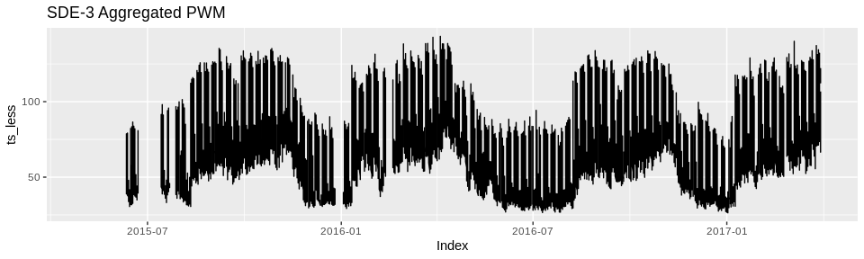

Plot the missing data
---------------------

``` r
plotNA.distribution(sde3_less_df$PWM_30min_avg, cex=.1)
```

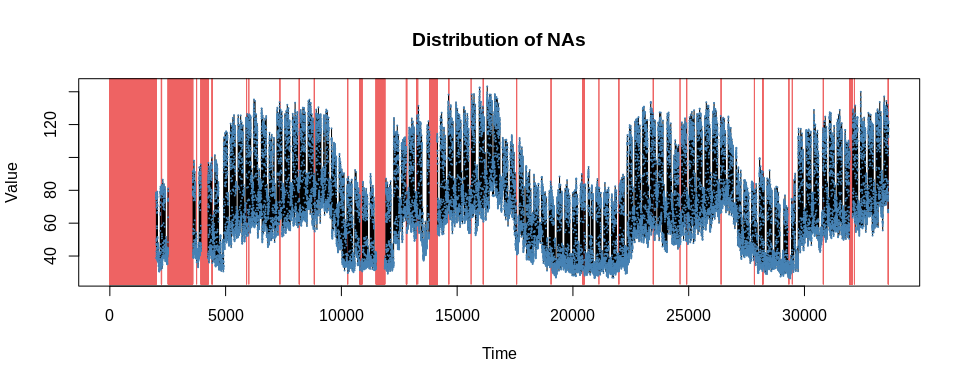

Plot the distribution of the missing data
-----------------------------------------

``` r
plotNA.distributionBar(sde3_less_df$PWM_30min_avg, breaks = 20)
```

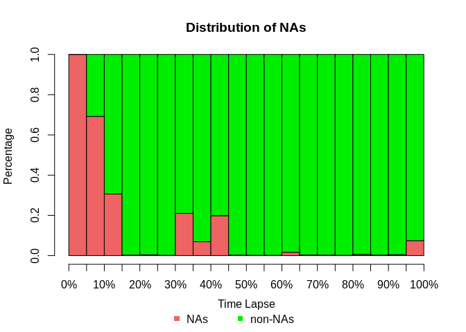

Plot the distribution of the missing data by gap size
-----------------------------------------------------

``` r
plotNA.gapsize(sde3_less_df$PWM_30min_avg)
```

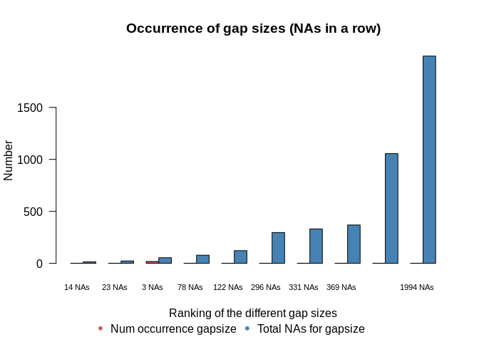

Impute the missing values using structural model and Kalman smoothing
=====================================================================

``` r
rownames(sde3_less_df) <- sde3_less_df$Pt_timeStamp
head(sde3_less_df["PWM_30min_avg"])
```

    ##                     PWM_30min_avg
    ## 2015-05-01 00:00:00            NA
    ## 2015-05-01 00:30:00            NA
    ## 2015-05-01 01:00:00            NA
    ## 2015-05-01 01:30:00            NA
    ## 2015-05-01 02:00:00            NA
    ## 2015-05-01 02:30:00            NA

``` r
imp <- na.kalman(sde3_less_df["PWM_30min_avg"])
#imp <- na.kalman(ts_less)
```

Plot the imputed data
---------------------

``` r
plotNA.imputations(x.withNA = sde3_less_df$PWM_30min_avg, x.withImputations = imp$PWM_30min_avg, cex=.1)
```

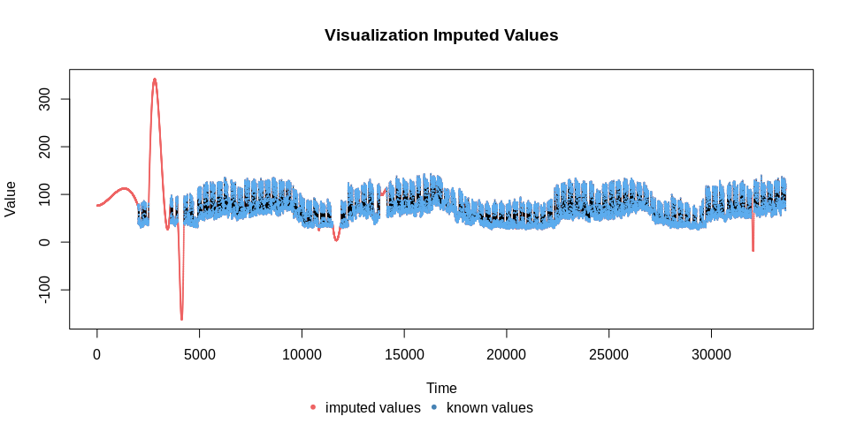

Imputation missing data in the larger gaps appear wildly inaccurate.

Plot the imputed data for the 1st 5000 observations
---------------------------------------------------

``` r
plotNA.imputations(x.withNA = sde3_less_df[1500:5000, "PWM_30min_avg"], x.withImputations = imp[1500:5000, "PWM_30min_avg"], cex=.1)
```

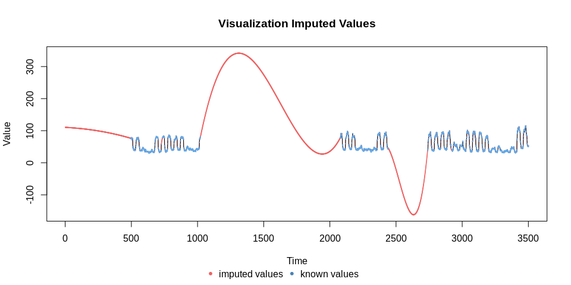

Plot the imputed data for the 2000-2500 observations
----------------------------------------------------

``` r
plotNA.imputations(x.withNA = sde3_less_df[1950:2550, "PWM_30min_avg"], x.withImputations = imp[1950:2550, "PWM_30min_avg"])
```

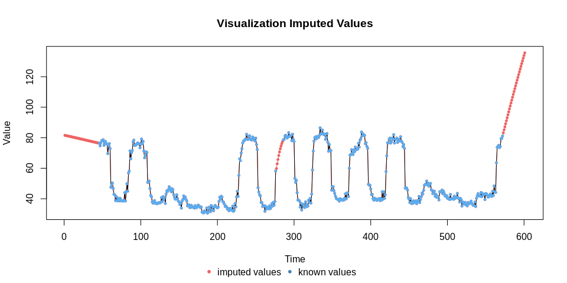

Imputation of missing data in the smaller gaps appear to be quite accurate.

Plot the imputed data for the 3500-4000 observations
----------------------------------------------------

``` r
plotNA.imputations(x.withNA = sde3_less_df[3500:4000, "PWM_30min_avg"], x.withImputations = imp[3500:4000, "PWM_30min_avg"])
```

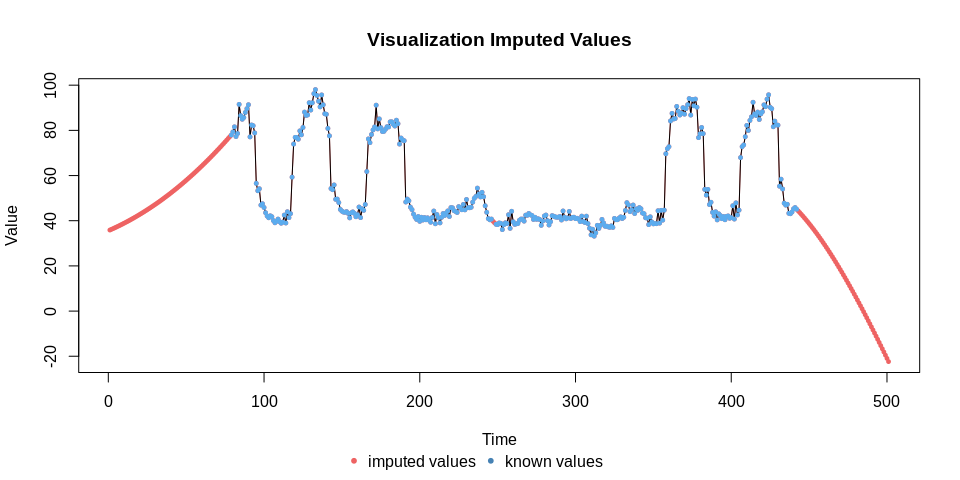

Plot the imputed data for the 4200-5000 observations
----------------------------------------------------

``` r
plotNA.imputations(x.withNA = sde3_less_df[4230:5000, "PWM_30min_avg"], x.withImputations = imp[4230:5000, "PWM_30min_avg"])
```

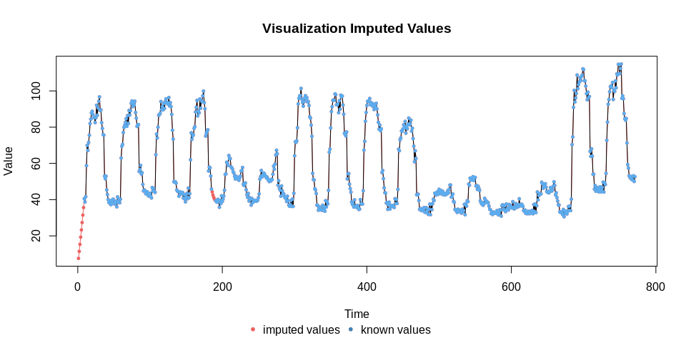

Plot the imputed data for the 5000-6000 observations
----------------------------------------------------

``` r
plotNA.imputations(x.withNA = sde3_less_df[5000:6000, "PWM_30min_avg"], x.withImputations = imp[5000:6000, "PWM_30min_avg"])
```


Impute the missing values using ARIMA model and Kalman smoothing
================================================================

``` r
imp_arima <- na.kalman(sde3_less_df["PWM_30min_avg"], model = "auto.arima")
```

Plot the imputed data
---------------------

``` r
plotNA.imputations(x.withNA = sde3_less_df$PWM_30min_avg, x.withImputations = imp_arima$PWM_30min_avg, cex=.1)
```

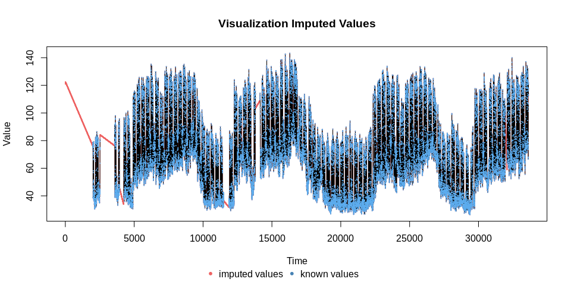

Plot the imputed data for the 1st 5000 observations
---------------------------------------------------

``` r
plotNA.imputations(x.withNA = sde3_less_df[1500:5000, "PWM_30min_avg"], x.withImputations = imp_arima[1500:5000, "PWM_30min_avg"], cex=.1)
```

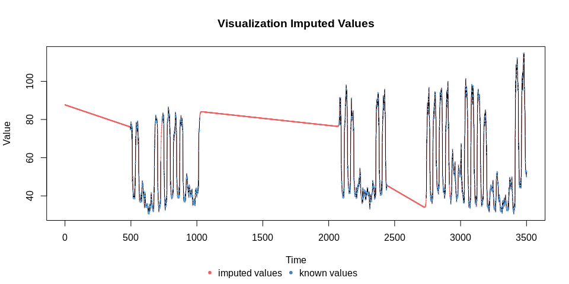

Imputation of missing date in the large gaps fail to capture the variability seen in the time series data.

Plot the imputed data for the 2000-2500 observations
----------------------------------------------------

``` r
plotNA.imputations(x.withNA = sde3_less_df[1950:2550, "PWM_30min_avg"], x.withImputations = imp_arima[1950:2550, "PWM_30min_avg"])
```

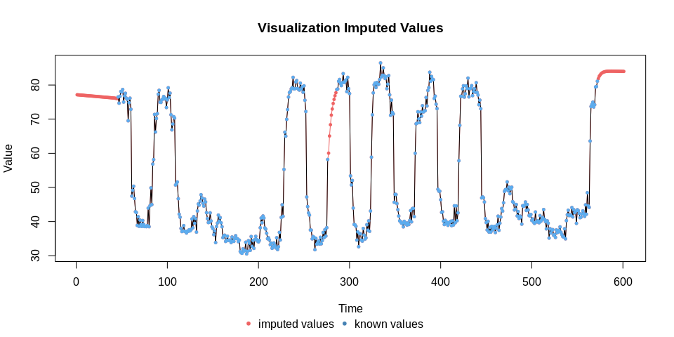

Imputation of missing data in the smaller gaps appear to be quite accurate.

Plot the imputed data for the 3500-4000 observations
----------------------------------------------------

``` r
plotNA.imputations(x.withNA = sde3_less_df[3500:4000, "PWM_30min_avg"], x.withImputations = imp_arima[3500:4000, "PWM_30min_avg"])
```

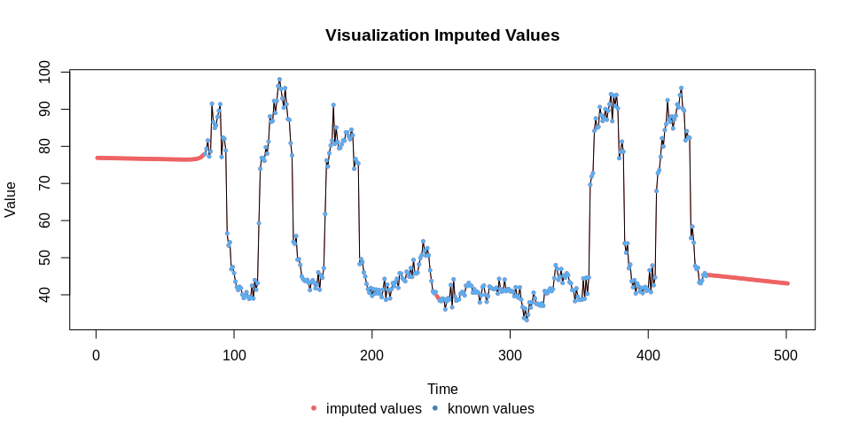

Plot the imputed data for the 4200-5000 observations
----------------------------------------------------

``` r
plotNA.imputations(x.withNA = sde3_less_df[4230:5000, "PWM_30min_avg"], x.withImputations = imp_arima[4230:5000, "PWM_30min_avg"])
```

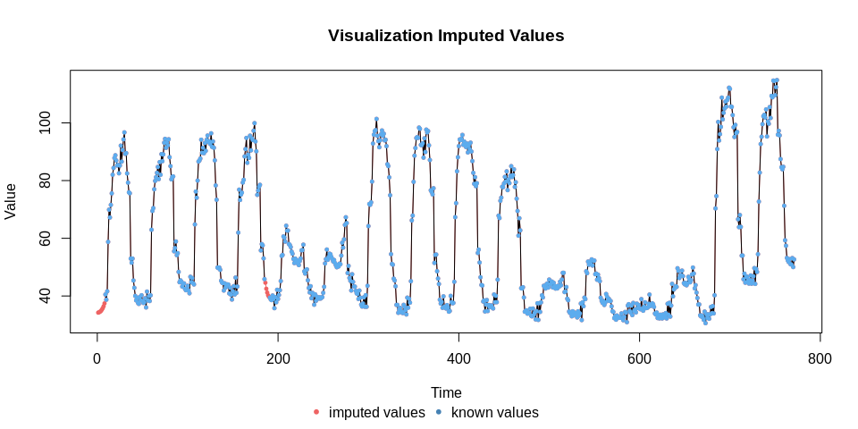

Plot the imputed data for the 5000-6000 observations
----------------------------------------------------

``` r
plotNA.imputations(x.withNA = sde3_less_df[5000:6000, "PWM_30min_avg"], x.withImputations = imp_arima[5000:6000, "PWM_30min_avg"])
```

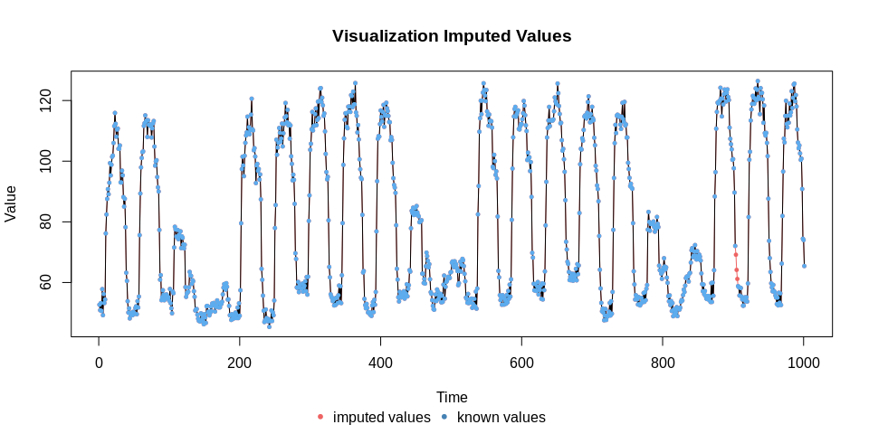
