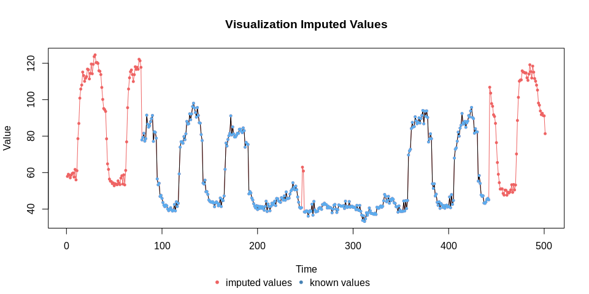

KE5105 - Building Electrical Consumption Forecasting
================

Extract, Transform and Load Data 5 - Data Imputation
====================================================

Summary of Findings
===================

-   Missing data in large gaps cannot be imputed accurately
-   Value
    -   Structural model and spline produces outliers (in value)
-   Variation
    -   Structural model, Arima and moving average fail to capture the variation in the time series
-   All methods perform similarly for small gaps
-   Test for missing completely at random (MCAR) patterns show no evidence that the missing data is not MCAR.

Load libraries
==============

``` r
library(ggplot2)
library(xts)
```

    ## Loading required package: zoo

    ## 
    ## Attaching package: 'zoo'

    ## The following objects are masked from 'package:base':
    ## 
    ##     as.Date, as.Date.numeric

``` r
library(imputeTS)
```

    ## 
    ## Attaching package: 'imputeTS'

    ## The following object is masked from 'package:zoo':
    ## 
    ##     na.locf

``` r
library(MissMech)
```

Load data
=========

``` r
sde3_agg_df <- read.csv("/home/tkokkeng/Documents/KE5105/ETL/source/test_data/SDE-3.agg.csv", header = TRUE, stringsAsFactors = FALSE)
head(sde3_agg_df)
```

Convert the Pt\_timeStamp strings to POSIX time
-----------------------------------------------

``` r
sde3_agg_df$Pt_timeStamp <- strptime(sde3_agg_df$Pt_timeStamp, format = "%Y-%m-%d %H:%M:%S", tz="GMT")
head(sde3_agg_df)
```

``` r
str(sde3_agg_df$Pt_timeStamp[2])
```

    ##  POSIXlt[1:1], format: "2015-05-01 00:30:00"

Convert the time series data for plotting
-----------------------------------------

``` r
ts <- xts(sde3_agg_df$PWM_30min_avg, as.Date(sde3_agg_df$Pt_timeStamp))

#start_time = sde3_agg_df[1, "Pt_timeStamp"]
#end_time = unclass(as.POSIXct(tail(sde3_agg_df, 1)$Pt_timeStamp, origin = as.POSIXct(tz="GMT")))
#ts <- ts(data=sde3_agg_df$PWM_30min_avg, start=c(sde3_agg_df[1, "Pt_timeStamp"], 1), end=c(tail(sde3_agg_df, 1)$Pt_timeStamp, 48), frequency=48)
#ts <- ts(data=sde3_agg_df$PWM_30min_avg, start=c(start_time, 1), end=c(end_time, 48), frequency=48)

head(ts)
```

    ##            [,1]
    ## 2015-05-01   NA
    ## 2015-05-01   NA
    ## 2015-05-01   NA
    ## 2015-05-01   NA
    ## 2015-05-01   NA
    ## 2015-05-01   NA

Plot the time series data
-------------------------

``` r
autoplot(ts, ylab = "Aggregated PWM", xlab = "Time") + ggtitle("SDE-3 Aggregated PWM")
```

    ## Warning: Removed 1997 rows containing missing values (geom_path).


Get the time series data before the data outage
-----------------------------------------------

``` r
sde3_less_df = sde3_agg_df[sde3_agg_df$Pt_timeStamp < as.POSIXct("2017-03-31 23:30:00"),]
head(sde3_less_df)
```

``` r
ts_less <- xts(sde3_less_df$PWM_30min_avg, as.Date(sde3_less_df$Pt_timeStamp))
head(ts_less)
```

    ##            [,1]
    ## 2015-05-01   NA
    ## 2015-05-01   NA
    ## 2015-05-01   NA
    ## 2015-05-01   NA
    ## 2015-05-01   NA
    ## 2015-05-01   NA

Plot the time series data
-------------------------

``` r
autoplot(ts_less, ylab = "Aggregated PWM", xlab = "Time") +
  ggtitle("SDE-3 Aggregated PWM")
```

    ## Warning: Removed 1994 rows containing missing values (geom_path).


Plot the missing data
---------------------

``` r
plotNA.distribution(sde3_less_df$PWM_30min_avg, cex=.1)
```


Plot the distribution of the missing data
-----------------------------------------

``` r
plotNA.distributionBar(sde3_less_df$PWM_30min_avg, breaks = 20)
```


Plot the distribution of the missing data by gap size
-----------------------------------------------------

``` r
plotNA.gapsize(sde3_less_df$PWM_30min_avg)
```


Impute the missing values using different imputation methods
============================================================

``` r
#rownames(sde3_less_df) <- sde3_less_df$Pt_timeStamp
#head(sde3_less_df["PWM_30min_avg"])
```

``` r
# Impute the missing values using structural model and Kalman smoothing
imp <- na.kalman(sde3_less_df["PWM_30min_avg"])

# Impute the missing values using ARIMA model and Kalman smoothing
imp_arima <- na.kalman(sde3_less_df["PWM_30min_avg"], model = "auto.arima")

# Impute the missing values using spline interpolation
imp_spline <- na.interpolation(sde3_less_df["PWM_30min_avg"], option = "spline")

# Impute the missing values using moving average
imp_ma <- na.ma(sde3_less_df["PWM_30min_avg"], k=4, weighting="exponential")
```

Plot the imputed data
---------------------

``` r
# structural model with kalman smoothing
plotNA.imputations(x.withNA = sde3_less_df$PWM_30min_avg,
                   x.withImputations = imp$PWM_30min_avg,
                   main = "Imputated Values Using Structural Model with Kalman Smoothing",
                   ylim = c(-150, 450), cex = .1)
```


``` r
# arima model with kalman smoothing 
plotNA.imputations(x.withNA = sde3_less_df$PWM_30min_avg,
                   x.withImputations = imp_arima$PWM_30min_avg,
                   main = "Imputed Values Using Arima Model with Kalman Smoothing",
                   ylim = c(-150, 450), cex = .1)
```


``` r
# spline interpolation
plotNA.imputations(x.withNA = sde3_less_df$PWM_30min_avg,
                   x.withImputations = imp_spline$PWM_30min_avg,
                   main = "Imputated Values Using Spline Interpolation",
                   ylim = c(-150, 450), cex = .1)
```


``` r
# exponential moving average
plotNA.imputations(x.withNA = sde3_less_df$PWM_30min_avg,
                   x.withImputations = imp_ma$PWM_30min_avg,
                   main = "Imputed Values Using Exponential Moving Average",
                   ylim = c(-150, 450), cex = .1)
```


Imputation missing data in the larger gaps appear wildly inaccurate for the structural model and spline interpolation.

Plot the imputed data for the 1st 5000 observations
---------------------------------------------------

``` r
plotNA.imputations(x.withNA = sde3_less_df[1500:5000, "PWM_30min_avg"],
                   x.withImputations = imp[1500:5000, "PWM_30min_avg"],
                   main = "Imputed Values Using Structural Model With Kalman Smoothing",
                   cex=.1)
```


``` r
plotNA.imputations(x.withNA = sde3_less_df[1500:5000, "PWM_30min_avg"],
                   x.withImputations = imp_arima[1500:5000, "PWM_30min_avg"],
                   main = "Imputed Values Using Arima Model with Kalman Smoothing", cex = .1)
```


Imputation of missing date in the large gaps fail to capture the variability seen in the time series data.

``` r
plotNA.imputations(x.withNA = sde3_less_df[1500:5000, "PWM_30min_avg"],
                   x.withImputations = imp_spline[1500:5000, "PWM_30min_avg"],
                   main = "Imputed Values Using Spline Interpolation", cex = .1)
```


Imputation of missing date in the large gaps by spline interpolation captures better the variability seen in the time series data than the other methods.

``` r
plotNA.imputations(x.withNA = sde3_less_df[1500:5000, "PWM_30min_avg"],
                   x.withImputations = imp_ma[1500:5000, "PWM_30min_avg"],
                   main = "Imputed Values Using Exponential Moving Average", cex = .1)
```


Plot the imputed data for the 2000-2500 observations
----------------------------------------------------

``` r
plotNA.imputations(x.withNA = sde3_less_df[1950:2550, "PWM_30min_avg"],
                   x.withImputations = imp[1950:2550, "PWM_30min_avg"],
                   main = "Imputed Values Using Structural Model With Kalman Smoothing",
                   ylim = c(30, 140))
```


``` r
plotNA.imputations(x.withNA = sde3_less_df[1950:2550, "PWM_30min_avg"],
                   x.withImputations = imp_arima[1950:2550, "PWM_30min_avg"],
                   main = "Imputed Values Using Arima Model With Kalman Smoothing",
                   ylim = c(30, 140))
```


``` r
plotNA.imputations(x.withNA = sde3_less_df[1950:2550, "PWM_30min_avg"],
                   x.withImputations = imp_spline[1950:2550, "PWM_30min_avg"],
                   main = "Imputed Values Using Spline Interpolation",
                   ylim = c(30, 140))
```


``` r
plotNA.imputations(x.withNA = sde3_less_df[1950:2550, "PWM_30min_avg"],
                   x.withImputations = imp_ma[1950:2550, "PWM_30min_avg"],
                   main = "Imputed Values Using Exponential Moving Average",
                   ylim = c(30, 140))
```


Imputation of missing data in the smaller gaps appear to be quite accurate.

Plot the imputed data for the 3500-4000 observations
----------------------------------------------------

``` r
plotNA.imputations(x.withNA = sde3_less_df[3500:4000, "PWM_30min_avg"], x.withImputations = imp[3500:4000, "PWM_30min_avg"])
```


``` r
plotNA.imputations(x.withNA = sde3_less_df[3500:4000, "PWM_30min_avg"], x.withImputations = imp_arima[3500:4000, "PWM_30min_avg"])
```


``` r
plotNA.imputations(x.withNA = sde3_less_df[3500:4000, "PWM_30min_avg"], x.withImputations = imp_spline[3500:4000, "PWM_30min_avg"])
```



``` r
plotNA.imputations(x.withNA = sde3_less_df[3500:4000, "PWM_30min_avg"], x.withImputations = imp_ma[3500:4000, "PWM_30min_avg"])
```


Plot the imputed data for the 4200-5000 observations
----------------------------------------------------

``` r
plotNA.imputations(x.withNA = sde3_less_df[4230:5000, "PWM_30min_avg"], x.withImputations = imp[4230:5000, "PWM_30min_avg"])
```


``` r
plotNA.imputations(x.withNA = sde3_less_df[4230:5000, "PWM_30min_avg"], x.withImputations = imp_arima[4230:5000, "PWM_30min_avg"])
```


``` r
plotNA.imputations(x.withNA = sde3_less_df[4230:5000, "PWM_30min_avg"], x.withImputations = imp_spline[4230:5000, "PWM_30min_avg"])
```


``` r
plotNA.imputations(x.withNA = sde3_less_df[4230:5000, "PWM_30min_avg"], x.withImputations = imp_ma[4230:5000, "PWM_30min_avg"])
```


Plot the imputed data for the 5000-6000 observations
----------------------------------------------------

``` r
plotNA.imputations(x.withNA = sde3_less_df[5000:6000, "PWM_30min_avg"], x.withImputations = imp[5000:6000, "PWM_30min_avg"])
```


``` r
plotNA.imputations(x.withNA = sde3_less_df[5000:6000, "PWM_30min_avg"], x.withImputations = imp_arima[5000:6000, "PWM_30min_avg"])
```


``` r
plotNA.imputations(x.withNA = sde3_less_df[5000:6000, "PWM_30min_avg"], x.withImputations = imp_spline[5000:6000, "PWM_30min_avg"])
```


``` r
plotNA.imputations(x.withNA = sde3_less_df[5000:6000, "PWM_30min_avg"], x.withImputations = imp_ma[5000:6000, "PWM_30min_avg"])
```


Plot the imputed data at 14000 observations
-------------------------------------------

``` r
plotNA.imputations(x.withNA = sde3_less_df[13500:14500, "PWM_30min_avg"], x.withImputations = imp[13500:14500, "PWM_30min_avg"])
```


``` r
plotNA.imputations(x.withNA = sde3_less_df[13500:14500, "PWM_30min_avg"], x.withImputations = imp_arima[13500:14500, "PWM_30min_avg"])
```


``` r
plotNA.imputations(x.withNA = sde3_less_df[13500:14500, "PWM_30min_avg"], x.withImputations = imp_spline[13500:14500, "PWM_30min_avg"])
```


``` r
plotNA.imputations(x.withNA = sde3_less_df[13500:14500, "PWM_30min_avg"], x.withImputations = imp_ma[13500:14500, "PWM_30min_avg"])
```


Plot the imputed data for the &gt;30000 observations
----------------------------------------------------

``` r
plotNA.imputations(x.withNA = sde3_less_df[31900:32200, "PWM_30min_avg"],
                   x.withImputations = imp[31900:32200, "PWM_30min_avg"],
                   main = "Imputed Values Using Structural Model with Kalman Smoothing",
                   ylim = c(-25, 130))
```


``` r
plotNA.imputations(x.withNA = sde3_less_df[31900:32200, "PWM_30min_avg"],
                   x.withImputations = imp_arima[31900:32200, "PWM_30min_avg"],
                   main = "Imputed Values Using Arima Model with Kalman Smoothing",
                   ylim = c(-25, 130))
```


``` r
plotNA.imputations(x.withNA = sde3_less_df[31900:32200, "PWM_30min_avg"],
                   x.withImputations = imp_spline[31900:32200, "PWM_30min_avg"],
                   main = "Imputed Values Using Spline Interpolation",
                   ylim = c(-25, 130))
```


``` r
plotNA.imputations(x.withNA = sde3_less_df[31900:32200, "PWM_30min_avg"],
                   x.withImputations = imp_ma[31900:32200, "PWM_30min_avg"],
                   main = "Imputed Values Using Exponential Moving Average",
                   ylim = c(-25, 130))
```


Prepare the data for MCAR test.
-------------------------------

``` r
sde3_less_df$time <- as.numeric(rownames(sde3_less_df))
head(sde3_less_df)
```

    ##          Pt_timeStamp PWM.SDE3.IC1 PWM.SDE3.IC2 PWM.SDE3.MCC..AC.
    ## 1 2015-05-01 00:00:00           NA           NA                NA
    ## 2 2015-05-01 00:30:00           NA           NA                NA
    ## 3 2015-05-01 01:00:00           NA           NA                NA
    ## 4 2015-05-01 01:30:00           NA           NA                NA
    ## 5 2015-05-01 02:00:00           NA           NA                NA
    ## 6 2015-05-01 02:30:00           NA           NA                NA
    ##   PWM.CELC.IC1 PWM.CELC.IC2 PWM.SDE1 PWM.SDE2.SSB PWM.SDE2.AC PWM.SDE3.Ext
    ## 1           NA           NA       NA           NA          NA           NA
    ## 2           NA           NA       NA           NA          NA           NA
    ## 3           NA           NA       NA           NA          NA           NA
    ## 4           NA           NA       NA           NA          NA           NA
    ## 5           NA           NA       NA           NA          NA           NA
    ## 6           NA           NA       NA           NA          NA           NA
    ##   PWM.Street.Light BTU.SDE3.Chiller.Plant BTU.SDE3.2 BTU.SDE3.1.2
    ## 1               NA                     NA         NA           NA
    ## 2               NA                     NA         NA           NA
    ## 3               NA                     NA         NA           NA
    ## 4               NA                     NA         NA           NA
    ## 5               NA                     NA         NA           NA
    ## 6               NA                     NA         NA           NA
    ##   PWM.SDE3.IC1_30min_avg PWM.SDE3.IC2_30min_avg
    ## 1                     NA                     NA
    ## 2                     NA                     NA
    ## 3                     NA                     NA
    ## 4                     NA                     NA
    ## 5                     NA                     NA
    ## 6                     NA                     NA
    ##   PWM.SDE3.MCC..AC._30min_avg PWM.CELC.IC1_30min_avg
    ## 1                          NA                     NA
    ## 2                          NA                     NA
    ## 3                          NA                     NA
    ## 4                          NA                     NA
    ## 5                          NA                     NA
    ## 6                          NA                     NA
    ##   PWM.CELC.IC2_30min_avg PWM.SDE1_30min_avg PWM.SDE2.SSB_30min_avg
    ## 1                     NA                 NA                     NA
    ## 2                     NA                 NA                     NA
    ## 3                     NA                 NA                     NA
    ## 4                     NA                 NA                     NA
    ## 5                     NA                 NA                     NA
    ## 6                     NA                 NA                     NA
    ##   PWM.SDE2.AC_30min_avg PWM.SDE3.Ext_30min_avg PWM.Street.Light_30min_avg
    ## 1                    NA                     NA                         NA
    ## 2                    NA                     NA                         NA
    ## 3                    NA                     NA                         NA
    ## 4                    NA                     NA                         NA
    ## 5                    NA                     NA                         NA
    ## 6                    NA                     NA                         NA
    ##   BTU.SDE3.Chiller.Plant_30min_avg BTU.SDE3.2_30min_avg
    ## 1                               NA                   NA
    ## 2                               NA                   NA
    ## 3                               NA                   NA
    ## 4                               NA                   NA
    ## 5                               NA                   NA
    ## 6                               NA                   NA
    ##   BTU.SDE3.1.2_30min_avg PWM_30min_avg time
    ## 1                     NA            NA    1
    ## 2                     NA            NA    2
    ## 3                     NA            NA    3
    ## 4                     NA            NA    4
    ## 5                     NA            NA    5
    ## 6                     NA            NA    6

Check the normality of the distribution.
----------------------------------------

``` r
plot(density(sde3_less_df$PWM_30min_avg, na.rm = TRUE))
```


Perform the Shapiro-Wilks normality test.
-----------------------------------------

``` r
shapiro.test(sde3_less_df[sde3_less_df$time > 5000 & sde3_less_df$time < 6000, c("PWM_30min_avg")])
```

    ## 
    ##  Shapiro-Wilk normality test
    ## 
    ## data:  sde3_less_df[sde3_less_df$time > 5000 & sde3_less_df$time < 6000,     c("PWM_30min_avg")]
    ## W = 0.86087, p-value < 2.2e-16

The distribution of the data is significantly different from normal distribution.

Perform the test for MCAR (missing completely at random) for 1st subset of time series data assuming non-normal data distribution
---------------------------------------------------------------------------------------------------------------------------------

The dataset is split into two because of a memory resource limit.

``` r
out <- TestMCARNormality(data=sde3_less_df[sde3_less_df$time > 5000 & sde3_less_df$time < 17000, c("time", "PWM_30min_avg")],
                         method = "Nonparametric")
```

``` r
summary(out)
```

    ## 
    ## Number of imputation:  1 
    ## 
    ## Number of Patterns:  2 
    ## 
    ## Total number of cases used in the analysis:  11999 
    ## 
    ##  Pattern(s) used:
    ##           time   PWM_30min_avg   Number of cases
    ## group.1      1               1             11176
    ## group.2      1              NA               823
    ## 
    ## 
    ##     Test of normality and Homoscedasticity:
    ##   -------------------------------------------
    ## 
    ## Non-Parametric Test:
    ## 
    ##     P-value for the non-parametric test of homoscedasticity:  0

There is evidence to reject the null hypothesis (the missing data pattern is **not** MCAR).

Perform the test for MCAR (missing completely at random) for 2nd subset of time series data
-------------------------------------------------------------------------------------------

``` r
out <- TestMCARNormality(data=sde3_less_df[sde3_less_df$time > 17000 & sde3_less_df$time < 29000, c("time", "PWM_30min_avg")],
                         method = "Nonparametric")
```

``` r
summary(out)
```

    ## 
    ## Number of imputation:  1 
    ## 
    ## Number of Patterns:  2 
    ## 
    ## Total number of cases used in the analysis:  11999 
    ## 
    ##  Pattern(s) used:
    ##           time   PWM_30min_avg   Number of cases
    ## group.1      1               1             11941
    ## group.2      1              NA                58
    ## 
    ## 
    ##     Test of normality and Homoscedasticity:
    ##   -------------------------------------------
    ## 
    ## Non-Parametric Test:
    ## 
    ##     P-value for the non-parametric test of homoscedasticity:  0.1970036

There is not enough evidence to reject the null hypothesis (the missing data pattern is MCAR).
