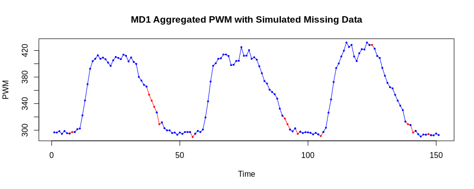
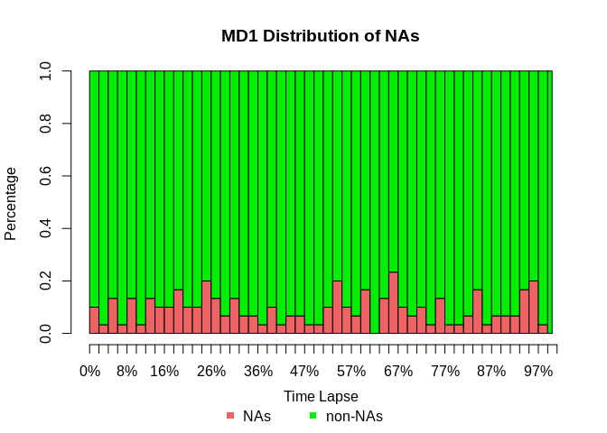
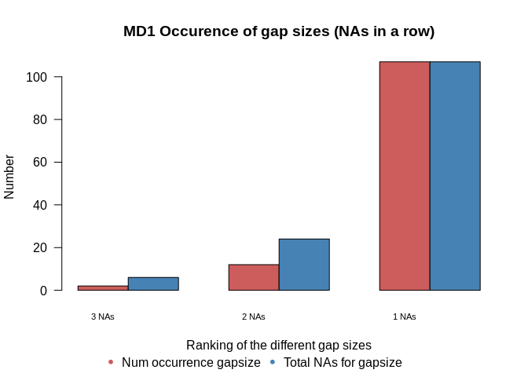
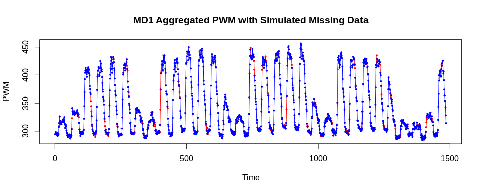
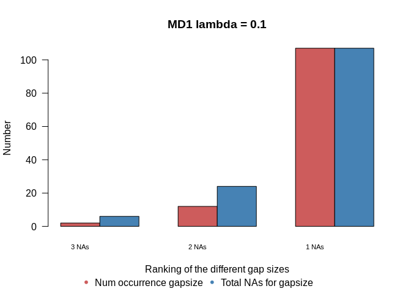
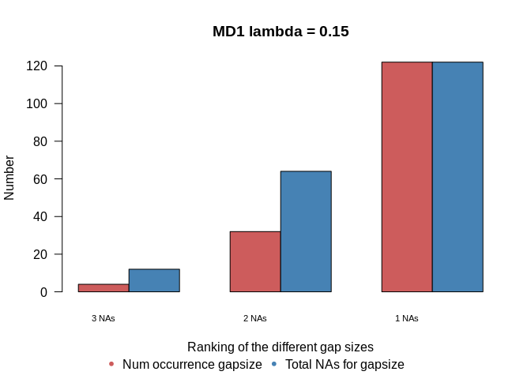
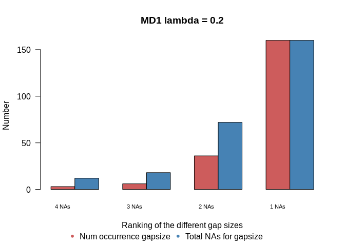
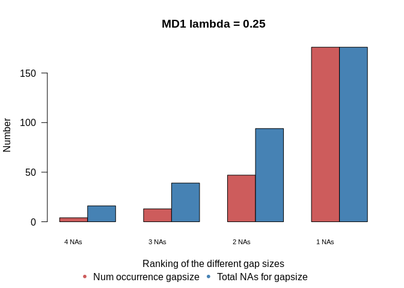

KE5105 - Building Electrical Consumption Forecasting
================

Extract, Transform and Load Data 6 - Data Imputation - MD1
==========================================================

Summary of Findings
===================

-   10 periods without any missing data of around 30-day duration is selected from MD1 data
-   Missing data in these periods are simulated assuming the missing data occurs according to an exponential distribution
    -   many missing observations in industrial datasets follow an exponential distribution \[1\]

\[1\] S. Moritz, A. Sardá, T. Bartz-Beielstein, M. Zaefferer, and J. Stork. Comparison of different Methods for Univariate Time Series Imputation in R. ArXiv e-prints, Oct. 2015.

Load libraries
==============

``` r
library(ggplot2)
library(xts)
```

    ## Loading required package: zoo

    ## 
    ## Attaching package: 'zoo'

    ## The following objects are masked from 'package:base':
    ## 
    ##     as.Date, as.Date.numeric

``` r
library(imputeTS)
```

    ## 
    ## Attaching package: 'imputeTS'

    ## The following object is masked from 'package:zoo':
    ## 
    ##     na.locf

Load data
=========

``` r
md1_df <- read.csv("/home/tkokkeng/Documents/KE5105/ETL/source/processed_bldg_data/MD1.csv", header = TRUE, stringsAsFactors = FALSE)
head(md1_df)
```

Convert the Pt\_timeStamp strings to POSIX time
-----------------------------------------------

``` r
md1_df$Pt_timeStamp <- strptime(md1_df$Pt_timeStamp, format = "%Y-%m-%d %H:%M:%S", tz="GMT")
head(md1_df)
```

Look for the largest contiguous subset of non-NA data
-----------------------------------------------------

``` r
PWM_notNA_df <- data.frame(md1_df$PWM_30min_avg)
head(PWM_notNA_df)
```

    ##   md1_df.PWM_30min_avg
    ## 1                   NA
    ## 2                   NA
    ## 3                   NA
    ## 4                   NA
    ## 5                   NA
    ## 6                   NA

### Get a cumulative count of the NAs.

``` r
PWM_notNA_df$na_cumsum = cumsum(is.na(PWM_notNA_df$md1_df.PWM_30min_avg))
head(PWM_notNA_df)
```

    ##   md1_df.PWM_30min_avg na_cumsum
    ## 1                   NA         1
    ## 2                   NA         2
    ## 3                   NA         3
    ## 4                   NA         4
    ## 5                   NA         5
    ## 6                   NA         6

### Remove the rows with NAs, leaving only the data rows. Each consective data row has a unique cumulative count.

``` r
PWM_notNA_df <- PWM_notNA_df[!is.na(PWM_notNA_df$md1_df.PWM_30min_avg),]
head(PWM_notNA_df)
```

    ##     md1_df.PWM_30min_avg na_cumsum
    ## 522               326.25       521
    ## 523               330.50       521
    ## 524               324.50       521
    ## 525               318.75       521
    ## 526               309.00       521
    ## 527               314.25       521

### Group the data rows by their cumulative count and get the frequency which is the size of each contiguous block of data.

``` r
PWM_notNA_df <- as.data.frame(table(PWM_notNA_df$na_cumsum), stringsAsFactors = FALSE)
colnames(PWM_notNA_df) <- c("row", "size")
PWM_notNA_df$row = as.integer(PWM_notNA_df$row)
head(PWM_notNA_df)
```

    ##   row size
    ## 1 521    8
    ## 2 561    8
    ## 3 601    8
    ## 4 641    8
    ## 5 656  798
    ## 6 659 1485

### Offset the row numbers to get the correct row index.

``` r
PWM_notNA_df[2:nrow(PWM_notNA_df), c("row")] <- tail(PWM_notNA_df$row, -1) + head(cumsum(PWM_notNA_df$size), -1) + 1
head(PWM_notNA_df)
```

    ##    row size
    ## 1  521    8
    ## 2  570    8
    ## 3  618    8
    ## 4  666    8
    ## 5  689  798
    ## 6 1490 1485

### Find the biggest contiguous data blocks.

``` r
PWM_notNA_df[which(PWM_notNA_df$size == max(PWM_notNA_df$size)),]
```

    ##      row size
    ## 6   1490 1485
    ## 9   4322 1485
    ## 10 19010 1485
    ## 13 21842 1485
    ## 15 24770 1485
    ## 17 27698 1485
    ## 18 29186 1485
    ## 21 32114 1485

Prepare the data for plotting.

``` r
ts <- xts(md1_df[1490:(1490+1485-1),]$PWM_30min_avg, md1_df[1490:(1490+1485-1),]$Pt_timeStamp)
```

Plot the time series data for a period without missing data
-----------------------------------------------------------

``` r
autoplot(ts) +
  ylab("Aggregated PWM") +
  xlab("Time") +
  ggtitle("MD1 Aggregated PWM for a Period without Missing Data")
```


Check that there is no missing data in the selected period.

``` r
which(is.na(md1_df[1490:(1490+1485),]$PWM_30min_avg))
```

    ## [1] 1486

Simulate missing data using an exponential distribution
-------------------------------------------------------

``` r
#' Code of the missing data simulation function
#' @param data - univariate time series
#' @param rate - lambda value for exponential distribution (# events per unit time)
#' @param seed - random seed used for the function

create.missing <- function(data, rate, seed=NULL) {

    ## Only for time series
  if (class(data) != "ts") {
    stop("Provided data is not a time series.")
  }

  ## No missing data (pass-through)
  if (rate == 0) {
    return(data)
  }

  ## Save original parameters
  t <- time(data)
  f <- frequency(data)
  
  ##Setting of random seed
  if (!is.null(seed))
    set.seed(seed)
  
  ## Initialize index
  a <- 0
  
  ## Indices of removed entries
  tempDelete <- numeric(0)
  while (a < length(data)) {
    ## 'ceiling' is to avoid possible zeros
    a <- ceiling(a + rexp(1, rate))
    if ( a <= length(data) ) {
      data[a] <- NA
      tempDelete <- c(tempDelete, a)
    }
  }
  return(list(data=data, na.ind=tempDelete))
}
```

#### Exponential Distribution (<https://en.wikipedia.org/wiki/Exponential_distribution>)


### Simulate missing data for 1 contiguous data block

``` r
ts <- ts(md1_df[1490:(1490+1485-1),]$PWM_30min_avg)
missing <- create.missing(data = ts, rate = .1, seed = 729)
```

### Prepare the simulated data for plotting

``` r
removed_data = md1_df[1490:(1490+1485-1),]$PWM_30min_avg
na_found <- FALSE
temp <- NA
for (i in 1:length(removed_data))
  if (!is.na(missing$data[i])) {
    temp <- removed_data[i]
    if (!na_found) {
      removed_data[i] <- NA
    }
    na_found <- FALSE
  } else if (!na_found) {
    na_found = TRUE
    removed_data[i-1] <- temp
  }
```

### Plot the simulated missing data

``` r
ts_removed_data = ts(removed_data)
ts_data_with_missing = ts(missing$data)
tsm <- cbind(ts_removed_data, ts_data_with_missing)
plot.ts(tsm, plot.type = "single", col = c("red", "blue"), type = "o", pch = 19, cex = .4, ylab = "PWM")
title("MD1 Aggregated PWM with Simulated Missing Data")
```


``` r
plot.ts(tsm[100:250,], plot.type = "single", col = c("red", "blue"), type = "o", pch = 19, cex = .4, ylab = "PWM")
title("MD1 Aggregated PWM with Simulated Missing Data")
```



### Distribution of simulated missing data

``` r
plotNA.distributionBar(missing$data, breaks = 50, main = "MD1 Distribution of NAs")
```



### Plot the distribution of the missing data by gap size

``` r
plotNA.gapsize(missing$data, byTotalNA = TRUE, main = "MD1 Occurence of gap sizes (NAs in a row)")
```



Create the simulated missing data for a set of contiguous data blocks.
----------------------------------------------------------------------

``` r
# Sort the contiguous data blocks by size.
PWM_notNA_df <- PWM_notNA_df[order(-PWM_notNA_df$size),]
head(PWM_notNA_df, 10)
```

    ##      row size
    ## 6   1490 1485
    ## 9   4322 1485
    ## 10 19010 1485
    ## 13 21842 1485
    ## 15 24770 1485
    ## 17 27698 1485
    ## 18 29186 1485
    ## 21 32114 1485
    ## 14 23330 1437
    ## 16 26258 1437

### Save the 10 largest data blocks without missing data to file (.csv)

``` r
for (i in 1:10) {
  write.csv(md1_df[PWM_notNA_df$row[i]:(PWM_notNA_df$row[i]+PWM_notNA_df$size[i]-1),],
            file = paste("md1_no_nan", toString(i), ".csv", sep = ""),
            row.names = FALSE)
}
```

``` r
# Generate missing data for the 10 largest data blocks for a range of lambda values (# events per unit time) .1, .15, .2, .25 

num_datasets = 10  # this is the number of time series data blocks we are extracting from the SDE-3 data to simulate the missing data 
lambda_list = seq(10, 25, by=5)
missing_list = vector("list", length(lambda_list))

# For each lambda value, simulate the missing data.
for (i in 1:length(lambda_list)) {
  
  missing = vector("list", num_datasets)
  
  # For each dataset, simulate the missing data.
  for (j in 1:num_datasets) {
    ts <- ts(md1_df[PWM_notNA_df$row[j]:(PWM_notNA_df$row[j]+PWM_notNA_df$size[j]-1),]$PWM_30min_avg)
    missing[[j]] <- c(create.missing(data = ts, rate = lambda_list[i]/100, seed = 729),
                      row = PWM_notNA_df$row[j], size = PWM_notNA_df$size[j])
  }
  missing_list[[i]] <- c(lambda=lambda_list[i]/100, missing = missing)
}
```

### Save the time series with simulated missing data to file (.csv)

``` r
for (i in missing_list) {
  for (j in 1:num_datasets) {
    data_with_na_df = data.frame(i[[j+1]]$data)
    colnames(data_with_na_df) = c('PWM_30min_avg')
    write.csv(data_with_na_df,
              file = paste("md1_sim_nan_", i$lambda, "_", j, ".csv", sep = ""),
              row.names = FALSE)    
  }
} 
```

``` r
# Check the generated data for 1 block
removed_data = md1_df[missing_list[[1]][[2]]$row:(missing_list[[1]][[2]]$row+missing_list[[1]][[2]]$size-1),]$PWM_30min_avg
na_found <- FALSE
temp <- NA
for (i in 1:length(removed_data)) {
  # Not a nan value
  if (!is.na(missing_list[[1]][[2]]$data[i])) {
    # Remember this value
    temp <- removed_data[i]
    # Not in a nan series of values, change value to nan
    if (!na_found) {
      removed_data[i] <- NA
    }
    # set to in a series of nan values
    na_found <- FALSE
  } else if (!na_found) {
    # 1st nan in series found
    na_found = TRUE
    # The previous value was set to nan, reset the previous value back to the remembered value
    removed_data[i-1] <- temp
  }
}

ts_removed_data = ts(removed_data)
ts_data_with_missing = ts(missing_list[[1]][[2]]$data)
tsm <- cbind(ts_removed_data, ts_data_with_missing)
plot.ts(tsm, plot.type = "single", col = c("red", "blue"), type = "o", pch = 19, cex = .4, ylab = "PWM")
title("MD1 Aggregated PWM with Simulated Missing Data")
```



``` r
for (i in missing_list) {
  plotNA.gapsize(i[[2]]$data, main=paste("MD1 lambda =", toString(i[[1]])), byTotalNA = TRUE)
  cat("MD1 Missing data statistics for lambda =", toString(i[[1]]), "\n")
  statsNA(i[[2]]$data)
  cat("\n")
}
```



    ## MD1 Missing data statistics for lambda = 0.1 
    ## [1] "Length of time series:"
    ## [1] 1485
    ## [1] "-------------------------"
    ## [1] "Number of Missing Values:"
    ## [1] 137
    ## [1] "-------------------------"
    ## [1] "Percentage of Missing Values:"
    ## [1] "9.23%"
    ## [1] "-------------------------"
    ## [1] "Stats for Bins"
    ## [1] "  Bin 1 (372 values from 1 to 372) :      37 NAs (9.95%)"
    ## [1] "  Bin 2 (372 values from 373 to 744) :      29 NAs (7.8%)"
    ## [1] "  Bin 3 (372 values from 745 to 1116) :      40 NAs (10.8%)"
    ## [1] "  Bin 4 (369 values from 1117 to 1485) :      31 NAs (8.4%)"
    ## [1] "-------------------------"
    ## [1] "Longest NA gap (series of consecutive NAs)"
    ## [1] "3 in a row"
    ## [1] "-------------------------"
    ## [1] "Most frequent gap size (series of consecutive NA series)"
    ## [1] "1 NA in a row (occuring 107 times)"
    ## [1] "-------------------------"
    ## [1] "Gap size accounting for most NAs"
    ## [1] "1 NA in a row (occuring 107 times, making up for overall 107 NAs)"
    ## [1] "-------------------------"
    ## [1] "Overview NA series"
    ## [1] "  1 NA in a row: 107 times"
    ## [1] "  2 NA in a row: 12 times"
    ## [1] "  3 NA in a row: 2 times"



    ## MD1 Missing data statistics for lambda = 0.15 
    ## [1] "Length of time series:"
    ## [1] 1485
    ## [1] "-------------------------"
    ## [1] "Number of Missing Values:"
    ## [1] 198
    ## [1] "-------------------------"
    ## [1] "Percentage of Missing Values:"
    ## [1] "13.3%"
    ## [1] "-------------------------"
    ## [1] "Stats for Bins"
    ## [1] "  Bin 1 (372 values from 1 to 372) :      55 NAs (14.8%)"
    ## [1] "  Bin 2 (372 values from 373 to 744) :      49 NAs (13.2%)"
    ## [1] "  Bin 3 (372 values from 745 to 1116) :      46 NAs (12.4%)"
    ## [1] "  Bin 4 (369 values from 1117 to 1485) :      48 NAs (13%)"
    ## [1] "-------------------------"
    ## [1] "Longest NA gap (series of consecutive NAs)"
    ## [1] "3 in a row"
    ## [1] "-------------------------"
    ## [1] "Most frequent gap size (series of consecutive NA series)"
    ## [1] "1 NA in a row (occuring 122 times)"
    ## [1] "-------------------------"
    ## [1] "Gap size accounting for most NAs"
    ## [1] "1 NA in a row (occuring 122 times, making up for overall 122 NAs)"
    ## [1] "-------------------------"
    ## [1] "Overview NA series"
    ## [1] "  1 NA in a row: 122 times"
    ## [1] "  2 NA in a row: 32 times"
    ## [1] "  3 NA in a row: 4 times"



    ## MD1 Missing data statistics for lambda = 0.2 
    ## [1] "Length of time series:"
    ## [1] 1485
    ## [1] "-------------------------"
    ## [1] "Number of Missing Values:"
    ## [1] 262
    ## [1] "-------------------------"
    ## [1] "Percentage of Missing Values:"
    ## [1] "17.6%"
    ## [1] "-------------------------"
    ## [1] "Stats for Bins"
    ## [1] "  Bin 1 (372 values from 1 to 372) :      65 NAs (17.5%)"
    ## [1] "  Bin 2 (372 values from 373 to 744) :      68 NAs (18.3%)"
    ## [1] "  Bin 3 (372 values from 745 to 1116) :      59 NAs (15.9%)"
    ## [1] "  Bin 4 (369 values from 1117 to 1485) :      70 NAs (19%)"
    ## [1] "-------------------------"
    ## [1] "Longest NA gap (series of consecutive NAs)"
    ## [1] "4 in a row"
    ## [1] "-------------------------"
    ## [1] "Most frequent gap size (series of consecutive NA series)"
    ## [1] "1 NA in a row (occuring 160 times)"
    ## [1] "-------------------------"
    ## [1] "Gap size accounting for most NAs"
    ## [1] "1 NA in a row (occuring 160 times, making up for overall 160 NAs)"
    ## [1] "-------------------------"
    ## [1] "Overview NA series"
    ## [1] "  1 NA in a row: 160 times"
    ## [1] "  2 NA in a row: 36 times"
    ## [1] "  3 NA in a row: 6 times"
    ## [1] "  4 NA in a row: 3 times"



    ## MD1 Missing data statistics for lambda = 0.25 
    ## [1] "Length of time series:"
    ## [1] 1485
    ## [1] "-------------------------"
    ## [1] "Number of Missing Values:"
    ## [1] 325
    ## [1] "-------------------------"
    ## [1] "Percentage of Missing Values:"
    ## [1] "21.9%"
    ## [1] "-------------------------"
    ## [1] "Stats for Bins"
    ## [1] "  Bin 1 (372 values from 1 to 372) :      80 NAs (21.5%)"
    ## [1] "  Bin 2 (372 values from 373 to 744) :      75 NAs (20.2%)"
    ## [1] "  Bin 3 (372 values from 745 to 1116) :      87 NAs (23.4%)"
    ## [1] "  Bin 4 (369 values from 1117 to 1485) :      83 NAs (22.5%)"
    ## [1] "-------------------------"
    ## [1] "Longest NA gap (series of consecutive NAs)"
    ## [1] "4 in a row"
    ## [1] "-------------------------"
    ## [1] "Most frequent gap size (series of consecutive NA series)"
    ## [1] "1 NA in a row (occuring 176 times)"
    ## [1] "-------------------------"
    ## [1] "Gap size accounting for most NAs"
    ## [1] "1 NA in a row (occuring 176 times, making up for overall 176 NAs)"
    ## [1] "-------------------------"
    ## [1] "Overview NA series"
    ## [1] "  1 NA in a row: 176 times"
    ## [1] "  2 NA in a row: 47 times"
    ## [1] "  3 NA in a row: 13 times"
    ## [1] "  4 NA in a row: 4 times"

### Save the simulated missing data to file.

``` r
saveRDS(missing_list, "sim_missing_data.md1.rds")
```
