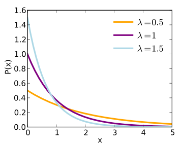

KE5105 - Building Electrical Consumption Forecasting
================

Extract, Transform and Load Data 6 - Data Imputation - MD1
==========================================================

Simulate Missing Data by Gap Size
---------------------------------

Summary of Findings
===================

-   Simulated missing data for a range of gap sizes and lambda

Load libraries
==============

``` r
library(ggplot2)
library(xts)
```

    ## Loading required package: zoo

    ## 
    ## Attaching package: 'zoo'

    ## The following objects are masked from 'package:base':
    ## 
    ##     as.Date, as.Date.numeric

``` r
library(imputeTS)
```

    ## 
    ## Attaching package: 'imputeTS'

    ## The following object is masked from 'package:zoo':
    ## 
    ##     na.locf

``` r
source("/home/tkokkeng/Documents/KE5105/ETL/source/R/ETL.utils.R")
```

Load data
=========

``` r
md1_agg_df <- read.csv("/home/tkokkeng/Documents/KE5105/ETL/source/processed_bldg_data/MD1.csv",
                        header = TRUE, stringsAsFactors = FALSE)
head(md1_agg_df)
```

Convert the Pt\_timeStamp strings to POSIX time
-----------------------------------------------

``` r
md1_agg_df$Pt_timeStamp <- strptime(md1_agg_df$Pt_timeStamp, format = "%Y-%m-%d %H:%M:%S", tz="GMT")
head(md1_agg_df)
```

Look for the largest contiguous subset of non-NA data
-----------------------------------------------------

``` r
PWM_notNA_df <- data.frame(md1_agg_df$PWM_30min_avg)
head(PWM_notNA_df)
```

    ##   md1_agg_df.PWM_30min_avg
    ## 1                       NA
    ## 2                       NA
    ## 3                       NA
    ## 4                       NA
    ## 5                       NA
    ## 6                       NA

### Get a cumulative count of the NAs.

``` r
PWM_notNA_df$na_cumsum = cumsum(is.na(PWM_notNA_df$md1_agg_df.PWM_30min_avg))
head(PWM_notNA_df)
```

    ##   md1_agg_df.PWM_30min_avg na_cumsum
    ## 1                       NA         1
    ## 2                       NA         2
    ## 3                       NA         3
    ## 4                       NA         4
    ## 5                       NA         5
    ## 6                       NA         6

### Remove the rows with NAs, leaving only the data rows. Each consective data row has a unique cumulative count.

``` r
PWM_notNA_df <- PWM_notNA_df[!is.na(PWM_notNA_df$md1_agg_df.PWM_30min_avg),]
head(PWM_notNA_df)
```

    ##     md1_agg_df.PWM_30min_avg na_cumsum
    ## 522                   326.25       521
    ## 523                   330.50       521
    ## 524                   324.50       521
    ## 525                   318.75       521
    ## 526                   309.00       521
    ## 527                   314.25       521

### Group the data rows by their cumulative count and get the frequency which is the size of each contiguous block of data.

``` r
PWM_notNA_df <- as.data.frame(table(PWM_notNA_df$na_cumsum), stringsAsFactors = FALSE)
colnames(PWM_notNA_df) <- c("row", "size")
PWM_notNA_df$row = as.integer(PWM_notNA_df$row)
head(PWM_notNA_df)
```

    ##   row size
    ## 1 521    8
    ## 2 561    8
    ## 3 601    8
    ## 4 641    8
    ## 5 656  798
    ## 6 659 1485

### Offset the row numbers to get the correct row index.

``` r
PWM_notNA_df[2:nrow(PWM_notNA_df), c("row")] <- tail(PWM_notNA_df$row, -1) + head(cumsum(PWM_notNA_df$size), -1) + 1
head(PWM_notNA_df)
```

    ##    row size
    ## 1  521    8
    ## 2  570    8
    ## 3  618    8
    ## 4  666    8
    ## 5  689  798
    ## 6 1490 1485

### Find the biggest contiguous data blocks.

``` r
PWM_notNA_df[which(PWM_notNA_df$size == max(PWM_notNA_df$size)),]
```

    ##      row size
    ## 6   1490 1485
    ## 9   4322 1485
    ## 10 19010 1485
    ## 13 21842 1485
    ## 15 24770 1485
    ## 17 27698 1485
    ## 18 29186 1485
    ## 21 32114 1485

Plot the data.

``` r
ts <- xts(md1_agg_df[1490:(1490+1485-1),]$PWM_30min_avg, md1_agg_df[1490:(1490+1485-1),]$Pt_timeStamp)
```

Plot the time series data for a period without missing data
-----------------------------------------------------------

``` r
autoplot(ts) +
  ylab("Aggregated PWM") +
  xlab("Time") +
  ggtitle("MD1 Aggregated PWM for a Period without Missing Data")
```


``` r
which(is.na(md1_agg_df[1490:(1490+1485),]$PWM_30min_avg))
```

    ## [1] 1486

#### Exponential Distribution (<https://en.wikipedia.org/wiki/Exponential_distribution>)



### Simulate missing data for 1 contiguous data block

``` r
ts <- ts(md1_agg_df[1490:(1490+1485-1),]$PWM_30min_avg)
missing <- create.missing(data = ts, rate = .05, gapsize=10, seed = 729)
```

### Prepare the simulated data for plotting

``` r
removed_data <- prepare.plot.data(missing, md1_agg_df[1490:(1490+1485-1),]$PWM_30min_avg)
```

### PLot the simulated missing data

``` r
ts_removed_data = ts(removed_data)
ts_data_with_missing = ts(missing$data)
tsm <- cbind(ts_removed_data, ts_data_with_missing)
plot.ts(tsm, plot.type = "single", col = c("red", "blue"), type = "o", pch = 19, cex = .4, ylab = "PWM")
title("MD1 Aggregated PWM with Simulated Gap Size of 10")
```


``` r
plot.ts(tsm[100:250,], plot.type = "single", col = c("red", "blue"), type = "o", pch = 19, cex = .4, ylab = "PWM")
title("MD1 Aggregated PWM with Simulated Gap Size of 10")
```


### Distribution of simulated missing data

``` r
plotNA.distributionBar(missing$data, breaks = 30, main = "MD1 Distribution of NAs")
```


Plot the distribution of the missing data by gap size
-----------------------------------------------------

``` r
plotNA.gapsize(missing$data, byTotalNA = TRUE, main = "MD1 Occurrence of gap sizes (NAs in a row)")
```


``` r
statsNA(missing$data, bins = 30)
```

    ## [1] "Length of time series:"
    ## [1] 1485
    ## [1] "-------------------------"
    ## [1] "Number of Missing Values:"
    ## [1] 510
    ## [1] "-------------------------"
    ## [1] "Percentage of Missing Values:"
    ## [1] "34.3%"
    ## [1] "-------------------------"
    ## [1] "Stats for Bins"
    ## [1] "  Bin 1 (50 values from 1 to 50) :      10 NAs (20%)"
    ## [1] "  Bin 2 (50 values from 51 to 100) :      20 NAs (40%)"
    ## [1] "  Bin 3 (50 values from 101 to 150) :      10 NAs (20%)"
    ## [1] "  Bin 4 (50 values from 151 to 200) :      10 NAs (20%)"
    ## [1] "  Bin 5 (50 values from 201 to 250) :      23 NAs (46%)"
    ## [1] "  Bin 6 (50 values from 251 to 300) :      17 NAs (34%)"
    ## [1] "  Bin 7 (50 values from 301 to 350) :      0 NAs (0%)"
    ## [1] "  Bin 8 (50 values from 351 to 400) :      35 NAs (70%)"
    ## [1] "  Bin 9 (50 values from 401 to 450) :      15 NAs (30%)"
    ## [1] "  Bin 10 (50 values from 451 to 500) :      0 NAs (0%)"
    ## [1] "  Bin 11 (50 values from 501 to 550) :      29 NAs (58%)"
    ## [1] "  Bin 12 (50 values from 551 to 600) :      11 NAs (22%)"
    ## [1] "  Bin 13 (50 values from 601 to 650) :      10 NAs (20%)"
    ## [1] "  Bin 14 (50 values from 651 to 700) :      29 NAs (58%)"
    ## [1] "  Bin 15 (50 values from 701 to 750) :      11 NAs (22%)"
    ## [1] "  Bin 16 (50 values from 751 to 800) :      30 NAs (60%)"
    ## [1] "  Bin 17 (50 values from 801 to 850) :      20 NAs (40%)"
    ## [1] "  Bin 18 (50 values from 851 to 900) :      20 NAs (40%)"
    ## [1] "  Bin 19 (50 values from 901 to 950) :      10 NAs (20%)"
    ## [1] "  Bin 20 (50 values from 951 to 1000) :      23 NAs (46%)"
    ## [1] "  Bin 21 (50 values from 1001 to 1050) :      17 NAs (34%)"
    ## [1] "  Bin 22 (50 values from 1051 to 1100) :      22 NAs (44%)"
    ## [1] "  Bin 23 (50 values from 1101 to 1150) :      38 NAs (76%)"
    ## [1] "  Bin 24 (50 values from 1151 to 1200) :      16 NAs (32%)"
    ## [1] "  Bin 25 (50 values from 1201 to 1250) :      24 NAs (48%)"
    ## [1] "  Bin 26 (50 values from 1251 to 1300) :      10 NAs (20%)"
    ## [1] "  Bin 27 (50 values from 1301 to 1350) :      10 NAs (20%)"
    ## [1] "  Bin 28 (50 values from 1351 to 1400) :      19 NAs (38%)"
    ## [1] "  Bin 29 (50 values from 1401 to 1450) :      21 NAs (42%)"
    ## [1] "  Bin 30 (35 values from 1451 to 1485) :      0 NAs (0%)"
    ## [1] "-------------------------"
    ## [1] "Longest NA gap (series of consecutive NAs)"
    ## [1] "10 in a row"
    ## [1] "-------------------------"
    ## [1] "Most frequent gap size (series of consecutive NA series)"
    ## [1] "10 NA in a row (occuring 51 times)"
    ## [1] "-------------------------"
    ## [1] "Gap size accounting for most NAs"
    ## [1] "10 NA in a row (occuring 51 times, making up for overall 510 NAs)"
    ## [1] "-------------------------"
    ## [1] "Overview NA series"
    ## [1] "  10 NA in a row: 51 times"

Create the simulated missing data for a set of contiguous data blocks.
----------------------------------------------------------------------

``` r
# Sort the contiguous data blocks by size.
PWM_notNA_df <- PWM_notNA_df[order(-PWM_notNA_df$size),]
head(PWM_notNA_df, 10)
```

    ##      row size
    ## 6   1490 1485
    ## 9   4322 1485
    ## 10 19010 1485
    ## 13 21842 1485
    ## 15 24770 1485
    ## 17 27698 1485
    ## 18 29186 1485
    ## 21 32114 1485
    ## 14 23330 1437
    ## 16 26258 1437

``` r
# this is the number of time series data blocks we are extracting from the SDE-3 data to simulate the missing data 
num_datasets = 10

# lambda values and gap sizes
lambda_list = seq(5, 25, by=5)
gap_size_list = c(2, 3, 4, 5, 7, 9, 14, 23)

missing_list <- create.all.missing(lambda_list, gap_size_list, PWM_notNA_df[1:num_datasets,], md1_agg_df)
```

``` r
# Check the generated data for 1 block
removed_data <-
  prepare.plot.data(missing_list[[20]][[5]],
                    md1_agg_df[missing_list[[20]][[5]]$row:(missing_list[[20]][[5]]$row+missing_list[[20]][[5]]$size-1),]$PWM_30min_avg)

ts_removed_data = ts(removed_data)
ts_data_with_missing = ts(missing_list[[20]][[5]]$data)
tsm <- cbind(ts_removed_data, ts_data_with_missing)
plot.ts(tsm, plot.type = "single", col = c("red", "blue"), type = "o", pch = 19, cex = .4, ylab = "PWM")
title(paste("MD1 Aggregated PWM with Simulated Gap Size of ", missing_list[[20]]$gapsize))
```


``` r
for (i in missing_list) {
  plotNA.gapsize(i[[2]]$data, main=paste("MD1 lambda =", i[[1]], " gapsize =", tail(i, n = 1)[[1]]), byTotalNA = TRUE)
  cat("MD1 Missing data statistics for lambda =", toString(i[[1]]), " gapsize =", toString(tail(i, n = 1)[[1]]), "\n")
  statsNA(i[[2]]$data)
  cat("\n")
}
```


    ## MD1 Missing data statistics for lambda = 0.05  gapsize = 2 
    ## [1] "Length of time series:"
    ## [1] 1485
    ## [1] "-------------------------"
    ## [1] "Number of Missing Values:"
    ## [1] 130
    ## [1] "-------------------------"
    ## [1] "Percentage of Missing Values:"
    ## [1] "8.75%"
    ## [1] "-------------------------"
    ## [1] "Stats for Bins"
    ## [1] "  Bin 1 (372 values from 1 to 372) :      28 NAs (7.53%)"
    ## [1] "  Bin 2 (372 values from 373 to 744) :      40 NAs (10.8%)"
    ## [1] "  Bin 3 (372 values from 745 to 1116) :      38 NAs (10.2%)"
    ## [1] "  Bin 4 (369 values from 1117 to 1485) :      24 NAs (6.5%)"
    ## [1] "-------------------------"
    ## [1] "Longest NA gap (series of consecutive NAs)"
    ## [1] "2 in a row"
    ## [1] "-------------------------"
    ## [1] "Most frequent gap size (series of consecutive NA series)"
    ## [1] "2 NA in a row (occuring 65 times)"
    ## [1] "-------------------------"
    ## [1] "Gap size accounting for most NAs"
    ## [1] "2 NA in a row (occuring 65 times, making up for overall 130 NAs)"
    ## [1] "-------------------------"
    ## [1] "Overview NA series"
    ## [1] "  2 NA in a row: 65 times"


    ## MD1 Missing data statistics for lambda = 0.05  gapsize = 3 
    ## [1] "Length of time series:"
    ## [1] 1485
    ## [1] "-------------------------"
    ## [1] "Number of Missing Values:"
    ## [1] 186
    ## [1] "-------------------------"
    ## [1] "Percentage of Missing Values:"
    ## [1] "12.5%"
    ## [1] "-------------------------"
    ## [1] "Stats for Bins"
    ## [1] "  Bin 1 (372 values from 1 to 372) :      42 NAs (11.3%)"
    ## [1] "  Bin 2 (372 values from 373 to 744) :      54 NAs (14.5%)"
    ## [1] "  Bin 3 (372 values from 745 to 1116) :      57 NAs (15.3%)"
    ## [1] "  Bin 4 (369 values from 1117 to 1485) :      33 NAs (8.94%)"
    ## [1] "-------------------------"
    ## [1] "Longest NA gap (series of consecutive NAs)"
    ## [1] "3 in a row"
    ## [1] "-------------------------"
    ## [1] "Most frequent gap size (series of consecutive NA series)"
    ## [1] "3 NA in a row (occuring 62 times)"
    ## [1] "-------------------------"
    ## [1] "Gap size accounting for most NAs"
    ## [1] "3 NA in a row (occuring 62 times, making up for overall 186 NAs)"
    ## [1] "-------------------------"
    ## [1] "Overview NA series"
    ## [1] "  3 NA in a row: 62 times"


    ## MD1 Missing data statistics for lambda = 0.05  gapsize = 4 
    ## [1] "Length of time series:"
    ## [1] 1485
    ## [1] "-------------------------"
    ## [1] "Number of Missing Values:"
    ## [1] 244
    ## [1] "-------------------------"
    ## [1] "Percentage of Missing Values:"
    ## [1] "16.4%"
    ## [1] "-------------------------"
    ## [1] "Stats for Bins"
    ## [1] "  Bin 1 (372 values from 1 to 372) :      56 NAs (15.1%)"
    ## [1] "  Bin 2 (372 values from 373 to 744) :      68 NAs (18.3%)"
    ## [1] "  Bin 3 (372 values from 745 to 1116) :      76 NAs (20.4%)"
    ## [1] "  Bin 4 (369 values from 1117 to 1485) :      44 NAs (11.9%)"
    ## [1] "-------------------------"
    ## [1] "Longest NA gap (series of consecutive NAs)"
    ## [1] "4 in a row"
    ## [1] "-------------------------"
    ## [1] "Most frequent gap size (series of consecutive NA series)"
    ## [1] "4 NA in a row (occuring 61 times)"
    ## [1] "-------------------------"
    ## [1] "Gap size accounting for most NAs"
    ## [1] "4 NA in a row (occuring 61 times, making up for overall 244 NAs)"
    ## [1] "-------------------------"
    ## [1] "Overview NA series"
    ## [1] "  4 NA in a row: 61 times"


    ## MD1 Missing data statistics for lambda = 0.05  gapsize = 5 
    ## [1] "Length of time series:"
    ## [1] 1485
    ## [1] "-------------------------"
    ## [1] "Number of Missing Values:"
    ## [1] 295
    ## [1] "-------------------------"
    ## [1] "Percentage of Missing Values:"
    ## [1] "19.9%"
    ## [1] "-------------------------"
    ## [1] "Stats for Bins"
    ## [1] "  Bin 1 (372 values from 1 to 372) :      70 NAs (18.8%)"
    ## [1] "  Bin 2 (372 values from 373 to 744) :      80 NAs (21.5%)"
    ## [1] "  Bin 3 (372 values from 745 to 1116) :      85 NAs (22.8%)"
    ## [1] "  Bin 4 (369 values from 1117 to 1485) :      60 NAs (16.3%)"
    ## [1] "-------------------------"
    ## [1] "Longest NA gap (series of consecutive NAs)"
    ## [1] "5 in a row"
    ## [1] "-------------------------"
    ## [1] "Most frequent gap size (series of consecutive NA series)"
    ## [1] "5 NA in a row (occuring 59 times)"
    ## [1] "-------------------------"
    ## [1] "Gap size accounting for most NAs"
    ## [1] "5 NA in a row (occuring 59 times, making up for overall 295 NAs)"
    ## [1] "-------------------------"
    ## [1] "Overview NA series"
    ## [1] "  5 NA in a row: 59 times"


    ## MD1 Missing data statistics for lambda = 0.05  gapsize = 7 
    ## [1] "Length of time series:"
    ## [1] 1485
    ## [1] "-------------------------"
    ## [1] "Number of Missing Values:"
    ## [1] 392
    ## [1] "-------------------------"
    ## [1] "Percentage of Missing Values:"
    ## [1] "26.4%"
    ## [1] "-------------------------"
    ## [1] "Stats for Bins"
    ## [1] "  Bin 1 (372 values from 1 to 372) :      91 NAs (24.5%)"
    ## [1] "  Bin 2 (372 values from 373 to 744) :      98 NAs (26.3%)"
    ## [1] "  Bin 3 (372 values from 745 to 1116) :      126 NAs (33.9%)"
    ## [1] "  Bin 4 (369 values from 1117 to 1485) :      77 NAs (20.9%)"
    ## [1] "-------------------------"
    ## [1] "Longest NA gap (series of consecutive NAs)"
    ## [1] "7 in a row"
    ## [1] "-------------------------"
    ## [1] "Most frequent gap size (series of consecutive NA series)"
    ## [1] "7 NA in a row (occuring 56 times)"
    ## [1] "-------------------------"
    ## [1] "Gap size accounting for most NAs"
    ## [1] "7 NA in a row (occuring 56 times, making up for overall 392 NAs)"
    ## [1] "-------------------------"
    ## [1] "Overview NA series"
    ## [1] "  7 NA in a row: 56 times"


    ## MD1 Missing data statistics for lambda = 0.05  gapsize = 9 
    ## [1] "Length of time series:"
    ## [1] 1485
    ## [1] "-------------------------"
    ## [1] "Number of Missing Values:"
    ## [1] 477
    ## [1] "-------------------------"
    ## [1] "Percentage of Missing Values:"
    ## [1] "32.1%"
    ## [1] "-------------------------"
    ## [1] "Stats for Bins"
    ## [1] "  Bin 1 (372 values from 1 to 372) :      101 NAs (27.2%)"
    ## [1] "  Bin 2 (372 values from 373 to 744) :      115 NAs (30.9%)"
    ## [1] "  Bin 3 (372 values from 745 to 1116) :      153 NAs (41.1%)"
    ## [1] "  Bin 4 (369 values from 1117 to 1485) :      108 NAs (29.3%)"
    ## [1] "-------------------------"
    ## [1] "Longest NA gap (series of consecutive NAs)"
    ## [1] "9 in a row"
    ## [1] "-------------------------"
    ## [1] "Most frequent gap size (series of consecutive NA series)"
    ## [1] "9 NA in a row (occuring 53 times)"
    ## [1] "-------------------------"
    ## [1] "Gap size accounting for most NAs"
    ## [1] "9 NA in a row (occuring 53 times, making up for overall 477 NAs)"
    ## [1] "-------------------------"
    ## [1] "Overview NA series"
    ## [1] "  9 NA in a row: 53 times"


    ## MD1 Missing data statistics for lambda = 0.05  gapsize = 14 
    ## [1] "Length of time series:"
    ## [1] 1485
    ## [1] "-------------------------"
    ## [1] "Number of Missing Values:"
    ## [1] 644
    ## [1] "-------------------------"
    ## [1] "Percentage of Missing Values:"
    ## [1] "43.4%"
    ## [1] "-------------------------"
    ## [1] "Stats for Bins"
    ## [1] "  Bin 1 (372 values from 1 to 372) :      126 NAs (33.9%)"
    ## [1] "  Bin 2 (372 values from 373 to 744) :      151 NAs (40.6%)"
    ## [1] "  Bin 3 (372 values from 745 to 1116) :      185 NAs (49.7%)"
    ## [1] "  Bin 4 (369 values from 1117 to 1485) :      182 NAs (49.3%)"
    ## [1] "-------------------------"
    ## [1] "Longest NA gap (series of consecutive NAs)"
    ## [1] "14 in a row"
    ## [1] "-------------------------"
    ## [1] "Most frequent gap size (series of consecutive NA series)"
    ## [1] "14 NA in a row (occuring 46 times)"
    ## [1] "-------------------------"
    ## [1] "Gap size accounting for most NAs"
    ## [1] "14 NA in a row (occuring 46 times, making up for overall 644 NAs)"
    ## [1] "-------------------------"
    ## [1] "Overview NA series"
    ## [1] "  14 NA in a row: 46 times"


    ## MD1 Missing data statistics for lambda = 0.05  gapsize = 23 
    ## [1] "Length of time series:"
    ## [1] 1485
    ## [1] "-------------------------"
    ## [1] "Number of Missing Values:"
    ## [1] 803
    ## [1] "-------------------------"
    ## [1] "Percentage of Missing Values:"
    ## [1] "54.1%"
    ## [1] "-------------------------"
    ## [1] "Stats for Bins"
    ## [1] "  Bin 1 (372 values from 1 to 372) :      184 NAs (49.5%)"
    ## [1] "  Bin 2 (372 values from 373 to 744) :      184 NAs (49.5%)"
    ## [1] "  Bin 3 (372 values from 745 to 1116) :      212 NAs (57%)"
    ## [1] "  Bin 4 (369 values from 1117 to 1485) :      223 NAs (60.4%)"
    ## [1] "-------------------------"
    ## [1] "Longest NA gap (series of consecutive NAs)"
    ## [1] "23 in a row"
    ## [1] "-------------------------"
    ## [1] "Most frequent gap size (series of consecutive NA series)"
    ## [1] "23 NA in a row (occuring 34 times)"
    ## [1] "-------------------------"
    ## [1] "Gap size accounting for most NAs"
    ## [1] "23 NA in a row (occuring 34 times, making up for overall 782 NAs)"
    ## [1] "-------------------------"
    ## [1] "Overview NA series"
    ## [1] "  21 NA in a row: 1 times"
    ## [1] "  23 NA in a row: 34 times"


    ## MD1 Missing data statistics for lambda = 0.1  gapsize = 2 
    ## [1] "Length of time series:"
    ## [1] 1485
    ## [1] "-------------------------"
    ## [1] "Number of Missing Values:"
    ## [1] 234
    ## [1] "-------------------------"
    ## [1] "Percentage of Missing Values:"
    ## [1] "15.8%"
    ## [1] "-------------------------"
    ## [1] "Stats for Bins"
    ## [1] "  Bin 1 (372 values from 1 to 372) :      60 NAs (16.1%)"
    ## [1] "  Bin 2 (372 values from 373 to 744) :      58 NAs (15.6%)"
    ## [1] "  Bin 3 (372 values from 745 to 1116) :      56 NAs (15.1%)"
    ## [1] "  Bin 4 (369 values from 1117 to 1485) :      60 NAs (16.3%)"
    ## [1] "-------------------------"
    ## [1] "Longest NA gap (series of consecutive NAs)"
    ## [1] "2 in a row"
    ## [1] "-------------------------"
    ## [1] "Most frequent gap size (series of consecutive NA series)"
    ## [1] "2 NA in a row (occuring 117 times)"
    ## [1] "-------------------------"
    ## [1] "Gap size accounting for most NAs"
    ## [1] "2 NA in a row (occuring 117 times, making up for overall 234 NAs)"
    ## [1] "-------------------------"
    ## [1] "Overview NA series"
    ## [1] "  2 NA in a row: 117 times"


    ## MD1 Missing data statistics for lambda = 0.1  gapsize = 3 
    ## [1] "Length of time series:"
    ## [1] 1485
    ## [1] "-------------------------"
    ## [1] "Number of Missing Values:"
    ## [1] 328
    ## [1] "-------------------------"
    ## [1] "Percentage of Missing Values:"
    ## [1] "22.1%"
    ## [1] "-------------------------"
    ## [1] "Stats for Bins"
    ## [1] "  Bin 1 (372 values from 1 to 372) :      82 NAs (22%)"
    ## [1] "  Bin 2 (372 values from 373 to 744) :      87 NAs (23.4%)"
    ## [1] "  Bin 3 (372 values from 745 to 1116) :      71 NAs (19.1%)"
    ## [1] "  Bin 4 (369 values from 1117 to 1485) :      88 NAs (23.8%)"
    ## [1] "-------------------------"
    ## [1] "Longest NA gap (series of consecutive NAs)"
    ## [1] "3 in a row"
    ## [1] "-------------------------"
    ## [1] "Most frequent gap size (series of consecutive NA series)"
    ## [1] "3 NA in a row (occuring 109 times)"
    ## [1] "-------------------------"
    ## [1] "Gap size accounting for most NAs"
    ## [1] "3 NA in a row (occuring 109 times, making up for overall 327 NAs)"
    ## [1] "-------------------------"
    ## [1] "Overview NA series"
    ## [1] "  1 NA in a row: 1 times"
    ## [1] "  3 NA in a row: 109 times"


    ## MD1 Missing data statistics for lambda = 0.1  gapsize = 4 
    ## [1] "Length of time series:"
    ## [1] 1485
    ## [1] "-------------------------"
    ## [1] "Number of Missing Values:"
    ## [1] 411
    ## [1] "-------------------------"
    ## [1] "Percentage of Missing Values:"
    ## [1] "27.7%"
    ## [1] "-------------------------"
    ## [1] "Stats for Bins"
    ## [1] "  Bin 1 (372 values from 1 to 372) :      99 NAs (26.6%)"
    ## [1] "  Bin 2 (372 values from 373 to 744) :      113 NAs (30.4%)"
    ## [1] "  Bin 3 (372 values from 745 to 1116) :      88 NAs (23.7%)"
    ## [1] "  Bin 4 (369 values from 1117 to 1485) :      111 NAs (30.1%)"
    ## [1] "-------------------------"
    ## [1] "Longest NA gap (series of consecutive NAs)"
    ## [1] "4 in a row"
    ## [1] "-------------------------"
    ## [1] "Most frequent gap size (series of consecutive NA series)"
    ## [1] "4 NA in a row (occuring 102 times)"
    ## [1] "-------------------------"
    ## [1] "Gap size accounting for most NAs"
    ## [1] "4 NA in a row (occuring 102 times, making up for overall 408 NAs)"
    ## [1] "-------------------------"
    ## [1] "Overview NA series"
    ## [1] "  3 NA in a row: 1 times"
    ## [1] "  4 NA in a row: 102 times"


    ## MD1 Missing data statistics for lambda = 0.1  gapsize = 5 
    ## [1] "Length of time series:"
    ## [1] 1485
    ## [1] "-------------------------"
    ## [1] "Number of Missing Values:"
    ## [1] 484
    ## [1] "-------------------------"
    ## [1] "Percentage of Missing Values:"
    ## [1] "32.6%"
    ## [1] "-------------------------"
    ## [1] "Stats for Bins"
    ## [1] "  Bin 1 (372 values from 1 to 372) :      112 NAs (30.1%)"
    ## [1] "  Bin 2 (372 values from 373 to 744) :      143 NAs (38.4%)"
    ## [1] "  Bin 3 (372 values from 745 to 1116) :      90 NAs (24.2%)"
    ## [1] "  Bin 4 (369 values from 1117 to 1485) :      139 NAs (37.7%)"
    ## [1] "-------------------------"
    ## [1] "Longest NA gap (series of consecutive NAs)"
    ## [1] "5 in a row"
    ## [1] "-------------------------"
    ## [1] "Most frequent gap size (series of consecutive NA series)"
    ## [1] "5 NA in a row (occuring 96 times)"
    ## [1] "-------------------------"
    ## [1] "Gap size accounting for most NAs"
    ## [1] "5 NA in a row (occuring 96 times, making up for overall 480 NAs)"
    ## [1] "-------------------------"
    ## [1] "Overview NA series"
    ## [1] "  4 NA in a row: 1 times"
    ## [1] "  5 NA in a row: 96 times"


    ## MD1 Missing data statistics for lambda = 0.1  gapsize = 7 
    ## [1] "Length of time series:"
    ## [1] 1485
    ## [1] "-------------------------"
    ## [1] "Number of Missing Values:"
    ## [1] 588
    ## [1] "-------------------------"
    ## [1] "Percentage of Missing Values:"
    ## [1] "39.6%"
    ## [1] "-------------------------"
    ## [1] "Stats for Bins"
    ## [1] "  Bin 1 (372 values from 1 to 372) :      134 NAs (36%)"
    ## [1] "  Bin 2 (372 values from 373 to 744) :      182 NAs (48.9%)"
    ## [1] "  Bin 3 (372 values from 745 to 1116) :      124 NAs (33.3%)"
    ## [1] "  Bin 4 (369 values from 1117 to 1485) :      148 NAs (40.1%)"
    ## [1] "-------------------------"
    ## [1] "Longest NA gap (series of consecutive NAs)"
    ## [1] "7 in a row"
    ## [1] "-------------------------"
    ## [1] "Most frequent gap size (series of consecutive NA series)"
    ## [1] "7 NA in a row (occuring 84 times)"
    ## [1] "-------------------------"
    ## [1] "Gap size accounting for most NAs"
    ## [1] "7 NA in a row (occuring 84 times, making up for overall 588 NAs)"
    ## [1] "-------------------------"
    ## [1] "Overview NA series"
    ## [1] "  7 NA in a row: 84 times"


    ## MD1 Missing data statistics for lambda = 0.1  gapsize = 9 
    ## [1] "Length of time series:"
    ## [1] 1485
    ## [1] "-------------------------"
    ## [1] "Number of Missing Values:"
    ## [1] 675
    ## [1] "-------------------------"
    ## [1] "Percentage of Missing Values:"
    ## [1] "45.5%"
    ## [1] "-------------------------"
    ## [1] "Stats for Bins"
    ## [1] "  Bin 1 (372 values from 1 to 372) :      162 NAs (43.5%)"
    ## [1] "  Bin 2 (372 values from 373 to 744) :      202 NAs (54.3%)"
    ## [1] "  Bin 3 (372 values from 745 to 1116) :      167 NAs (44.9%)"
    ## [1] "  Bin 4 (369 values from 1117 to 1485) :      144 NAs (39%)"
    ## [1] "-------------------------"
    ## [1] "Longest NA gap (series of consecutive NAs)"
    ## [1] "9 in a row"
    ## [1] "-------------------------"
    ## [1] "Most frequent gap size (series of consecutive NA series)"
    ## [1] "9 NA in a row (occuring 75 times)"
    ## [1] "-------------------------"
    ## [1] "Gap size accounting for most NAs"
    ## [1] "9 NA in a row (occuring 75 times, making up for overall 675 NAs)"
    ## [1] "-------------------------"
    ## [1] "Overview NA series"
    ## [1] "  9 NA in a row: 75 times"


    ## MD1 Missing data statistics for lambda = 0.1  gapsize = 14 
    ## [1] "Length of time series:"
    ## [1] 1485
    ## [1] "-------------------------"
    ## [1] "Number of Missing Values:"
    ## [1] 852
    ## [1] "-------------------------"
    ## [1] "Percentage of Missing Values:"
    ## [1] "57.4%"
    ## [1] "-------------------------"
    ## [1] "Stats for Bins"
    ## [1] "  Bin 1 (372 values from 1 to 372) :      196 NAs (52.7%)"
    ## [1] "  Bin 2 (372 values from 373 to 744) :      235 NAs (63.2%)"
    ## [1] "  Bin 3 (372 values from 745 to 1116) :      227 NAs (61%)"
    ## [1] "  Bin 4 (369 values from 1117 to 1485) :      194 NAs (52.6%)"
    ## [1] "-------------------------"
    ## [1] "Longest NA gap (series of consecutive NAs)"
    ## [1] "14 in a row"
    ## [1] "-------------------------"
    ## [1] "Most frequent gap size (series of consecutive NA series)"
    ## [1] "14 NA in a row (occuring 60 times)"
    ## [1] "-------------------------"
    ## [1] "Gap size accounting for most NAs"
    ## [1] "14 NA in a row (occuring 60 times, making up for overall 840 NAs)"
    ## [1] "-------------------------"
    ## [1] "Overview NA series"
    ## [1] "  12 NA in a row: 1 times"
    ## [1] "  14 NA in a row: 60 times"


    ## MD1 Missing data statistics for lambda = 0.1  gapsize = 23 
    ## [1] "Length of time series:"
    ## [1] 1485
    ## [1] "-------------------------"
    ## [1] "Number of Missing Values:"
    ## [1] 1057
    ## [1] "-------------------------"
    ## [1] "Percentage of Missing Values:"
    ## [1] "71.2%"
    ## [1] "-------------------------"
    ## [1] "Stats for Bins"
    ## [1] "  Bin 1 (372 values from 1 to 372) :      234 NAs (62.9%)"
    ## [1] "  Bin 2 (372 values from 373 to 744) :      264 NAs (71%)"
    ## [1] "  Bin 3 (372 values from 745 to 1116) :      274 NAs (73.7%)"
    ## [1] "  Bin 4 (369 values from 1117 to 1485) :      285 NAs (77.2%)"
    ## [1] "-------------------------"
    ## [1] "Longest NA gap (series of consecutive NAs)"
    ## [1] "23 in a row"
    ## [1] "-------------------------"
    ## [1] "Most frequent gap size (series of consecutive NA series)"
    ## [1] "23 NA in a row (occuring 45 times)"
    ## [1] "-------------------------"
    ## [1] "Gap size accounting for most NAs"
    ## [1] "23 NA in a row (occuring 45 times, making up for overall 1035 NAs)"
    ## [1] "-------------------------"
    ## [1] "Overview NA series"
    ## [1] "  22 NA in a row: 1 times"
    ## [1] "  23 NA in a row: 45 times"


    ## MD1 Missing data statistics for lambda = 0.15  gapsize = 2 
    ## [1] "Length of time series:"
    ## [1] 1485
    ## [1] "-------------------------"
    ## [1] "Number of Missing Values:"
    ## [1] 310
    ## [1] "-------------------------"
    ## [1] "Percentage of Missing Values:"
    ## [1] "20.9%"
    ## [1] "-------------------------"
    ## [1] "Stats for Bins"
    ## [1] "  Bin 1 (372 values from 1 to 372) :      90 NAs (24.2%)"
    ## [1] "  Bin 2 (372 values from 373 to 744) :      68 NAs (18.3%)"
    ## [1] "  Bin 3 (372 values from 745 to 1116) :      81 NAs (21.8%)"
    ## [1] "  Bin 4 (369 values from 1117 to 1485) :      71 NAs (19.2%)"
    ## [1] "-------------------------"
    ## [1] "Longest NA gap (series of consecutive NAs)"
    ## [1] "2 in a row"
    ## [1] "-------------------------"
    ## [1] "Most frequent gap size (series of consecutive NA series)"
    ## [1] "2 NA in a row (occuring 155 times)"
    ## [1] "-------------------------"
    ## [1] "Gap size accounting for most NAs"
    ## [1] "2 NA in a row (occuring 155 times, making up for overall 310 NAs)"
    ## [1] "-------------------------"
    ## [1] "Overview NA series"
    ## [1] "  2 NA in a row: 155 times"


    ## MD1 Missing data statistics for lambda = 0.15  gapsize = 3 
    ## [1] "Length of time series:"
    ## [1] 1485
    ## [1] "-------------------------"
    ## [1] "Number of Missing Values:"
    ## [1] 429
    ## [1] "-------------------------"
    ## [1] "Percentage of Missing Values:"
    ## [1] "28.9%"
    ## [1] "-------------------------"
    ## [1] "Stats for Bins"
    ## [1] "  Bin 1 (372 values from 1 to 372) :      115 NAs (30.9%)"
    ## [1] "  Bin 2 (372 values from 373 to 744) :      94 NAs (25.3%)"
    ## [1] "  Bin 3 (372 values from 745 to 1116) :      121 NAs (32.5%)"
    ## [1] "  Bin 4 (369 values from 1117 to 1485) :      99 NAs (26.8%)"
    ## [1] "-------------------------"
    ## [1] "Longest NA gap (series of consecutive NAs)"
    ## [1] "3 in a row"
    ## [1] "-------------------------"
    ## [1] "Most frequent gap size (series of consecutive NA series)"
    ## [1] "3 NA in a row (occuring 143 times)"
    ## [1] "-------------------------"
    ## [1] "Gap size accounting for most NAs"
    ## [1] "3 NA in a row (occuring 143 times, making up for overall 429 NAs)"
    ## [1] "-------------------------"
    ## [1] "Overview NA series"
    ## [1] "  3 NA in a row: 143 times"


    ## MD1 Missing data statistics for lambda = 0.15  gapsize = 4 
    ## [1] "Length of time series:"
    ## [1] 1485
    ## [1] "-------------------------"
    ## [1] "Number of Missing Values:"
    ## [1] 525
    ## [1] "-------------------------"
    ## [1] "Percentage of Missing Values:"
    ## [1] "35.4%"
    ## [1] "-------------------------"
    ## [1] "Stats for Bins"
    ## [1] "  Bin 1 (372 values from 1 to 372) :      136 NAs (36.6%)"
    ## [1] "  Bin 2 (372 values from 373 to 744) :      124 NAs (33.3%)"
    ## [1] "  Bin 3 (372 values from 745 to 1116) :      144 NAs (38.7%)"
    ## [1] "  Bin 4 (369 values from 1117 to 1485) :      121 NAs (32.8%)"
    ## [1] "-------------------------"
    ## [1] "Longest NA gap (series of consecutive NAs)"
    ## [1] "4 in a row"
    ## [1] "-------------------------"
    ## [1] "Most frequent gap size (series of consecutive NA series)"
    ## [1] "4 NA in a row (occuring 131 times)"
    ## [1] "-------------------------"
    ## [1] "Gap size accounting for most NAs"
    ## [1] "4 NA in a row (occuring 131 times, making up for overall 524 NAs)"
    ## [1] "-------------------------"
    ## [1] "Overview NA series"
    ## [1] "  1 NA in a row: 1 times"
    ## [1] "  4 NA in a row: 131 times"


    ## MD1 Missing data statistics for lambda = 0.15  gapsize = 5 
    ## [1] "Length of time series:"
    ## [1] 1485
    ## [1] "-------------------------"
    ## [1] "Number of Missing Values:"
    ## [1] 600
    ## [1] "-------------------------"
    ## [1] "Percentage of Missing Values:"
    ## [1] "40.4%"
    ## [1] "-------------------------"
    ## [1] "Stats for Bins"
    ## [1] "  Bin 1 (372 values from 1 to 372) :      155 NAs (41.7%)"
    ## [1] "  Bin 2 (372 values from 373 to 744) :      150 NAs (40.3%)"
    ## [1] "  Bin 3 (372 values from 745 to 1116) :      150 NAs (40.3%)"
    ## [1] "  Bin 4 (369 values from 1117 to 1485) :      145 NAs (39.3%)"
    ## [1] "-------------------------"
    ## [1] "Longest NA gap (series of consecutive NAs)"
    ## [1] "5 in a row"
    ## [1] "-------------------------"
    ## [1] "Most frequent gap size (series of consecutive NA series)"
    ## [1] "5 NA in a row (occuring 120 times)"
    ## [1] "-------------------------"
    ## [1] "Gap size accounting for most NAs"
    ## [1] "5 NA in a row (occuring 120 times, making up for overall 600 NAs)"
    ## [1] "-------------------------"
    ## [1] "Overview NA series"
    ## [1] "  5 NA in a row: 120 times"


    ## MD1 Missing data statistics for lambda = 0.15  gapsize = 7 
    ## [1] "Length of time series:"
    ## [1] 1485
    ## [1] "-------------------------"
    ## [1] "Number of Missing Values:"
    ## [1] 734
    ## [1] "-------------------------"
    ## [1] "Percentage of Missing Values:"
    ## [1] "49.4%"
    ## [1] "-------------------------"
    ## [1] "Stats for Bins"
    ## [1] "  Bin 1 (372 values from 1 to 372) :      182 NAs (48.9%)"
    ## [1] "  Bin 2 (372 values from 373 to 744) :      196 NAs (52.7%)"
    ## [1] "  Bin 3 (372 values from 745 to 1116) :      165 NAs (44.4%)"
    ## [1] "  Bin 4 (369 values from 1117 to 1485) :      191 NAs (51.8%)"
    ## [1] "-------------------------"
    ## [1] "Longest NA gap (series of consecutive NAs)"
    ## [1] "7 in a row"
    ## [1] "-------------------------"
    ## [1] "Most frequent gap size (series of consecutive NA series)"
    ## [1] "7 NA in a row (occuring 104 times)"
    ## [1] "-------------------------"
    ## [1] "Gap size accounting for most NAs"
    ## [1] "7 NA in a row (occuring 104 times, making up for overall 728 NAs)"
    ## [1] "-------------------------"
    ## [1] "Overview NA series"
    ## [1] "  6 NA in a row: 1 times"
    ## [1] "  7 NA in a row: 104 times"


    ## MD1 Missing data statistics for lambda = 0.15  gapsize = 9 
    ## [1] "Length of time series:"
    ## [1] 1485
    ## [1] "-------------------------"
    ## [1] "Number of Missing Values:"
    ## [1] 820
    ## [1] "-------------------------"
    ## [1] "Percentage of Missing Values:"
    ## [1] "55.2%"
    ## [1] "-------------------------"
    ## [1] "Stats for Bins"
    ## [1] "  Bin 1 (372 values from 1 to 372) :      198 NAs (53.2%)"
    ## [1] "  Bin 2 (372 values from 373 to 744) :      233 NAs (62.6%)"
    ## [1] "  Bin 3 (372 values from 745 to 1116) :      172 NAs (46.2%)"
    ## [1] "  Bin 4 (369 values from 1117 to 1485) :      217 NAs (58.8%)"
    ## [1] "-------------------------"
    ## [1] "Longest NA gap (series of consecutive NAs)"
    ## [1] "9 in a row"
    ## [1] "-------------------------"
    ## [1] "Most frequent gap size (series of consecutive NA series)"
    ## [1] "9 NA in a row (occuring 91 times)"
    ## [1] "-------------------------"
    ## [1] "Gap size accounting for most NAs"
    ## [1] "9 NA in a row (occuring 91 times, making up for overall 819 NAs)"
    ## [1] "-------------------------"
    ## [1] "Overview NA series"
    ## [1] "  1 NA in a row: 1 times"
    ## [1] "  9 NA in a row: 91 times"


    ## MD1 Missing data statistics for lambda = 0.15  gapsize = 14 
    ## [1] "Length of time series:"
    ## [1] 1485
    ## [1] "-------------------------"
    ## [1] "Number of Missing Values:"
    ## [1] 962
    ## [1] "-------------------------"
    ## [1] "Percentage of Missing Values:"
    ## [1] "64.8%"
    ## [1] "-------------------------"
    ## [1] "Stats for Bins"
    ## [1] "  Bin 1 (372 values from 1 to 372) :      238 NAs (64%)"
    ## [1] "  Bin 2 (372 values from 373 to 744) :      256 NAs (68.8%)"
    ## [1] "  Bin 3 (372 values from 745 to 1116) :      259 NAs (69.6%)"
    ## [1] "  Bin 4 (369 values from 1117 to 1485) :      209 NAs (56.6%)"
    ## [1] "-------------------------"
    ## [1] "Longest NA gap (series of consecutive NAs)"
    ## [1] "14 in a row"
    ## [1] "-------------------------"
    ## [1] "Most frequent gap size (series of consecutive NA series)"
    ## [1] "14 NA in a row (occuring 68 times)"
    ## [1] "-------------------------"
    ## [1] "Gap size accounting for most NAs"
    ## [1] "14 NA in a row (occuring 68 times, making up for overall 952 NAs)"
    ## [1] "-------------------------"
    ## [1] "Overview NA series"
    ## [1] "  10 NA in a row: 1 times"
    ## [1] "  14 NA in a row: 68 times"


    ## MD1 Missing data statistics for lambda = 0.15  gapsize = 23 
    ## [1] "Length of time series:"
    ## [1] 1485
    ## [1] "-------------------------"
    ## [1] "Number of Missing Values:"
    ## [1] 1161
    ## [1] "-------------------------"
    ## [1] "Percentage of Missing Values:"
    ## [1] "78.2%"
    ## [1] "-------------------------"
    ## [1] "Stats for Bins"
    ## [1] "  Bin 1 (372 values from 1 to 372) :      276 NAs (74.2%)"
    ## [1] "  Bin 2 (372 values from 373 to 744) :      281 NAs (75.5%)"
    ## [1] "  Bin 3 (372 values from 745 to 1116) :      303 NAs (81.5%)"
    ## [1] "  Bin 4 (369 values from 1117 to 1485) :      301 NAs (81.6%)"
    ## [1] "-------------------------"
    ## [1] "Longest NA gap (series of consecutive NAs)"
    ## [1] "23 in a row"
    ## [1] "-------------------------"
    ## [1] "Most frequent gap size (series of consecutive NA series)"
    ## [1] "23 NA in a row (occuring 50 times)"
    ## [1] "-------------------------"
    ## [1] "Gap size accounting for most NAs"
    ## [1] "23 NA in a row (occuring 50 times, making up for overall 1150 NAs)"
    ## [1] "-------------------------"
    ## [1] "Overview NA series"
    ## [1] "  11 NA in a row: 1 times"
    ## [1] "  23 NA in a row: 50 times"


    ## MD1 Missing data statistics for lambda = 0.2  gapsize = 2 
    ## [1] "Length of time series:"
    ## [1] 1485
    ## [1] "-------------------------"
    ## [1] "Number of Missing Values:"
    ## [1] 376
    ## [1] "-------------------------"
    ## [1] "Percentage of Missing Values:"
    ## [1] "25.3%"
    ## [1] "-------------------------"
    ## [1] "Stats for Bins"
    ## [1] "  Bin 1 (372 values from 1 to 372) :      106 NAs (28.5%)"
    ## [1] "  Bin 2 (372 values from 373 to 744) :      93 NAs (25%)"
    ## [1] "  Bin 3 (372 values from 745 to 1116) :      89 NAs (23.9%)"
    ## [1] "  Bin 4 (369 values from 1117 to 1485) :      88 NAs (23.8%)"
    ## [1] "-------------------------"
    ## [1] "Longest NA gap (series of consecutive NAs)"
    ## [1] "2 in a row"
    ## [1] "-------------------------"
    ## [1] "Most frequent gap size (series of consecutive NA series)"
    ## [1] "2 NA in a row (occuring 188 times)"
    ## [1] "-------------------------"
    ## [1] "Gap size accounting for most NAs"
    ## [1] "2 NA in a row (occuring 188 times, making up for overall 376 NAs)"
    ## [1] "-------------------------"
    ## [1] "Overview NA series"
    ## [1] "  2 NA in a row: 188 times"


    ## MD1 Missing data statistics for lambda = 0.2  gapsize = 3 
    ## [1] "Length of time series:"
    ## [1] 1485
    ## [1] "-------------------------"
    ## [1] "Number of Missing Values:"
    ## [1] 504
    ## [1] "-------------------------"
    ## [1] "Percentage of Missing Values:"
    ## [1] "33.9%"
    ## [1] "-------------------------"
    ## [1] "Stats for Bins"
    ## [1] "  Bin 1 (372 values from 1 to 372) :      141 NAs (37.9%)"
    ## [1] "  Bin 2 (372 values from 373 to 744) :      114 NAs (30.6%)"
    ## [1] "  Bin 3 (372 values from 745 to 1116) :      129 NAs (34.7%)"
    ## [1] "  Bin 4 (369 values from 1117 to 1485) :      120 NAs (32.5%)"
    ## [1] "-------------------------"
    ## [1] "Longest NA gap (series of consecutive NAs)"
    ## [1] "3 in a row"
    ## [1] "-------------------------"
    ## [1] "Most frequent gap size (series of consecutive NA series)"
    ## [1] "3 NA in a row (occuring 168 times)"
    ## [1] "-------------------------"
    ## [1] "Gap size accounting for most NAs"
    ## [1] "3 NA in a row (occuring 168 times, making up for overall 504 NAs)"
    ## [1] "-------------------------"
    ## [1] "Overview NA series"
    ## [1] "  3 NA in a row: 168 times"


    ## MD1 Missing data statistics for lambda = 0.2  gapsize = 4 
    ## [1] "Length of time series:"
    ## [1] 1485
    ## [1] "-------------------------"
    ## [1] "Number of Missing Values:"
    ## [1] 608
    ## [1] "-------------------------"
    ## [1] "Percentage of Missing Values:"
    ## [1] "40.9%"
    ## [1] "-------------------------"
    ## [1] "Stats for Bins"
    ## [1] "  Bin 1 (372 values from 1 to 372) :      164 NAs (44.1%)"
    ## [1] "  Bin 2 (372 values from 373 to 744) :      144 NAs (38.7%)"
    ## [1] "  Bin 3 (372 values from 745 to 1116) :      155 NAs (41.7%)"
    ## [1] "  Bin 4 (369 values from 1117 to 1485) :      145 NAs (39.3%)"
    ## [1] "-------------------------"
    ## [1] "Longest NA gap (series of consecutive NAs)"
    ## [1] "4 in a row"
    ## [1] "-------------------------"
    ## [1] "Most frequent gap size (series of consecutive NA series)"
    ## [1] "4 NA in a row (occuring 152 times)"
    ## [1] "-------------------------"
    ## [1] "Gap size accounting for most NAs"
    ## [1] "4 NA in a row (occuring 152 times, making up for overall 608 NAs)"
    ## [1] "-------------------------"
    ## [1] "Overview NA series"
    ## [1] "  4 NA in a row: 152 times"


    ## MD1 Missing data statistics for lambda = 0.2  gapsize = 5 
    ## [1] "Length of time series:"
    ## [1] 1485
    ## [1] "-------------------------"
    ## [1] "Number of Missing Values:"
    ## [1] 690
    ## [1] "-------------------------"
    ## [1] "Percentage of Missing Values:"
    ## [1] "46.5%"
    ## [1] "-------------------------"
    ## [1] "Stats for Bins"
    ## [1] "  Bin 1 (372 values from 1 to 372) :      180 NAs (48.4%)"
    ## [1] "  Bin 2 (372 values from 373 to 744) :      163 NAs (43.8%)"
    ## [1] "  Bin 3 (372 values from 745 to 1116) :      187 NAs (50.3%)"
    ## [1] "  Bin 4 (369 values from 1117 to 1485) :      160 NAs (43.4%)"
    ## [1] "-------------------------"
    ## [1] "Longest NA gap (series of consecutive NAs)"
    ## [1] "5 in a row"
    ## [1] "-------------------------"
    ## [1] "Most frequent gap size (series of consecutive NA series)"
    ## [1] "5 NA in a row (occuring 138 times)"
    ## [1] "-------------------------"
    ## [1] "Gap size accounting for most NAs"
    ## [1] "5 NA in a row (occuring 138 times, making up for overall 690 NAs)"
    ## [1] "-------------------------"
    ## [1] "Overview NA series"
    ## [1] "  5 NA in a row: 138 times"


    ## MD1 Missing data statistics for lambda = 0.2  gapsize = 7 
    ## [1] "Length of time series:"
    ## [1] 1485
    ## [1] "-------------------------"
    ## [1] "Number of Missing Values:"
    ## [1] 826
    ## [1] "-------------------------"
    ## [1] "Percentage of Missing Values:"
    ## [1] "55.6%"
    ## [1] "-------------------------"
    ## [1] "Stats for Bins"
    ## [1] "  Bin 1 (372 values from 1 to 372) :      210 NAs (56.5%)"
    ## [1] "  Bin 2 (372 values from 373 to 744) :      206 NAs (55.4%)"
    ## [1] "  Bin 3 (372 values from 745 to 1116) :      199 NAs (53.5%)"
    ## [1] "  Bin 4 (369 values from 1117 to 1485) :      211 NAs (57.2%)"
    ## [1] "-------------------------"
    ## [1] "Longest NA gap (series of consecutive NAs)"
    ## [1] "7 in a row"
    ## [1] "-------------------------"
    ## [1] "Most frequent gap size (series of consecutive NA series)"
    ## [1] "7 NA in a row (occuring 118 times)"
    ## [1] "-------------------------"
    ## [1] "Gap size accounting for most NAs"
    ## [1] "7 NA in a row (occuring 118 times, making up for overall 826 NAs)"
    ## [1] "-------------------------"
    ## [1] "Overview NA series"
    ## [1] "  7 NA in a row: 118 times"


    ## MD1 Missing data statistics for lambda = 0.2  gapsize = 9 
    ## [1] "Length of time series:"
    ## [1] 1485
    ## [1] "-------------------------"
    ## [1] "Number of Missing Values:"
    ## [1] 923
    ## [1] "-------------------------"
    ## [1] "Percentage of Missing Values:"
    ## [1] "62.2%"
    ## [1] "-------------------------"
    ## [1] "Stats for Bins"
    ## [1] "  Bin 1 (372 values from 1 to 372) :      228 NAs (61.3%)"
    ## [1] "  Bin 2 (372 values from 373 to 744) :      249 NAs (66.9%)"
    ## [1] "  Bin 3 (372 values from 745 to 1116) :      208 NAs (55.9%)"
    ## [1] "  Bin 4 (369 values from 1117 to 1485) :      238 NAs (64.5%)"
    ## [1] "-------------------------"
    ## [1] "Longest NA gap (series of consecutive NAs)"
    ## [1] "9 in a row"
    ## [1] "-------------------------"
    ## [1] "Most frequent gap size (series of consecutive NA series)"
    ## [1] "9 NA in a row (occuring 102 times)"
    ## [1] "-------------------------"
    ## [1] "Gap size accounting for most NAs"
    ## [1] "9 NA in a row (occuring 102 times, making up for overall 918 NAs)"
    ## [1] "-------------------------"
    ## [1] "Overview NA series"
    ## [1] "  5 NA in a row: 1 times"
    ## [1] "  9 NA in a row: 102 times"


    ## MD1 Missing data statistics for lambda = 0.2  gapsize = 14 
    ## [1] "Length of time series:"
    ## [1] 1485
    ## [1] "-------------------------"
    ## [1] "Number of Missing Values:"
    ## [1] 1056
    ## [1] "-------------------------"
    ## [1] "Percentage of Missing Values:"
    ## [1] "71.1%"
    ## [1] "-------------------------"
    ## [1] "Stats for Bins"
    ## [1] "  Bin 1 (372 values from 1 to 372) :      254 NAs (68.3%)"
    ## [1] "  Bin 2 (372 values from 373 to 744) :      292 NAs (78.5%)"
    ## [1] "  Bin 3 (372 values from 745 to 1116) :      266 NAs (71.5%)"
    ## [1] "  Bin 4 (369 values from 1117 to 1485) :      244 NAs (66.1%)"
    ## [1] "-------------------------"
    ## [1] "Longest NA gap (series of consecutive NAs)"
    ## [1] "14 in a row"
    ## [1] "-------------------------"
    ## [1] "Most frequent gap size (series of consecutive NA series)"
    ## [1] "14 NA in a row (occuring 75 times)"
    ## [1] "-------------------------"
    ## [1] "Gap size accounting for most NAs"
    ## [1] "14 NA in a row (occuring 75 times, making up for overall 1050 NAs)"
    ## [1] "-------------------------"
    ## [1] "Overview NA series"
    ## [1] "  6 NA in a row: 1 times"
    ## [1] "  14 NA in a row: 75 times"


    ## MD1 Missing data statistics for lambda = 0.2  gapsize = 23 
    ## [1] "Length of time series:"
    ## [1] 1485
    ## [1] "-------------------------"
    ## [1] "Number of Missing Values:"
    ## [1] 1219
    ## [1] "-------------------------"
    ## [1] "Percentage of Missing Values:"
    ## [1] "82.1%"
    ## [1] "-------------------------"
    ## [1] "Stats for Bins"
    ## [1] "  Bin 1 (372 values from 1 to 372) :      297 NAs (79.8%)"
    ## [1] "  Bin 2 (372 values from 373 to 744) :      301 NAs (80.9%)"
    ## [1] "  Bin 3 (372 values from 745 to 1116) :      319 NAs (85.8%)"
    ## [1] "  Bin 4 (369 values from 1117 to 1485) :      302 NAs (81.8%)"
    ## [1] "-------------------------"
    ## [1] "Longest NA gap (series of consecutive NAs)"
    ## [1] "23 in a row"
    ## [1] "-------------------------"
    ## [1] "Most frequent gap size (series of consecutive NA series)"
    ## [1] "23 NA in a row (occuring 53 times)"
    ## [1] "-------------------------"
    ## [1] "Gap size accounting for most NAs"
    ## [1] "23 NA in a row (occuring 53 times, making up for overall 1219 NAs)"
    ## [1] "-------------------------"
    ## [1] "Overview NA series"
    ## [1] "  23 NA in a row: 53 times"


    ## MD1 Missing data statistics for lambda = 0.25  gapsize = 2 
    ## [1] "Length of time series:"
    ## [1] 1485
    ## [1] "-------------------------"
    ## [1] "Number of Missing Values:"
    ## [1] 450
    ## [1] "-------------------------"
    ## [1] "Percentage of Missing Values:"
    ## [1] "30.3%"
    ## [1] "-------------------------"
    ## [1] "Stats for Bins"
    ## [1] "  Bin 1 (372 values from 1 to 372) :      118 NAs (31.7%)"
    ## [1] "  Bin 2 (372 values from 373 to 744) :      106 NAs (28.5%)"
    ## [1] "  Bin 3 (372 values from 745 to 1116) :      104 NAs (28%)"
    ## [1] "  Bin 4 (369 values from 1117 to 1485) :      122 NAs (33.1%)"
    ## [1] "-------------------------"
    ## [1] "Longest NA gap (series of consecutive NAs)"
    ## [1] "2 in a row"
    ## [1] "-------------------------"
    ## [1] "Most frequent gap size (series of consecutive NA series)"
    ## [1] "2 NA in a row (occuring 225 times)"
    ## [1] "-------------------------"
    ## [1] "Gap size accounting for most NAs"
    ## [1] "2 NA in a row (occuring 225 times, making up for overall 450 NAs)"
    ## [1] "-------------------------"
    ## [1] "Overview NA series"
    ## [1] "  2 NA in a row: 225 times"


    ## MD1 Missing data statistics for lambda = 0.25  gapsize = 3 
    ## [1] "Length of time series:"
    ## [1] 1485
    ## [1] "-------------------------"
    ## [1] "Number of Missing Values:"
    ## [1] 570
    ## [1] "-------------------------"
    ## [1] "Percentage of Missing Values:"
    ## [1] "38.4%"
    ## [1] "-------------------------"
    ## [1] "Stats for Bins"
    ## [1] "  Bin 1 (372 values from 1 to 372) :      156 NAs (41.9%)"
    ## [1] "  Bin 2 (372 values from 373 to 744) :      144 NAs (38.7%)"
    ## [1] "  Bin 3 (372 values from 745 to 1116) :      135 NAs (36.3%)"
    ## [1] "  Bin 4 (369 values from 1117 to 1485) :      135 NAs (36.6%)"
    ## [1] "-------------------------"
    ## [1] "Longest NA gap (series of consecutive NAs)"
    ## [1] "3 in a row"
    ## [1] "-------------------------"
    ## [1] "Most frequent gap size (series of consecutive NA series)"
    ## [1] "3 NA in a row (occuring 190 times)"
    ## [1] "-------------------------"
    ## [1] "Gap size accounting for most NAs"
    ## [1] "3 NA in a row (occuring 190 times, making up for overall 570 NAs)"
    ## [1] "-------------------------"
    ## [1] "Overview NA series"
    ## [1] "  3 NA in a row: 190 times"


    ## MD1 Missing data statistics for lambda = 0.25  gapsize = 4 
    ## [1] "Length of time series:"
    ## [1] 1485
    ## [1] "-------------------------"
    ## [1] "Number of Missing Values:"
    ## [1] 675
    ## [1] "-------------------------"
    ## [1] "Percentage of Missing Values:"
    ## [1] "45.5%"
    ## [1] "-------------------------"
    ## [1] "Stats for Bins"
    ## [1] "  Bin 1 (372 values from 1 to 372) :      185 NAs (49.7%)"
    ## [1] "  Bin 2 (372 values from 373 to 744) :      159 NAs (42.7%)"
    ## [1] "  Bin 3 (372 values from 745 to 1116) :      169 NAs (45.4%)"
    ## [1] "  Bin 4 (369 values from 1117 to 1485) :      162 NAs (43.9%)"
    ## [1] "-------------------------"
    ## [1] "Longest NA gap (series of consecutive NAs)"
    ## [1] "4 in a row"
    ## [1] "-------------------------"
    ## [1] "Most frequent gap size (series of consecutive NA series)"
    ## [1] "4 NA in a row (occuring 168 times)"
    ## [1] "-------------------------"
    ## [1] "Gap size accounting for most NAs"
    ## [1] "4 NA in a row (occuring 168 times, making up for overall 672 NAs)"
    ## [1] "-------------------------"
    ## [1] "Overview NA series"
    ## [1] "  3 NA in a row: 1 times"
    ## [1] "  4 NA in a row: 168 times"


    ## MD1 Missing data statistics for lambda = 0.25  gapsize = 5 
    ## [1] "Length of time series:"
    ## [1] 1485
    ## [1] "-------------------------"
    ## [1] "Number of Missing Values:"
    ## [1] 761
    ## [1] "-------------------------"
    ## [1] "Percentage of Missing Values:"
    ## [1] "51.2%"
    ## [1] "-------------------------"
    ## [1] "Stats for Bins"
    ## [1] "  Bin 1 (372 values from 1 to 372) :      205 NAs (55.1%)"
    ## [1] "  Bin 2 (372 values from 373 to 744) :      180 NAs (48.4%)"
    ## [1] "  Bin 3 (372 values from 745 to 1116) :      198 NAs (53.2%)"
    ## [1] "  Bin 4 (369 values from 1117 to 1485) :      178 NAs (48.2%)"
    ## [1] "-------------------------"
    ## [1] "Longest NA gap (series of consecutive NAs)"
    ## [1] "5 in a row"
    ## [1] "-------------------------"
    ## [1] "Most frequent gap size (series of consecutive NA series)"
    ## [1] "5 NA in a row (occuring 152 times)"
    ## [1] "-------------------------"
    ## [1] "Gap size accounting for most NAs"
    ## [1] "5 NA in a row (occuring 152 times, making up for overall 760 NAs)"
    ## [1] "-------------------------"
    ## [1] "Overview NA series"
    ## [1] "  1 NA in a row: 1 times"
    ## [1] "  5 NA in a row: 152 times"


    ## MD1 Missing data statistics for lambda = 0.25  gapsize = 7 
    ## [1] "Length of time series:"
    ## [1] 1485
    ## [1] "-------------------------"
    ## [1] "Number of Missing Values:"
    ## [1] 888
    ## [1] "-------------------------"
    ## [1] "Percentage of Missing Values:"
    ## [1] "59.8%"
    ## [1] "-------------------------"
    ## [1] "Stats for Bins"
    ## [1] "  Bin 1 (372 values from 1 to 372) :      227 NAs (61%)"
    ## [1] "  Bin 2 (372 values from 373 to 744) :      221 NAs (59.4%)"
    ## [1] "  Bin 3 (372 values from 745 to 1116) :      237 NAs (63.7%)"
    ## [1] "  Bin 4 (369 values from 1117 to 1485) :      203 NAs (55%)"
    ## [1] "-------------------------"
    ## [1] "Longest NA gap (series of consecutive NAs)"
    ## [1] "7 in a row"
    ## [1] "-------------------------"
    ## [1] "Most frequent gap size (series of consecutive NA series)"
    ## [1] "7 NA in a row (occuring 126 times)"
    ## [1] "-------------------------"
    ## [1] "Gap size accounting for most NAs"
    ## [1] "7 NA in a row (occuring 126 times, making up for overall 882 NAs)"
    ## [1] "-------------------------"
    ## [1] "Overview NA series"
    ## [1] "  6 NA in a row: 1 times"
    ## [1] "  7 NA in a row: 126 times"


    ## MD1 Missing data statistics for lambda = 0.25  gapsize = 9 
    ## [1] "Length of time series:"
    ## [1] 1485
    ## [1] "-------------------------"
    ## [1] "Number of Missing Values:"
    ## [1] 990
    ## [1] "-------------------------"
    ## [1] "Percentage of Missing Values:"
    ## [1] "66.7%"
    ## [1] "-------------------------"
    ## [1] "Stats for Bins"
    ## [1] "  Bin 1 (372 values from 1 to 372) :      247 NAs (66.4%)"
    ## [1] "  Bin 2 (372 values from 373 to 744) :      257 NAs (69.1%)"
    ## [1] "  Bin 3 (372 values from 745 to 1116) :      233 NAs (62.6%)"
    ## [1] "  Bin 4 (369 values from 1117 to 1485) :      253 NAs (68.6%)"
    ## [1] "-------------------------"
    ## [1] "Longest NA gap (series of consecutive NAs)"
    ## [1] "9 in a row"
    ## [1] "-------------------------"
    ## [1] "Most frequent gap size (series of consecutive NA series)"
    ## [1] "9 NA in a row (occuring 110 times)"
    ## [1] "-------------------------"
    ## [1] "Gap size accounting for most NAs"
    ## [1] "9 NA in a row (occuring 110 times, making up for overall 990 NAs)"
    ## [1] "-------------------------"
    ## [1] "Overview NA series"
    ## [1] "  9 NA in a row: 110 times"


    ## MD1 Missing data statistics for lambda = 0.25  gapsize = 14 
    ## [1] "Length of time series:"
    ## [1] 1485
    ## [1] "-------------------------"
    ## [1] "Number of Missing Values:"
    ## [1] 1113
    ## [1] "-------------------------"
    ## [1] "Percentage of Missing Values:"
    ## [1] "74.9%"
    ## [1] "-------------------------"
    ## [1] "Stats for Bins"
    ## [1] "  Bin 1 (372 values from 1 to 372) :      270 NAs (72.6%)"
    ## [1] "  Bin 2 (372 values from 373 to 744) :      304 NAs (81.7%)"
    ## [1] "  Bin 3 (372 values from 745 to 1116) :      271 NAs (72.8%)"
    ## [1] "  Bin 4 (369 values from 1117 to 1485) :      268 NAs (72.6%)"
    ## [1] "-------------------------"
    ## [1] "Longest NA gap (series of consecutive NAs)"
    ## [1] "14 in a row"
    ## [1] "-------------------------"
    ## [1] "Most frequent gap size (series of consecutive NA series)"
    ## [1] "14 NA in a row (occuring 79 times)"
    ## [1] "-------------------------"
    ## [1] "Gap size accounting for most NAs"
    ## [1] "14 NA in a row (occuring 79 times, making up for overall 1106 NAs)"
    ## [1] "-------------------------"
    ## [1] "Overview NA series"
    ## [1] "  7 NA in a row: 1 times"
    ## [1] "  14 NA in a row: 79 times"


    ## MD1 Missing data statistics for lambda = 0.25  gapsize = 23 
    ## [1] "Length of time series:"
    ## [1] 1485
    ## [1] "-------------------------"
    ## [1] "Number of Missing Values:"
    ## [1] 1256
    ## [1] "-------------------------"
    ## [1] "Percentage of Missing Values:"
    ## [1] "84.6%"
    ## [1] "-------------------------"
    ## [1] "Stats for Bins"
    ## [1] "  Bin 1 (372 values from 1 to 372) :      306 NAs (82.3%)"
    ## [1] "  Bin 2 (372 values from 373 to 744) :      315 NAs (84.7%)"
    ## [1] "  Bin 3 (372 values from 745 to 1116) :      324 NAs (87.1%)"
    ## [1] "  Bin 4 (369 values from 1117 to 1485) :      311 NAs (84.3%)"
    ## [1] "-------------------------"
    ## [1] "Longest NA gap (series of consecutive NAs)"
    ## [1] "23 in a row"
    ## [1] "-------------------------"
    ## [1] "Most frequent gap size (series of consecutive NA series)"
    ## [1] "23 NA in a row (occuring 54 times)"
    ## [1] "-------------------------"
    ## [1] "Gap size accounting for most NAs"
    ## [1] "23 NA in a row (occuring 54 times, making up for overall 1242 NAs)"
    ## [1] "-------------------------"
    ## [1] "Overview NA series"
    ## [1] "  14 NA in a row: 1 times"
    ## [1] "  23 NA in a row: 54 times"

Save the simulated missing data to file.
----------------------------------------

``` r
saveRDS(missing_list, "sim_missing_data_gapsize.md1.rds")
```
