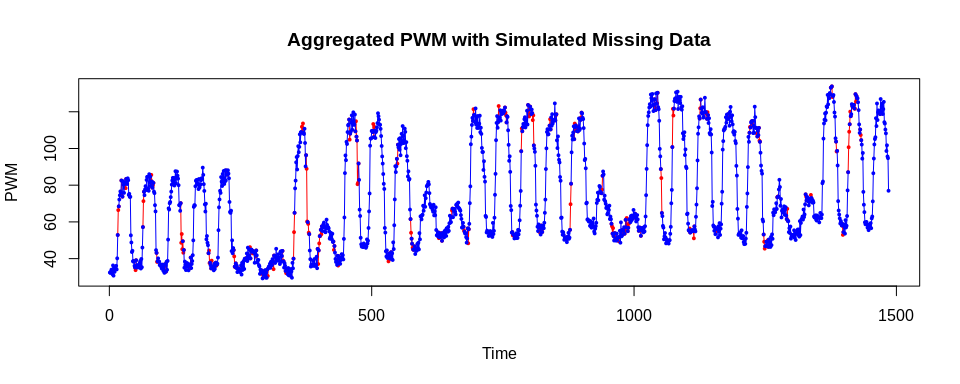

KE5105 - Building Electrical Consumption Forecasting
================

Extract, Transform and Load Data 5 - Data Imputation
====================================================

Summary of Findings
===================

-   to be filled in
-   to be filled in
    -   to be filled in

Load libraries
==============

``` r
library(ggplot2)
library(xts)
```

    ## Loading required package: zoo

    ## 
    ## Attaching package: 'zoo'

    ## The following objects are masked from 'package:base':
    ## 
    ##     as.Date, as.Date.numeric

``` r
library(imputeTS)
```

    ## 
    ## Attaching package: 'imputeTS'

    ## The following object is masked from 'package:zoo':
    ## 
    ##     na.locf

Load data
=========

``` r
sde3_agg_df <- read.csv("/home/tkokkeng/Documents/KE5105/ETL/source/test_data/SDE-3.agg.csv", header = TRUE, stringsAsFactors = FALSE)
head(sde3_agg_df)
```

Convert the Pt\_timeStamp strings to POSIX time
-----------------------------------------------

``` r
sde3_agg_df$Pt_timeStamp <- strptime(sde3_agg_df$Pt_timeStamp, format = "%Y-%m-%d %H:%M:%S", tz="GMT")
head(sde3_agg_df)
```

Look for the largest contiguous subset of non-NA data
-----------------------------------------------------

``` r
PWM_notNA_df <- data.frame(sde3_agg_df$PWM_30min_avg)
head(PWM_notNA_df)
```

    ##   sde3_agg_df.PWM_30min_avg
    ## 1                        NA
    ## 2                        NA
    ## 3                        NA
    ## 4                        NA
    ## 5                        NA
    ## 6                        NA

### Get a cumulative count of the NAs.

``` r
PWM_notNA_df$na_cumsum = cumsum(is.na(PWM_notNA_df$sde3_agg_df.PWM_30min_avg))
head(PWM_notNA_df)
```

    ##   sde3_agg_df.PWM_30min_avg na_cumsum
    ## 1                        NA         1
    ## 2                        NA         2
    ## 3                        NA         3
    ## 4                        NA         4
    ## 5                        NA         5
    ## 6                        NA         6

### Remove the rows with NAs, leaving only the data rows. Each consective data row has a unique cumulative count.

``` r
PWM_notNA_df <- PWM_notNA_df[!is.na(PWM_notNA_df$sde3_agg_df.PWM_30min_avg),]
head(PWM_notNA_df)
```

    ##      sde3_agg_df.PWM_30min_avg na_cumsum
    ## 1995                     76.50      1994
    ## 1996                     74.68      1994
    ## 1997                     76.69      1994
    ## 1998                     78.11      1994
    ## 1999                     77.97      1994
    ## 2000                     78.70      1994

### Group the data rows by their cumulative count and get the frequency which is the size of each contiguous block of data.

``` r
PWM_notNA_df <- as.data.frame(table(PWM_notNA_df$na_cumsum), stringsAsFactors = FALSE)
colnames(PWM_notNA_df) <- c("row", "size")
PWM_notNA_df$row = as.integer(PWM_notNA_df$row)
head(PWM_notNA_df)
```

    ##    row size
    ## 1 1994  231
    ## 2 2003  287
    ## 3 3059  168
    ## 4 3061  194
    ## 5 3357  177
    ## 6 3362 1483

### Offset the row numbers to get the correct row index.

``` r
PWM_notNA_df[2:nrow(PWM_notNA_df), c("row")] <- tail(PWM_notNA_df$row, -1) + head(cumsum(PWM_notNA_df$size), -1) + 1
head(PWM_notNA_df)
```

    ##    row size
    ## 1 1994  231
    ## 2 2235  287
    ## 3 3578  168
    ## 4 3748  194
    ## 5 4238  177
    ## 6 4420 1483

### Find the biggest contiguous data blocks.

``` r
PWM_notNA_df[which(PWM_notNA_df$size == max(PWM_notNA_df$size)),]
```

    ##      row size
    ## 22 17570 1485
    ## 27 21986 1485
    ## 30 24914 1485
    ## 40 46850 1485

Plot the data.

``` r
ts <- xts(sde3_agg_df[17570:(17570+1485-1),]$PWM_30min_avg, sde3_agg_df[17570:(17570+1485-1),]$Pt_timeStamp)
```

Plot the time series data for a period without missing data
-----------------------------------------------------------

``` r
autoplot(ts) +
  ylab("Aggregated PWM") +
  xlab("Time") +
  ggtitle("SDE-3 Aggregated PWM for a Period without Missing Data")
```


``` r
which(is.na(sde3_agg_df[17570:(17570+1485),]$PWM_30min_avg))
```

    ## [1] 1486

Simulate missing data using an exponential distribution
-------------------------------------------------------

``` r
#' Code of the missing data simulation function
#' @param data - univariate time series
#' @param rate - lambda value for exponential distribution (# events per unit time)
#' @param seed - random seed used for the function

create.missing <- function(data, rate, seed=NULL) {

    ## Only for time series
  if (class(data) != "ts") {
    stop("Provided data is not a time series.")
  }

  ## No missing data (pass-through)
  if (rate == 0) {
    return(data)
  }

  ## Save original parameters
  t <- time(data)
  f <- frequency(data)
  
  ##Setting of random seed
  if (!is.null(seed))
    set.seed(seed)
  
  ## Initialize index
  a <- 0
  
  ## Indices of removed entries
  tempDelete <- numeric(0)
  while (a < length(data)) {
    ## 'ceiling' is to avoid possible zeros
    a <- ceiling(a + rexp(1, rate))
    if ( a <= length(data) ) {
      data[a] <- NA
      tempDelete <- c(tempDelete, a)
    }
  }
  return(list(data=data, na.ind=tempDelete))
}
```

### Simulate missing data for 1 contiguous data block

``` r
ts <- ts(sde3_agg_df[17570:(17570+1485-1),]$PWM_30min_avg)
missing <- create.missing(data = ts, rate = .1, seed = 729)
```

### Prepare the simulated data for plotting

``` r
removed_data = sde3_agg_df[17570:(17570+1485-1),]$PWM_30min_avg
na_found <- FALSE
for (i in 1:length(removed_data))
  if (!is.na(missing$data[i])) {
    temp <- removed_data[i]
    if (!na_found) {
      removed_data[i] <- NA
    }
    na_found <- FALSE
  } else if (!na_found) {
    na_found = TRUE
    removed_data[i-1] <- temp
  }
```

### PLot the simulated missing data

``` r
ts_removed_data = ts(removed_data)
ts_data_with_missing = ts(missing$data)
tsm <- cbind(ts_removed_data, ts_data_with_missing)
plot.ts(tsm, plot.type = "single", col = c("red", "blue"), type = "o", pch = 19, cex = .4, ylab = "PWM")
title("Aggregated PWM with Simulated Missing Data")
```


``` r
plot.ts(tsm[100:250,], plot.type = "single", col = c("red", "blue"), type = "o", pch = 19, cex = .4, ylab = "PWM")
title("Aggregated PWM with Simulated Missing Data")
```


``` r
ts_removed_data = ts(removed_data)
ts_data_with_missing = ts(missing$data)
tsm <- cbind(ts_removed_data, ts_data_with_missing)
plot.ts(tsm, plot.type = "multiple", type = "o", pch = 19, cex = .4, main = "Aggregated PWM with Simulated Missing Data")
```


``` r
#title("Aggregated PWM with Simulated Missing Data")
```

Create the simulated missing data for a set of contiguous data blocks.
----------------------------------------------------------------------

``` r
# Sort the contiguous data blocks by size.
PWM_notNA_df <- PWM_notNA_df[order(-PWM_notNA_df$size),]
head(PWM_notNA_df, 10)
```

    ##      row size
    ## 22 17570 1485
    ## 27 21986 1485
    ## 30 24914 1485
    ## 40 46850 1485
    ## 6   4420 1483
    ## 38 32162 1458
    ## 11  8834 1437
    ## 21 16130 1437
    ## 31 26402 1437
    ## 23 19058 1380

``` r
# Generate missing data for the 10 largest data blocks
missing = vector("list", 10)
for (i in 1:10) {
  ts <- ts(sde3_agg_df[PWM_notNA_df$row[i]:(PWM_notNA_df$row[i]+PWM_notNA_df$size[i]-1),]$PWM_30min_avg)
  missing[[i]] <- c(create.missing(data = ts, rate = .1, seed = 729), row = PWM_notNA_df$row[i], size = PWM_notNA_df$size[i])
} 
```

``` r
# Check the generated data for 1 block
removed_data = sde3_agg_df[missing[[2]]$row:(missing[[2]]$row+missing[[2]]$size-1),]$PWM_30min_avg
na_found <- FALSE
for (i in 1:length(removed_data))
  if (!is.na(missing[[2]]$data[i])) {
    temp <- removed_data[i]
    if (!na_found) {
      removed_data[i] <- NA
    }
    na_found <- FALSE
  } else if (!na_found) {
    na_found = TRUE
    removed_data[i-1] <- temp
  }

ts_removed_data = ts(removed_data)
ts_data_with_missing = ts(missing[[2]]$data)
tsm <- cbind(ts_removed_data, ts_data_with_missing)
plot.ts(tsm, plot.type = "single", col = c("red", "blue"), type = "o", pch = 19, cex = .4, ylab = "PWM")
title("Aggregated PWM with Simulated Missing Data")
```



Save the simulated missing data to file.
----------------------------------------

``` r
saveRDS(missing, "sim_missing_data.rds")
```
