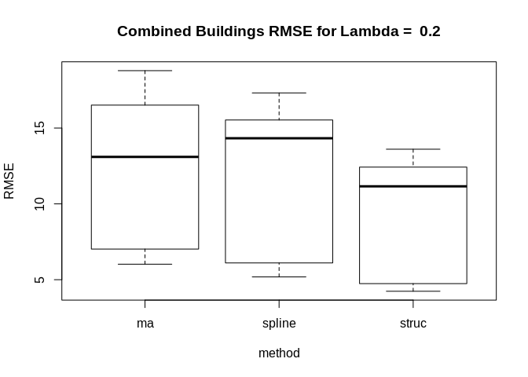

KE5105 - Building Electrical Consumption Forecasting
================

Extract, Transform and Load Data 7 - Data Imputation - MD1 and MD6
==================================================================

Summary of Findings
===================

-   Data imputation was performed on the 20 test periods of MD1 and MD6 data with simulated missing completely at random (MCAR) data using :
    -   structural model with Kalman smoothing
    -   arima model with Kalman smoothing
    -   spline interpolation
    -   exponential moving average (k=4)
-   Outliers in the rmse were found in arima for all lambda values
-   1-way anova test found
    -   for combined md1, md6 data, no significant differences
    -   for md1 data, no significant differences
    -   for md6 data, significant differences for all lambda
-   Multiple pairwise t-tests found the following relationships between rmse:
    -   for combined md1, md6 data, no significant differences
    -   for md1 data, no significant differences
    -   for md6 data :
    -   for lambda=.1, ma &gt; struc
    -   for lambda=.15, ma &gt; struc, spline
    -   for lambda=.2, ma, spline &gt; struc
    -   for lambda=.25, ma &gt; struc, spline

Load libraries
==============

``` r
library(ggplot2)
library(xts)
```

    ## Loading required package: zoo

    ## 
    ## Attaching package: 'zoo'

    ## The following objects are masked from 'package:base':
    ## 
    ##     as.Date, as.Date.numeric

``` r
library(imputeTS)
```

    ## 
    ## Attaching package: 'imputeTS'

    ## The following object is masked from 'package:zoo':
    ## 
    ##     na.locf

Load data
=========

``` r
# Time series data
md1_df <- read.csv("/home/tkokkeng/Documents/KE5105/ETL/source/processed_bldg_data/MD1.csv", header = TRUE, stringsAsFactors = FALSE)
md6_df <- read.csv("/home/tkokkeng/Documents/KE5105/ETL/source/processed_bldg_data/MD6.csv", header = TRUE, stringsAsFactors = FALSE)

# A list of 10 time series datasets with simulated missing data
missing_list_md1 <- readRDS("/home/tkokkeng/Documents/KE5105/ETL/source/md1-data/sim_missing_data.md1.rds")
missing_list_md6 <- readRDS("/home/tkokkeng/Documents/KE5105/ETL/source/md6-data/sim_missing_data.md6.rds")
```

``` r
cat("length MD1 data = ", length(missing_list_md1), "\n", "length MD6 data = ", length(missing_list_md6))
```

    ## length MD1 data =  4 
    ##  length MD6 data =  4

``` r
computeResults <- function(bldg_name, nresults, missing_list, data_df) {
  
  #results = vector('list', num_lambdas * num_datasets)
  num_datasets = length(missing_list[[1]])-1
  results = vector('list', nresults)
  idx = 1
  for (i in missing_list) {

    for (j in 1:num_datasets) {
      # test data
      data_with_na = i[[j+1]]$data
      data_true = data_df[i[[j+1]]$row:(i[[j+1]]$row+i[[j+1]]$size-1), ]$PWM_30min_avg
      na_true = data_true[i[[j+1]]$na.ind]
      
      # Impute the missing values using structural model and Kalman smoothing
      imp_struct <- na.kalman(data_with_na)
      # Impute the missing values using ARIMA model and Kalman smoothing
      imp_arima <- na.kalman(data_with_na, model = "auto.arima")
      # Impute the missing values using spline interpolation
      imp_spline <- na.interpolation(data_with_na, option = "spline")
      # Impute the missing values using moving average
      imp_ma <- na.ma(data_with_na, k=4, weighting="exponential")  
    
      # Save the imputed data to file (.csv)
      for (k in list("imp_struct", "imp_arima", "imp_spline", "imp_ma")) {
        df = data.frame(eval(parse(text = k)))
        colnames(df) = c('PWM_30min_avg')
        write.csv(df,
                  file = paste(bldg_name, "_", k, "_", i$lambda, "_", j, ".csv", sep = ""),
                  row.names = FALSE)
      }
      
      # Extract all the imputed na values
      na_imp_struct = imp_struct[i[[j+1]]$na.ind]
      na_imp_arima = imp_arima[i[[j+1]]$na.ind]
      na_imp_spline = imp_spline[i[[j+1]]$na.ind]
      na_imp_ma = imp_ma[i[[j+1]]$na.ind]
      
      # compute rmse
      rmse_struct = sqrt(mean((na_imp_struct - na_true)^2))
      rmse_arima = sqrt(mean((na_imp_arima - na_true)^2))
      rmse_spline = sqrt(mean((na_imp_spline - na_true)^2))
      rmse_ma = sqrt(mean((na_imp_ma - na_true)^2))
      
      #Update results
      results[[idx]] <- c(i$lambda, rmse_struct, rmse_arima, rmse_spline, rmse_ma)
      idx = idx + 1
    }
  }
  return(results)
}
```

``` r
# Each list has lambda, missing1, ..., missing<n>
nresults_md1 <- length(missing_list_md1) * (length(missing_list_md1[[1]])-1)
nresults_md6 <- length(missing_list_md6) * (length(missing_list_md6[[1]])-1)
results_md1 <- computeResults("md1", nresults_md1, missing_list_md1, md1_df)
results_md6 <- computeResults("md6", nresults_md6, missing_list_md6, md6_df)
results <- c(results_md1, results_md6)
```

``` r
results_df = as.data.frame(matrix(unlist(results), nrow = length(results), byrow = TRUE))
colnames(results_df) = c("lambda", "struc", "arima", "spline", "ma")
results_df
```

    ##    lambda     struc      arima    spline        ma
    ## 1    0.10  5.047777   5.118169  5.207669  6.821642
    ## 2    0.10  4.063379   4.048662  4.822783  6.400616
    ## 3    0.10  4.203199   4.178175  4.944999  5.855171
    ## 4    0.10  4.741377   4.705362  5.654420  5.611359
    ## 5    0.10  4.121066  12.802843  5.500801  5.103059
    ## 6    0.10  9.684477   9.823103 12.105365 10.261485
    ## 7    0.10 12.030570  12.132082 13.665242 11.976015
    ## 8    0.10 11.199660  11.387736 13.995601 11.588322
    ## 9    0.10  4.150031 110.377394  4.875450  5.800978
    ## 10   0.10  4.911640   5.456342  6.428827  5.037761
    ## 11   0.15  4.293671   4.345336  4.754883  5.821346
    ## 12   0.15  4.732957   4.980107  5.136180  6.809451
    ## 13   0.15  4.868548   4.973187  4.974461  6.573382
    ## 14   0.15  5.840282   5.843963  6.794611  7.428414
    ## 15   0.15  4.951159   4.955021  6.063990  6.063995
    ## 16   0.15  9.985914  10.165127 12.306772 10.390985
    ## 17   0.15 11.666851  11.853060 13.969452 12.633479
    ## 18   0.15 13.332882  13.385437 13.882309 14.219787
    ## 19   0.15  6.079847 131.575755  8.426783  7.532530
    ## 20   0.15  7.595035   7.608888  9.024535  8.127902
    ## 21   0.20  4.492220   4.525602  5.300840  7.060333
    ## 22   0.20  4.708793  67.303007  5.182905  7.059061
    ## 23   0.20  4.772080   4.727833  5.901287  6.980920
    ## 24   0.20  4.343913  65.517240  6.309013  6.455489
    ## 25   0.20  4.556444  69.011550  5.689729  6.022582
    ## 26   0.20  8.779913 150.413263 11.463538  9.428699
    ## 27   0.20 11.272084 147.470461 15.403498 11.543136
    ## 28   0.20 11.038642  11.058358 14.743800 12.035722
    ## 29   0.20  4.234888   4.293479  5.426458  6.158523
    ## 30   0.20  5.068650   5.257179  6.327678  6.092935
    ## 31   0.25  4.968565   5.039827  5.332411  7.354626
    ## 32   0.25  4.670062   4.673951  5.090643  7.845585
    ## 33   0.25  4.974988   5.001001  5.820403  6.486849
    ## 34   0.25  4.819370   4.796855  5.772914  6.028855
    ## 35   0.25  4.595866   4.598833  5.771782  5.869773
    ## 36   0.25 11.284835  11.543109 13.282888 11.914325
    ## 37   0.25 11.548943 160.959402 15.001701 12.250686
    ## 38   0.25 11.416316  11.548009 16.033833 11.671696
    ## 39   0.25  4.952108   4.949732  6.532454  6.626338
    ## 40   0.25  6.494337   6.640844  7.602149  7.191296
    ## 41   0.10 14.928009  14.175485 14.773331 20.073963
    ## 42   0.10 10.679136  11.136428 12.590384 13.191062
    ## 43   0.10 11.749044  12.238843 14.683577 13.074773
    ## 44   0.10 14.092115  13.281543 17.111789 17.133155
    ## 45   0.10  9.509587   9.391052 12.128343 13.565252
    ## 46   0.10 14.202786  14.104551 16.844290 17.651109
    ## 47   0.10 12.440411 223.185735 15.736808 14.818304
    ## 48   0.10 11.423132  11.562104 13.550672 12.901227
    ## 49   0.10 11.448859  11.293402 12.560840 13.670785
    ## 50   0.10 13.398165  13.482050 15.059743 15.656917
    ## 51   0.15 15.658242  14.424389 14.702332 20.504634
    ## 52   0.15 11.377773  11.733717 12.382077 14.143345
    ## 53   0.15 12.395416  12.487529 14.972845 14.974992
    ## 54   0.15 12.436727  11.883442 14.823771 15.072123
    ## 55   0.15 14.624590  14.496001 16.655143 18.584376
    ## 56   0.15 12.331348  12.509764 14.055956 16.434497
    ## 57   0.15 14.246743  14.531105 16.646469 17.829649
    ## 58   0.15 13.195700  84.170323 13.527210 16.999652
    ## 59   0.15 12.130275  12.339332 14.498382 15.471118
    ## 60   0.15 13.523127 265.731012 14.009568 16.291028
    ## 61   0.20 13.303985  12.768999 16.648559 18.785634
    ## 62   0.20 10.894940  11.565732 13.660894 14.161105
    ## 63   0.20 13.442011  13.703209 16.183945 16.557339
    ## 64   0.20 13.604330 136.926737 17.317315 17.874589
    ## 65   0.20 13.505749  13.761823 16.990937 18.533171
    ## 66   0.20 11.834017  12.102790 15.657917 16.488040
    ## 67   0.20 12.445197  11.930126 14.921269 15.953934
    ## 68   0.20 12.018852 133.851092 15.255791 14.374072
    ## 69   0.20 12.402476  12.455742 15.292902 16.540641
    ## 70   0.20 11.977587 299.986551 13.907459 15.406407
    ## 71   0.25 15.828828  15.057822 15.219976 21.304199
    ## 72   0.25 10.996558  11.190927 13.593096 13.055448
    ## 73   0.25 12.659987  12.928553 15.063856 14.699493
    ## 74   0.25 12.734094  12.575543 15.191867 16.658100
    ## 75   0.25 13.377158  13.165116 16.310676 16.915083
    ## 76   0.25 13.805177  14.060826 15.482455 18.088047
    ## 77   0.25 12.120259 152.550893 16.067856 15.702557
    ## 78   0.25 12.769232  12.983763 15.487692 15.498048
    ## 79   0.25 11.730045  12.122599 13.990892 14.305814
    ## 80   0.25 12.111400  12.058359 14.797724 14.367515

``` r
colMeans(results_df)
```

    ##   lambda    struc    arima   spline       ma 
    ##  0.17500  9.74808 35.56188 11.61102 12.06808

``` r
# same as apply(results_df, 2, mean)
```

``` r
apply(results_df, 2, sd)
```

    ##     lambda      struc      arima     spline         ma 
    ##  0.0562544  3.7942042 61.3072409  4.4258685  4.6616113

``` r
aggregate(results_df[, 2:5], list(lambda = results_df$lambda), mean)
```

    ##   lambda     struc    arima   spline       ma
    ## 1   0.10  9.401221 25.69405 11.11205 11.30965
    ## 2   0.15 10.263354 32.69962 11.58039 12.59533
    ## 3   0.20  9.434839 59.43154 11.87929 12.17562
    ## 4   0.25  9.892906 24.42230 11.87236 12.19172

``` r
aggregate(results_df[, 2:5], list(lambda = results_df$lambda), sd)
```

    ##   lambda    struc    arima   spline       ma
    ## 1   0.10 3.962145 51.71880 4.551588 4.692031
    ## 2   0.15 3.843589 63.08116 4.112047 4.780194
    ## 3   0.20 3.801570 77.90022 4.797479 4.801357
    ## 4   0.25 3.794971 45.42871 4.515943 4.637758

There are **outliers** in the RMSE for several ARIMA imputations. Let's look at test sample \#9 in MD1 for lambda = .15.

Check the outliers in the ARIMA imputation.
-------------------------------------------

``` r
results = vector('list', 1)
idx = 1
for (j in list(10)) {
  # test data
  data_with_na = missing_list_md1[[2]][[j]]$data
  data_true = md1_df[missing_list_md1[[2]][[j]]$row:(missing_list_md1[[2]][[j]]$row+missing_list_md1[[2]][[j]]$size-1), ]$PWM_30min_avg
  na_true = data_true[missing_list_md1[[2]][[j]]$na.ind]
  
  # Impute the missing values using ARIMA model and Kalman smoothing
  imp_arima <- na.kalman(data_with_na, model = "auto.arima")

  # Extract all the imputed na values
  na_imp_arima = imp_arima[missing_list_md1[[2]][[j]]$na.ind]

  # compute rmse
  rmse_arima = sqrt(mean((na_imp_arima - na_true)^2))

  #Update results
  results[[idx]] <- c(lambda=missing_list_md1[[2]]$lambda, rmse=rmse_arima, imp=list(imp_arima), data.withNA=list(data_with_na))
  idx = idx + 1
}  
```

``` r
plotNA.imputations(x.withNA = results[[1]]$data.withNA,
                   x.withImputations = results[[1]]$imp,
                   main = "Imputed Values with High RMSE Using ARIMA Model with Kalman Smoothing",
                   ylim = c(-10, 500), cex = .1)
```


Look into the variation in RMSE for structural model. E.g. for lambda=.1, sample 9 RMSE more than twice that of sample 1.

``` r
results = vector('list', 2)
idx = 1
for (j in list(2, 9)) {
  # test data
  data_with_na = missing_list_md1[[2]][[j]]$data
  data_true = md1_df[missing_list_md1[[2]][[j]]$row:(missing_list_md1[[2]][[j]]$row+missing_list_md1[[2]][[j]]$size-1), ]$PWM_30min_avg
  na_true = data_true[missing_list_md1[[2]][[j]]$na.ind]
  
  # Impute the missing values using structural model and Kalman smoothing
  imp_struc <- na.kalman(data_with_na)

  # Extract all the imputed na values
  na_imp_struc = imp_struc[missing_list_md1[[2]][[j]]$na.ind]

  # compute rmse
  rmse_struc = sqrt(mean((na_imp_struc - na_true)^2))

  #Update results
  results[[idx]] <- c(lambda=missing_list_md1[[2]]$lambda, rmse=rmse_struc, imp=list(imp_struc), data.withNA=list(data_with_na))
  idx = idx + 1
}  
```

``` r
plotNA.imputations(x.withNA = results[[1]]$data.withNA[1:500],
                   x.withImputations = results[[1]]$imp[1:500],
                   main = "Imputed Values with low RMSE Using Structural Model with Kalman Smoothing",
                   ylim = c(250, 500), cex = .1)
```


``` r
plotNA.imputations(x.withNA = results[[2]]$data.withNA[1:500],
                   x.withImputations = results[[2]]$imp[1:500],
                   main = "Imputed Values with higher RMSE Using Structural Model with Kalman Smoothing",
                   ylim = c(250, 500), cex = .1)
```


In the above plots, sample 9 shows more variation in the data than in sample 1. This may account for the higher RMSE.

Check for significance in the difference in the means of the RMSE.
------------------------------------------------------------------

### One-way ANOVA

#### Determine whether the means from the 4 imputation methods are equal.

``` r
results_long_df <- reshape(results_df, varying = c('struc', 'arima', 'spline', 'ma'),
                           timevar = "method", v.names='RMSE',
                           times=c('struc', 'arima', 'spline', 'ma'), direction="long")
results_long_df$method <- as.factor(results_long_df$method)
results_long_df
```

    ##           lambda method       RMSE id
    ## 1.struc     0.10  struc   5.047777  1
    ## 2.struc     0.10  struc   4.063379  2
    ## 3.struc     0.10  struc   4.203199  3
    ## 4.struc     0.10  struc   4.741377  4
    ## 5.struc     0.10  struc   4.121066  5
    ## 6.struc     0.10  struc   9.684477  6
    ## 7.struc     0.10  struc  12.030570  7
    ## 8.struc     0.10  struc  11.199660  8
    ## 9.struc     0.10  struc   4.150031  9
    ## 10.struc    0.10  struc   4.911640 10
    ## 11.struc    0.15  struc   4.293671 11
    ## 12.struc    0.15  struc   4.732957 12
    ## 13.struc    0.15  struc   4.868548 13
    ## 14.struc    0.15  struc   5.840282 14
    ## 15.struc    0.15  struc   4.951159 15
    ## 16.struc    0.15  struc   9.985914 16
    ## 17.struc    0.15  struc  11.666851 17
    ## 18.struc    0.15  struc  13.332882 18
    ## 19.struc    0.15  struc   6.079847 19
    ## 20.struc    0.15  struc   7.595035 20
    ## 21.struc    0.20  struc   4.492220 21
    ## 22.struc    0.20  struc   4.708793 22
    ## 23.struc    0.20  struc   4.772080 23
    ## 24.struc    0.20  struc   4.343913 24
    ## 25.struc    0.20  struc   4.556444 25
    ## 26.struc    0.20  struc   8.779913 26
    ## 27.struc    0.20  struc  11.272084 27
    ## 28.struc    0.20  struc  11.038642 28
    ## 29.struc    0.20  struc   4.234888 29
    ## 30.struc    0.20  struc   5.068650 30
    ## 31.struc    0.25  struc   4.968565 31
    ## 32.struc    0.25  struc   4.670062 32
    ## 33.struc    0.25  struc   4.974988 33
    ## 34.struc    0.25  struc   4.819370 34
    ## 35.struc    0.25  struc   4.595866 35
    ## 36.struc    0.25  struc  11.284835 36
    ## 37.struc    0.25  struc  11.548943 37
    ## 38.struc    0.25  struc  11.416316 38
    ## 39.struc    0.25  struc   4.952108 39
    ## 40.struc    0.25  struc   6.494337 40
    ## 41.struc    0.10  struc  14.928009 41
    ## 42.struc    0.10  struc  10.679136 42
    ## 43.struc    0.10  struc  11.749044 43
    ## 44.struc    0.10  struc  14.092115 44
    ## 45.struc    0.10  struc   9.509587 45
    ## 46.struc    0.10  struc  14.202786 46
    ## 47.struc    0.10  struc  12.440411 47
    ## 48.struc    0.10  struc  11.423132 48
    ## 49.struc    0.10  struc  11.448859 49
    ## 50.struc    0.10  struc  13.398165 50
    ## 51.struc    0.15  struc  15.658242 51
    ## 52.struc    0.15  struc  11.377773 52
    ## 53.struc    0.15  struc  12.395416 53
    ## 54.struc    0.15  struc  12.436727 54
    ## 55.struc    0.15  struc  14.624590 55
    ## 56.struc    0.15  struc  12.331348 56
    ## 57.struc    0.15  struc  14.246743 57
    ## 58.struc    0.15  struc  13.195700 58
    ## 59.struc    0.15  struc  12.130275 59
    ## 60.struc    0.15  struc  13.523127 60
    ## 61.struc    0.20  struc  13.303985 61
    ## 62.struc    0.20  struc  10.894940 62
    ## 63.struc    0.20  struc  13.442011 63
    ## 64.struc    0.20  struc  13.604330 64
    ## 65.struc    0.20  struc  13.505749 65
    ## 66.struc    0.20  struc  11.834017 66
    ## 67.struc    0.20  struc  12.445197 67
    ## 68.struc    0.20  struc  12.018852 68
    ## 69.struc    0.20  struc  12.402476 69
    ## 70.struc    0.20  struc  11.977587 70
    ## 71.struc    0.25  struc  15.828828 71
    ## 72.struc    0.25  struc  10.996558 72
    ## 73.struc    0.25  struc  12.659987 73
    ## 74.struc    0.25  struc  12.734094 74
    ## 75.struc    0.25  struc  13.377158 75
    ## 76.struc    0.25  struc  13.805177 76
    ## 77.struc    0.25  struc  12.120259 77
    ## 78.struc    0.25  struc  12.769232 78
    ## 79.struc    0.25  struc  11.730045 79
    ## 80.struc    0.25  struc  12.111400 80
    ## 1.arima     0.10  arima   5.118169  1
    ## 2.arima     0.10  arima   4.048662  2
    ## 3.arima     0.10  arima   4.178175  3
    ## 4.arima     0.10  arima   4.705362  4
    ## 5.arima     0.10  arima  12.802843  5
    ## 6.arima     0.10  arima   9.823103  6
    ## 7.arima     0.10  arima  12.132082  7
    ## 8.arima     0.10  arima  11.387736  8
    ## 9.arima     0.10  arima 110.377394  9
    ## 10.arima    0.10  arima   5.456342 10
    ## 11.arima    0.15  arima   4.345336 11
    ## 12.arima    0.15  arima   4.980107 12
    ## 13.arima    0.15  arima   4.973187 13
    ## 14.arima    0.15  arima   5.843963 14
    ## 15.arima    0.15  arima   4.955021 15
    ## 16.arima    0.15  arima  10.165127 16
    ## 17.arima    0.15  arima  11.853060 17
    ## 18.arima    0.15  arima  13.385437 18
    ## 19.arima    0.15  arima 131.575755 19
    ## 20.arima    0.15  arima   7.608888 20
    ## 21.arima    0.20  arima   4.525602 21
    ## 22.arima    0.20  arima  67.303007 22
    ## 23.arima    0.20  arima   4.727833 23
    ## 24.arima    0.20  arima  65.517240 24
    ## 25.arima    0.20  arima  69.011550 25
    ## 26.arima    0.20  arima 150.413263 26
    ## 27.arima    0.20  arima 147.470461 27
    ## 28.arima    0.20  arima  11.058358 28
    ## 29.arima    0.20  arima   4.293479 29
    ## 30.arima    0.20  arima   5.257179 30
    ## 31.arima    0.25  arima   5.039827 31
    ## 32.arima    0.25  arima   4.673951 32
    ## 33.arima    0.25  arima   5.001001 33
    ## 34.arima    0.25  arima   4.796855 34
    ## 35.arima    0.25  arima   4.598833 35
    ## 36.arima    0.25  arima  11.543109 36
    ## 37.arima    0.25  arima 160.959402 37
    ## 38.arima    0.25  arima  11.548009 38
    ## 39.arima    0.25  arima   4.949732 39
    ## 40.arima    0.25  arima   6.640844 40
    ## 41.arima    0.10  arima  14.175485 41
    ## 42.arima    0.10  arima  11.136428 42
    ## 43.arima    0.10  arima  12.238843 43
    ## 44.arima    0.10  arima  13.281543 44
    ## 45.arima    0.10  arima   9.391052 45
    ## 46.arima    0.10  arima  14.104551 46
    ## 47.arima    0.10  arima 223.185735 47
    ## 48.arima    0.10  arima  11.562104 48
    ## 49.arima    0.10  arima  11.293402 49
    ## 50.arima    0.10  arima  13.482050 50
    ## 51.arima    0.15  arima  14.424389 51
    ## 52.arima    0.15  arima  11.733717 52
    ## 53.arima    0.15  arima  12.487529 53
    ## 54.arima    0.15  arima  11.883442 54
    ## 55.arima    0.15  arima  14.496001 55
    ## 56.arima    0.15  arima  12.509764 56
    ## 57.arima    0.15  arima  14.531105 57
    ## 58.arima    0.15  arima  84.170323 58
    ## 59.arima    0.15  arima  12.339332 59
    ## 60.arima    0.15  arima 265.731012 60
    ## 61.arima    0.20  arima  12.768999 61
    ## 62.arima    0.20  arima  11.565732 62
    ## 63.arima    0.20  arima  13.703209 63
    ## 64.arima    0.20  arima 136.926737 64
    ## 65.arima    0.20  arima  13.761823 65
    ## 66.arima    0.20  arima  12.102790 66
    ## 67.arima    0.20  arima  11.930126 67
    ## 68.arima    0.20  arima 133.851092 68
    ## 69.arima    0.20  arima  12.455742 69
    ## 70.arima    0.20  arima 299.986551 70
    ## 71.arima    0.25  arima  15.057822 71
    ## 72.arima    0.25  arima  11.190927 72
    ## 73.arima    0.25  arima  12.928553 73
    ## 74.arima    0.25  arima  12.575543 74
    ## 75.arima    0.25  arima  13.165116 75
    ## 76.arima    0.25  arima  14.060826 76
    ## 77.arima    0.25  arima 152.550893 77
    ## 78.arima    0.25  arima  12.983763 78
    ## 79.arima    0.25  arima  12.122599 79
    ## 80.arima    0.25  arima  12.058359 80
    ## 1.spline    0.10 spline   5.207669  1
    ## 2.spline    0.10 spline   4.822783  2
    ## 3.spline    0.10 spline   4.944999  3
    ## 4.spline    0.10 spline   5.654420  4
    ## 5.spline    0.10 spline   5.500801  5
    ## 6.spline    0.10 spline  12.105365  6
    ## 7.spline    0.10 spline  13.665242  7
    ## 8.spline    0.10 spline  13.995601  8
    ## 9.spline    0.10 spline   4.875450  9
    ## 10.spline   0.10 spline   6.428827 10
    ## 11.spline   0.15 spline   4.754883 11
    ## 12.spline   0.15 spline   5.136180 12
    ## 13.spline   0.15 spline   4.974461 13
    ## 14.spline   0.15 spline   6.794611 14
    ## 15.spline   0.15 spline   6.063990 15
    ## 16.spline   0.15 spline  12.306772 16
    ## 17.spline   0.15 spline  13.969452 17
    ## 18.spline   0.15 spline  13.882309 18
    ## 19.spline   0.15 spline   8.426783 19
    ## 20.spline   0.15 spline   9.024535 20
    ## 21.spline   0.20 spline   5.300840 21
    ## 22.spline   0.20 spline   5.182905 22
    ## 23.spline   0.20 spline   5.901287 23
    ## 24.spline   0.20 spline   6.309013 24
    ## 25.spline   0.20 spline   5.689729 25
    ## 26.spline   0.20 spline  11.463538 26
    ## 27.spline   0.20 spline  15.403498 27
    ## 28.spline   0.20 spline  14.743800 28
    ## 29.spline   0.20 spline   5.426458 29
    ## 30.spline   0.20 spline   6.327678 30
    ## 31.spline   0.25 spline   5.332411 31
    ## 32.spline   0.25 spline   5.090643 32
    ## 33.spline   0.25 spline   5.820403 33
    ## 34.spline   0.25 spline   5.772914 34
    ## 35.spline   0.25 spline   5.771782 35
    ## 36.spline   0.25 spline  13.282888 36
    ## 37.spline   0.25 spline  15.001701 37
    ## 38.spline   0.25 spline  16.033833 38
    ## 39.spline   0.25 spline   6.532454 39
    ## 40.spline   0.25 spline   7.602149 40
    ## 41.spline   0.10 spline  14.773331 41
    ## 42.spline   0.10 spline  12.590384 42
    ## 43.spline   0.10 spline  14.683577 43
    ## 44.spline   0.10 spline  17.111789 44
    ## 45.spline   0.10 spline  12.128343 45
    ## 46.spline   0.10 spline  16.844290 46
    ## 47.spline   0.10 spline  15.736808 47
    ## 48.spline   0.10 spline  13.550672 48
    ## 49.spline   0.10 spline  12.560840 49
    ## 50.spline   0.10 spline  15.059743 50
    ## 51.spline   0.15 spline  14.702332 51
    ## 52.spline   0.15 spline  12.382077 52
    ## 53.spline   0.15 spline  14.972845 53
    ## 54.spline   0.15 spline  14.823771 54
    ## 55.spline   0.15 spline  16.655143 55
    ## 56.spline   0.15 spline  14.055956 56
    ## 57.spline   0.15 spline  16.646469 57
    ## 58.spline   0.15 spline  13.527210 58
    ## 59.spline   0.15 spline  14.498382 59
    ## 60.spline   0.15 spline  14.009568 60
    ## 61.spline   0.20 spline  16.648559 61
    ## 62.spline   0.20 spline  13.660894 62
    ## 63.spline   0.20 spline  16.183945 63
    ## 64.spline   0.20 spline  17.317315 64
    ## 65.spline   0.20 spline  16.990937 65
    ## 66.spline   0.20 spline  15.657917 66
    ## 67.spline   0.20 spline  14.921269 67
    ## 68.spline   0.20 spline  15.255791 68
    ## 69.spline   0.20 spline  15.292902 69
    ## 70.spline   0.20 spline  13.907459 70
    ## 71.spline   0.25 spline  15.219976 71
    ## 72.spline   0.25 spline  13.593096 72
    ## 73.spline   0.25 spline  15.063856 73
    ## 74.spline   0.25 spline  15.191867 74
    ## 75.spline   0.25 spline  16.310676 75
    ## 76.spline   0.25 spline  15.482455 76
    ## 77.spline   0.25 spline  16.067856 77
    ## 78.spline   0.25 spline  15.487692 78
    ## 79.spline   0.25 spline  13.990892 79
    ## 80.spline   0.25 spline  14.797724 80
    ## 1.ma        0.10     ma   6.821642  1
    ## 2.ma        0.10     ma   6.400616  2
    ## 3.ma        0.10     ma   5.855171  3
    ## 4.ma        0.10     ma   5.611359  4
    ## 5.ma        0.10     ma   5.103059  5
    ## 6.ma        0.10     ma  10.261485  6
    ## 7.ma        0.10     ma  11.976015  7
    ## 8.ma        0.10     ma  11.588322  8
    ## 9.ma        0.10     ma   5.800978  9
    ## 10.ma       0.10     ma   5.037761 10
    ## 11.ma       0.15     ma   5.821346 11
    ## 12.ma       0.15     ma   6.809451 12
    ## 13.ma       0.15     ma   6.573382 13
    ## 14.ma       0.15     ma   7.428414 14
    ## 15.ma       0.15     ma   6.063995 15
    ## 16.ma       0.15     ma  10.390985 16
    ## 17.ma       0.15     ma  12.633479 17
    ## 18.ma       0.15     ma  14.219787 18
    ## 19.ma       0.15     ma   7.532530 19
    ## 20.ma       0.15     ma   8.127902 20
    ## 21.ma       0.20     ma   7.060333 21
    ## 22.ma       0.20     ma   7.059061 22
    ## 23.ma       0.20     ma   6.980920 23
    ## 24.ma       0.20     ma   6.455489 24
    ## 25.ma       0.20     ma   6.022582 25
    ## 26.ma       0.20     ma   9.428699 26
    ## 27.ma       0.20     ma  11.543136 27
    ## 28.ma       0.20     ma  12.035722 28
    ## 29.ma       0.20     ma   6.158523 29
    ## 30.ma       0.20     ma   6.092935 30
    ## 31.ma       0.25     ma   7.354626 31
    ## 32.ma       0.25     ma   7.845585 32
    ## 33.ma       0.25     ma   6.486849 33
    ## 34.ma       0.25     ma   6.028855 34
    ## 35.ma       0.25     ma   5.869773 35
    ## 36.ma       0.25     ma  11.914325 36
    ## 37.ma       0.25     ma  12.250686 37
    ## 38.ma       0.25     ma  11.671696 38
    ## 39.ma       0.25     ma   6.626338 39
    ## 40.ma       0.25     ma   7.191296 40
    ## 41.ma       0.10     ma  20.073963 41
    ## 42.ma       0.10     ma  13.191062 42
    ## 43.ma       0.10     ma  13.074773 43
    ## 44.ma       0.10     ma  17.133155 44
    ## 45.ma       0.10     ma  13.565252 45
    ## 46.ma       0.10     ma  17.651109 46
    ## 47.ma       0.10     ma  14.818304 47
    ## 48.ma       0.10     ma  12.901227 48
    ## 49.ma       0.10     ma  13.670785 49
    ## 50.ma       0.10     ma  15.656917 50
    ## 51.ma       0.15     ma  20.504634 51
    ## 52.ma       0.15     ma  14.143345 52
    ## 53.ma       0.15     ma  14.974992 53
    ## 54.ma       0.15     ma  15.072123 54
    ## 55.ma       0.15     ma  18.584376 55
    ## 56.ma       0.15     ma  16.434497 56
    ## 57.ma       0.15     ma  17.829649 57
    ## 58.ma       0.15     ma  16.999652 58
    ## 59.ma       0.15     ma  15.471118 59
    ## 60.ma       0.15     ma  16.291028 60
    ## 61.ma       0.20     ma  18.785634 61
    ## 62.ma       0.20     ma  14.161105 62
    ## 63.ma       0.20     ma  16.557339 63
    ## 64.ma       0.20     ma  17.874589 64
    ## 65.ma       0.20     ma  18.533171 65
    ## 66.ma       0.20     ma  16.488040 66
    ## 67.ma       0.20     ma  15.953934 67
    ## 68.ma       0.20     ma  14.374072 68
    ## 69.ma       0.20     ma  16.540641 69
    ## 70.ma       0.20     ma  15.406407 70
    ## 71.ma       0.25     ma  21.304199 71
    ## 72.ma       0.25     ma  13.055448 72
    ## 73.ma       0.25     ma  14.699493 73
    ## 74.ma       0.25     ma  16.658100 74
    ## 75.ma       0.25     ma  16.915083 75
    ## 76.ma       0.25     ma  18.088047 76
    ## 77.ma       0.25     ma  15.702557 77
    ## 78.ma       0.25     ma  15.498048 78
    ## 79.ma       0.25     ma  14.305814 79
    ## 80.ma       0.25     ma  14.367515 80

``` r
for (i in list(.1, .15, .2, .25)) {
  plot(RMSE ~ method, data = results_long_df[results_long_df$lambda == i, ],
       main = paste("Combined Buildings RMSE for Lambda = ", i))
}
```


#### Arima has outliers for all lambda values. Leave it out in the analysis.

``` r
results_long_no_arima_df = results_long_df[results_long_df$method != "arima",]
results_long_no_arima_df$method <- factor(results_long_no_arima_df$method)
for (i in list(.1, .15, .2, .25)) {
plot(RMSE ~ method, data = results_long_no_arima_df[results_long_no_arima_df$lambda == i, ],
     main = paste("Combined Buildings RMSE for Lambda = ", i))
}
```



``` r
for (i in list(.1, .15, .2, .25)) {
  cat("lambda = ", i, "\n")
  res = aov(RMSE ~ method, data = results_long_no_arima_df[results_long_no_arima_df$lambda == i, ])
  print(summary(res))
  cat("--------------------------------------------------------------------------------------------------------------\n")
}
```

    ## lambda =  0.1 
    ##             Df Sum Sq Mean Sq F value Pr(>F)
    ## method       2   44.1   22.03   1.131   0.33
    ## Residuals   57 1110.2   19.48               
    ## --------------------------------------------------------------------------------------------------------------
    ## lambda =  0.15 
    ##             Df Sum Sq Mean Sq F value Pr(>F)
    ## method       2   54.7   27.34   1.504  0.231
    ## Residuals   57 1036.1   18.18               
    ## --------------------------------------------------------------------------------------------------------------
    ## lambda =  0.2 
    ##             Df Sum Sq Mean Sq F value Pr(>F)
    ## method       2   90.5   45.25   2.243  0.115
    ## Residuals   57 1149.9   20.17               
    ## --------------------------------------------------------------------------------------------------------------
    ## lambda =  0.25 
    ##             Df Sum Sq Mean Sq F value Pr(>F)
    ## method       2     62   31.02   1.653  0.201
    ## Residuals   57   1070   18.77               
    ## --------------------------------------------------------------------------------------------------------------

The anova tests found **insufficient evidence** to show that the differences are significant for all lambda values.

### Pairwise t-test for lambda .1, .15, .2, .25 (exclude ARIMA)

Pairwise multiple comparisons tests involve the computation of a p-value for each pair of the compared group. The p-value represents the risk of stating that an effect is statistically significant while this is not true. As the number of pairwise comparisons increases, and therefore the number of p-values, it becomes more likely to detect significant effects which are due to chance in reality.

To deal with this problem, multiple pairwise comparisons tests involve p-value corrections: p-values are penalized (= their value is increased) as the number of comparisons increase.

#### Results Summary

No significant pairwise differences found.

``` r
for (i in list(.1, .15, .2, .25)) {
  cat("lambda = ", i, "\n")
  print(pairwise.t.test(results_long_no_arima_df[results_long_no_arima_df$lambda == i,]$RMSE,
                        results_long_no_arima_df[results_long_no_arima_df$lambda == i,]$method,
                        p.adjust = "bonferroni"))
  cat("--------------------------------------------------------------------------------------------------------------\n")
}
```

    ## lambda =  0.1 
    ## 
    ##  Pairwise comparisons using t tests with pooled SD 
    ## 
    ## data:  results_long_no_arima_df[results_long_no_arima_df$lambda == i,  and results_long_no_arima_df[results_long_no_arima_df$lambda == i,      ]$RMSE and     ]$method 
    ## 
    ##        ma   spline
    ## spline 1.00 -     
    ## struc  0.53 0.68  
    ## 
    ## P value adjustment method: bonferroni 
    ## --------------------------------------------------------------------------------------------------------------
    ## lambda =  0.15 
    ## 
    ##  Pairwise comparisons using t tests with pooled SD 
    ## 
    ## data:  results_long_no_arima_df[results_long_no_arima_df$lambda == i,  and results_long_no_arima_df[results_long_no_arima_df$lambda == i,      ]$RMSE and     ]$method 
    ## 
    ##        ma   spline
    ## spline 1.00 -     
    ## struc  0.27 1.00  
    ## 
    ## P value adjustment method: bonferroni 
    ## --------------------------------------------------------------------------------------------------------------
    ## lambda =  0.2 
    ## 
    ##  Pairwise comparisons using t tests with pooled SD 
    ## 
    ## data:  results_long_no_arima_df[results_long_no_arima_df$lambda == i,  and results_long_no_arima_df[results_long_no_arima_df$lambda == i,      ]$RMSE and     ]$method 
    ## 
    ##        ma   spline
    ## spline 1.00 -     
    ## struc  0.18 0.27  
    ## 
    ## P value adjustment method: bonferroni 
    ## --------------------------------------------------------------------------------------------------------------
    ## lambda =  0.25 
    ## 
    ##  Pairwise comparisons using t tests with pooled SD 
    ## 
    ## data:  results_long_no_arima_df[results_long_no_arima_df$lambda == i,  and results_long_no_arima_df[results_long_no_arima_df$lambda == i,      ]$RMSE and     ]$method 
    ## 
    ##        ma   spline
    ## spline 1.00 -     
    ## struc  0.30 0.46  
    ## 
    ## P value adjustment method: bonferroni 
    ## --------------------------------------------------------------------------------------------------------------

for lambda = .15, exclude arima from test

``` r
print(pairwise.t.test(results_long_df[(results_long_df$lambda == .15) & (results_long_df$method != "arima"),]$RMSE,
                      results_long_df[(results_long_df$lambda == .15) & (results_long_df$method != "arima"),]$method,
                      p.adjust = "bonferroni"))
```

    ## 
    ##  Pairwise comparisons using t tests with pooled SD 
    ## 
    ## data:  results_long_df[(results_long_df$lambda == 0.15) & (results_long_df$method !=  and results_long_df[(results_long_df$lambda == 0.15) & (results_long_df$method !=      "arima"), ]$RMSE and     "arima"), ]$method 
    ## 
    ##        ma   spline
    ## spline 1.00 -     
    ## struc  0.27 1.00  
    ## 
    ## P value adjustment method: bonferroni

MD1 - Check for significance in the difference in the means of the RMSE.
------------------------------------------------------------------------

### One-way ANOVA

#### Determine whether the means from the 4 imputation methods are equal.

``` r
results_md1_df = as.data.frame(matrix(unlist(results_md1), nrow = length(results_md1), byrow = TRUE))
colnames(results_md1_df) = c("lambda", "struc", "arima", "spline", "ma")
results_long_md1_df <- reshape(results_md1_df, varying = c('struc', 'arima', 'spline', 'ma'),
                           timevar = "method", v.names='RMSE',
                           times=c('struc', 'arima', 'spline', 'ma'), direction="long")
results_long_md1_df$method <- as.factor(results_long_md1_df$method)
results_long_md1_df
```

    ##           lambda method       RMSE id
    ## 1.struc     0.10  struc   5.047777  1
    ## 2.struc     0.10  struc   4.063379  2
    ## 3.struc     0.10  struc   4.203199  3
    ## 4.struc     0.10  struc   4.741377  4
    ## 5.struc     0.10  struc   4.121066  5
    ## 6.struc     0.10  struc   9.684477  6
    ## 7.struc     0.10  struc  12.030570  7
    ## 8.struc     0.10  struc  11.199660  8
    ## 9.struc     0.10  struc   4.150031  9
    ## 10.struc    0.10  struc   4.911640 10
    ## 11.struc    0.15  struc   4.293671 11
    ## 12.struc    0.15  struc   4.732957 12
    ## 13.struc    0.15  struc   4.868548 13
    ## 14.struc    0.15  struc   5.840282 14
    ## 15.struc    0.15  struc   4.951159 15
    ## 16.struc    0.15  struc   9.985914 16
    ## 17.struc    0.15  struc  11.666851 17
    ## 18.struc    0.15  struc  13.332882 18
    ## 19.struc    0.15  struc   6.079847 19
    ## 20.struc    0.15  struc   7.595035 20
    ## 21.struc    0.20  struc   4.492220 21
    ## 22.struc    0.20  struc   4.708793 22
    ## 23.struc    0.20  struc   4.772080 23
    ## 24.struc    0.20  struc   4.343913 24
    ## 25.struc    0.20  struc   4.556444 25
    ## 26.struc    0.20  struc   8.779913 26
    ## 27.struc    0.20  struc  11.272084 27
    ## 28.struc    0.20  struc  11.038642 28
    ## 29.struc    0.20  struc   4.234888 29
    ## 30.struc    0.20  struc   5.068650 30
    ## 31.struc    0.25  struc   4.968565 31
    ## 32.struc    0.25  struc   4.670062 32
    ## 33.struc    0.25  struc   4.974988 33
    ## 34.struc    0.25  struc   4.819370 34
    ## 35.struc    0.25  struc   4.595866 35
    ## 36.struc    0.25  struc  11.284835 36
    ## 37.struc    0.25  struc  11.548943 37
    ## 38.struc    0.25  struc  11.416316 38
    ## 39.struc    0.25  struc   4.952108 39
    ## 40.struc    0.25  struc   6.494337 40
    ## 1.arima     0.10  arima   5.118169  1
    ## 2.arima     0.10  arima   4.048662  2
    ## 3.arima     0.10  arima   4.178175  3
    ## 4.arima     0.10  arima   4.705362  4
    ## 5.arima     0.10  arima  12.802843  5
    ## 6.arima     0.10  arima   9.823103  6
    ## 7.arima     0.10  arima  12.132082  7
    ## 8.arima     0.10  arima  11.387736  8
    ## 9.arima     0.10  arima 110.377394  9
    ## 10.arima    0.10  arima   5.456342 10
    ## 11.arima    0.15  arima   4.345336 11
    ## 12.arima    0.15  arima   4.980107 12
    ## 13.arima    0.15  arima   4.973187 13
    ## 14.arima    0.15  arima   5.843963 14
    ## 15.arima    0.15  arima   4.955021 15
    ## 16.arima    0.15  arima  10.165127 16
    ## 17.arima    0.15  arima  11.853060 17
    ## 18.arima    0.15  arima  13.385437 18
    ## 19.arima    0.15  arima 131.575755 19
    ## 20.arima    0.15  arima   7.608888 20
    ## 21.arima    0.20  arima   4.525602 21
    ## 22.arima    0.20  arima  67.303007 22
    ## 23.arima    0.20  arima   4.727833 23
    ## 24.arima    0.20  arima  65.517240 24
    ## 25.arima    0.20  arima  69.011550 25
    ## 26.arima    0.20  arima 150.413263 26
    ## 27.arima    0.20  arima 147.470461 27
    ## 28.arima    0.20  arima  11.058358 28
    ## 29.arima    0.20  arima   4.293479 29
    ## 30.arima    0.20  arima   5.257179 30
    ## 31.arima    0.25  arima   5.039827 31
    ## 32.arima    0.25  arima   4.673951 32
    ## 33.arima    0.25  arima   5.001001 33
    ## 34.arima    0.25  arima   4.796855 34
    ## 35.arima    0.25  arima   4.598833 35
    ## 36.arima    0.25  arima  11.543109 36
    ## 37.arima    0.25  arima 160.959402 37
    ## 38.arima    0.25  arima  11.548009 38
    ## 39.arima    0.25  arima   4.949732 39
    ## 40.arima    0.25  arima   6.640844 40
    ## 1.spline    0.10 spline   5.207669  1
    ## 2.spline    0.10 spline   4.822783  2
    ## 3.spline    0.10 spline   4.944999  3
    ## 4.spline    0.10 spline   5.654420  4
    ## 5.spline    0.10 spline   5.500801  5
    ## 6.spline    0.10 spline  12.105365  6
    ## 7.spline    0.10 spline  13.665242  7
    ## 8.spline    0.10 spline  13.995601  8
    ## 9.spline    0.10 spline   4.875450  9
    ## 10.spline   0.10 spline   6.428827 10
    ## 11.spline   0.15 spline   4.754883 11
    ## 12.spline   0.15 spline   5.136180 12
    ## 13.spline   0.15 spline   4.974461 13
    ## 14.spline   0.15 spline   6.794611 14
    ## 15.spline   0.15 spline   6.063990 15
    ## 16.spline   0.15 spline  12.306772 16
    ## 17.spline   0.15 spline  13.969452 17
    ## 18.spline   0.15 spline  13.882309 18
    ## 19.spline   0.15 spline   8.426783 19
    ## 20.spline   0.15 spline   9.024535 20
    ## 21.spline   0.20 spline   5.300840 21
    ## 22.spline   0.20 spline   5.182905 22
    ## 23.spline   0.20 spline   5.901287 23
    ## 24.spline   0.20 spline   6.309013 24
    ## 25.spline   0.20 spline   5.689729 25
    ## 26.spline   0.20 spline  11.463538 26
    ## 27.spline   0.20 spline  15.403498 27
    ## 28.spline   0.20 spline  14.743800 28
    ## 29.spline   0.20 spline   5.426458 29
    ## 30.spline   0.20 spline   6.327678 30
    ## 31.spline   0.25 spline   5.332411 31
    ## 32.spline   0.25 spline   5.090643 32
    ## 33.spline   0.25 spline   5.820403 33
    ## 34.spline   0.25 spline   5.772914 34
    ## 35.spline   0.25 spline   5.771782 35
    ## 36.spline   0.25 spline  13.282888 36
    ## 37.spline   0.25 spline  15.001701 37
    ## 38.spline   0.25 spline  16.033833 38
    ## 39.spline   0.25 spline   6.532454 39
    ## 40.spline   0.25 spline   7.602149 40
    ## 1.ma        0.10     ma   6.821642  1
    ## 2.ma        0.10     ma   6.400616  2
    ## 3.ma        0.10     ma   5.855171  3
    ## 4.ma        0.10     ma   5.611359  4
    ## 5.ma        0.10     ma   5.103059  5
    ## 6.ma        0.10     ma  10.261485  6
    ## 7.ma        0.10     ma  11.976015  7
    ## 8.ma        0.10     ma  11.588322  8
    ## 9.ma        0.10     ma   5.800978  9
    ## 10.ma       0.10     ma   5.037761 10
    ## 11.ma       0.15     ma   5.821346 11
    ## 12.ma       0.15     ma   6.809451 12
    ## 13.ma       0.15     ma   6.573382 13
    ## 14.ma       0.15     ma   7.428414 14
    ## 15.ma       0.15     ma   6.063995 15
    ## 16.ma       0.15     ma  10.390985 16
    ## 17.ma       0.15     ma  12.633479 17
    ## 18.ma       0.15     ma  14.219787 18
    ## 19.ma       0.15     ma   7.532530 19
    ## 20.ma       0.15     ma   8.127902 20
    ## 21.ma       0.20     ma   7.060333 21
    ## 22.ma       0.20     ma   7.059061 22
    ## 23.ma       0.20     ma   6.980920 23
    ## 24.ma       0.20     ma   6.455489 24
    ## 25.ma       0.20     ma   6.022582 25
    ## 26.ma       0.20     ma   9.428699 26
    ## 27.ma       0.20     ma  11.543136 27
    ## 28.ma       0.20     ma  12.035722 28
    ## 29.ma       0.20     ma   6.158523 29
    ## 30.ma       0.20     ma   6.092935 30
    ## 31.ma       0.25     ma   7.354626 31
    ## 32.ma       0.25     ma   7.845585 32
    ## 33.ma       0.25     ma   6.486849 33
    ## 34.ma       0.25     ma   6.028855 34
    ## 35.ma       0.25     ma   5.869773 35
    ## 36.ma       0.25     ma  11.914325 36
    ## 37.ma       0.25     ma  12.250686 37
    ## 38.ma       0.25     ma  11.671696 38
    ## 39.ma       0.25     ma   6.626338 39
    ## 40.ma       0.25     ma   7.191296 40

``` r
for (i in list(.1, .15, .2, .25)) {
  plot(RMSE ~ method, data = results_long_md1_df[results_long_md1_df$lambda == i, ],
       main = paste("MD1 RMSE for Lambda = ", i))
}
```


``` r
results_long_no_arima_md1_df = results_long_md1_df[results_long_md1_df$method != "arima",]
results_long_no_arima_md1_df$method <- factor(results_long_no_arima_md1_df$method)
for (i in list(.1, .15, .2, .25)) {
plot(RMSE ~ method, data = results_long_no_arima_md1_df[results_long_no_arima_md1_df$lambda == i, ],
     main = paste("MD1 RMSE for Lambda =", i))
}
```


``` r
for (i in list(.1, .15, .2, .25)) {
  cat("lambda = ", i, "\n")
  res = aov(RMSE ~ method, data = results_long_no_arima_md1_df[results_long_no_arima_md1_df$lambda == i, ])
  print(summary(res))
  cat("--------------------------------------------------------------------------------------------------------------\n")
}
```

    ## lambda =  0.1 
    ##             Df Sum Sq Mean Sq F value Pr(>F)
    ## method       2   9.46   4.732   0.433  0.653
    ## Residuals   27 295.16  10.932               
    ## --------------------------------------------------------------------------------------------------------------
    ## lambda =  0.15 
    ##             Df Sum Sq Mean Sq F value Pr(>F)
    ## method       2    9.8   4.899   0.458  0.638
    ## Residuals   27  288.9  10.701               
    ## --------------------------------------------------------------------------------------------------------------
    ## lambda =  0.2 
    ##             Df Sum Sq Mean Sq F value Pr(>F)
    ## method       2  19.75   9.874   0.987  0.386
    ## Residuals   27 270.20  10.007               
    ## --------------------------------------------------------------------------------------------------------------
    ## lambda =  0.25 
    ##             Df Sum Sq Mean Sq F value Pr(>F)
    ## method       2   15.5    7.74    0.66  0.525
    ## Residuals   27  316.9   11.73               
    ## --------------------------------------------------------------------------------------------------------------

The anova tests found **insufficient evidence** to show that the differences are significant for all lambda values.

### Pairwise t-test for lambda .1, .15, .2, .25 (exclude ARIMA)

#### Results Summary

No significant pairwise differences found.

``` r
for (i in list(.1, .15, .2, .25)) {
  cat("lambda = ", i, "\n")
  print(pairwise.t.test(results_long_no_arima_md1_df[results_long_no_arima_md1_df$lambda == i,]$RMSE,
                        results_long_no_arima_md1_df[results_long_no_arima_md1_df$lambda == i,]$method,
                        p.adjust = "bonferroni"))
  cat("--------------------------------------------------------------------------------------------------------------\n")
}
```

    ## lambda =  0.1 
    ## 
    ##  Pairwise comparisons using t tests with pooled SD 
    ## 
    ## data:  results_long_no_arima_md1_df[results_long_no_arima_md1_df$lambda ==  and results_long_no_arima_md1_df[results_long_no_arima_md1_df$lambda ==      i, ]$RMSE and     i, ]$method 
    ## 
    ##        ma spline
    ## spline 1  -     
    ## struc  1  1     
    ## 
    ## P value adjustment method: bonferroni 
    ## --------------------------------------------------------------------------------------------------------------
    ## lambda =  0.15 
    ## 
    ##  Pairwise comparisons using t tests with pooled SD 
    ## 
    ## data:  results_long_no_arima_md1_df[results_long_no_arima_md1_df$lambda ==  and results_long_no_arima_md1_df[results_long_no_arima_md1_df$lambda ==      i, ]$RMSE and     i, ]$method 
    ## 
    ##        ma spline
    ## spline 1  -     
    ## struc  1  1     
    ## 
    ## P value adjustment method: bonferroni 
    ## --------------------------------------------------------------------------------------------------------------
    ## lambda =  0.2 
    ## 
    ##  Pairwise comparisons using t tests with pooled SD 
    ## 
    ## data:  results_long_no_arima_md1_df[results_long_no_arima_md1_df$lambda ==  and results_long_no_arima_md1_df[results_long_no_arima_md1_df$lambda ==      i, ]$RMSE and     i, ]$method 
    ## 
    ##        ma   spline
    ## spline 1.00 -     
    ## struc  0.84 0.61  
    ## 
    ## P value adjustment method: bonferroni 
    ## --------------------------------------------------------------------------------------------------------------
    ## lambda =  0.25 
    ## 
    ##  Pairwise comparisons using t tests with pooled SD 
    ## 
    ## data:  results_long_no_arima_md1_df[results_long_no_arima_md1_df$lambda ==  and results_long_no_arima_md1_df[results_long_no_arima_md1_df$lambda ==      i, ]$RMSE and     i, ]$method 
    ## 
    ##        ma   spline
    ## spline 1.00 -     
    ## struc  1.00 0.87  
    ## 
    ## P value adjustment method: bonferroni 
    ## --------------------------------------------------------------------------------------------------------------

MD6 - Check for significance in the difference in the means of the RMSE.
------------------------------------------------------------------------

### One-way ANOVA

#### Determine whether the means from the 4 imputation methods are equal.

``` r
results_md6_df = as.data.frame(matrix(unlist(results_md6), nrow = length(results_md6), byrow = TRUE))
colnames(results_md6_df) = c("lambda", "struc", "arima", "spline", "ma")
results_long_md6_df <- reshape(results_md6_df, varying = c('struc', 'arima', 'spline', 'ma'),
                           timevar = "method", v.names='RMSE',
                           times=c('struc', 'arima', 'spline', 'ma'), direction="long")
results_long_md6_df$method <- as.factor(results_long_md6_df$method)
results_long_md6_df
```

    ##           lambda method       RMSE id
    ## 1.struc     0.10  struc  14.928009  1
    ## 2.struc     0.10  struc  10.679136  2
    ## 3.struc     0.10  struc  11.749044  3
    ## 4.struc     0.10  struc  14.092115  4
    ## 5.struc     0.10  struc   9.509587  5
    ## 6.struc     0.10  struc  14.202786  6
    ## 7.struc     0.10  struc  12.440411  7
    ## 8.struc     0.10  struc  11.423132  8
    ## 9.struc     0.10  struc  11.448859  9
    ## 10.struc    0.10  struc  13.398165 10
    ## 11.struc    0.15  struc  15.658242 11
    ## 12.struc    0.15  struc  11.377773 12
    ## 13.struc    0.15  struc  12.395416 13
    ## 14.struc    0.15  struc  12.436727 14
    ## 15.struc    0.15  struc  14.624590 15
    ## 16.struc    0.15  struc  12.331348 16
    ## 17.struc    0.15  struc  14.246743 17
    ## 18.struc    0.15  struc  13.195700 18
    ## 19.struc    0.15  struc  12.130275 19
    ## 20.struc    0.15  struc  13.523127 20
    ## 21.struc    0.20  struc  13.303985 21
    ## 22.struc    0.20  struc  10.894940 22
    ## 23.struc    0.20  struc  13.442011 23
    ## 24.struc    0.20  struc  13.604330 24
    ## 25.struc    0.20  struc  13.505749 25
    ## 26.struc    0.20  struc  11.834017 26
    ## 27.struc    0.20  struc  12.445197 27
    ## 28.struc    0.20  struc  12.018852 28
    ## 29.struc    0.20  struc  12.402476 29
    ## 30.struc    0.20  struc  11.977587 30
    ## 31.struc    0.25  struc  15.828828 31
    ## 32.struc    0.25  struc  10.996558 32
    ## 33.struc    0.25  struc  12.659987 33
    ## 34.struc    0.25  struc  12.734094 34
    ## 35.struc    0.25  struc  13.377158 35
    ## 36.struc    0.25  struc  13.805177 36
    ## 37.struc    0.25  struc  12.120259 37
    ## 38.struc    0.25  struc  12.769232 38
    ## 39.struc    0.25  struc  11.730045 39
    ## 40.struc    0.25  struc  12.111400 40
    ## 1.arima     0.10  arima  14.175485  1
    ## 2.arima     0.10  arima  11.136428  2
    ## 3.arima     0.10  arima  12.238843  3
    ## 4.arima     0.10  arima  13.281543  4
    ## 5.arima     0.10  arima   9.391052  5
    ## 6.arima     0.10  arima  14.104551  6
    ## 7.arima     0.10  arima 223.185735  7
    ## 8.arima     0.10  arima  11.562104  8
    ## 9.arima     0.10  arima  11.293402  9
    ## 10.arima    0.10  arima  13.482050 10
    ## 11.arima    0.15  arima  14.424389 11
    ## 12.arima    0.15  arima  11.733717 12
    ## 13.arima    0.15  arima  12.487529 13
    ## 14.arima    0.15  arima  11.883442 14
    ## 15.arima    0.15  arima  14.496001 15
    ## 16.arima    0.15  arima  12.509764 16
    ## 17.arima    0.15  arima  14.531105 17
    ## 18.arima    0.15  arima  84.170323 18
    ## 19.arima    0.15  arima  12.339332 19
    ## 20.arima    0.15  arima 265.731012 20
    ## 21.arima    0.20  arima  12.768999 21
    ## 22.arima    0.20  arima  11.565732 22
    ## 23.arima    0.20  arima  13.703209 23
    ## 24.arima    0.20  arima 136.926737 24
    ## 25.arima    0.20  arima  13.761823 25
    ## 26.arima    0.20  arima  12.102790 26
    ## 27.arima    0.20  arima  11.930126 27
    ## 28.arima    0.20  arima 133.851092 28
    ## 29.arima    0.20  arima  12.455742 29
    ## 30.arima    0.20  arima 299.986551 30
    ## 31.arima    0.25  arima  15.057822 31
    ## 32.arima    0.25  arima  11.190927 32
    ## 33.arima    0.25  arima  12.928553 33
    ## 34.arima    0.25  arima  12.575543 34
    ## 35.arima    0.25  arima  13.165116 35
    ## 36.arima    0.25  arima  14.060826 36
    ## 37.arima    0.25  arima 152.550893 37
    ## 38.arima    0.25  arima  12.983763 38
    ## 39.arima    0.25  arima  12.122599 39
    ## 40.arima    0.25  arima  12.058359 40
    ## 1.spline    0.10 spline  14.773331  1
    ## 2.spline    0.10 spline  12.590384  2
    ## 3.spline    0.10 spline  14.683577  3
    ## 4.spline    0.10 spline  17.111789  4
    ## 5.spline    0.10 spline  12.128343  5
    ## 6.spline    0.10 spline  16.844290  6
    ## 7.spline    0.10 spline  15.736808  7
    ## 8.spline    0.10 spline  13.550672  8
    ## 9.spline    0.10 spline  12.560840  9
    ## 10.spline   0.10 spline  15.059743 10
    ## 11.spline   0.15 spline  14.702332 11
    ## 12.spline   0.15 spline  12.382077 12
    ## 13.spline   0.15 spline  14.972845 13
    ## 14.spline   0.15 spline  14.823771 14
    ## 15.spline   0.15 spline  16.655143 15
    ## 16.spline   0.15 spline  14.055956 16
    ## 17.spline   0.15 spline  16.646469 17
    ## 18.spline   0.15 spline  13.527210 18
    ## 19.spline   0.15 spline  14.498382 19
    ## 20.spline   0.15 spline  14.009568 20
    ## 21.spline   0.20 spline  16.648559 21
    ## 22.spline   0.20 spline  13.660894 22
    ## 23.spline   0.20 spline  16.183945 23
    ## 24.spline   0.20 spline  17.317315 24
    ## 25.spline   0.20 spline  16.990937 25
    ## 26.spline   0.20 spline  15.657917 26
    ## 27.spline   0.20 spline  14.921269 27
    ## 28.spline   0.20 spline  15.255791 28
    ## 29.spline   0.20 spline  15.292902 29
    ## 30.spline   0.20 spline  13.907459 30
    ## 31.spline   0.25 spline  15.219976 31
    ## 32.spline   0.25 spline  13.593096 32
    ## 33.spline   0.25 spline  15.063856 33
    ## 34.spline   0.25 spline  15.191867 34
    ## 35.spline   0.25 spline  16.310676 35
    ## 36.spline   0.25 spline  15.482455 36
    ## 37.spline   0.25 spline  16.067856 37
    ## 38.spline   0.25 spline  15.487692 38
    ## 39.spline   0.25 spline  13.990892 39
    ## 40.spline   0.25 spline  14.797724 40
    ## 1.ma        0.10     ma  20.073963  1
    ## 2.ma        0.10     ma  13.191062  2
    ## 3.ma        0.10     ma  13.074773  3
    ## 4.ma        0.10     ma  17.133155  4
    ## 5.ma        0.10     ma  13.565252  5
    ## 6.ma        0.10     ma  17.651109  6
    ## 7.ma        0.10     ma  14.818304  7
    ## 8.ma        0.10     ma  12.901227  8
    ## 9.ma        0.10     ma  13.670785  9
    ## 10.ma       0.10     ma  15.656917 10
    ## 11.ma       0.15     ma  20.504634 11
    ## 12.ma       0.15     ma  14.143345 12
    ## 13.ma       0.15     ma  14.974992 13
    ## 14.ma       0.15     ma  15.072123 14
    ## 15.ma       0.15     ma  18.584376 15
    ## 16.ma       0.15     ma  16.434497 16
    ## 17.ma       0.15     ma  17.829649 17
    ## 18.ma       0.15     ma  16.999652 18
    ## 19.ma       0.15     ma  15.471118 19
    ## 20.ma       0.15     ma  16.291028 20
    ## 21.ma       0.20     ma  18.785634 21
    ## 22.ma       0.20     ma  14.161105 22
    ## 23.ma       0.20     ma  16.557339 23
    ## 24.ma       0.20     ma  17.874589 24
    ## 25.ma       0.20     ma  18.533171 25
    ## 26.ma       0.20     ma  16.488040 26
    ## 27.ma       0.20     ma  15.953934 27
    ## 28.ma       0.20     ma  14.374072 28
    ## 29.ma       0.20     ma  16.540641 29
    ## 30.ma       0.20     ma  15.406407 30
    ## 31.ma       0.25     ma  21.304199 31
    ## 32.ma       0.25     ma  13.055448 32
    ## 33.ma       0.25     ma  14.699493 33
    ## 34.ma       0.25     ma  16.658100 34
    ## 35.ma       0.25     ma  16.915083 35
    ## 36.ma       0.25     ma  18.088047 36
    ## 37.ma       0.25     ma  15.702557 37
    ## 38.ma       0.25     ma  15.498048 38
    ## 39.ma       0.25     ma  14.305814 39
    ## 40.ma       0.25     ma  14.367515 40

``` r
for (i in list(.1, .15, .2, .25)) {
  plot(RMSE ~ method, data = results_long_md6_df[results_long_md6_df$lambda == i, ],
       main = paste("MD6 RMSE for Lambda = ", i))
}
```


``` r
results_long_no_arima_md6_df = results_long_md6_df[results_long_md6_df$method != "arima",]
results_long_no_arima_md6_df$method <- factor(results_long_no_arima_md6_df$method)
for (i in list(.1, .15, .2, .25)) {
plot(RMSE ~ method, data = results_long_no_arima_md6_df[results_long_no_arima_md6_df$lambda == i, ],
     main = paste("MD6 RMSE for Lambda = ", i))
}
```


``` r
for (i in list(.1, .15, .2, .25)) {
  cat("lambda = ", i, "\n")
  res = aov(RMSE ~ method, data = results_long_no_arima_md6_df[results_long_no_arima_md6_df$lambda == i, ])
  print(summary(res))
  cat("--------------------------------------------------------------------------------------------------------------\n")
}
```

    ## lambda =  0.1 
    ##             Df Sum Sq Mean Sq F value Pr(>F)  
    ## method       2  42.31   21.16   5.289 0.0115 *
    ## Residuals   27 108.00    4.00                 
    ## ---
    ## Signif. codes:  0 '***' 0.001 '**' 0.01 '*' 0.05 '.' 0.1 ' ' 1
    ## --------------------------------------------------------------------------------------------------------------
    ## lambda =  0.15 
    ##             Df Sum Sq Mean Sq F value   Pr(>F)    
    ## method       2  59.66  29.828   12.52 0.000142 ***
    ## Residuals   27  64.30   2.382                     
    ## ---
    ## Signif. codes:  0 '***' 0.001 '**' 0.01 '*' 0.05 '.' 0.1 ' ' 1
    ## --------------------------------------------------------------------------------------------------------------
    ## lambda =  0.2 
    ##             Df Sum Sq Mean Sq F value  Pr(>F)    
    ## method       2  84.77   42.38   26.23 4.7e-07 ***
    ## Residuals   27  43.63    1.62                    
    ## ---
    ## Signif. codes:  0 '***' 0.001 '**' 0.01 '*' 0.05 '.' 0.1 ' ' 1
    ## --------------------------------------------------------------------------------------------------------------
    ## lambda =  0.25 
    ##             Df Sum Sq Mean Sq F value   Pr(>F)    
    ## method       2  55.81  27.905   10.44 0.000437 ***
    ## Residuals   27  72.15   2.672                     
    ## ---
    ## Signif. codes:  0 '***' 0.001 '**' 0.01 '*' 0.05 '.' 0.1 ' ' 1
    ## --------------------------------------------------------------------------------------------------------------

The anova tests found **evidence** to show that the differences are significant for all lambda values.

### Pairwise t-test for lambda .1, .15, .2, .25 (exclude ARIMA)

#### Results Summary

for lambda=.1, ma &gt; struc for lambda=.15, ma &gt; struc, spline for lambda=.2, ma, spline &gt; struc for lambda=.25, ma &gt; struc, spline

``` r
for (i in list(.1, .15, .2, .25)) {
  cat("lambda = ", i, "\n")
  print(pairwise.t.test(results_long_no_arima_md6_df[results_long_no_arima_md6_df$lambda == i,]$RMSE,
                        results_long_no_arima_md6_df[results_long_no_arima_md6_df$lambda == i,]$method,
                        p.adjust = "bonferroni"))
  cat("--------------------------------------------------------------------------------------------------------------\n")
}
```

    ## lambda =  0.1 
    ## 
    ##  Pairwise comparisons using t tests with pooled SD 
    ## 
    ## data:  results_long_no_arima_md6_df[results_long_no_arima_md6_df$lambda ==  and results_long_no_arima_md6_df[results_long_no_arima_md6_df$lambda ==      i, ]$RMSE and     i, ]$method 
    ## 
    ##        ma    spline
    ## spline 1.000 -     
    ## struc  0.013 0.076 
    ## 
    ## P value adjustment method: bonferroni 
    ## --------------------------------------------------------------------------------------------------------------
    ## lambda =  0.15 
    ## 
    ##  Pairwise comparisons using t tests with pooled SD 
    ## 
    ## data:  results_long_no_arima_md6_df[results_long_no_arima_md6_df$lambda ==  and results_long_no_arima_md6_df[results_long_no_arima_md6_df$lambda ==      i, ]$RMSE and     i, ]$method 
    ## 
    ##        ma      spline
    ## spline 0.022   -     
    ## struc  9.6e-05 0.142 
    ## 
    ## P value adjustment method: bonferroni 
    ## --------------------------------------------------------------------------------------------------------------
    ## lambda =  0.2 
    ## 
    ##  Pairwise comparisons using t tests with pooled SD 
    ## 
    ## data:  results_long_no_arima_md6_df[results_long_no_arima_md6_df$lambda ==  and results_long_no_arima_md6_df[results_long_no_arima_md6_df$lambda ==      i, ]$RMSE and     i, ]$method 
    ## 
    ##        ma      spline 
    ## spline 0.4     -      
    ## struc  6.1e-07 3.6e-05
    ## 
    ## P value adjustment method: bonferroni 
    ## --------------------------------------------------------------------------------------------------------------
    ## lambda =  0.25 
    ## 
    ##  Pairwise comparisons using t tests with pooled SD 
    ## 
    ## data:  results_long_no_arima_md6_df[results_long_no_arima_md6_df$lambda ==  and results_long_no_arima_md6_df[results_long_no_arima_md6_df$lambda ==      i, ]$RMSE and     i, ]$method 
    ## 
    ##        ma      spline 
    ## spline 0.62997 -      
    ## struc  0.00041 0.01172
    ## 
    ## P value adjustment method: bonferroni 
    ## --------------------------------------------------------------------------------------------------------------

#### Show all the boxplots together

``` r
par(mfrow = c(3, 4), mar = c(2, 2, 2, 2))
for (i in list(.1, .15, .2, .25)) {
plot(RMSE ~ method, data = results_long_no_arima_df[results_long_no_arima_df$lambda == i, ],
     main = paste("All Bldgs RMSE for  = ", i), ylim = c(2, 22),
     xlab = NULL, ylab = NULL, cex.main = .7, cex.axis = .7)
}
for (i in list(.1, .15, .2, .25)) {
plot(RMSE ~ method, data = results_long_no_arima_md1_df[results_long_no_arima_md1_df$lambda == i, ],
     main = paste("MD1 RMSE for  =", i), ylim = c(2, 22),
     xlab = NULL, ylab = NULL, cex.main = .7, cex.axis = .7)
}
for (i in list(.1, .15, .2, .25)) {
plot(RMSE ~ method, data = results_long_no_arima_md6_df[results_long_no_arima_md6_df$lambda == i, ],
     main = paste("MD6 RMSE for  = ", i), ylim = c(2, 22),
     xlab = NULL, ylab = NULL, cex.main = .7, cex.axis = .7)
}
```


The distributions of RMSE by method in MD1 boxplot has less overlap which explains why some of the differences between methods are significant.
