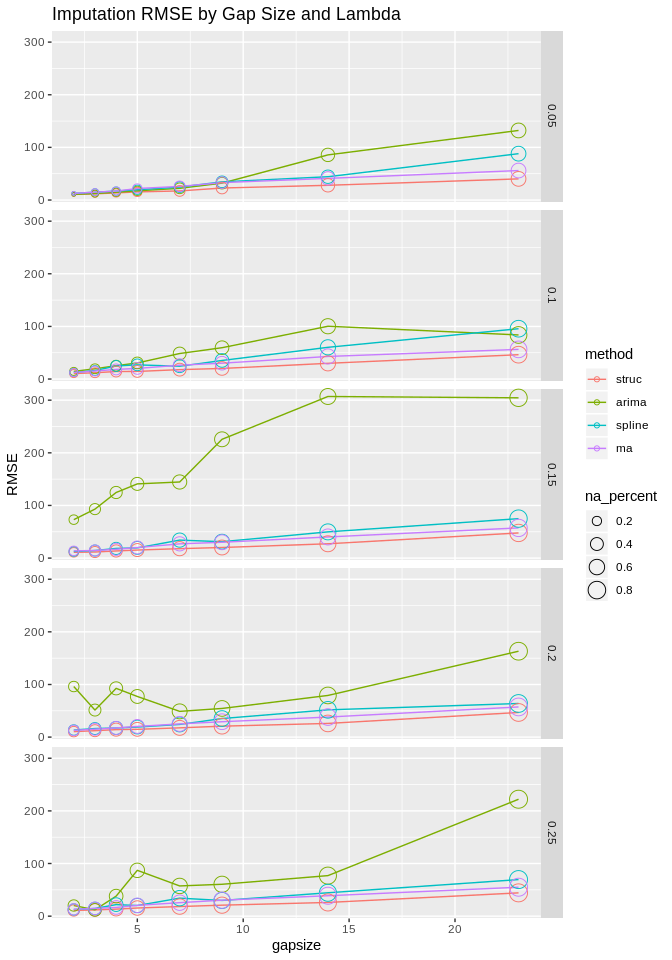
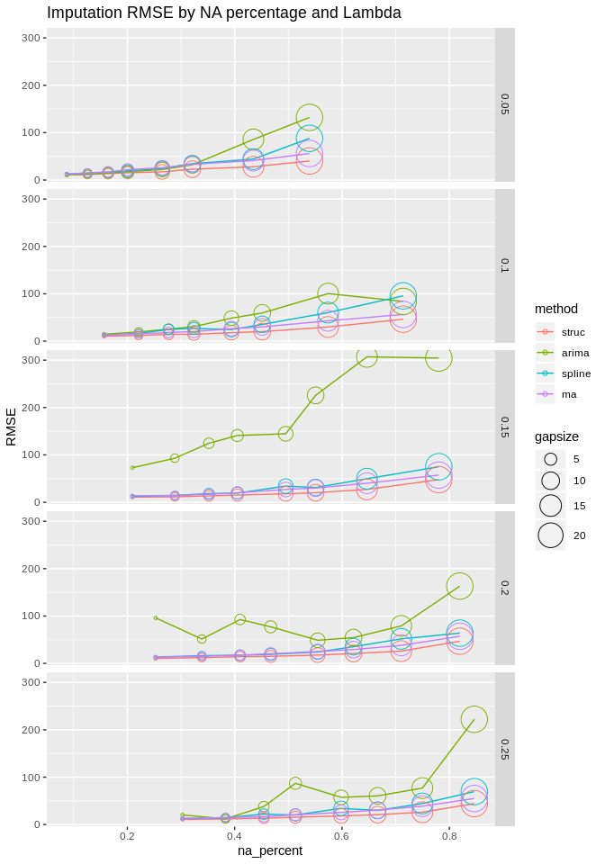
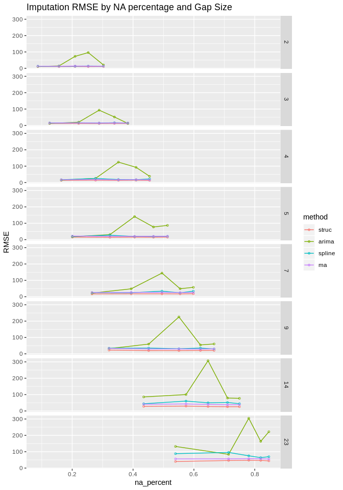
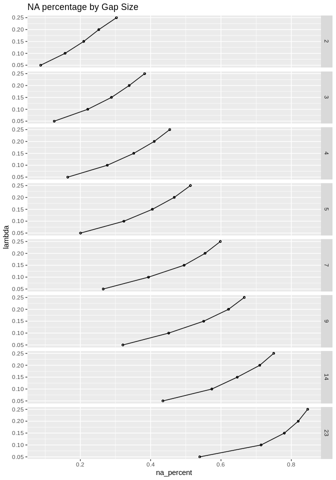

KE5105 - Building Electrical Consumption Forecasting
================

Extract, Transform and Load Data 7 - Data Imputation
====================================================

### Gap Size Analysis for MD1 and MD6

Summary of Findings
===================

-   RMSE increases with gap size.

Load libraries
==============

``` r
library(ggplot2)
library(reshape2)
library(xts)
```

    ## Loading required package: zoo

    ## 
    ## Attaching package: 'zoo'

    ## The following objects are masked from 'package:base':
    ## 
    ##     as.Date, as.Date.numeric

``` r
library(imputeTS)
```

    ## 
    ## Attaching package: 'imputeTS'

    ## The following object is masked from 'package:zoo':
    ## 
    ##     na.locf

``` r
source("/home/tkokkeng/Documents/KE5105/ETL/source/R/ETL.utils.R")
```

Load data
=========

``` r
# time series data
md1_df <- read.csv("/home/tkokkeng/Documents/KE5105/ETL/source/processed_bldg_data/MD1.csv", header = TRUE, stringsAsFactors = FALSE)
md6_df <- read.csv("/home/tkokkeng/Documents/KE5105/ETL/source/processed_bldg_data/MD6.csv", header = TRUE, stringsAsFactors = FALSE)

# A list of 10 time series datasets with simulated missing data
missing_list_md1 <- readRDS("/home/tkokkeng/Documents/KE5105/ETL/source/md1-data/sim_missing_data_gapsize.md1.rds")
missing_list_md6 <- readRDS("/home/tkokkeng/Documents/KE5105/ETL/source/md6-data/sim_missing_data_gapsize.md6.rds")
```

``` r
cat("length MD1 data = ", length(missing_list_md1), "\n", "length MD6 data = ", length(missing_list_md6))
```

    ## length MD1 data =  40 
    ##  length MD6 data =  40

``` r
# Each list has lambda, missing1, ..., missing<n>
#nresults_md1 <- length(missing_list_md1) * (length(missing_list_md1[[1]]) - 2)
#nresults_md6 <- length(missing_list_md6) * (length(missing_list_md6[[1]]) - 2)
#results_md1 <- computeResultsWithGapsize("md1", nresults_md1, missing_list_md1, md1_df)
#results_md6 <- computeResultsWithGapsize("md6", nresults_md6, missing_list_md6, md6_df)
results_md1 <- computeResults("md1", missing_list_md1, md1_df, FALSE)
results_md6 <- computeResults("md6", missing_list_md6, md6_df, FALSE)
results <- c(results_md1, results_md6)
```

``` r
results_df = as.data.frame(matrix(unlist(results), nrow = length(results), byrow = TRUE))
colnames(results_df) = c("lambda", "gapsize", "na_percent", "struc", "arima", "spline", "ma")
results_df
```

    ##     lambda gapsize na_percent     struc      arima     spline        ma
    ## 1     0.05       2 0.08754209  5.496589   5.541100   6.679065  7.653777
    ## 2     0.05       2 0.08754209  5.102110   5.129631   6.340602  7.840135
    ## 3     0.05       2 0.08754209  4.978983   5.050531   6.278025  6.639837
    ## 4     0.05       2 0.08754209  4.923617   4.981220   6.309552  6.238670
    ## 5     0.05       2 0.08754209  4.910658   4.752104   6.008438  6.211351
    ## 6     0.05       2 0.08754209 12.056043  12.186020  14.943174 12.265726
    ## 7     0.05       2 0.08754209 13.922939  14.012436  17.259100 13.758698
    ## 8     0.05       2 0.08754209 13.568911  13.808191  16.595921 14.085803
    ## 9     0.05       2 0.08629088  5.013522   5.184836   6.129081  7.316149
    ## 10    0.05       2 0.08629088  3.621664   4.390898   4.830814  4.060119
    ## 11    0.05       3 0.12525253  6.019498   6.133814   6.350273  9.514052
    ## 12    0.05       3 0.12525253  5.377194   5.293848   6.272332  9.552591
    ## 13    0.05       3 0.12525253  5.417215   5.285277   6.743086  8.596062
    ## 14    0.05       3 0.12525253  5.463126   5.823775   7.922390  8.489582
    ## 15    0.05       3 0.12525253  5.553772   5.387308   6.957754  8.305972
    ## 16    0.05       3 0.12525253 11.727211  12.002145  17.371067 12.384351
    ## 17    0.05       3 0.12525253 11.074194  11.173154  16.588519 12.574762
    ## 18    0.05       3 0.12525253 13.067752  13.729099  19.549806 15.005734
    ## 19    0.05       3 0.12734864  5.011126   5.341317   7.256907  8.026893
    ## 20    0.05       3 0.12734864  5.388309   7.282165   7.279395  6.621501
    ## 21    0.05       4 0.16430976  5.759574   6.700078   7.797248  8.972490
    ## 22    0.05       4 0.16430976  7.411117   7.469230   8.831269 11.914131
    ## 23    0.05       4 0.16430976  6.752438   6.455642   8.853754  9.936458
    ## 24    0.05       4 0.16430976  7.990789   7.703552   9.116128 10.819396
    ## 25    0.05       4 0.16430976  7.262729   7.291801   8.139062  9.770221
    ## 26    0.05       4 0.16430976 11.794136  12.562183  16.341196 13.204173
    ## 27    0.05       4 0.16430976 14.390716  14.690027  20.795334 15.417796
    ## 28    0.05       4 0.16430976 13.824590  14.220249  20.323440 14.869728
    ## 29    0.05       4 0.16423104  5.607238   6.860081   7.321772  7.793047
    ## 30    0.05       4 0.16423104  6.941218  10.390233   8.144007  8.837789
    ## 31    0.05       5 0.19865320  9.163485  10.415405  10.831630 16.434441
    ## 32    0.05       5 0.19865320  8.650889   8.682026   8.561011 16.772184
    ## 33    0.05       5 0.19865320  7.159023   7.138962   8.626371 12.975458
    ## 34    0.05       5 0.19865320  8.172266   8.060482   9.263017 12.981389
    ## 35    0.05       5 0.19865320  8.661550   9.109377  11.379853 12.530976
    ## 36    0.05       5 0.19865320 14.402921  15.361038  19.296343 17.255177
    ## 37    0.05       5 0.19865320 17.642015  18.457111  21.929281 21.183128
    ## 38    0.05       5 0.19865320 13.918843  24.010881  25.413152 16.135080
    ## 39    0.05       5 0.20528880  7.541017   7.890591   9.578280 12.211702
    ## 40    0.05       5 0.20528880  7.629587   7.975883  10.794884 12.242814
    ## 41    0.05       7 0.26397306 10.811794  12.693086  11.781785 18.324506
    ## 42    0.05       7 0.26397306  8.885948  10.088050  12.349210 16.413242
    ## 43    0.05       7 0.26397306  9.756313   9.528429  12.781078 16.313650
    ## 44    0.05       7 0.26397306  9.840020  10.740829  13.738629 17.545207
    ## 45    0.05       7 0.26397306  8.793230  10.435688  11.658169 13.593501
    ## 46    0.05       7 0.26397306 15.202277  15.893036  24.804948 19.731818
    ## 47    0.05       7 0.26397306 15.602595  17.380926  27.975108 19.632531
    ## 48    0.05       7 0.26397306 14.928798  15.314336  24.215233 19.740061
    ## 49    0.05       7 0.26791928  9.358483  13.646496  12.055183 14.762181
    ## 50    0.05       7 0.26791928  9.024709   9.530730  11.105958 14.448322
    ## 51    0.05       9 0.32121212 16.001348  18.724362  18.149633 22.981479
    ## 52    0.05       9 0.32121212 16.333808  17.695229  18.883245 25.007826
    ## 53    0.05       9 0.32121212 13.329990  13.153316  15.815373 21.446229
    ## 54    0.05       9 0.32121212 13.650801  15.923305  16.707384 21.540547
    ## 55    0.05       9 0.32121212 11.908696  14.466066  14.283915 19.575001
    ## 56    0.05       9 0.32121212 17.690831  20.104717  32.180537 22.778646
    ## 57    0.05       9 0.32121212 19.961539  23.706853  35.583695 25.649568
    ## 58    0.05       9 0.32121212 18.522025  23.510038  40.254182 24.852623
    ## 59    0.05       9 0.32080724 13.361284  14.712762  15.909918 19.906554
    ## 60    0.05       9 0.32080724 12.471620  33.480119  19.136575 17.692432
    ## 61    0.05      14 0.43367003 20.511488  42.130135  24.806526 29.116310
    ## 62    0.05      14 0.43367003 20.950934  38.618653  23.214253 30.548135
    ## 63    0.05      14 0.43367003 19.008877  18.781098  24.542916 27.366605
    ## 64    0.05      14 0.43367003 17.922038  33.141173  24.025608 27.442485
    ## 65    0.05      14 0.43367003 16.995128  37.439491  22.022485 23.830089
    ## 66    0.05      14 0.43367003 21.114656 295.215626  38.903375 29.753451
    ## 67    0.05      14 0.43367003 21.712679  54.318759  57.040175 28.295376
    ## 68    0.05      14 0.43367003 22.629012  31.856866  44.483317 30.889219
    ## 69    0.05      14 0.43841336 17.541210  20.646997  22.232917 26.728367
    ## 70    0.05      14 0.43841336 15.648764  18.248220  22.206141 23.812242
    ## 71    0.05      23 0.54074074 25.859488 176.760474  61.713097 41.964841
    ## 72    0.05      23 0.54074074 26.220754 163.514299  70.622941 40.352374
    ## 73    0.05      23 0.54074074 26.352925  30.658603  63.125528 40.711740
    ## 74    0.05      23 0.54074074 23.852792 208.586313  56.703506 35.256454
    ## 75    0.05      23 0.54074074 24.880924  25.583612  50.281890 31.991343
    ## 76    0.05      23 0.54074074 33.597081 336.749817  61.291306 39.071006
    ## 77    0.05      23 0.54074074 32.344901 134.804401  77.353007 39.255014
    ## 78    0.05      23 0.54074074 34.567988  72.178551  81.097152 41.884392
    ## 79    0.05      23 0.53583855 23.944742  29.729809  44.503657 36.535721
    ## 80    0.05      23 0.53583855 20.269049  22.413105  42.309663 30.410909
    ## 81    0.10       2 0.15757576  5.045313   5.090727   5.550537  6.835255
    ## 82    0.10       2 0.15757576  4.954966   5.058472   5.730842  7.243096
    ## 83    0.10       2 0.15757576  4.901403   4.788538   6.210529  6.157557
    ## 84    0.10       2 0.15757576  5.014642   5.078961   6.409978  6.778065
    ## 85    0.10       2 0.15757576  5.092290  43.347684   5.878993  6.116425
    ## 86    0.10       2 0.15757576 10.924433  53.959534  14.353601 11.049280
    ## 87    0.10       2 0.15757576 11.847739  12.066888  15.566645 12.232871
    ## 88    0.10       2 0.15757576 10.877166  10.990779  15.672126 11.433986
    ## 89    0.10       2 0.15448852  6.076690   6.089352   6.377975  7.187410
    ## 90    0.10       2 0.15448852  5.931584   6.037471   7.661137  6.417876
    ## 91    0.10       3 0.22087542  5.527865   5.453882   7.814371  8.523262
    ## 92    0.10       3 0.22087542  5.753838   5.892532   7.711036  9.742880
    ## 93    0.10       3 0.22087542  5.184771   5.088706   7.339558  8.153513
    ## 94    0.10       3 0.22087542  5.570444   5.600006   7.985205  7.789954
    ## 95    0.10       3 0.22087542  5.673362   6.013144   7.712725  8.077356
    ## 96    0.10       3 0.22087542 11.359013 158.208449  16.032445 12.272057
    ## 97    0.10       3 0.22087542 13.197084  14.052535  17.042157 14.760140
    ## 98    0.10       3 0.22087542 13.973764  14.233291  19.768699 15.236460
    ## 99    0.10       3 0.22129436  6.181297   6.592123   8.123313  8.609176
    ## 100   0.10       3 0.22129436  6.729500   6.811581   9.476917  8.327364
    ## 101   0.10       4 0.27676768  7.106690   7.350604  13.562351 11.878582
    ## 102   0.10       4 0.27676768  7.556867   7.805775  18.423150 12.672032
    ## 103   0.10       4 0.27676768  7.429174   7.333575  16.179434 11.005122
    ## 104   0.10       4 0.27676768  7.215675   7.195752  13.963596 10.881367
    ## 105   0.10       4 0.27676768  6.804706   6.945295  12.926914  9.457043
    ## 106   0.10       4 0.27676768 12.278991 219.710102  18.363105 14.053108
    ## 107   0.10       4 0.27676768 13.128754  12.968046  25.177416 15.410372
    ## 108   0.10       4 0.27676768 13.333096  13.821945  22.537617 15.561309
    ## 109   0.10       4 0.27627001  7.404891   7.564413   8.004845 10.468567
    ## 110   0.10       4 0.27627001  7.936612   7.694436   9.172387 10.566813
    ## 111   0.10       5 0.32592593  7.145371   7.805459  15.778838 13.227369
    ## 112   0.10       5 0.32592593  7.814699   8.478649  18.922606 15.366745
    ## 113   0.10       5 0.32592593  6.688056   6.207744  17.952045 12.467396
    ## 114   0.10       5 0.32592593  7.158548   8.366335  14.322610 10.980399
    ## 115   0.10       5 0.32592593  6.856103   7.222107  14.057515 11.414570
    ## 116   0.10       5 0.32592593 12.587383 258.145176  21.748865 15.487633
    ## 117   0.10       5 0.32592593 14.806944  15.966681  24.298167 17.521858
    ## 118   0.10       5 0.32592593 13.854920  14.922076  24.531775 17.531145
    ## 119   0.10       5 0.31871955  6.242881   6.993719  13.278344 11.575061
    ## 120   0.10       5 0.31871955  6.879026   8.036805  12.357198  9.802416
    ## 121   0.10       7 0.39595960 10.415614  10.869448  11.323059 17.040646
    ## 122   0.10       7 0.39595960 10.534196  10.291360  12.124941 19.077580
    ## 123   0.10       7 0.39595960  9.531736   9.180495  10.880517 16.448949
    ## 124   0.10       7 0.39595960  9.713501  10.007754  11.715517 16.099660
    ## 125   0.10       7 0.39595960  9.145754 294.103813  11.415355 15.271214
    ## 126   0.10       7 0.39595960 14.836911 290.005570  24.915909 18.616791
    ## 127   0.10       7 0.39595960 16.229553  17.941837  23.420621 20.233550
    ## 128   0.10       7 0.39595960 17.025465  18.603035  28.849122 21.895031
    ## 129   0.10       7 0.38970077  9.218315   9.723638  12.175964 14.272309
    ## 130   0.10       7 0.38970077  9.337340  10.032089  11.386599 14.862135
    ## 131   0.10       9 0.45454545 12.650589  14.370668  14.964518 20.956167
    ## 132   0.10       9 0.45454545 14.354669  14.765399  15.607388 22.180998
    ## 133   0.10       9 0.45454545 13.350986  12.811636  14.839054 20.535036
    ## 134   0.10       9 0.45454545 11.555139  14.682508  16.306283 18.008781
    ## 135   0.10       9 0.45454545 10.239078 312.030044  12.870360 15.935790
    ## 136   0.10       9 0.45454545 15.095164 310.123082  22.572436 20.547683
    ## 137   0.10       9 0.45454545 18.380824  23.266323  29.273053 22.577928
    ## 138   0.10       9 0.45454545 18.080252  21.568938  35.738116 24.393778
    ## 139   0.10       9 0.44398051 10.728889  12.470229  23.970811 18.115052
    ## 140   0.10       9 0.44398051 14.307286  15.751487  27.563013 17.556951
    ## 141   0.10      14 0.57373737 21.423572  42.309586  46.397319 29.987028
    ## 142   0.10      14 0.57373737 22.204998  46.324379  50.008494 33.463266
    ## 143   0.10      14 0.57373737 19.616179  19.639135  46.433353 28.837304
    ## 144   0.10      14 0.57373737 18.352354  18.986468  44.223415 28.374301
    ## 145   0.10      14 0.57373737 17.312495 317.036098  36.923510 24.677981
    ## 146   0.10      14 0.57373737 22.466502 348.747773  47.823166 27.768752
    ## 147   0.10      14 0.57373737 25.144034  42.301593  53.991615 32.935403
    ## 148   0.10      14 0.57373737 24.911287  40.308207  58.992713 32.378273
    ## 149   0.10      14 0.57480863 16.292475  38.317046  22.503351 24.764126
    ## 150   0.10      14 0.57480863 14.697911  44.028346  20.621374 23.243958
    ## 151   0.10      23 0.71178451 28.048464 152.931287  62.521195 39.659882
    ## 152   0.10      23 0.71178451 32.498637  31.102508  69.109794 42.726513
    ## 153   0.10      23 0.71178451 29.359023  27.530767  61.746451 39.158751
    ## 154   0.10      23 0.71178451 24.321247 150.641091  61.062101 37.006313
    ## 155   0.10      23 0.71178451 25.263620  25.131424  55.717946 31.079348
    ## 156   0.10      23 0.71178451 31.956341 358.086038  72.477149 37.824532
    ## 157   0.10      23 0.71178451 34.088747  91.999919  73.870592 38.453765
    ## 158   0.10      23 0.71178451 35.369764  35.352025  71.434232 42.633798
    ## 159   0.10      23 0.71885873 26.464889  27.712454  55.293415 34.115360
    ## 160   0.10      23 0.71885873 20.754405  23.164070  50.479488 31.168067
    ## 161   0.15       2 0.20875421  4.991592   4.891465   5.733021  7.682782
    ## 162   0.15       2 0.20875421  5.062605   5.370963   5.794786  7.789161
    ## 163   0.15       2 0.20875421  5.573911   5.482299   6.757982  7.686987
    ## 164   0.15       2 0.20875421  6.136581   6.039478   6.997167  8.513095
    ## 165   0.15       2 0.20875421  5.593155 200.609864   6.453866  7.398177
    ## 166   0.15       2 0.20875421 10.644043  10.674269  13.227765 11.492342
    ## 167   0.15       2 0.20875421 12.333957 202.955015  15.746202 13.241942
    ## 168   0.15       2 0.20875421 12.312467  12.469311  15.017820 13.442764
    ## 169   0.15       2 0.21155184  5.266119   5.302982   6.743628  7.226336
    ## 170   0.15       2 0.21155184  6.356927   6.437632   7.172310  7.765394
    ## 171   0.15       3 0.28888889  5.983902   5.857866   6.578097  9.333345
    ## 172   0.15       3 0.28888889  5.980186   6.523311   7.095925  9.625985
    ## 173   0.15       3 0.28888889  5.343042   5.230838   6.991608  8.289643
    ## 174   0.15       3 0.28888889  5.131770   5.192806   6.681921  8.033401
    ## 175   0.15       3 0.28888889  4.728663   4.802345   6.800835  7.018908
    ## 176   0.15       3 0.28888889 12.303729  12.811637  16.435213 13.211065
    ## 177   0.15       3 0.28888889 12.931348 271.438233  17.027829 13.944013
    ## 178   0.15       3 0.28888889 12.507585  12.693873  17.410152 13.520073
    ## 179   0.15       3 0.28810021  5.095634   5.229712   7.434084  7.053976
    ## 180   0.15       3 0.28810021  5.813420   5.894161   7.192524  7.800509
    ## 181   0.15       4 0.35353535  6.555846   6.622344   9.253532 10.062979
    ## 182   0.15       4 0.35353535  7.016712   6.893756   8.627520 11.439903
    ## 183   0.15       4 0.35353535  6.473786   6.349625   9.319958  9.334512
    ## 184   0.15       4 0.35353535  6.694223   6.481151   8.551936  9.852763
    ## 185   0.15       4 0.35353535  6.802433 216.214849   8.691694  8.883845
    ## 186   0.15       4 0.35353535 11.352710  11.965638  19.692369 12.476430
    ## 187   0.15       4 0.35353535 15.057764 292.789210  19.677196 16.081737
    ## 188   0.15       4 0.35353535 14.292301  14.599380  21.509609 14.884517
    ## 189   0.15       4 0.34794711  5.915622 291.497933   7.263069  8.572789
    ## 190   0.15       4 0.34794711  7.313721 209.916772   9.070856  8.922509
    ## 191   0.15       5 0.40404040  8.121917   7.902582   8.640750 13.671384
    ## 192   0.15       5 0.40404040  8.619492  10.226774   8.986939 14.492057
    ## 193   0.15       5 0.40404040  7.976477   7.692453   9.264009 12.631485
    ## 194   0.15       5 0.40404040  7.543217 253.043269  10.525815 11.753558
    ## 195   0.15       5 0.40404040  8.008023   8.003274   9.161844 11.739876
    ## 196   0.15       5 0.40404040 13.794553  14.178356  20.460398 15.932734
    ## 197   0.15       5 0.40404040 15.392981 308.642074  24.070009 16.956875
    ## 198   0.15       5 0.40404040 14.934059  15.697005  21.925782 17.404331
    ## 199   0.15       5 0.40709812  7.156507   7.843313   8.914288 11.268467
    ## 200   0.15       5 0.40709812  7.300093 250.083792  10.451159  9.899907
    ## 201   0.15       7 0.49427609  9.679289  12.085058  23.347478 17.001326
    ## 202   0.15       7 0.49427609 11.396873  13.608553  27.307968 20.670966
    ## 203   0.15       7 0.49427609  9.738076   9.353555  23.589525 16.754128
    ## 204   0.15       7 0.49427609  9.794290 292.098947  22.321034 16.706219
    ## 205   0.15       7 0.49427609 10.044311 255.777819  21.875845 16.460296
    ## 206   0.15       7 0.49427609 13.574564  17.671139  29.991981 18.410636
    ## 207   0.15       7 0.49427609 17.207829 329.389368  33.262770 21.718046
    ## 208   0.15       7 0.49427609 16.219512  18.349362  31.600336 21.828073
    ## 209   0.15       7 0.49686848  9.576823 327.505772  12.867003 15.443418
    ## 210   0.15       7 0.49686848 10.337316  11.286367  14.401517 15.141671
    ## 211   0.15       9 0.55218855 12.784859 345.839584  16.144479 20.589293
    ## 212   0.15       9 0.55218855 14.633401  16.641261  16.042534 23.738326
    ## 213   0.15       9 0.55218855 12.386836  12.205923  16.302916 19.546046
    ## 214   0.15       9 0.55218855 11.575893  13.639583  13.945299 19.856801
    ## 215   0.15       9 0.55218855 10.538477 309.820097  14.008217 16.798560
    ## 216   0.15       9 0.55218855 15.877874  20.167789  21.802678 20.948552
    ## 217   0.15       9 0.55218855 18.633226 334.761372  36.368412 22.579660
    ## 218   0.15       9 0.55218855 18.877406  23.052251  31.621565 24.169865
    ## 219   0.15       9 0.54697286 10.820638 335.722124  15.074544 17.712274
    ## 220   0.15       9 0.54697286 10.734018 330.075383  18.234509 16.188448
    ## 221   0.15      14 0.64781145 18.601792  35.028819  36.703847 27.123302
    ## 222   0.15      14 0.64781145 21.125190 359.277277  38.756637 31.770855
    ## 223   0.15      14 0.64781145 17.236044  17.916335  34.196033 27.465370
    ## 224   0.15      14 0.64781145 15.901333  21.308380  31.042560 25.124713
    ## 225   0.15      14 0.64781145 14.414766  38.041659  28.723356 23.201972
    ## 226   0.15      14 0.64781145 21.396058  39.144587  41.013169 26.333084
    ## 227   0.15      14 0.64781145 26.385528 347.143316  47.206246 31.157039
    ## 228   0.15      14 0.64781145 21.338870  53.871098  47.923940 30.746102
    ## 229   0.15      14 0.64300626 14.580438 348.270282  16.643786 23.760389
    ## 230   0.15      14 0.64300626 14.644481 324.946816  22.701910 22.684825
    ## 231   0.15      23 0.78181818 26.759924 348.594939  40.156254 37.800198
    ## 232   0.15      23 0.78181818 32.551259  32.396080  49.724231 45.443363
    ## 233   0.15      23 0.78181818 27.251933  28.822891  47.839161 39.007400
    ## 234   0.15      23 0.78181818 26.991402  77.504231  47.768560 39.998769
    ## 235   0.15      23 0.78181818 26.294492 371.286503  39.096102 34.054775
    ## 236   0.15      23 0.78181818 31.643097 462.471710  62.005866 35.081584
    ## 237   0.15      23 0.78181818 36.567302 356.544008  73.978377 42.158491
    ## 238   0.15      23 0.78181818 37.035609 112.116798  62.258154 41.791556
    ## 239   0.15      23 0.77661795 30.624527 367.518617  38.658058 34.180996
    ## 240   0.15      23 0.77661795 29.594022  28.435438  43.947662 33.236472
    ## 241   0.20       2 0.25319865  5.495938 344.737193  10.244325  7.686673
    ## 242   0.20       2 0.25319865  5.225819 356.914658  10.136791  8.650023
    ## 243   0.20       2 0.25319865  5.139483   5.138094   9.590754  7.230236
    ## 244   0.20       2 0.25319865  5.590937 369.223517  10.126511  7.140555
    ## 245   0.20       2 0.25319865  5.379415   5.445451   9.341632  7.081889
    ## 246   0.20       2 0.25319865 10.728229 202.717379  15.553867 11.693385
    ## 247   0.20       2 0.25319865 12.013672  11.924356  18.212021 12.629844
    ## 248   0.20       2 0.25319865 12.321448  12.437853  16.353748 13.065684
    ## 249   0.20       2 0.25191371  5.585126   5.643909   6.265675  6.879934
    ## 250   0.20       2 0.25191371  5.313098   5.405034   6.992911  6.647017
    ## 251   0.20       3 0.33939394  5.449895   5.873737   6.498629  8.333509
    ## 252   0.20       3 0.33939394  5.710355   6.397234   6.360433  9.587300
    ## 253   0.20       3 0.33939394  5.674471   5.694528   7.085481  7.656899
    ## 254   0.20       3 0.33939394  5.593167   5.629049   7.321310  7.874950
    ## 255   0.20       3 0.33939394  5.462074   5.470821   7.316711  7.466548
    ## 256   0.20       3 0.33939394 11.911859 265.919809  15.675903 12.611870
    ## 257   0.20       3 0.33939394 13.603549  13.836790  17.819202 14.678559
    ## 258   0.20       3 0.33939394 13.231120  13.404985  18.113146 13.786229
    ## 259   0.20       3 0.33750870  5.812664   6.053340   8.340266  8.050998
    ## 260   0.20       3 0.33750870  5.777260   6.194363   8.180288  7.783698
    ## 261   0.20       4 0.40942761  7.031158 348.880837   7.224280 10.502229
    ## 262   0.20       4 0.40942761  7.467884   8.369047   8.294810 11.564338
    ## 263   0.20       4 0.40942761  7.041863   6.785506   8.187034  9.517079
    ## 264   0.20       4 0.40942761  7.269595   7.331489   8.580290 10.195068
    ## 265   0.20       4 0.40942761  6.931829 221.540250   8.296215  8.797290
    ## 266   0.20       4 0.40942761 12.839050 296.623292  19.749418 13.939148
    ## 267   0.20       4 0.40942761 14.426039  14.861641  19.591549 15.983961
    ## 268   0.20       4 0.40942761 14.269733  14.716465  21.450623 15.178014
    ## 269   0.20       4 0.41196938  7.595074   7.815893   9.362102  9.995255
    ## 270   0.20       4 0.41196938  7.175809   7.305218   8.747575  9.511727
    ## 271   0.20       5 0.46464646  8.153708   9.228821   8.837618 13.170474
    ## 272   0.20       5 0.46464646  7.942501   9.342065   8.852331 13.956216
    ## 273   0.20       5 0.46464646  8.267904   7.969391   9.297245 12.913534
    ## 274   0.20       5 0.46464646  8.196181   8.819712  11.009979 12.666612
    ## 275   0.20       5 0.46464646  7.271953   7.825441   9.904886 10.717808
    ## 276   0.20       5 0.46464646 13.172396  13.997759  15.907731 15.488729
    ## 277   0.20       5 0.46464646 15.309125  16.372750  21.515646 17.837392
    ## 278   0.20       5 0.46464646 14.259471  15.095258  22.804417 16.946802
    ## 279   0.20       5 0.47320807  7.749071   8.284863   8.803254 11.818777
    ## 280   0.20       5 0.47320807  8.018534   8.425681  10.799821 10.911108
    ## 281   0.20       7 0.55622896 11.302517  11.733055  12.615465 16.811647
    ## 282   0.20       7 0.55622896 10.540916  12.123920  11.168724 17.904803
    ## 283   0.20       7 0.55622896  9.506995   9.009810  11.406689 15.333431
    ## 284   0.20       7 0.55622896  9.918784  10.392969  11.788393 15.717455
    ## 285   0.20       7 0.55622896  8.522874   9.444128  11.128305 13.192830
    ## 286   0.20       7 0.55622896 14.679723 330.144666  22.641568 18.018703
    ## 287   0.20       7 0.55622896 16.811093  18.947317  28.820377 20.407199
    ## 288   0.20       7 0.55622896 16.049971  18.598295  21.635121 19.753751
    ## 289   0.20       7 0.55114823  8.996964   9.741472  12.443515 14.250044
    ## 290   0.20       7 0.55114823 10.839119 288.439502  12.991993 15.059398
    ## 291   0.20       9 0.62154882 13.705945  15.238676  22.665804 19.921556
    ## 292   0.20       9 0.62154882 13.253202  14.881582  23.457614 21.752682
    ## 293   0.20       9 0.62154882 11.949322  11.458848  22.493384 18.348187
    ## 294   0.20       9 0.62154882 11.301015  12.781221  20.585088 18.239153
    ## 295   0.20       9 0.62154882 10.754047  11.657469  19.060528 16.349725
    ## 296   0.20       9 0.62154882 17.038587 334.360723  32.784190 20.772557
    ## 297   0.20       9 0.62154882 18.258918  22.559426  37.480070 22.962026
    ## 298   0.20       9 0.62154882 20.051973  23.226532  35.680025 24.617172
    ## 299   0.20       9 0.62073765 11.616522  12.644222  14.330449 16.895058
    ## 300   0.20       9 0.62073765 11.442599 303.576188  15.389367 16.103337
    ## 301   0.20      14 0.71111111 18.552588  31.556405  29.946541 28.320187
    ## 302   0.20      14 0.71111111 19.442542  23.231259  31.349825 28.231760
    ## 303   0.20      14 0.71111111 16.160162  16.791389  28.550458 25.424011
    ## 304   0.20      14 0.71111111 15.810930 334.118548  27.449858 23.245749
    ## 305   0.20      14 0.71111111 14.871322  41.292316  27.586400 21.865784
    ## 306   0.20      14 0.71111111 20.818860 347.421399  36.169646 26.240830
    ## 307   0.20      14 0.71111111 22.398268  61.542129  49.328827 26.791911
    ## 308   0.20      14 0.71111111 25.607592  45.370598  39.594485 30.344351
    ## 309   0.20      14 0.70842032 14.946553  19.337167  31.147173 23.225150
    ## 310   0.20      14 0.70842032 13.792428  35.174365  31.562486 21.301030
    ## 311   0.20      23 0.82087542 28.180955  33.749948  34.640924 40.164177
    ## 312   0.20      23 0.82087542 32.673456  49.533921  35.558911 46.360821
    ## 313   0.20      23 0.82087542 29.954279  32.000875  35.641731 40.871438
    ## 314   0.20      23 0.82087542 28.169696  47.399898  38.511735 38.003885
    ## 315   0.20      23 0.82087542 31.316151 188.341518  34.668885 35.287575
    ## 316   0.20      23 0.82087542 33.347621 353.613205  58.481757 37.892454
    ## 317   0.20      23 0.82087542 35.810406 121.196154  78.798043 40.048755
    ## 318   0.20      23 0.82087542 38.728963 192.677407  64.873481 44.212411
    ## 319   0.20      23 0.81697982 23.492723  40.424812  31.599432 35.535034
    ## 320   0.20      23 0.81697982 28.208518 191.649566  44.492512 32.273755
    ## 321   0.25       2 0.30303030  5.385513   5.334094   5.706322  7.944151
    ## 322   0.25       2 0.30303030  5.621486   6.093805   6.038391  8.038850
    ## 323   0.25       2 0.30303030  5.762674   5.593016   6.484540  7.739841
    ## 324   0.25       2 0.30303030  5.560959   5.459900   6.622367  6.686810
    ## 325   0.25       2 0.30303030  5.084473   4.980361   6.071008  6.397083
    ## 326   0.25       2 0.30303030 10.464381  10.428838  12.479349 10.995704
    ## 327   0.25       2 0.30303030 13.266981 202.112400  15.234146 13.886800
    ## 328   0.25       2 0.30303030 12.771049  12.972018  15.288689 13.309010
    ## 329   0.25       2 0.30201809  6.410102   6.259731   6.668942  7.783155
    ## 330   0.25       2 0.30201809  5.584237   5.801910   6.773102  6.814196
    ## 331   0.25       3 0.38383838  5.478642   5.411464   6.468600  8.703420
    ## 332   0.25       3 0.38383838  6.040760   6.842556   6.669287  9.902195
    ## 333   0.25       3 0.38383838  5.825662   5.663514   7.045951  8.561268
    ## 334   0.25       3 0.38383838  6.233490   6.103687   6.835292  8.591898
    ## 335   0.25       3 0.38383838  5.914560   6.026862   7.249855  7.981878
    ## 336   0.25       3 0.38383838 12.156404  12.272933  13.702281 13.347514
    ## 337   0.25       3 0.38383838 13.574783  13.732976  17.043336 14.346969
    ## 338   0.25       3 0.38383838 13.030100  13.183767  16.440055 14.067684
    ## 339   0.25       3 0.37995825  5.253803   5.426807   7.149901  7.238812
    ## 340   0.25       3 0.37995825  6.478863   6.645068   7.195426  8.075971
    ## 341   0.25       4 0.45454545  6.710929   6.848066  12.872749  9.992353
    ## 342   0.25       4 0.45454545  6.771263   7.705652  15.153905 11.061852
    ## 343   0.25       4 0.45454545  6.467086   6.366724  13.272058  9.445251
    ## 344   0.25       4 0.45454545  6.485710   6.932403  13.579959  9.447513
    ## 345   0.25       4 0.45454545  6.300762   6.571686  11.807321  8.213865
    ## 346   0.25       4 0.45454545 11.558841  12.167125  17.534236 12.868126
    ## 347   0.25       4 0.45454545 14.805118 296.387935  22.877557 16.263709
    ## 348   0.25       4 0.45454545 13.982392  14.533307  19.758739 15.562493
    ## 349   0.25       4 0.45372303  5.939242   6.205093   7.309737  8.377436
    ## 350   0.25       4 0.45372303  6.398079 210.218595   7.830505  8.291531
    ## 351   0.25       5 0.51245791  8.271573 347.460300   9.681903 13.265294
    ## 352   0.25       5 0.51245791  8.721501  10.265926  10.034526 14.486467
    ## 353   0.25       5 0.51245791  7.919215   7.617098   9.564900 12.199297
    ## 354   0.25       5 0.51245791  8.272021 371.473385  10.122551 13.100974
    ## 355   0.25       5 0.51245791  7.322971   7.993156   9.511498 10.537515
    ## 356   0.25       5 0.51245791 13.503231  14.221366  19.886963 16.168014
    ## 357   0.25       5 0.51245791 15.647657  16.305347  21.947292 17.337967
    ## 358   0.25       5 0.51245791 14.891313  15.728086  22.263167 17.230493
    ## 359   0.25       5 0.51496173  8.096071   8.176634   9.803534 11.647305
    ## 360   0.25       5 0.51496173  8.583150   8.919523   9.755185 11.473524
    ## 361   0.25       7 0.59797980 10.795188  12.695101  25.194827 15.921544
    ## 362   0.25       7 0.59797980 11.569282  12.798280  27.264856 18.285547
    ## 363   0.25       7 0.59797980 10.433331  10.141228  24.613197 15.980603
    ## 364   0.25       7 0.59797980 10.789984  12.006761  23.096542 16.631857
    ## 365   0.25       7 0.59797980  9.370536  11.657821  20.929396 14.300193
    ## 366   0.25       7 0.59797980 14.174226  18.277482  27.536460 17.248157
    ## 367   0.25       7 0.59797980 16.865009  18.874668  31.520096 20.273852
    ## 368   0.25       7 0.59797980 17.804302  19.421986  29.095155 21.556121
    ## 369   0.25       7 0.59916493  9.396135  11.257133  13.687659 13.950697
    ## 370   0.25       7 0.59916493  9.824460  10.856403  12.695051 13.847164
    ## 371   0.25       9 0.66666667 14.169214  15.047387  16.041932 20.478495
    ## 372   0.25       9 0.66666667 14.688551  16.672039  15.438941 22.879947
    ## 373   0.25       9 0.66666667 12.766895  12.496119  13.418916 20.018144
    ## 374   0.25       9 0.66666667 12.458259  13.395230  14.284048 19.908668
    ## 375   0.25       9 0.66666667 12.036767  13.640758  14.432996 18.088814
    ## 376   0.25       9 0.66666667 17.274740  25.057701  29.377785 22.459783
    ## 377   0.25       9 0.66666667 19.406911  64.824989  34.221312 23.583942
    ## 378   0.25       9 0.66666667 17.171198  23.130643  33.915383 22.946261
    ## 379   0.25       9 0.66597077 12.246616  14.223742  17.921249 18.086369
    ## 380   0.25       9 0.66597077 11.326305  11.743709  16.972977 16.658308
    ## 381   0.25      14 0.74949495 17.315980  28.399049  28.380504 27.305845
    ## 382   0.25      14 0.74949495 19.597952  39.007718  29.434251 31.100244
    ## 383   0.25      14 0.74949495 17.510582  18.386305  27.997698 26.439836
    ## 384   0.25      14 0.74949495 16.358989  34.038036  27.403069 25.026942
    ## 385   0.25      14 0.74949495 15.609575  19.180969  25.304089 23.778081
    ## 386   0.25      14 0.74949495 21.173275  48.391136  30.639051 26.498705
    ## 387   0.25      14 0.74949495 22.600449 366.299135  40.821180 27.315437
    ## 388   0.25      14 0.74949495 23.168130  45.896957  39.507553 29.369448
    ## 389   0.25      14 0.75017397 14.934180  29.656384  19.872540 23.052309
    ## 390   0.25      14 0.75017397 14.386532  35.494873  18.525108 22.347840
    ## 391   0.25      23 0.84579125 28.687523 136.536988  49.249446 39.583491
    ## 392   0.25      23 0.84579125 30.057550 360.672424  52.016698 43.974920
    ## 393   0.25      23 0.84579125 28.048508 142.563786  50.084284 36.635712
    ## 394   0.25      23 0.84579125 26.073163  50.459892  48.157594 36.092017
    ## 395   0.25      23 0.84579125 23.584643  40.735180  39.145182 31.802134
    ## 396   0.25      23 0.84579125 31.331646 197.949805  57.094246 37.730967
    ## 397   0.25      23 0.84579125 34.245005 355.766558  74.799141 40.291688
    ## 398   0.25      23 0.84579125 35.319945 134.628231  58.070479 40.635994
    ## 399   0.25      23 0.84829506 28.808325 124.656198  28.407476 34.017172
    ## 400   0.25      23 0.84829506 25.427080  55.130330  36.143291 30.162444
    ## 401   0.05       2 0.08748318 18.794935  16.880168  17.629484 24.669049
    ## 402   0.05       2 0.08748318 12.861103  13.470823  13.706591 14.618672
    ## 403   0.05       2 0.08748318 10.842389  10.555261  14.332785 13.948289
    ## 404   0.05       2 0.08748318 14.722581  15.949275  19.184507 17.389271
    ## 405   0.05       2 0.08748318 15.843291  16.112289  18.898042 17.661019
    ## 406   0.05       2 0.08748318 13.451153  12.922869  14.052383 17.366654
    ## 407   0.05       2 0.08623088 15.219315  15.436819  18.261552 18.099264
    ## 408   0.05       2 0.08623088 12.643644  12.836159  16.462867 14.084527
    ## 409   0.05       2 0.08623088 12.131737  12.321967  14.772560 14.227755
    ## 410   0.05       2 0.08623088 12.073674  13.737077  15.184510 14.662199
    ## 411   0.05       3 0.12516824 21.894465  21.609281  24.333191 25.850999
    ## 412   0.05       3 0.12516824 13.786803  14.195717  18.199005 15.863957
    ## 413   0.05       3 0.12516824 13.186942  13.651638  18.750454 16.910227
    ## 414   0.05       3 0.12516824 18.214260  21.136237  20.301480 22.716247
    ## 415   0.05       3 0.12516824 16.943734  16.721043  19.884553 20.972601
    ## 416   0.05       3 0.12516824 17.146482  16.697806  19.265017 22.337565
    ## 417   0.05       3 0.12726008 15.864330  18.305174  20.011344 19.722858
    ## 418   0.05       3 0.12726008 14.458454  16.073177  18.870618 17.603327
    ## 419   0.05       3 0.12726008 14.872549  14.625890  17.931078 19.106779
    ## 420   0.05       3 0.12726008 14.539108  15.095277  17.664859 18.776292
    ## 421   0.05       4 0.16419919 25.597956  24.510971  25.807858 29.462920
    ## 422   0.05       4 0.16419919 15.710399  18.524920  17.168072 20.474895
    ## 423   0.05       4 0.16419919 15.602748  16.581478  22.462294 21.611164
    ## 424   0.05       4 0.16419919 18.360342  25.334550  24.631781 22.454028
    ## 425   0.05       4 0.16419919 19.006395  18.877253  22.398019 24.598764
    ## 426   0.05       4 0.16419919 18.948269  19.492974  22.663134 23.359422
    ## 427   0.05       4 0.16411683 17.623203  18.251890  25.906525 20.985804
    ## 428   0.05       4 0.16411683 16.498521  19.163113  19.706978 21.102735
    ## 429   0.05       4 0.16411683 16.057053  16.665316  21.263973 20.644714
    ## 430   0.05       4 0.16411683 18.067434  22.497772  21.980910 22.379773
    ## 431   0.05       5 0.19851952 30.010219  28.942645  31.645303 36.558715
    ## 432   0.05       5 0.19851952 17.391145  20.229608  22.514140 24.016489
    ## 433   0.05       5 0.19851952 17.247838  18.036123  24.883231 24.665217
    ## 434   0.05       5 0.19851952 20.569325  27.956865  25.559720 28.932508
    ## 435   0.05       5 0.19851952 22.255017  21.908648  25.290792 30.387982
    ## 436   0.05       5 0.19851952 19.381323  19.530776  24.271361 27.607443
    ## 437   0.05       5 0.20514604 21.614438  21.877869  27.111769 29.282948
    ## 438   0.05       5 0.20514604 17.552099  23.989872  24.719029 27.717548
    ## 439   0.05       5 0.20514604 20.459643  20.349223  22.816060 31.940248
    ## 440   0.05       5 0.20514604 18.955778  29.730692  26.648031 26.478819
    ## 441   0.05       7 0.26379542 28.189198  33.109906  39.144692 34.568314
    ## 442   0.05       7 0.26379542 19.382973  33.558688  28.807607 32.247440
    ## 443   0.05       7 0.26379542 22.726315  24.638647  35.637638 34.584261
    ## 444   0.05       7 0.26379542 24.088391  45.687730  33.594957 35.945818
    ## 445   0.05       7 0.26379542 24.699930  24.222435  31.942784 36.781177
    ## 446   0.05       7 0.26379542 22.120901  27.111150  33.832573 36.268614
    ## 447   0.05       7 0.26773296 24.351956  39.207173  31.755089 35.629901
    ## 448   0.05       7 0.26773296 21.561640  23.593567  29.918148 32.616762
    ## 449   0.05       7 0.26773296 23.285276  25.797939  32.544772 33.814098
    ## 450   0.05       7 0.26773296 22.755884  42.076931  31.777039 34.503828
    ## 451   0.05       9 0.32099596 36.568312  45.371892  57.097105 44.829702
    ## 452   0.05       9 0.32099596 24.509096  45.745056  29.855339 39.922160
    ## 453   0.05       9 0.32099596 31.425969  36.856834  41.515553 45.897613
    ## 454   0.05       9 0.32099596 29.719451  73.318402  41.266019 44.558260
    ## 455   0.05       9 0.32099596 31.550452  33.574609  43.663560 45.828902
    ## 456   0.05       9 0.32099596 32.054599  39.860748  50.854240 48.519298
    ## 457   0.05       9 0.32127955 28.408445  34.062657  47.112004 40.194295
    ## 458   0.05       9 0.32127955 30.172901  36.666518  51.732687 43.081398
    ## 459   0.05       9 0.32127955 28.965552  34.320810  45.712828 41.915474
    ## 460   0.05       9 0.32127955 29.797972  66.842822  55.046799 44.772382
    ## 461   0.05      14 0.43337820 41.778732  84.509452  71.109638 54.454140
    ## 462   0.05      14 0.43337820 32.401177 111.157860  57.577176 49.911476
    ## 463   0.05      14 0.43337820 34.503321  52.125900  64.038772 53.642180
    ## 464   0.05      14 0.43337820 35.479330 189.317177  57.917233 51.665759
    ## 465   0.05      14 0.43337820 39.036882 158.500444  60.956450 55.979807
    ## 466   0.05      14 0.43337820 33.109514  53.859492  48.341375 55.772705
    ## 467   0.05      14 0.43810848 35.983442 129.511692  48.444816 56.874394
    ## 468   0.05      14 0.43810848 34.826691 121.073678  55.867468 55.255802
    ## 469   0.05      14 0.43810848 39.505837  63.512924  57.833727 58.044893
    ## 470   0.05      14 0.43810848 39.292194 161.136130  59.910103 53.308457
    ## 471   0.05      23 0.54104980 60.437220  59.549573 131.963548 70.238327
    ## 472   0.05      23 0.54104980 67.941423  59.141549 132.872029 77.656508
    ## 473   0.05      23 0.54104980 47.319969 119.292907 120.775237 70.953837
    ## 474   0.05      23 0.54104980 52.565660  54.372255 122.871149 68.624616
    ## 475   0.05      23 0.54104980 65.083688  98.563205 119.312545 79.099923
    ## 476   0.05      23 0.54104980 55.643025 161.772755 140.390271 83.876345
    ## 477   0.05      23 0.53616134 49.044358  55.497975 100.916093 74.721919
    ## 478   0.05      23 0.53616134 44.932165 690.998517  89.460550 70.925013
    ## 479   0.05      23 0.53616134 41.950743  49.520034  91.711923 73.016673
    ## 480   0.05      23 0.53616134 46.934774  93.890988 102.262401 73.650271
    ## 481   0.10       2 0.15746972 18.667932  17.991482  19.430050 23.075700
    ## 482   0.10       2 0.15746972 12.243749  12.644467  14.568674 14.671347
    ## 483   0.10       2 0.15746972 12.170991  12.244050  15.586794 15.199164
    ## 484   0.10       2 0.15746972 13.613169  13.600896  15.877679 16.779312
    ## 485   0.10       2 0.15746972 15.396927  15.003614  16.943072 19.275855
    ## 486   0.10       2 0.15746972 14.165286  14.114038  15.382564 17.943112
    ## 487   0.10       2 0.15438108 12.834523  13.325333  16.311832 14.844168
    ## 488   0.10       2 0.15438108 12.824270  13.353248  17.042398 14.446018
    ## 489   0.10       2 0.15438108 13.473206  13.422700  14.535004 16.933048
    ## 490   0.10       2 0.15438108 12.562477  12.848610  15.067839 15.128604
    ## 491   0.10       3 0.22139973 21.895797  21.487438  30.033235 25.944453
    ## 492   0.10       3 0.22139973 13.538937  13.252198  20.512722 18.576565
    ## 493   0.10       3 0.22139973 14.963543  15.177355  21.060077 18.279349
    ## 494   0.10       3 0.22139973 15.207096  15.337409  23.808044 19.824440
    ## 495   0.10       3 0.22139973 17.334173  17.282861  22.971795 21.409666
    ## 496   0.10       3 0.22139973 15.945181  16.003829  24.694556 21.213940
    ## 497   0.10       3 0.22114047 15.361268  15.729907  17.356560 20.495369
    ## 498   0.10       3 0.22114047 15.260002  17.495889  18.118039 18.874078
    ## 499   0.10       3 0.22114047 16.084673  16.031227  17.703248 20.804442
    ## 500   0.10       3 0.22114047 14.787553  15.313360  18.225953 18.599039
    ## 501   0.10       4 0.27725437 26.029431  27.782877  42.813067 29.573363
    ## 502   0.10       4 0.27725437 17.250265  17.979888  37.250885 21.826603
    ## 503   0.10       4 0.27725437 17.121370  18.313935  35.946828 22.832623
    ## 504   0.10       4 0.27725437 19.325851  20.083275  35.480502 23.363245
    ## 505   0.10       4 0.27725437 21.357449  21.011131  38.692566 25.999863
    ## 506   0.10       4 0.27725437 19.889988  21.687819  41.631955 25.526747
    ## 507   0.10       4 0.27677330 20.540692  24.026975  26.850475 25.566311
    ## 508   0.10       4 0.27677330 18.175663  21.962659  25.802017 22.735932
    ## 509   0.10       4 0.27677330 18.093471  17.712552  26.732460 24.718648
    ## 510   0.10       4 0.27677330 18.462784  18.767442  27.703634 22.419463
    ## 511   0.10       5 0.32637954 29.493673  28.856693  42.869277 34.039253
    ## 512   0.10       5 0.32637954 15.724616  29.617260  36.804956 23.995993
    ## 513   0.10       5 0.32637954 16.756107  21.711603  35.008847 23.330722
    ## 514   0.10       5 0.32637954 19.054535  38.272188  34.979904 26.156562
    ## 515   0.10       5 0.32637954 22.016545  23.956121  41.735610 29.491307
    ## 516   0.10       5 0.32637954 20.426222  25.640576  43.491396 28.275514
    ## 517   0.10       5 0.31919332 19.403372  31.376425  30.983745 26.341848
    ## 518   0.10       5 0.31919332 17.990116  27.761679  31.617514 23.617926
    ## 519   0.10       5 0.31919332 19.837354  22.113130  29.932145 27.571890
    ## 520   0.10       5 0.31919332 18.373185  21.107762  34.998221 26.034545
    ## 521   0.10       7 0.39569314 30.746358  30.789653  39.624808 40.235877
    ## 522   0.10       7 0.39569314 21.677055  21.750580  27.806716 32.927268
    ## 523   0.10       7 0.39569314 22.774203  24.818168  29.571945 34.259934
    ## 524   0.10       7 0.39569314 22.532691  25.168545  31.766338 33.656204
    ## 525   0.10       7 0.39569314 23.159382  27.257529  31.395846 35.390967
    ## 526   0.10       7 0.39569314 25.564733  30.593109  36.574475 36.764960
    ## 527   0.10       7 0.38942976 23.273498  37.786737  32.359339 33.393215
    ## 528   0.10       7 0.38942976 22.892459  36.981525  34.363934 34.138383
    ## 529   0.10       7 0.38942976 25.670546  27.748639  34.090990 37.073520
    ## 530   0.10       7 0.38942976 23.724197  26.903664  31.796900 35.489406
    ## 531   0.10       9 0.45423957 33.267447  39.741586  48.501388 44.506411
    ## 532   0.10       9 0.45423957 23.947735  42.019744  32.869826 36.797588
    ## 533   0.10       9 0.45423957 25.305340  32.975992  35.993944 37.371874
    ## 534   0.10       9 0.45423957 27.551333  33.888460  40.647665 38.361625
    ## 535   0.10       9 0.45423957 26.124675  30.081663  36.508996 43.355816
    ## 536   0.10       9 0.45423957 28.273331  34.428621  40.060501 43.937057
    ## 537   0.10       9 0.44436718 26.855134  77.359309  59.543180 39.756987
    ## 538   0.10       9 0.44436718 25.357259  69.320249  68.088339 40.316976
    ## 539   0.10       9 0.44436718 24.717576  35.178026  62.389846 38.825192
    ## 540   0.10       9 0.44436718 22.702776  44.678963  68.195516 38.325677
    ## 541   0.10      14 0.57402423 46.821406 103.659644  86.276344 58.024677
    ## 542   0.10      14 0.57402423 35.005138 140.871713  92.617265 54.834589
    ## 543   0.10      14 0.57402423 36.162536  98.570871  94.361349 55.336037
    ## 544   0.10      14 0.57402423 37.631966  72.113824  85.064044 56.255320
    ## 545   0.10      14 0.57402423 49.555444  77.401063  95.247310 62.927363
    ## 546   0.10      14 0.57402423 43.119980  98.999235 100.427951 62.715896
    ## 547   0.10      14 0.57440890 37.505222 168.789291  54.824739 54.371312
    ## 548   0.10      14 0.57440890 36.039178  38.917298  59.385490 55.483176
    ## 549   0.10      14 0.57440890 36.379052 150.256100  54.286608 55.461066
    ## 550   0.10      14 0.57440890 36.888753  99.227617  55.769057 56.847977
    ## 551   0.10      23 0.71197847 60.566249  60.938387 144.202035 70.283079
    ## 552   0.10      23 0.71197847 74.086139  57.886360 114.911775 75.291475
    ## 553   0.10      23 0.71197847 52.758425  54.278971 126.787002 73.816139
    ## 554   0.10      23 0.71197847 70.766752  60.668926 124.774598 72.078173
    ## 555   0.10      23 0.71197847 67.622358 211.847995 130.027811 76.881999
    ## 556   0.10      23 0.71197847 69.616108  67.918804 131.250804 85.618462
    ## 557   0.10      23 0.71905424 66.597432  60.031689 121.457384 72.649563
    ## 558   0.10      23 0.71905424 53.388953  57.730877 131.776493 75.523791
    ## 559   0.10      23 0.71905424 51.234519  58.184148 128.660813 75.133563
    ## 560   0.10      23 0.71905424 71.480659  62.628224 125.723645 76.700219
    ## 561   0.15       2 0.20861373 17.797812  17.088866  18.008400 22.008173
    ## 562   0.15       2 0.20861373 13.432235  13.617670  14.394158 16.605843
    ## 563   0.15       2 0.20861373 13.538439  13.536929  15.781784 16.110457
    ## 564   0.15       2 0.20861373 14.206787  80.948916  15.866058 18.353794
    ## 565   0.15       2 0.20861373 15.606705  15.147526  18.136939 19.910589
    ## 566   0.15       2 0.20861373 15.431601  15.487437  16.515326 19.430527
    ## 567   0.15       2 0.21140473 14.311124 406.704062  16.404707 18.237039
    ## 568   0.15       2 0.21140473 13.000097  12.888019  15.045479 16.452814
    ## 569   0.15       2 0.21140473 13.587530 410.598235  15.673847 17.727666
    ## 570   0.15       2 0.21140473 14.180987  14.400536  15.918889 17.599508
    ## 571   0.15       3 0.28869448 20.327082  19.438420  21.644023 24.678343
    ## 572   0.15       3 0.28869448 13.953251  14.439070  18.332427 16.535276
    ## 573   0.15       3 0.28869448 13.542427  14.102782  16.011483 16.739018
    ## 574   0.15       3 0.28869448 14.453514  15.047641  18.538486 18.878743
    ## 575   0.15       3 0.28869448 17.029651  17.399861  20.918016 21.002824
    ## 576   0.15       3 0.28869448 15.078719 560.282398  17.895460 19.729186
    ## 577   0.15       3 0.28789986 15.309241 546.828976  19.841542 17.841235
    ## 578   0.15       3 0.28789986 14.821500  15.508555  18.849840 18.658866
    ## 579   0.15       3 0.28789986 15.757629 307.474457  17.922080 19.736019
    ## 580   0.15       3 0.28789986 14.275196  14.729934  17.805485 17.908573
    ## 581   0.15       4 0.35397039 25.163037  26.122118  32.536238 27.813371
    ## 582   0.15       4 0.35397039 15.838142  16.758099  24.096438 19.247197
    ## 583   0.15       4 0.35397039 16.576032  17.215039  24.428239 21.227715
    ## 584   0.15       4 0.35397039 18.563482  94.676571  26.651052 22.398223
    ## 585   0.15       4 0.35397039 20.703417  21.200114  28.094898 24.717317
    ## 586   0.15       4 0.35397039 18.702143  19.315564  26.391866 22.837744
    ## 587   0.15       4 0.34770515 17.124665 594.726936  19.786201 20.597263
    ## 588   0.15       4 0.34770515 16.334406  16.663156  21.263735 20.732112
    ## 589   0.15       4 0.34770515 17.981243  19.069590  22.221902 22.095812
    ## 590   0.15       4 0.34770515 16.165086 603.180768  20.180524 21.109143
    ## 591   0.15       5 0.40376851 26.417980  25.728434  30.097124 31.341226
    ## 592   0.15       5 0.40376851 18.553564  19.541118  22.360434 24.883576
    ## 593   0.15       5 0.40376851 19.131671  19.556935  24.112708 25.313932
    ## 594   0.15       5 0.40376851 21.099872 520.338230  25.482599 27.527171
    ## 595   0.15       5 0.40376851 22.349819  22.688217  26.744848 27.572283
    ## 596   0.15       5 0.40376851 21.963641  23.067613  26.871951 29.112872
    ## 597   0.15       5 0.40751043 19.948581 633.353251  24.798104 25.138703
    ## 598   0.15       5 0.40751043 17.047364  17.707067  22.811712 22.911947
    ## 599   0.15       5 0.40751043 20.469225  21.218501  26.940006 26.143869
    ## 600   0.15       5 0.40751043 19.293011 633.048667  25.616430 25.663025
    ## 601   0.15       7 0.49461642 32.222142  39.383074  58.385480 40.470705
    ## 602   0.15       7 0.49461642 19.849258  25.467951  48.685255 33.794384
    ## 603   0.15       7 0.49461642 22.899229  27.652871  52.042531 34.284216
    ## 604   0.15       7 0.49461642 24.877941  61.181191  55.748363 36.467477
    ## 605   0.15       7 0.49461642 26.273198  34.033958  55.571884 38.218481
    ## 606   0.15       7 0.49461642 24.729519  27.495363  55.001511 39.527119
    ## 607   0.15       7 0.49652295 21.464926 665.983924  32.001591 32.894551
    ## 608   0.15       7 0.49652295 23.063982  23.777900  29.997628 33.920056
    ## 609   0.15       7 0.49652295 23.327597 676.425276  27.423555 36.766739
    ## 610   0.15       7 0.49652295 21.725763  22.953484  27.629874 34.470157
    ## 611   0.15       9 0.55248991 32.448250  32.139002  49.754088 42.722027
    ## 612   0.15       9 0.55248991 23.248497  27.659420  34.984513 36.926862
    ## 613   0.15       9 0.55248991 25.628535  31.083838  37.790325 39.703165
    ## 614   0.15       9 0.55248991 25.841363 576.880341  39.007113 38.557657
    ## 615   0.15       9 0.55248991 27.525642  38.515232  45.157823 42.415656
    ## 616   0.15       9 0.55248991 26.955818 698.652547  39.362791 41.024683
    ## 617   0.15       9 0.54728790 28.270350 681.983016  44.666904 41.288736
    ## 618   0.15       9 0.54728790 24.125457  26.589702  45.561936 36.308730
    ## 619   0.15       9 0.54728790 26.660292 631.072866  42.722113 41.338315
    ## 620   0.15       9 0.54728790 24.859313  27.171480  44.695570 38.586176
    ## 621   0.15      14 0.64804845 44.952205 103.121131  66.360705 54.111475
    ## 622   0.15      14 0.64804845 31.039540 728.867620  72.547591 50.990224
    ## 623   0.15      14 0.64804845 33.767767  82.782753  71.062381 52.951532
    ## 624   0.15      14 0.64804845 34.257890 644.248564  73.702830 52.305761
    ## 625   0.15      14 0.64804845 36.163219 114.216745  72.763237 55.258356
    ## 626   0.15      14 0.64804845 40.994810 725.863354  79.355443 60.039582
    ## 627   0.15      14 0.64325452 33.592993 710.091765  54.741327 50.114720
    ## 628   0.15      14 0.64325452 33.202028  55.347622  54.814265 51.402560
    ## 629   0.15      14 0.64325452 36.386711 679.381901  51.529070 55.298185
    ## 630   0.15      14 0.64325452 33.666904 711.645085  54.471901 51.427817
    ## 631   0.15      23 0.78196501 63.000908  61.545328 101.017167 72.124434
    ## 632   0.15      23 0.78196501 57.018968 360.897050  97.953907 73.270059
    ## 633   0.15      23 0.78196501 68.183329 360.721708 102.119714 77.804255
    ## 634   0.15      23 0.78196501 66.379235 553.343542 100.205464 76.092374
    ## 635   0.15      23 0.78196501 63.398075 758.578870 100.517158 75.002634
    ## 636   0.15      23 0.78196501 72.643992 114.650811 103.141592 82.231225
    ## 637   0.15      23 0.77677330 64.374984 749.581949  95.139751 73.417554
    ## 638   0.15      23 0.77677330 69.411282  90.559594 103.051424 78.664920
    ## 639   0.15      23 0.77677330 56.557175 756.216465  93.616259 77.423315
    ## 640   0.15      23 0.77677330 69.250635  97.824566  97.432864 78.338001
    ## 641   0.20       2 0.25302826 16.369595  15.615026  16.638975 20.781093
    ## 642   0.20       2 0.25302826 12.293014  12.515444  13.344564 15.201389
    ## 643   0.20       2 0.25302826 13.255349  13.241713  15.829674 15.927797
    ## 644   0.20       2 0.25302826 13.481588 409.161117  15.557796 17.132333
    ## 645   0.20       2 0.25302826 14.311602  14.128967  16.458354 17.330914
    ## 646   0.20       2 0.25302826 13.983802  14.069003  16.773694 17.972049
    ## 647   0.20       2 0.25173853 13.397004  13.606407  16.029340 16.150126
    ## 648   0.20       2 0.25173853 14.207927  85.463872  16.868165 17.093988
    ## 649   0.20       2 0.25173853 12.235609  12.472957  14.325656 16.690837
    ## 650   0.20       2 0.25173853 12.556856  12.616982  15.083027 15.504582
    ## 651   0.20       3 0.33916555 22.568395  22.053700  23.321906 26.436825
    ## 652   0.20       3 0.33916555 14.644671  14.812417  17.488788 16.786716
    ## 653   0.20       3 0.33916555 15.376836  15.521299  19.259734 19.228935
    ## 654   0.20       3 0.33916555 16.837856  16.949688  19.212385 20.608488
    ## 655   0.20       3 0.33916555 17.735484  18.426587  20.194567 21.233798
    ## 656   0.20       3 0.33916555 16.529180  16.879375  19.805788 19.963394
    ## 657   0.20       3 0.33796940 16.913424 542.282090  27.599268 19.973858
    ## 658   0.20       3 0.33796940 15.045735  15.028238  24.642700 18.992935
    ## 659   0.20       3 0.33796940 16.243570  16.979363  26.986390 21.222871
    ## 660   0.20       3 0.33796940 14.391696  14.709469  24.357662 18.673072
    ## 661   0.20       4 0.40915209 25.783801  27.454523  27.769247 29.490244
    ## 662   0.20       4 0.40915209 17.112350  17.293849  20.692541 20.469187
    ## 663   0.20       4 0.40915209 18.032428 739.181796  22.131800 22.804085
    ## 664   0.20       4 0.40915209 19.060412  19.792270  22.233239 22.731092
    ## 665   0.20       4 0.40915209 20.776681  21.634206  23.343052 25.285556
    ## 666   0.20       4 0.40915209 19.759411  20.434784  22.802367 24.011966
    ## 667   0.20       4 0.41168289 19.196024  18.970397  23.815869 23.272347
    ## 668   0.20       4 0.41168289 17.278630  18.010348  22.336575 21.513534
    ## 669   0.20       4 0.41168289 18.906455  18.969189  22.521277 23.364853
    ## 670   0.20       4 0.41168289 16.595992  16.937632  20.252304 21.488851
    ## 671   0.20       5 0.46433378 25.636828  24.922058  30.938911 31.360166
    ## 672   0.20       5 0.46433378 17.711141  18.323500  23.454618 24.865742
    ## 673   0.20       5 0.46433378 17.931879  18.424118  24.203636 25.822187
    ## 674   0.20       5 0.46433378 18.668205 638.579576  22.683295 25.532220
    ## 675   0.20       5 0.46433378 22.351763  21.785640  27.219752 29.495035
    ## 676   0.20       5 0.46433378 20.582905  21.386205  26.165816 29.074139
    ## 677   0.20       5 0.47287900 20.319132  20.499957  27.832780 26.235160
    ## 678   0.20       5 0.47287900 17.937237  18.619256  24.224403 24.633521
    ## 679   0.20       5 0.47287900 19.269741 638.056683  24.311240 26.565983
    ## 680   0.20       5 0.47287900 17.991250  18.619458  23.208997 25.969827
    ## 681   0.20       7 0.55585464 29.015458  28.945585  39.899833 36.065689
    ## 682   0.20       7 0.55585464 21.404960  24.522198  26.893841 32.238529
    ## 683   0.20       7 0.55585464 22.186442  24.120157  31.188236 31.568317
    ## 684   0.20       7 0.55585464 22.688079  26.390591  29.017655 32.852802
    ## 685   0.20       7 0.55585464 24.866846  30.112878  34.782987 34.495875
    ## 686   0.20       7 0.55585464 23.640744  25.647798  32.591768 36.014804
    ## 687   0.20       7 0.55146036 23.929622  27.380782  32.688229 32.819672
    ## 688   0.20       7 0.55146036 21.560080  24.214490  34.208226 32.674958
    ## 689   0.20       7 0.55146036 23.582385  24.470734  32.386039 33.980389
    ## 690   0.20       7 0.55146036 22.096381  24.054412  31.341283 33.077982
    ## 691   0.20       9 0.62180350 32.771529  46.608050  51.909739 39.665305
    ## 692   0.20       9 0.62180350 23.871081  31.979945  48.795770 35.778792
    ## 693   0.20       9 0.62180350 24.389314  29.541708  49.180098 37.703452
    ## 694   0.20       9 0.62180350 28.549823  33.029966  52.429334 38.870323
    ## 695   0.20       9 0.62180350 27.582369  33.331665  52.835519 40.207691
    ## 696   0.20       9 0.62180350 29.100524  33.298127  55.521371 42.764149
    ## 697   0.20       9 0.62100139 28.284432  29.936297  37.888074 38.925081
    ## 698   0.20       9 0.62100139 26.494928  28.346199  38.673994 37.462326
    ## 699   0.20       9 0.62100139 28.607698  32.653342  36.658431 39.864453
    ## 700   0.20       9 0.62100139 26.553880  28.218435  38.254100 37.793056
    ## 701   0.20      14 0.71130552 39.325235  39.298841  61.870151 48.518120
    ## 702   0.20      14 0.71130552 29.318772  73.427479  61.434689 48.471831
    ## 703   0.20      14 0.71130552 29.790154  69.919023  59.904537 46.456822
    ## 704   0.20      14 0.71130552 34.972998 102.383107  67.455017 51.071441
    ## 705   0.20      14 0.71130552 35.489241  97.812214  73.502277 53.242514
    ## 706   0.20      14 0.71130552 36.465760  51.088062  66.414354 55.138526
    ## 707   0.20      14 0.70862309 34.629239  46.177477  72.135997 50.355500
    ## 708   0.20      14 0.70862309 32.700431  58.228054  78.090366 52.262161
    ## 709   0.20      14 0.70862309 33.842066  47.028440  83.877123 53.564799
    ## 710   0.20      14 0.70862309 31.313852  42.149366  79.162085 48.219001
    ## 711   0.20      23 0.82032301 60.823067 322.057783 101.382537 69.676023
    ## 712   0.20      23 0.82032301 55.132932 273.206998  78.750190 75.294896
    ## 713   0.20      23 0.82032301 51.054435 305.670539  72.239735 74.697625
    ## 714   0.20      23 0.82032301 67.433781 195.909191  80.099396 76.440720
    ## 715   0.20      23 0.82032301 69.156191 353.712181  73.371600 80.153271
    ## 716   0.20      23 0.82032301 73.030759 116.361144  90.849417 83.381188
    ## 717   0.20      23 0.81710709 65.346165 107.247192  83.578616 74.448184
    ## 718   0.20      23 0.81710709 53.819459 108.938061  80.424392 73.031447
    ## 719   0.20      23 0.81710709 67.221754 114.933116  81.321246 76.092844
    ## 720   0.20      23 0.81710709 64.131997 115.585181  78.736655 72.758809
    ## 721   0.25       2 0.30349933 16.760388  15.917423  19.983695 20.845516
    ## 722   0.25       2 0.30349933 12.067351  12.276020  14.756160 14.563284
    ## 723   0.25       2 0.30349933 13.891837  13.913815  17.325335 16.087677
    ## 724   0.25       2 0.30349933 13.828309  13.560908  17.140986 16.572287
    ## 725   0.25       2 0.30349933 14.985506  15.083188  19.268706 17.748239
    ## 726   0.25       2 0.30349933 13.979383  14.275306  16.835628 17.274451
    ## 727   0.25       2 0.30180807 13.623349  13.387278  15.751168 16.127360
    ## 728   0.25       2 0.30180807 13.936761  13.974853  15.277039 17.001557
    ## 729   0.25       2 0.30180807 13.541033  13.379389  14.224039 17.481872
    ## 730   0.25       2 0.30180807 13.967390  13.857204  16.034325 15.862381
    ## 731   0.25       3 0.38425303 22.715001  21.898592  23.683475 26.304257
    ## 732   0.25       3 0.38425303 14.181682  14.485867  17.218341 17.643222
    ## 733   0.25       3 0.38425303 14.269845  14.606904  18.751959 17.032781
    ## 734   0.25       3 0.38425303 14.733020  14.981456  18.397498 18.653988
    ## 735   0.25       3 0.38425303 15.930190  16.236547  20.157166 20.293146
    ## 736   0.25       3 0.38425303 16.106756  16.415596  20.464043 20.096951
    ## 737   0.25       3 0.38038943 15.567006  15.715256  18.974211 19.251639
    ## 738   0.25       3 0.38038943 14.157583  14.425599  19.335265 17.606673
    ## 739   0.25       3 0.38038943 14.756850  14.558196  20.895767 17.606544
    ## 740   0.25       3 0.38038943 14.336302  14.849362  18.722412 18.119957
    ## 741   0.25       4 0.45491252 24.089082  24.798836  38.862036 28.170902
    ## 742   0.25       4 0.45491252 16.137523  17.453993  32.729882 18.999892
    ## 743   0.25       4 0.45491252 15.714685  17.139586  33.598485 20.164720
    ## 744   0.25       4 0.45491252 18.395238  18.383416  33.873605 22.424845
    ## 745   0.25       4 0.45491252 19.218171  20.639595  35.527301 23.219901
    ## 746   0.25       4 0.45491252 17.908903  18.365098  35.610575 22.410541
    ## 747   0.25       4 0.45340751 18.576593  18.729570  23.485482 22.271857
    ## 748   0.25       4 0.45340751 16.777703  16.531922  20.856867 20.350252
    ## 749   0.25       4 0.45340751 17.406364  17.308918  20.736011 21.343829
    ## 750   0.25       4 0.45340751 17.208880  17.668898  21.096623 21.180671
    ## 751   0.25       5 0.51278600 28.830510  29.717704  36.868242 32.557926
    ## 752   0.25       5 0.51278600 16.558754  17.591391  23.225611 23.764857
    ## 753   0.25       5 0.51278600 20.165021 737.636945  27.621474 27.072627
    ## 754   0.25       5 0.51278600 20.125306  21.339457  27.042469 26.373148
    ## 755   0.25       5 0.51278600 22.864257  23.399795  31.560590 28.929844
    ## 756   0.25       5 0.51278600 21.130478  21.950506  27.724893 28.195013
    ## 757   0.25       5 0.51460362 20.643630  21.330316  25.042031 26.185499
    ## 758   0.25       5 0.51460362 18.551738  19.794951  22.771262 25.617227
    ## 759   0.25       5 0.51460362 20.488494  21.100302  24.954307 28.010284
    ## 760   0.25       5 0.51460362 18.689250  19.231272  24.765937 26.222831
    ## 761   0.25       7 0.59825034 30.636684  30.321171  56.361603 38.109831
    ## 762   0.25       7 0.59825034 20.636562  26.965876  49.778080 30.927710
    ## 763   0.25       7 0.59825034 23.132792  28.395835  51.653773 33.855489
    ## 764   0.25       7 0.59825034 24.941739  33.694638  54.872546 33.822307
    ## 765   0.25       7 0.59825034 25.929398  33.849990  53.902146 37.230749
    ## 766   0.25       7 0.59825034 26.217717  27.727534  56.782390 37.110516
    ## 767   0.25       7 0.59874826 23.532752  25.263908  33.697300 32.141760
    ## 768   0.25       7 0.59874826 22.977516  25.023736  31.630094 33.322019
    ## 769   0.25       7 0.59874826 23.401113  24.159556  30.863083 33.893886
    ## 770   0.25       7 0.59874826 22.697976 754.670987  28.945541 33.867725
    ## 771   0.25       9 0.66621803 33.816017  49.115826  45.950434 42.919934
    ## 772   0.25       9 0.66621803 23.123441  30.248593  31.153648 36.316882
    ## 773   0.25       9 0.66621803 25.718041  27.673126  33.649141 38.943612
    ## 774   0.25       9 0.66621803 27.870734  35.228297  38.395296 39.315879
    ## 775   0.25       9 0.66621803 26.875878  36.213440  34.764489 41.851264
    ## 776   0.25       9 0.66621803 28.382584 699.647916  36.105429 42.938856
    ## 777   0.25       9 0.66620306 29.235661  32.417992  41.180992 40.271956
    ## 778   0.25       9 0.66620306 24.770913  30.660497  42.098608 38.863533
    ## 779   0.25       9 0.66620306 27.109074  29.295788  46.072476 39.613762
    ## 780   0.25       9 0.66620306 26.719608  30.311555  41.072268 40.329156
    ## 781   0.25      14 0.74966353 39.101296 136.757997  68.927247 50.800044
    ## 782   0.25      14 0.74966353 31.658144  70.213431  61.834689 50.983332
    ## 783   0.25      14 0.74966353 31.370177  73.331688  64.831702 49.329803
    ## 784   0.25      14 0.74966353 36.500818  95.293523  60.709995 52.526973
    ## 785   0.25      14 0.74966353 34.295654 110.998057  60.784335 53.214295
    ## 786   0.25      14 0.74966353 36.306654  49.477513  67.346506 55.239878
    ## 787   0.25      14 0.75034771 31.119398  96.470130  55.027069 49.096293
    ## 788   0.25      14 0.75034771 32.109216  68.927372  51.923446 51.166410
    ## 789   0.25      14 0.75034771 32.593264  80.166312  54.399985 51.511914
    ## 790   0.25      14 0.75034771 32.718556  93.539821  55.150436 49.765403
    ## 791   0.25      23 0.84589502 62.060762 266.815466  98.620694 71.237057
    ## 792   0.25      23 0.84589502 56.825193 229.145659  95.885040 71.280284
    ## 793   0.25      23 0.84589502 53.648485 331.005278  89.786133 72.171075
    ## 794   0.25      23 0.84589502 61.965202 241.540387  95.404456 71.895616
    ## 795   0.25      23 0.84589502 67.393564 339.921319 112.390781 77.920791
    ## 796   0.25      23 0.84589502 66.376380 118.097676 120.446634 78.830096
    ## 797   0.25      23 0.84770515 59.358915 345.738720  64.994223 69.136775
    ## 798   0.25      23 0.84770515 58.531400 103.828105  77.440274 68.391915
    ## 799   0.25      23 0.84770515 52.172384 754.838466  70.471187 76.144725
    ## 800   0.25      23 0.84770515 54.931718 112.896315  71.178585 72.014679

Save results to file.

``` r
write.csv(results_df, file = "results_gapsize.csv", row.names = FALSE)
```

``` r
agg_df <- aggregate(results_df[, c("na_percent", "struc", "arima", "spline", "ma")],
                    list(lambda = results_df$lambda, gapsize = results_df$gapsize), mean)
agg_df
```

    ##    lambda gapsize na_percent    struc     arima   spline       ma
    ## 1    0.05       2 0.08713705 10.60894  10.76298 12.69295 12.63985
    ## 2    0.10       2 0.15659629 10.43094  14.55284 12.50791 12.48741
    ## 3    0.15       2 0.20952193 10.96823  73.03257 12.56951 13.73377
    ## 4    0.20       2 0.25272702 10.44428  96.12395 13.48637 12.92452
    ## 5    0.25       2 0.30282534 10.82466  20.23307 12.69820 12.95801
    ## 6    0.05       3 0.12583836 11.75033  12.27816 14.87516 14.94662
    ## 7    0.10       3 0.22112762 11.97646  19.55289 16.17453 15.27568
    ## 8    0.15       3 0.28855389 11.51837  93.04634 14.37035 14.47695
    ## 9    0.20       3 0.33885199 12.22566  51.40584 16.27903 15.04757
    ## 10   0.25       3 0.38288497 11.83707  11.97415 14.62001 14.67134
    ## 11   0.05       4 0.16423013 13.46034  14.71217 16.98264 16.93047
    ## 12   0.10       4 0.27686504 14.32212  25.38592 24.86076 18.32586
    ## 13   0.15       4 0.35194100 13.53134 124.61293 18.36544 16.66439
    ## 14   0.20       4 0.41005019 14.22751  92.64543 17.36911 17.48079
    ## 15   0.25       4 0.45434574 13.34263  38.04782 21.91868 16.50308
    ## 16   0.05       5 0.20057522 15.41892  17.48270 19.55666 21.91551
    ## 17   0.10       5 0.32399485 14.45548  30.62791 26.98348 20.21151
    ## 18   0.15       5 0.40495861 15.25610 140.97805 19.41185 20.06796
    ## 19   0.20       5 0.46705533 14.83705  77.22891 19.09882 20.29907
    ## 20   0.25       5 0.51323586 15.46381  87.06267 20.20742 20.51881
    ## 21   0.05       7 0.26506637 17.26833  22.21279 24.57103 25.87326
    ## 22   0.10       7 0.39394781 17.90018  48.52786 24.37794 26.35738
    ## 23   0.15       7 0.49508680 17.90012 144.57405 34.15266 27.04743
    ## 24   0.20       7 0.55465487 17.60700  48.92174 24.08191 25.11191
    ## 25   0.25       7 0.59833317 18.25634  57.40300 34.20599 25.61389
    ## 26   0.05       9 0.32112027 22.82023  32.10486 34.53803 33.04752
    ## 27   0.10       9 0.45136154 20.14227  59.57565 35.32521 30.11817
    ## 28   0.15       9 0.55077726 20.12131 225.68364 31.16242 30.04999
    ## 29   0.20       9 0.62143462 20.77889  54.46643 35.30365 29.24980
    ## 30   0.25       9 0.66636977 20.85837  60.55227 29.82342 30.32368
    ## 31   0.05      14 0.43494451 27.99760  85.75509 44.27372 41.13459
    ## 32   0.10      14 0.57406486 29.87652 100.34026 60.30892 42.93439
    ## 33   0.15      14 0.64649065 27.18243 307.02576 49.81301 40.16339
    ## 34   0.20      14 0.71040275 26.01245  79.16738 51.82661 38.11457
    ## 35   0.25      14 0.74978398 26.02144  76.99632 44.44102 38.79345
    ## 36   0.05      23 0.53942736 40.18718 132.17894 88.07687 56.00986
    ## 37   0.10      23 0.71400407 46.31214  83.78830 95.66424 56.39014
    ## 38   0.15      23 0.78033323 47.77661 304.48055 74.98139 57.35612
    ## 39   0.20      23 0.81956647 46.85167 163.21043 63.90106 57.33127
    ## 40   0.25      23 0.84645554 44.24237 222.14634 69.48929 54.99748

``` r
agg_long_df <- melt(agg_df, id.vars = c("lambda", "gapsize", "na_percent"), variable.name = "method")
colnames(agg_long_df)[5] <- "RMSE"
agg_long_df
```

    ##     lambda gapsize na_percent method      RMSE
    ## 1     0.05       2 0.08713705  struc  10.60894
    ## 2     0.10       2 0.15659629  struc  10.43094
    ## 3     0.15       2 0.20952193  struc  10.96823
    ## 4     0.20       2 0.25272702  struc  10.44428
    ## 5     0.25       2 0.30282534  struc  10.82466
    ## 6     0.05       3 0.12583836  struc  11.75033
    ## 7     0.10       3 0.22112762  struc  11.97646
    ## 8     0.15       3 0.28855389  struc  11.51837
    ## 9     0.20       3 0.33885199  struc  12.22566
    ## 10    0.25       3 0.38288497  struc  11.83707
    ## 11    0.05       4 0.16423013  struc  13.46034
    ## 12    0.10       4 0.27686504  struc  14.32212
    ## 13    0.15       4 0.35194100  struc  13.53134
    ## 14    0.20       4 0.41005019  struc  14.22751
    ## 15    0.25       4 0.45434574  struc  13.34263
    ## 16    0.05       5 0.20057522  struc  15.41892
    ## 17    0.10       5 0.32399485  struc  14.45548
    ## 18    0.15       5 0.40495861  struc  15.25610
    ## 19    0.20       5 0.46705533  struc  14.83705
    ## 20    0.25       5 0.51323586  struc  15.46381
    ## 21    0.05       7 0.26506637  struc  17.26833
    ## 22    0.10       7 0.39394781  struc  17.90018
    ## 23    0.15       7 0.49508680  struc  17.90012
    ## 24    0.20       7 0.55465487  struc  17.60700
    ## 25    0.25       7 0.59833317  struc  18.25634
    ## 26    0.05       9 0.32112027  struc  22.82023
    ## 27    0.10       9 0.45136154  struc  20.14227
    ## 28    0.15       9 0.55077726  struc  20.12131
    ## 29    0.20       9 0.62143462  struc  20.77889
    ## 30    0.25       9 0.66636977  struc  20.85837
    ## 31    0.05      14 0.43494451  struc  27.99760
    ## 32    0.10      14 0.57406486  struc  29.87652
    ## 33    0.15      14 0.64649065  struc  27.18243
    ## 34    0.20      14 0.71040275  struc  26.01245
    ## 35    0.25      14 0.74978398  struc  26.02144
    ## 36    0.05      23 0.53942736  struc  40.18718
    ## 37    0.10      23 0.71400407  struc  46.31214
    ## 38    0.15      23 0.78033323  struc  47.77661
    ## 39    0.20      23 0.81956647  struc  46.85167
    ## 40    0.25      23 0.84645554  struc  44.24237
    ## 41    0.05       2 0.08713705  arima  10.76298
    ## 42    0.10       2 0.15659629  arima  14.55284
    ## 43    0.15       2 0.20952193  arima  73.03257
    ## 44    0.20       2 0.25272702  arima  96.12395
    ## 45    0.25       2 0.30282534  arima  20.23307
    ## 46    0.05       3 0.12583836  arima  12.27816
    ## 47    0.10       3 0.22112762  arima  19.55289
    ## 48    0.15       3 0.28855389  arima  93.04634
    ## 49    0.20       3 0.33885199  arima  51.40584
    ## 50    0.25       3 0.38288497  arima  11.97415
    ## 51    0.05       4 0.16423013  arima  14.71217
    ## 52    0.10       4 0.27686504  arima  25.38592
    ## 53    0.15       4 0.35194100  arima 124.61293
    ## 54    0.20       4 0.41005019  arima  92.64543
    ## 55    0.25       4 0.45434574  arima  38.04782
    ## 56    0.05       5 0.20057522  arima  17.48270
    ## 57    0.10       5 0.32399485  arima  30.62791
    ## 58    0.15       5 0.40495861  arima 140.97805
    ## 59    0.20       5 0.46705533  arima  77.22891
    ## 60    0.25       5 0.51323586  arima  87.06267
    ## 61    0.05       7 0.26506637  arima  22.21279
    ## 62    0.10       7 0.39394781  arima  48.52786
    ## 63    0.15       7 0.49508680  arima 144.57405
    ## 64    0.20       7 0.55465487  arima  48.92174
    ## 65    0.25       7 0.59833317  arima  57.40300
    ## 66    0.05       9 0.32112027  arima  32.10486
    ## 67    0.10       9 0.45136154  arima  59.57565
    ## 68    0.15       9 0.55077726  arima 225.68364
    ## 69    0.20       9 0.62143462  arima  54.46643
    ## 70    0.25       9 0.66636977  arima  60.55227
    ## 71    0.05      14 0.43494451  arima  85.75509
    ## 72    0.10      14 0.57406486  arima 100.34026
    ## 73    0.15      14 0.64649065  arima 307.02576
    ## 74    0.20      14 0.71040275  arima  79.16738
    ## 75    0.25      14 0.74978398  arima  76.99632
    ## 76    0.05      23 0.53942736  arima 132.17894
    ## 77    0.10      23 0.71400407  arima  83.78830
    ## 78    0.15      23 0.78033323  arima 304.48055
    ## 79    0.20      23 0.81956647  arima 163.21043
    ## 80    0.25      23 0.84645554  arima 222.14634
    ## 81    0.05       2 0.08713705 spline  12.69295
    ## 82    0.10       2 0.15659629 spline  12.50791
    ## 83    0.15       2 0.20952193 spline  12.56951
    ## 84    0.20       2 0.25272702 spline  13.48637
    ## 85    0.25       2 0.30282534 spline  12.69820
    ## 86    0.05       3 0.12583836 spline  14.87516
    ## 87    0.10       3 0.22112762 spline  16.17453
    ## 88    0.15       3 0.28855389 spline  14.37035
    ## 89    0.20       3 0.33885199 spline  16.27903
    ## 90    0.25       3 0.38288497 spline  14.62001
    ## 91    0.05       4 0.16423013 spline  16.98264
    ## 92    0.10       4 0.27686504 spline  24.86076
    ## 93    0.15       4 0.35194100 spline  18.36544
    ## 94    0.20       4 0.41005019 spline  17.36911
    ## 95    0.25       4 0.45434574 spline  21.91868
    ## 96    0.05       5 0.20057522 spline  19.55666
    ## 97    0.10       5 0.32399485 spline  26.98348
    ## 98    0.15       5 0.40495861 spline  19.41185
    ## 99    0.20       5 0.46705533 spline  19.09882
    ## 100   0.25       5 0.51323586 spline  20.20742
    ## 101   0.05       7 0.26506637 spline  24.57103
    ## 102   0.10       7 0.39394781 spline  24.37794
    ## 103   0.15       7 0.49508680 spline  34.15266
    ## 104   0.20       7 0.55465487 spline  24.08191
    ## 105   0.25       7 0.59833317 spline  34.20599
    ## 106   0.05       9 0.32112027 spline  34.53803
    ## 107   0.10       9 0.45136154 spline  35.32521
    ## 108   0.15       9 0.55077726 spline  31.16242
    ## 109   0.20       9 0.62143462 spline  35.30365
    ## 110   0.25       9 0.66636977 spline  29.82342
    ## 111   0.05      14 0.43494451 spline  44.27372
    ## 112   0.10      14 0.57406486 spline  60.30892
    ## 113   0.15      14 0.64649065 spline  49.81301
    ## 114   0.20      14 0.71040275 spline  51.82661
    ## 115   0.25      14 0.74978398 spline  44.44102
    ## 116   0.05      23 0.53942736 spline  88.07687
    ## 117   0.10      23 0.71400407 spline  95.66424
    ## 118   0.15      23 0.78033323 spline  74.98139
    ## 119   0.20      23 0.81956647 spline  63.90106
    ## 120   0.25      23 0.84645554 spline  69.48929
    ## 121   0.05       2 0.08713705     ma  12.63985
    ## 122   0.10       2 0.15659629     ma  12.48741
    ## 123   0.15       2 0.20952193     ma  13.73377
    ## 124   0.20       2 0.25272702     ma  12.92452
    ## 125   0.25       2 0.30282534     ma  12.95801
    ## 126   0.05       3 0.12583836     ma  14.94662
    ## 127   0.10       3 0.22112762     ma  15.27568
    ## 128   0.15       3 0.28855389     ma  14.47695
    ## 129   0.20       3 0.33885199     ma  15.04757
    ## 130   0.25       3 0.38288497     ma  14.67134
    ## 131   0.05       4 0.16423013     ma  16.93047
    ## 132   0.10       4 0.27686504     ma  18.32586
    ## 133   0.15       4 0.35194100     ma  16.66439
    ## 134   0.20       4 0.41005019     ma  17.48079
    ## 135   0.25       4 0.45434574     ma  16.50308
    ## 136   0.05       5 0.20057522     ma  21.91551
    ## 137   0.10       5 0.32399485     ma  20.21151
    ## 138   0.15       5 0.40495861     ma  20.06796
    ## 139   0.20       5 0.46705533     ma  20.29907
    ## 140   0.25       5 0.51323586     ma  20.51881
    ## 141   0.05       7 0.26506637     ma  25.87326
    ## 142   0.10       7 0.39394781     ma  26.35738
    ## 143   0.15       7 0.49508680     ma  27.04743
    ## 144   0.20       7 0.55465487     ma  25.11191
    ## 145   0.25       7 0.59833317     ma  25.61389
    ## 146   0.05       9 0.32112027     ma  33.04752
    ## 147   0.10       9 0.45136154     ma  30.11817
    ## 148   0.15       9 0.55077726     ma  30.04999
    ## 149   0.20       9 0.62143462     ma  29.24980
    ## 150   0.25       9 0.66636977     ma  30.32368
    ## 151   0.05      14 0.43494451     ma  41.13459
    ## 152   0.10      14 0.57406486     ma  42.93439
    ## 153   0.15      14 0.64649065     ma  40.16339
    ## 154   0.20      14 0.71040275     ma  38.11457
    ## 155   0.25      14 0.74978398     ma  38.79345
    ## 156   0.05      23 0.53942736     ma  56.00986
    ## 157   0.10      23 0.71400407     ma  56.39014
    ## 158   0.15      23 0.78033323     ma  57.35612
    ## 159   0.20      23 0.81956647     ma  57.33127
    ## 160   0.25      23 0.84645554     ma  54.99748

RMSE appears to increase with gap size and / or the percentage of NAs.

``` r
ggplot(agg_long_df, aes(x=gapsize, y=RMSE, group=method)) +
  geom_line(aes(color=method)) +
  geom_point(aes(color=method, size=na_percent), shape = 1) +
  #scale_size_continuous(range = c(.2,10), trans = "exp") +
  facet_grid(lambda ~ .) +
  ggtitle("Imputation RMSE by Gap Size and Lambda")
```



``` r
ggplot(agg_long_df, aes(x=na_percent, y=RMSE, group=method)) +
  geom_line(aes(color=method)) +
  geom_point(aes(color=method, size=gapsize), shape = 1) +
  scale_size_continuous(range = c(1,10)) +
  facet_grid(lambda ~ .) +
  ggtitle("Imputation RMSE by NA percentage and Lambda")
```



For a constant gap size, the error does not increase with the total missing data (or the frequency of missing data).

``` r
ggplot(agg_long_df, aes(x=na_percent, y=RMSE, group=method)) +
  geom_line(aes(color=method)) +
  geom_point(aes(color=method), shape = 1, size = 1) +
  # geom_point(aes(color=method, size=gapsize), shape = 1) +
  # scale_size_continuous(range = c(1,10)) +
  facet_grid(gapsize ~ .) +
  ggtitle("Imputation RMSE by NA percentage and Gap Size")
```



The percentage of NAs increases linearly for small gap sizes and exponentially for larger gap sizes.

``` r
ggplot(agg_long_df, aes(x=na_percent, y=lambda)) +
  geom_line() +
  geom_point(shape = 1, size = 1) +
  # geom_point(aes(color=method, size=gapsize), shape = 1) +
  # scale_size_continuous(range = c(1,10)) +
  facet_grid(gapsize ~ .) +
  ggtitle("NA percentage by Gap Size")
```


