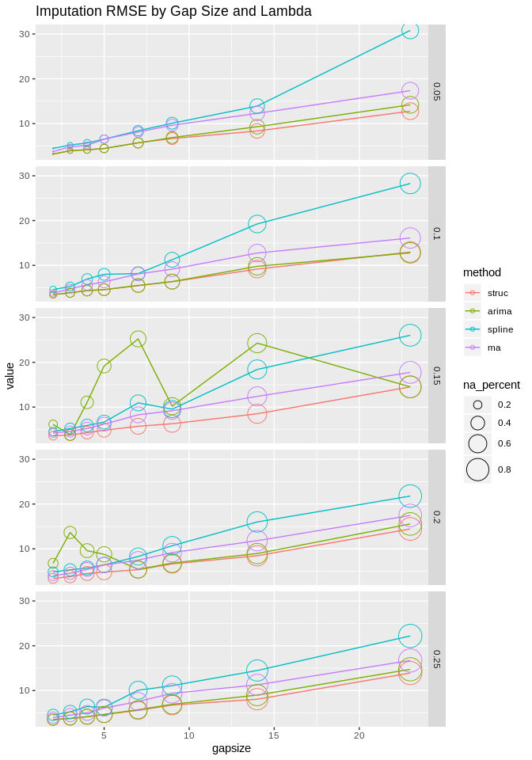
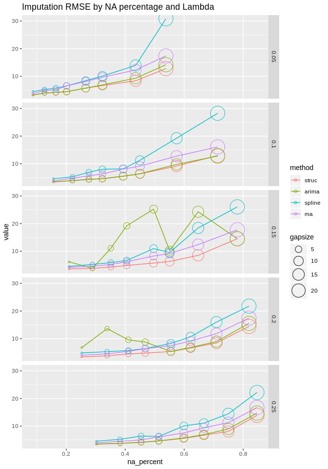

KE5105 - Building Electrical Consumption Forecasting
================

Extract, Transform and Load Data 7 - Data Imputation
====================================================

### Gap Size Analysis

Summary of Findings
===================

-   RMSE increases with gap size and amount of missing data.

Load libraries
==============

``` r
library(ggplot2)
library(reshape2)
library(xts)
```

    ## Loading required package: zoo

    ## 
    ## Attaching package: 'zoo'

    ## The following objects are masked from 'package:base':
    ## 
    ##     as.Date, as.Date.numeric

``` r
library(imputeTS)
```

    ## 
    ## Attaching package: 'imputeTS'

    ## The following object is masked from 'package:zoo':
    ## 
    ##     na.locf

Load data
=========

``` r
# SDE-3 time series data
sde3_agg_df <- read.csv("/home/tkokkeng/Documents/KE5105/ETL/source/test_data/SDE-3.agg.csv", header = TRUE, stringsAsFactors = FALSE)

# A list of 10 time series datasets with simulated missing data
missing_list <- readRDS("sim_missing_data_gapsize.rds")
```

``` r
length(missing_list)
```

    ## [1] 40

``` r
num_lambdas_gapsize = length(missing_list)
num_datasets = length(missing_list[[1]])-2  # each list has lambda, missing1, ..., missing<n>, gapsize

results = vector('list', num_lambdas_gapsize * num_datasets) 
idx = 1
for (i in missing_list) {

  for (j in 1:num_datasets) {
  # test data
  data_with_na = i[[j+1]]$data
  data_true = sde3_agg_df[i[[j+1]]$row:(i[[j+1]]$row+i[[j+1]]$size-1), ]$PWM_30min_avg
  na_true = data_true[i[[j+1]]$na.ind]
  
  # Impute the missing values using structural model and Kalman smoothing
  imp_struct <- na.kalman(data_with_na)
  # Impute the missing values using ARIMA model and Kalman smoothing
  imp_arima <- na.kalman(data_with_na, model = "auto.arima")
  # Impute the missing values using spline interpolation
  imp_spline <- na.interpolation(data_with_na, option = "spline")
  # Impute the missing values using moving average
  imp_ma <- na.ma(data_with_na, k=4, weighting="exponential")  

  # Extract all the imputed na values
  na_imp_struct = imp_struct[i[[j+1]]$na.ind]
  na_imp_arima = imp_arima[i[[j+1]]$na.ind]
  na_imp_spline = imp_spline[i[[j+1]]$na.ind]
  na_imp_ma = imp_ma[i[[j+1]]$na.ind]
  
  # compute rmse
  rmse_struct = sqrt(mean((na_imp_struct - na_true)^2))
  rmse_arima = sqrt(mean((na_imp_arima - na_true)^2))
  rmse_spline = sqrt(mean((na_imp_spline - na_true)^2))
  rmse_ma = sqrt(mean((na_imp_ma - na_true)^2))
  
  #Update results
  results[[idx]] <- c(i$lambda,
                      i$gapsize, length(i[[j+1]]$na.ind) / length(i[[j+1]]$data),
                      rmse_struct, rmse_arima, rmse_spline, rmse_ma)
  idx = idx + 1
  }
}  
```

``` r
results_df = as.data.frame(matrix(unlist(results), nrow = length(results), byrow = TRUE))
colnames(results_df) = c("lambda", "gapsize", "na_percent", "struc", "arima", "spline", "ma")
results_df
```

    ##     lambda gapsize na_percent     struc     arima    spline        ma
    ## 1     0.05       2 0.08754209  3.026381  3.048958  4.124050  3.146572
    ## 2     0.05       2 0.08754209  3.441613  3.667177  5.146846  3.787361
    ## 3     0.05       2 0.08754209  3.769836  3.617282  4.974468  4.216591
    ## 4     0.05       2 0.08754209  2.174851  2.175194  3.006260  3.225758
    ## 5     0.05       2 0.08766015  3.287506  3.421587  5.688659  4.262579
    ## 6     0.05       2 0.08641975  3.618251  3.575717  4.930532  4.267776
    ## 7     0.05       2 0.08629088  3.572624  3.448749  4.549308  4.432820
    ## 8     0.05       2 0.08629088  3.493766  3.465480  4.841659  4.034060
    ## 9     0.05       2 0.08629088  2.768544  2.750629  3.469509  3.106516
    ## 10    0.05       2 0.08840580  3.047022  3.027852  4.136129  3.213836
    ## 11    0.05       3 0.12525253  4.293501  4.286594  5.594638  4.628962
    ## 12    0.05       3 0.12525253  4.517847  4.641951  5.843172  5.706706
    ## 13    0.05       3 0.12525253  3.722385  3.428681  5.202647  5.107582
    ## 14    0.05       3 0.12525253  3.932136  3.915806  4.423448  5.161767
    ## 15    0.05       3 0.12542144  4.209787  4.290783  5.321964  4.777978
    ## 16    0.05       3 0.12757202  5.874737  5.856125  7.269856  6.400532
    ## 17    0.05       3 0.12734864  3.280238  3.206686  4.259996  4.828925
    ## 18    0.05       3 0.12734864  3.527197  3.417412  5.148195  3.970548
    ## 19    0.05       3 0.12734864  2.726682  2.829921  4.458239  3.318452
    ## 20    0.05       3 0.12826087  3.583357  3.592277  4.629506  4.256126
    ## 21    0.05       4 0.16430976  4.036821  4.025444  6.179106  4.639458
    ## 22    0.05       4 0.16430976  4.636106  4.680779  6.173585  5.469196
    ## 23    0.05       4 0.16430976  4.034210  3.926337  5.728365  5.488375
    ## 24    0.05       4 0.16430976  4.203403  4.136844  5.052721  5.593989
    ## 25    0.05       4 0.16453136  4.141680  4.112431  5.297437  6.017667
    ## 26    0.05       4 0.16186557  4.305619  4.154362  6.013278  5.523383
    ## 27    0.05       4 0.16423104  4.584165  4.599625  5.692880  5.250054
    ## 28    0.05       4 0.16423104  4.187055  4.250732  5.952327  4.599670
    ## 29    0.05       4 0.16423104  3.424733  3.434083  4.819910  4.106375
    ## 30    0.05       4 0.17101449  4.166343  4.305235  5.904028  4.863040
    ## 31    0.05       5 0.19865320  3.821634  3.839454  6.151772  5.127393
    ## 32    0.05       5 0.19865320  4.661357  4.647308  7.879103  6.794219
    ## 33    0.05       5 0.19865320  4.956398  4.724036  6.163512  8.134474
    ## 34    0.05       5 0.19865320  3.878678  3.771015  5.678829  6.887047
    ## 35    0.05       5 0.19892111  4.758107  4.726130  6.267526  7.235671
    ## 36    0.05       5 0.20233196  5.913422  5.789756  8.263852  8.084160
    ## 37    0.05       5 0.20528880  4.253287  4.293896  6.074836  6.260929
    ## 38    0.05       5 0.20528880  4.380280  4.315599  6.972615  5.971856
    ## 39    0.05       5 0.20528880  3.427516  3.490837  5.463816  4.764790
    ## 40    0.05       5 0.20289855  4.627884  4.731075  6.450034  6.045063
    ## 41    0.05       7 0.26397306  4.941561  4.911320  6.539794  6.384672
    ## 42    0.05       7 0.26397306  6.417544  6.745528  9.528390  9.974191
    ## 43    0.05       7 0.26397306  6.600164  6.499025  9.230218  9.816609
    ## 44    0.05       7 0.26397306  5.679245  5.567128  6.250455  8.034347
    ## 45    0.05       7 0.26432906  6.891461  6.794191  7.761016 10.825874
    ## 46    0.05       7 0.26817558  5.970285  5.583437 13.198699  8.170802
    ## 47    0.05       7 0.26791928  5.667754  5.615585  8.203384  7.580414
    ## 48    0.05       7 0.26791928  5.590618  5.653843  9.904489  7.451725
    ## 49    0.05       7 0.26791928  4.239403  4.188647  6.549922  5.720885
    ## 50    0.05       7 0.26884058  5.256604  5.466755  7.056004  7.316994
    ## 51    0.05       9 0.32121212  5.489135  5.679764 10.347635  7.310014
    ## 52    0.05       9 0.32121212  8.400006  9.163062 12.732891 12.388410
    ## 53    0.05       9 0.32121212  6.788406  6.902655  9.450272 10.138713
    ## 54    0.05       9 0.32121212  7.281452  7.245926  8.520819 11.615587
    ## 55    0.05       9 0.32164531  7.756803  7.678152 11.173745 11.340862
    ## 56    0.05       9 0.32716049  7.412517  7.949891  9.892413 10.583581
    ## 57    0.05       9 0.32080724  6.425021  6.558642 10.024551  8.433824
    ## 58    0.05       9 0.32080724  5.586997  5.663621  8.937343  8.070146
    ## 59    0.05       9 0.32080724  5.298949  5.359888  9.720628  7.563268
    ## 60    0.05       9 0.33260870  6.287030  6.682121 10.131101  8.996202
    ## 61    0.05      14 0.43367003  6.982021  7.443301 11.635768 10.111653
    ## 62    0.05      14 0.43367003  9.353491 10.217007 15.504474 13.825389
    ## 63    0.05      14 0.43367003  9.993222 12.693055 16.154411 15.176111
    ## 64    0.05      14 0.43367003  8.455751  8.255725 13.410713 12.655977
    ## 65    0.05      14 0.43425489  9.972482 10.497529 15.455109 14.289592
    ## 66    0.05      14 0.43209877  9.141446  9.282896 15.885191 13.765885
    ## 67    0.05      14 0.43841336  8.804541  9.135510 13.985303 13.340121
    ## 68    0.05      14 0.43841336  7.935421  8.681756 11.767414 11.603368
    ## 69    0.05      14 0.43841336  6.185377  6.611506 11.092139  9.185590
    ## 70    0.05      14 0.43695652  6.851836 10.293433 14.264772  8.999876
    ## 71    0.05      23 0.54074074 12.131571 15.171315 23.934173 14.257128
    ## 72    0.05      23 0.54074074 14.859951 18.434574 38.943778 22.126303
    ## 73    0.05      23 0.54074074 13.331591 14.850784 32.398827 19.811182
    ## 74    0.05      23 0.54074074 14.809244 14.436311 33.994570 20.592051
    ## 75    0.05      23 0.54012138 13.912345 14.938833 28.163958 18.931824
    ## 76    0.05      23 0.53635117 11.339144 12.012526 27.639413 17.632210
    ## 77    0.05      23 0.53583855 13.610167 13.909954 20.252050 17.738900
    ## 78    0.05      23 0.53583855 13.882310 13.882547 22.676083 15.886457
    ## 79    0.05      23 0.53583855  8.530736 10.936745 20.659990 13.012411
    ## 80    0.05      23 0.53333333 11.384956 13.413478 59.408391 13.592671
    ## 81    0.10       2 0.15757576  3.631579  3.649940  4.195190  3.800952
    ## 82    0.10       2 0.15757576  3.652461  3.773853  4.866908  3.940754
    ## 83    0.10       2 0.15757576  3.717946  3.513635  5.246642  4.022291
    ## 84    0.10       2 0.15757576  2.745280  2.837124  3.150893  3.329604
    ## 85    0.10       2 0.15778827  4.293054  4.440872  7.022564  4.829340
    ## 86    0.10       2 0.15500686  3.664296  3.759163  4.552619  4.085275
    ## 87    0.10       2 0.15448852  2.995105  2.943253  3.906370  3.556586
    ## 88    0.10       2 0.15448852  3.700373  3.733827  4.729143  4.163238
    ## 89    0.10       2 0.15448852  2.935956  3.080385  4.107681  3.071454
    ## 90    0.10       2 0.15942029  3.045293  3.169876  4.177382  3.507996
    ## 91    0.10       3 0.22087542  3.437348  3.414980  4.757365  3.899049
    ## 92    0.10       3 0.22087542  4.536522  4.599955  6.226368  5.774058
    ## 93    0.10       3 0.22087542  3.879045  3.744875  5.393453  4.846893
    ## 94    0.10       3 0.22087542  3.321456  3.345040  4.795982  4.588088
    ## 95    0.10       3 0.22049899  3.983795  4.002594  4.854454  4.962043
    ## 96    0.10       3 0.22016461  4.310654  4.243021  6.088684  5.187425
    ## 97    0.10       3 0.22129436  3.491121  3.409661  4.477677  4.400114
    ## 98    0.10       3 0.22129436  4.252083  4.259109  5.319899  4.872746
    ## 99    0.10       3 0.22129436  3.165679  3.180932  4.715663  3.833772
    ## 100   0.10       3 0.22173913  4.480818  4.575631  6.095958  5.221221
    ## 101   0.10       4 0.27676768  4.136270  4.024902  6.372936  5.068004
    ## 102   0.10       4 0.27676768  4.928352  4.990171  9.667886  6.441940
    ## 103   0.10       4 0.27676768  4.599438  4.605646  8.254675  6.473041
    ## 104   0.10       4 0.27676768  4.263459  4.153446  9.321631  6.069773
    ## 105   0.10       4 0.27579231  4.722429  4.683761  6.136910  5.977501
    ## 106   0.10       4 0.27846365  4.868023  4.827592  7.807188  6.170185
    ## 107   0.10       4 0.27627001  4.475115  4.441914  5.602288  5.774518
    ## 108   0.10       4 0.27627001  4.362882  4.266854  5.683513  5.432394
    ## 109   0.10       4 0.27627001  3.468006  3.461054  4.799087  4.293913
    ## 110   0.10       4 0.27826087  4.077993  4.070456  5.868659  4.774972
    ## 111   0.10       5 0.32592593  3.915936  3.842226  7.085151  5.189089
    ## 112   0.10       5 0.32592593  4.589205  4.620801 10.827980  7.076282
    ## 113   0.10       5 0.32592593  4.833233  4.994223  9.278074  7.104634
    ## 114   0.10       5 0.32592593  4.363147  4.354123 10.283371  6.773795
    ## 115   0.10       5 0.32501686  5.036685  5.044679  6.289380  6.499453
    ## 116   0.10       5 0.32304527  5.088789  5.116598  7.406281  7.107900
    ## 117   0.10       5 0.31871955  4.669601  4.776532  7.640674  6.437503
    ## 118   0.10       5 0.31871955  4.852140  4.912298  7.880605  6.319882
    ## 119   0.10       5 0.31871955  3.960531  4.002201  6.239041  5.225006
    ## 120   0.10       5 0.31521739  4.285032  4.384786  7.091305  5.414948
    ## 121   0.10       7 0.39595960  4.972220  5.005250  7.723154  6.826095
    ## 122   0.10       7 0.39595960  6.069450  6.166030  9.740759  9.457670
    ## 123   0.10       7 0.39595960  6.437435  6.411873  9.736476  9.409155
    ## 124   0.10       7 0.39595960  4.897035  4.930158  6.017085  8.300357
    ## 125   0.10       7 0.39649359  5.755195  5.711418  7.987390  8.425026
    ## 126   0.10       7 0.39163237  5.719424  5.756806 10.541046  8.882311
    ## 127   0.10       7 0.38970077  5.395588  5.284223  6.803148  8.112497
    ## 128   0.10       7 0.38970077  5.815078  6.046424  8.435591  7.751422
    ## 129   0.10       7 0.38970077  4.632672  4.618141  7.239846  6.683131
    ## 130   0.10       7 0.39130435  5.006765  5.268860  7.439583  6.969420
    ## 131   0.10       9 0.45454545  5.334417  5.353708  7.841380  7.542203
    ## 132   0.10       9 0.45454545  6.517471  6.495928 11.306490 10.651197
    ## 133   0.10       9 0.45454545  6.558051  6.629523 11.105831  9.967660
    ## 134   0.10       9 0.45454545  7.440031  7.378831  9.886996 11.231702
    ## 135   0.10       9 0.45515846  7.879605  7.823100 15.447964 10.520646
    ## 136   0.10       9 0.45061728  6.734935  6.509535 15.540109  9.378863
    ## 137   0.10       9 0.44398051  6.584617  6.753468 11.863608  9.254637
    ## 138   0.10       9 0.44398051  6.127844  6.088261 10.416978  8.535709
    ## 139   0.10       9 0.44398051  4.636122  4.606638 10.060843  6.981948
    ## 140   0.10       9 0.44347826  5.695254  6.221207  9.119974  7.499490
    ## 141   0.10      14 0.57373737  8.557326  8.054280 16.693219 10.273772
    ## 142   0.10      14 0.57373737 10.918285 10.805485 26.571569 15.467507
    ## 143   0.10      14 0.57373737 10.904135 12.125197 25.273104 14.502263
    ## 144   0.10      14 0.57373737  9.781447  9.969398 25.058175 14.104621
    ## 145   0.10      14 0.57316251 10.618640 11.128071 24.805645 14.984636
    ## 146   0.10      14 0.56927298  9.279243 11.090641 18.794508 14.076677
    ## 147   0.10      14 0.57480863  8.126895  8.726151 12.356971 11.743354
    ## 148   0.10      14 0.57480863  8.413144  8.718506 15.013275 11.706486
    ## 149   0.10      14 0.57480863  6.066437  6.370033 12.084770  9.004342
    ## 150   0.10      14 0.58115942  9.037226 10.943552 15.784336 11.678723
    ## 151   0.10      23 0.71178451 10.413812 10.112702 23.466524 12.445545
    ## 152   0.10      23 0.71178451 18.525123 15.150985 35.881390 20.567648
    ## 153   0.10      23 0.71178451 13.725003 13.803240 33.960650 17.871468
    ## 154   0.10      23 0.71178451 13.814446 14.045999 31.487785 19.709235
    ## 155   0.10      23 0.71139582 13.313333 12.822653 32.933536 17.543626
    ## 156   0.10      23 0.70987654 12.898863 15.563080 22.044444 17.824227
    ## 157   0.10      23 0.71885873 13.019092 12.594657 29.048262 15.429563
    ## 158   0.10      23 0.71885873 11.831481 11.612642 26.109706 13.950613
    ## 159   0.10      23 0.71885873 10.556255 10.556193 22.911202 12.418929
    ## 160   0.10      23 0.71014493 11.682738 11.680757 24.924174 13.294233
    ## 161   0.15       2 0.20875421  3.340337  3.302809  4.399325  3.983352
    ## 162   0.15       2 0.20875421  4.131793  4.117956  5.120549  4.905468
    ## 163   0.15       2 0.20875421  3.857388  3.828114  4.971668  4.436645
    ## 164   0.15       2 0.20875421  3.412536  3.399438  3.952612  4.316732
    ## 165   0.15       2 0.20836143  3.840489  3.828115  4.528631  4.425309
    ## 166   0.15       2 0.20987654  3.907824  3.843446  5.052682  4.358962
    ## 167   0.15       2 0.21155184  3.496959  3.476167  4.312120  4.429831
    ## 168   0.15       2 0.21155184  3.732787  3.720145  4.499763  3.927693
    ## 169   0.15       2 0.21155184  2.943246  3.086689  4.202924  3.270010
    ## 170   0.15       2 0.21304348  3.453202 28.825379  4.210328  3.937083
    ## 171   0.15       3 0.28888889  3.416887  3.420237  6.166876  3.891138
    ## 172   0.15       3 0.28888889  4.545990  4.543101  6.084244  5.495872
    ## 173   0.15       3 0.28888889  3.780487  3.749705  5.401690  4.790845
    ## 174   0.15       3 0.28888889  3.733688  3.714425  4.760924  4.724037
    ## 175   0.15       3 0.28860418  4.118382  4.155250  5.693994  4.972947
    ## 176   0.15       3 0.28669410  4.240593  4.253813  5.537800  5.194759
    ## 177   0.15       3 0.28810021  3.583257  3.567166  4.339656  4.580322
    ## 178   0.15       3 0.28810021  3.670945  3.723303  4.996902  4.217316
    ## 179   0.15       3 0.28810021  3.002885  3.072759  4.316906  3.543862
    ## 180   0.15       3 0.29565217  3.682714  3.696469  4.873823  4.225245
    ## 181   0.15       4 0.35353535  3.922557  3.954328  5.344679  4.468417
    ## 182   0.15       4 0.35353535  4.590847  4.643454  6.748097  5.684029
    ## 183   0.15       4 0.35353535  4.336913 71.886626  6.142045  5.353375
    ## 184   0.15       4 0.35353535  4.416848  4.389719  5.791267  5.666968
    ## 185   0.15       4 0.35333783  4.630004  4.629908  6.051749  5.616959
    ## 186   0.15       4 0.34979424  4.759987  4.975094  7.209690  5.872869
    ## 187   0.15       4 0.34794711  4.215237  4.194194  5.161193  4.964310
    ## 188   0.15       4 0.34794711  4.294825  4.178653  5.861228  5.336255
    ## 189   0.15       4 0.34794711  3.326045  3.269789  4.765167  3.918545
    ## 190   0.15       4 0.35072464  4.500924  4.567603  5.850653  5.223299
    ## 191   0.15       5 0.40404040  4.116777  4.105318  5.885505  5.075869
    ## 192   0.15       5 0.40404040  5.579950  5.460653  7.742600  7.423081
    ## 193   0.15       5 0.40404040  4.698809 76.334864  6.095901  6.525545
    ## 194   0.15       5 0.40404040  4.832083  4.774904  5.928555  6.677510
    ## 195   0.15       5 0.40458530  5.658714  5.657812  6.811089  7.239189
    ## 196   0.15       5 0.40672154  5.561325 77.291704  8.459351  7.044882
    ## 197   0.15       5 0.40709812  4.715195  4.814161  6.261367  5.937234
    ## 198   0.15       5 0.40709812  5.052085  5.153299  7.416868  5.809991
    ## 199   0.15       5 0.40709812  3.868184  3.814044  4.975807  4.989138
    ## 200   0.15       5 0.40217391  4.238691  4.315199  7.022142  5.245837
    ## 201   0.15       7 0.49427609  5.200956  5.031971 10.172993  6.562196
    ## 202   0.15       7 0.49427609  6.088270  5.896394 13.481741  9.536703
    ## 203   0.15       7 0.49427609  6.062460 81.151024 12.666136  9.201823
    ## 204   0.15       7 0.49427609  5.324992  5.365488 12.138817  8.656690
    ## 205   0.15       7 0.49359407  6.315306  6.408330 10.750801  9.518480
    ## 206   0.15       7 0.49931413  6.442233 84.133259 14.449956  9.392122
    ## 207   0.15       7 0.49686848  5.641149  5.751710  7.859412  7.777393
    ## 208   0.15       7 0.49686848  5.794144  5.787527  8.951501  7.480127
    ## 209   0.15       7 0.49686848  4.428949  4.352304  6.710060  6.343375
    ## 210   0.15       7 0.50217391  5.876343 48.415080 12.243934  8.240300
    ## 211   0.15       9 0.55218855  5.408433  5.322401  8.543459  7.547492
    ## 212   0.15       9 0.55218855  6.924394  6.911098 11.913081 10.765213
    ## 213   0.15       9 0.55218855  6.428874  6.443043  9.994320  9.892534
    ## 214   0.15       9 0.55218855  6.717525  6.857903  9.306192 10.008993
    ## 215   0.15       9 0.55225893  7.820684  7.841690  9.442801 11.535998
    ## 216   0.15       9 0.55075446  6.683278  6.696374 10.548569 10.283430
    ## 217   0.15       9 0.54697286  6.456941  6.433034  9.115544  8.911294
    ## 218   0.15       9 0.54697286  5.850478  6.050308  9.569169  7.875619
    ## 219   0.15       9 0.54697286  4.864211  4.965287  7.517343  6.841418
    ## 220   0.15       9 0.55434783  5.785923 44.463311  9.491941  8.227572
    ## 221   0.15      14 0.64781145  8.080523  8.074960 14.932846  9.864020
    ## 222   0.15      14 0.64781145 10.114262 10.723222 21.858837 15.028664
    ## 223   0.15      14 0.64781145  9.448095 85.210397 19.179411 14.113094
    ## 224   0.15      14 0.64781145  9.489888 10.047088 20.267497 14.230472
    ## 225   0.15      14 0.64733648 10.313607 10.670482 18.240866 14.719963
    ## 226   0.15      14 0.64746228  9.049860 87.058002 38.121050 13.605946
    ## 227   0.15      14 0.64300626  7.870046  8.243198 11.061390 11.709400
    ## 228   0.15      14 0.64300626  7.285849  7.781520 13.224544 10.585149
    ## 229   0.15      14 0.64300626  6.046872  6.420644 11.165171  9.371385
    ## 230   0.15      14 0.65797101  7.431155  8.570343 15.967866 10.710783
    ## 231   0.15      23 0.78181818 11.928873 11.618004 21.272225 13.145398
    ## 232   0.15      23 0.78181818 17.091670 17.010385 25.861437 22.762138
    ## 233   0.15      23 0.78181818 15.958655 18.676694 22.736699 19.964070
    ## 234   0.15      23 0.78181818 13.560092 14.220149 24.018136 19.533752
    ## 235   0.15      23 0.78152394 15.910709 17.305230 25.613814 19.350775
    ## 236   0.15      23 0.77846365 17.062316 15.774545 24.750106 19.831977
    ## 237   0.15      23 0.77661795 14.881905 13.572433 22.198074 16.855675
    ## 238   0.15      23 0.77661795 13.676994 13.297036 22.656173 16.197693
    ## 239   0.15      23 0.77661795 11.527455 10.389689 18.443292 13.725313
    ## 240   0.15      23 0.78333333 13.508620 13.281604 52.818960 16.064101
    ## 241   0.20       2 0.25319865  3.407317  3.412963  4.835440  3.784231
    ## 242   0.20       2 0.25319865  3.665294  3.834064  6.283551  4.399088
    ## 243   0.20       2 0.25319865  3.565802  3.627438  5.932107  4.306853
    ## 244   0.20       2 0.25319865  2.946309  3.011843  5.422726  4.066651
    ## 245   0.20       2 0.25219150  3.762907  3.765366  4.208850  4.636404
    ## 246   0.20       2 0.25240055  3.611851 11.382354  4.914353  3.959788
    ## 247   0.20       2 0.25191371  3.395854  3.366050  4.055885  4.164614
    ## 248   0.20       2 0.25191371  3.414130  3.451173  4.394256  3.829595
    ## 249   0.20       2 0.25191371  2.906995  2.877793  3.930649  3.148791
    ## 250   0.20       2 0.25289855  3.448452 28.928217  4.467605  3.872597
    ## 251   0.20       3 0.33939394  3.818028  3.842977  4.783326  4.294231
    ## 252   0.20       3 0.33939394  4.081802  4.017772  5.875033  4.576341
    ## 253   0.20       3 0.33939394  3.927385  4.014043  4.936804  5.140308
    ## 254   0.20       3 0.33939394  3.130697  3.098625  4.171762  4.036260
    ## 255   0.20       3 0.33985165  3.922192  3.981801  6.703287  4.915591
    ## 256   0.20       3 0.33744856  4.139919 67.512935  5.369880  5.003751
    ## 257   0.20       3 0.33750870  3.870208  3.888941  5.264165  4.627171
    ## 258   0.20       3 0.33750870  4.021317  4.078301  5.399477  4.742949
    ## 259   0.20       3 0.33750870  3.074104  3.086775  4.876457  3.381550
    ## 260   0.20       3 0.33913043  3.954766 38.991964  5.657258  4.619540
    ## 261   0.20       4 0.40942761  3.878814  3.870777  5.249392  4.504979
    ## 262   0.20       4 0.40942761  5.223998  5.169538  6.555894  6.289885
    ## 263   0.20       4 0.40942761  4.557316  4.706551  5.952998  5.863612
    ## 264   0.20       4 0.40942761  4.599513  4.515577  4.861087  5.647904
    ## 265   0.20       4 0.40997977  4.995484  5.102502  6.127643  6.019048
    ## 266   0.20       4 0.40946502  4.932119 55.795555  6.313587  6.030343
    ## 267   0.20       4 0.41196938  4.448999  4.465501  5.471759  5.116450
    ## 268   0.20       4 0.41196938  4.437552  4.365207  5.529858  5.295393
    ## 269   0.20       4 0.41196938  3.750201  3.694790  5.130773  4.353822
    ## 270   0.20       4 0.41159420  4.221586  4.219580  5.959887  4.981307
    ## 271   0.20       5 0.46464646  4.242144  4.218294  6.285657  5.234221
    ## 272   0.20       5 0.46464646  5.176247  5.145694  7.058227  7.378664
    ## 273   0.20       5 0.46464646  4.961812  4.844291  6.245643  6.805999
    ## 274   0.20       5 0.46464646  4.788760  4.786830  5.301573  7.001305
    ## 275   0.20       5 0.46527310  5.398444  5.455616  6.998106  7.172490
    ## 276   0.20       5 0.46982167  5.173782  5.361132  7.052884  6.797841
    ## 277   0.20       5 0.47320807  5.364443  5.297178  6.047759  6.783531
    ## 278   0.20       5 0.47320807  4.499586  4.579976  6.360544  5.866120
    ## 279   0.20       5 0.47320807  3.846169  3.878652  5.346707  4.917920
    ## 280   0.20       5 0.46594203  4.498208 44.139857  7.459004  5.933214
    ## 281   0.20       7 0.55622896  4.680559  4.632312  7.249463  5.995452
    ## 282   0.20       7 0.55622896  6.034568  5.999521  9.133898  8.689725
    ## 283   0.20       7 0.55622896  5.946690  6.316075  8.255328  8.149212
    ## 284   0.20       7 0.55622896  5.009941  4.987134  6.360496  7.734081
    ## 285   0.20       7 0.55697910  5.897386  5.914583 13.946494  8.507855
    ## 286   0.20       7 0.55212620  5.671929  5.875488  8.546086  8.276895
    ## 287   0.20       7 0.55114823  5.477609  5.513196  7.107831  7.718323
    ## 288   0.20       7 0.55114823  5.583774  5.645807  8.086461  7.459222
    ## 289   0.20       7 0.55114823  4.041731  4.011905  6.605544  5.560879
    ## 290   0.20       7 0.55797101  5.120021  5.203571  7.563412  6.742188
    ## 291   0.20       9 0.62154882  5.993746  6.247702  9.811846  7.585384
    ## 292   0.20       9 0.62154882  7.515491  7.999357 13.626504 11.100847
    ## 293   0.20       9 0.62154882  7.111430  7.188805 11.959112 10.324470
    ## 294   0.20       9 0.62154882  7.026748  7.130665 12.427111  9.909137
    ## 295   0.20       9 0.62103844  7.347510  7.457619 11.311569 10.111320
    ## 296   0.20       9 0.62345679  7.201866  7.259399 10.529846 10.130370
    ## 297   0.20       9 0.62073765  6.530833  6.530851  8.240624  8.795891
    ## 298   0.20       9 0.62073765  6.562460  6.928129  8.820830  8.711603
    ## 299   0.20       9 0.62073765  5.145616  5.163602  8.568459  7.028398
    ## 300   0.20       9 0.62391304  5.931264  6.412623 11.604846  7.875649
    ## 301   0.20      14 0.71111111  7.187422  7.785894 12.607378  9.608792
    ## 302   0.20      14 0.71111111  9.620732 10.027875 17.641216 14.569664
    ## 303   0.20      14 0.71111111  9.433622 10.241571 14.192968 14.075865
    ## 304   0.20      14 0.71111111  8.151395  8.521036 16.412037 12.530847
    ## 305   0.20      14 0.71072151  9.701997 10.362578 15.046739 13.501918
    ## 306   0.20      14 0.71056241  9.283551  8.845660 23.670364 12.564107
    ## 307   0.20      14 0.70842032  8.343046  9.355408 15.632722 11.676839
    ## 308   0.20      14 0.70842032  8.355413  7.742465 16.135440 10.843443
    ## 309   0.20      14 0.70842032  6.639720  6.943486 14.154425  9.186079
    ## 310   0.20      14 0.70289855  7.836341  9.681329 14.518999  9.692348
    ## 311   0.20      23 0.82087542 11.051408 10.876612 19.594558 12.979063
    ## 312   0.20      23 0.82087542 18.725175 17.205258 19.574070 22.089253
    ## 313   0.20      23 0.82087542 16.439350 19.435927 22.874496 19.396221
    ## 314   0.20      23 0.82087542 14.212552 24.617238 17.409544 20.165997
    ## 315   0.20      23 0.82198247 15.745076 13.642164 34.831157 18.937937
    ## 316   0.20      23 0.81961591 15.971066 17.583039 30.737932 19.254225
    ## 317   0.20      23 0.81697982 13.678583 13.203640 19.218582 16.064346
    ## 318   0.20      23 0.81697982 13.117794 13.117796 17.245101 15.436584
    ## 319   0.20      23 0.81697982 11.449757 10.902919 14.761601 13.936883
    ## 320   0.20      23 0.82101449 13.974177 14.959605 21.543042 16.229357
    ## 321   0.25       2 0.30303030  3.444085  3.425053  4.148109  3.730955
    ## 322   0.25       2 0.30303030  3.941521  3.944356  4.906452  4.240839
    ## 323   0.25       2 0.30303030  3.526817  3.527205  4.743526  4.277035
    ## 324   0.25       2 0.30303030  2.835204  2.856590  3.379804  3.393776
    ## 325   0.25       2 0.30276467  3.577670  3.726292  5.258028  4.104811
    ## 326   0.25       2 0.30452675  4.031448  4.230027  6.409077  4.568755
    ## 327   0.25       2 0.30201809  3.742958  3.662945  4.247183  4.237504
    ## 328   0.25       2 0.30201809  3.483868  3.514850  4.353141  3.955690
    ## 329   0.25       2 0.30201809  2.910978  3.000319  3.907168  3.130853
    ## 330   0.25       2 0.30000000  3.488495  3.482809  4.425575  3.857437
    ## 331   0.25       3 0.38383838  3.613890  3.650795  4.747350  4.073569
    ## 332   0.25       3 0.38383838  4.235354  4.159153  5.945963  5.113409
    ## 333   0.25       3 0.38383838  3.529108  3.442826  4.862277  4.702108
    ## 334   0.25       3 0.38383838  3.556290  3.479695  4.398549  4.769662
    ## 335   0.25       3 0.38435604  3.890825  3.983752  7.844153  4.640194
    ## 336   0.25       3 0.38271605  4.104368  4.199342  5.496728  5.095532
    ## 337   0.25       3 0.37995825  3.547400  3.603388  4.637715  4.243633
    ## 338   0.25       3 0.37995825  4.055984  4.045212  4.993287  4.634821
    ## 339   0.25       3 0.37995825  3.154765  3.113886  4.341271  3.474046
    ## 340   0.25       3 0.38260870  3.958273  3.993375  4.978484  4.546126
    ## 341   0.25       4 0.45454545  3.833141  3.814082  5.760946  4.228851
    ## 342   0.25       4 0.45454545  4.668853  4.717055  8.574505  5.670038
    ## 343   0.25       4 0.45454545  4.375186  4.441411  7.592256  5.471294
    ## 344   0.25       4 0.45454545  3.920154  3.919405  7.789138  5.132673
    ## 345   0.25       4 0.45380984  4.239038  4.238915  5.412202  5.445816
    ## 346   0.25       4 0.45267490  4.288964  4.385418  6.524817  5.308323
    ## 347   0.25       4 0.45372303  4.121712  4.187790  5.634177  4.996009
    ## 348   0.25       4 0.45372303  3.939965  3.941814  5.282605  4.750342
    ## 349   0.25       4 0.45372303  3.554468  3.595975  5.091702  4.171423
    ## 350   0.25       4 0.45434783  4.485491  4.554927  6.659410  4.976825
    ## 351   0.25       5 0.51245791  4.209915  4.236240  5.897275  5.059690
    ## 352   0.25       5 0.51245791  5.171671  5.109780  7.017963  6.868845
    ## 353   0.25       5 0.51245791  4.847715  5.045756  6.621886  6.821100
    ## 354   0.25       5 0.51245791  4.576883  4.547096  5.753153  6.643295
    ## 355   0.25       5 0.51247471  5.140459  5.035143  5.847050  6.988281
    ## 356   0.25       5 0.51440329  4.669117  4.776699  6.669162  6.308289
    ## 357   0.25       5 0.51496173  4.633014  4.603684  5.911804  5.973768
    ## 358   0.25       5 0.51496173  4.718017  4.750820  6.545661  5.760022
    ## 359   0.25       5 0.51496173  3.681548  3.765361  5.678180  4.553331
    ## 360   0.25       5 0.51521739  4.810569  4.951418  6.680100  6.068092
    ## 361   0.25       7 0.59797980  5.114020  5.204083  9.267722  6.689623
    ## 362   0.25       7 0.59797980  6.495333  7.006945 13.695595  8.823825
    ## 363   0.25       7 0.59797980  6.027961  6.083238 13.387086  8.248090
    ## 364   0.25       7 0.59797980  5.907800  5.913409 12.626340  8.525151
    ## 365   0.25       7 0.59743763  6.150704  6.172335 11.176044  8.561821
    ## 366   0.25       7 0.59670782  5.609783  5.821993 10.470012  7.599584
    ## 367   0.25       7 0.59916493  5.515745  5.622791  7.455039  7.014522
    ## 368   0.25       7 0.59916493  5.411906  5.455797  7.274804  7.472719
    ## 369   0.25       7 0.59916493  4.207465  4.366308  6.556227  5.608351
    ## 370   0.25       7 0.60362319  5.409327  5.573434  8.731488  7.012155
    ## 371   0.25       9 0.66666667  5.804606  5.955690  8.761559  7.573079
    ## 372   0.25       9 0.66666667  7.729779  7.672243  9.485734 11.166568
    ## 373   0.25       9 0.66666667  7.736452  7.927512 10.262830 10.647091
    ## 374   0.25       9 0.66666667  6.853097  6.867269  9.020019 10.158188
    ## 375   0.25       9 0.66756575  7.605848  8.049658 19.631862 10.234800
    ## 376   0.25       9 0.66666667  7.145986  7.788233 13.935585 10.346520
    ## 377   0.25       9 0.66597077  7.000520  7.058881 10.671988  9.426596
    ## 378   0.25       9 0.66597077  6.639567  6.613757 10.166899  8.983229
    ## 379   0.25       9 0.66597077  5.284197  5.329764  8.596470  7.362547
    ## 380   0.25       9 0.66884058  5.717471  6.121965 10.471443  7.988781
    ## 381   0.25      14 0.74949495  7.259931  6.736576 13.103895  8.912773
    ## 382   0.25      14 0.74949495  9.312292 10.559145 18.513767 13.532034
    ## 383   0.25      14 0.74949495  8.623030 10.141472 16.663177 12.503773
    ## 384   0.25      14 0.74949495  9.256846 10.745910 14.414666 13.945416
    ## 385   0.25      14 0.74915711  8.176780  8.561380 16.570734 11.484564
    ## 386   0.25      14 0.75034294  8.386404 10.144540 13.494030 12.330627
    ## 387   0.25      14 0.75017397  7.836975  8.321623 10.991188 10.568154
    ## 388   0.25      14 0.75017397  7.690148  8.658306 11.854010 10.435934
    ## 389   0.25      14 0.75017397  6.166163  7.035044 10.004110  8.876389
    ## 390   0.25      14 0.75072464  7.970788  9.000421 19.191643 10.200682
    ## 391   0.25      23 0.84579125 11.485532 12.574344 19.348894 13.811022
    ## 392   0.25      23 0.84579125 16.376579 14.868928 31.024151 18.886444
    ## 393   0.25      23 0.84579125 17.273766 19.037817 24.931918 20.169585
    ## 394   0.25      23 0.84579125 12.610108 15.387392 25.488708 17.782513
    ## 395   0.25      23 0.84558328 14.844461 14.499784 26.228466 19.238073
    ## 396   0.25      23 0.84430727 16.538618 18.999977 23.556335 19.337891
    ## 397   0.25      23 0.84829506 14.040894 13.683841 17.902833 16.338322
    ## 398   0.25      23 0.84829506 13.130546 13.130546 19.434482 14.885043
    ## 399   0.25      23 0.84829506 10.930070 10.761477 16.790558 12.941610
    ## 400   0.25      23 0.85000000 11.907472 14.574697 17.270603 13.800103

Save results to file.

``` r
write.csv(results_df, file = "results_gapsize.csv", row.names = FALSE)
```

``` r
agg_df <- aggregate(results_df[, c("na_percent", "struc", "arima", "spline", "ma")],
                    list(lambda = results_df$lambda, gapsize = results_df$gapsize), mean)
agg_df
```

    ##    lambda gapsize na_percent     struc     arima    spline        ma
    ## 1    0.05       2 0.08715267  3.220039  3.219863  4.486742  3.769387
    ## 2    0.10       2 0.15659840  3.438135  3.490193  4.595539  3.830749
    ## 3    0.15       2 0.21009538  3.611656  6.142826  4.525060  4.199108
    ## 4    0.20       2 0.25260263  3.412491  6.765726  4.844542  4.016861
    ## 5    0.25       2 0.30254669  3.498304  3.537045  4.577806  3.949765
    ## 6    0.05       3 0.12643104  3.966787  3.946624  5.215166  4.815758
    ## 7    0.10       3 0.22097875  3.885852  3.877580  5.272550  4.758541
    ## 8    0.15       3 0.28908066  3.777583  3.789623  5.217281  4.563634
    ## 9    0.20       3 0.33865325  3.794042 13.651413  5.303745  4.533769
    ## 10   0.25       3 0.38249091  3.764626  3.767143  5.224578  4.529310
    ## 11   0.05       4 0.16473436  4.172014  4.162587  5.681364  5.155121
    ## 12   0.10       4 0.27683976  4.390197  4.352580  6.951477  5.647624
    ## 13   0.15       4 0.35118395  4.299419 11.068937  5.892577  5.210503
    ## 14   0.20       4 0.41046576  4.504558  9.590558  5.715288  5.410274
    ## 15   0.25       4 0.45401835  4.142697  4.179679  6.432176  5.015159
    ## 16   0.05       5 0.20146308  4.467856  4.432911  6.536590  6.530560
    ## 17   0.10       5 0.32231419  4.559430  4.604847  8.002186  6.314849
    ## 18   0.15       5 0.40509367  4.832181 19.172196  6.659918  6.196828
    ## 19   0.20       5 0.46792469  4.794960  8.770752  6.415610  6.389131
    ## 20   0.25       5 0.51368122  4.645891  4.682200  6.262223  6.104471
    ## 21   0.05       7 0.26609953  5.725464  5.702546  8.422237  8.127651
    ## 22   0.10       7 0.39323710  5.470086  5.519918  8.166408  8.081708
    ## 23   0.15       7 0.49627919  5.717480 25.229309 10.942535  8.270921
    ## 24   0.20       7 0.55454368  5.346421  5.409959  8.285501  7.483383
    ## 25   0.25       7 0.59871826  5.585004  5.722033 10.064036  7.555584
    ## 26   0.05       9 0.32286847  6.672632  6.888372 10.093140  9.644061
    ## 27   0.10       9 0.44993774  6.350835  6.386020 11.259017  9.156405
    ## 28   0.15       9 0.55070340  6.294074 10.198445  9.544242  9.188956
    ## 29   0.20       9 0.62168165  6.636696  6.831875 10.690075  9.157307
    ## 30   0.25       9 0.66676520  6.751752  6.938497 11.100439  9.388740
    ## 31   0.05      14 0.43532304  8.367559  9.311172 13.915529 12.295356
    ## 32   0.10      14 0.57429703  9.170278  9.793131 19.243557 12.754238
    ## 33   0.15      14 0.64730344  8.513016 24.279986 18.401948 12.393888
    ## 34   0.20      14 0.70938879  8.455324  8.950730 16.001229 11.824990
    ## 35   0.25      14 0.74987264  8.067936  8.990442 14.480122 11.279035
    ## 36   0.05      23 0.53802845 12.779201 14.198707 30.807123 17.358114
    ## 37   0.10      23 0.71351315 12.978015 12.794291 28.276767 16.105509
    ## 38   0.15      23 0.78004475 14.510729 14.514577 26.036892 17.743089
    ## 39   0.20      23 0.81970540 14.436494 15.554420 21.779008 17.448987
    ## 40   0.25      23 0.84679407 13.913805 14.751880 22.197695 16.719061

``` r
agg_long_df <- melt(agg_df, id.vars = c("lambda", "gapsize", "na_percent"), variable.name = "method")
agg_long_df
```

    ##     lambda gapsize na_percent method     value
    ## 1     0.05       2 0.08715267  struc  3.220039
    ## 2     0.10       2 0.15659840  struc  3.438135
    ## 3     0.15       2 0.21009538  struc  3.611656
    ## 4     0.20       2 0.25260263  struc  3.412491
    ## 5     0.25       2 0.30254669  struc  3.498304
    ## 6     0.05       3 0.12643104  struc  3.966787
    ## 7     0.10       3 0.22097875  struc  3.885852
    ## 8     0.15       3 0.28908066  struc  3.777583
    ## 9     0.20       3 0.33865325  struc  3.794042
    ## 10    0.25       3 0.38249091  struc  3.764626
    ## 11    0.05       4 0.16473436  struc  4.172014
    ## 12    0.10       4 0.27683976  struc  4.390197
    ## 13    0.15       4 0.35118395  struc  4.299419
    ## 14    0.20       4 0.41046576  struc  4.504558
    ## 15    0.25       4 0.45401835  struc  4.142697
    ## 16    0.05       5 0.20146308  struc  4.467856
    ## 17    0.10       5 0.32231419  struc  4.559430
    ## 18    0.15       5 0.40509367  struc  4.832181
    ## 19    0.20       5 0.46792469  struc  4.794960
    ## 20    0.25       5 0.51368122  struc  4.645891
    ## 21    0.05       7 0.26609953  struc  5.725464
    ## 22    0.10       7 0.39323710  struc  5.470086
    ## 23    0.15       7 0.49627919  struc  5.717480
    ## 24    0.20       7 0.55454368  struc  5.346421
    ## 25    0.25       7 0.59871826  struc  5.585004
    ## 26    0.05       9 0.32286847  struc  6.672632
    ## 27    0.10       9 0.44993774  struc  6.350835
    ## 28    0.15       9 0.55070340  struc  6.294074
    ## 29    0.20       9 0.62168165  struc  6.636696
    ## 30    0.25       9 0.66676520  struc  6.751752
    ## 31    0.05      14 0.43532304  struc  8.367559
    ## 32    0.10      14 0.57429703  struc  9.170278
    ## 33    0.15      14 0.64730344  struc  8.513016
    ## 34    0.20      14 0.70938879  struc  8.455324
    ## 35    0.25      14 0.74987264  struc  8.067936
    ## 36    0.05      23 0.53802845  struc 12.779201
    ## 37    0.10      23 0.71351315  struc 12.978015
    ## 38    0.15      23 0.78004475  struc 14.510729
    ## 39    0.20      23 0.81970540  struc 14.436494
    ## 40    0.25      23 0.84679407  struc 13.913805
    ## 41    0.05       2 0.08715267  arima  3.219863
    ## 42    0.10       2 0.15659840  arima  3.490193
    ## 43    0.15       2 0.21009538  arima  6.142826
    ## 44    0.20       2 0.25260263  arima  6.765726
    ## 45    0.25       2 0.30254669  arima  3.537045
    ## 46    0.05       3 0.12643104  arima  3.946624
    ## 47    0.10       3 0.22097875  arima  3.877580
    ## 48    0.15       3 0.28908066  arima  3.789623
    ## 49    0.20       3 0.33865325  arima 13.651413
    ## 50    0.25       3 0.38249091  arima  3.767143
    ## 51    0.05       4 0.16473436  arima  4.162587
    ## 52    0.10       4 0.27683976  arima  4.352580
    ## 53    0.15       4 0.35118395  arima 11.068937
    ## 54    0.20       4 0.41046576  arima  9.590558
    ## 55    0.25       4 0.45401835  arima  4.179679
    ## 56    0.05       5 0.20146308  arima  4.432911
    ## 57    0.10       5 0.32231419  arima  4.604847
    ## 58    0.15       5 0.40509367  arima 19.172196
    ## 59    0.20       5 0.46792469  arima  8.770752
    ## 60    0.25       5 0.51368122  arima  4.682200
    ## 61    0.05       7 0.26609953  arima  5.702546
    ## 62    0.10       7 0.39323710  arima  5.519918
    ## 63    0.15       7 0.49627919  arima 25.229309
    ## 64    0.20       7 0.55454368  arima  5.409959
    ## 65    0.25       7 0.59871826  arima  5.722033
    ## 66    0.05       9 0.32286847  arima  6.888372
    ## 67    0.10       9 0.44993774  arima  6.386020
    ## 68    0.15       9 0.55070340  arima 10.198445
    ## 69    0.20       9 0.62168165  arima  6.831875
    ## 70    0.25       9 0.66676520  arima  6.938497
    ## 71    0.05      14 0.43532304  arima  9.311172
    ## 72    0.10      14 0.57429703  arima  9.793131
    ## 73    0.15      14 0.64730344  arima 24.279986
    ## 74    0.20      14 0.70938879  arima  8.950730
    ## 75    0.25      14 0.74987264  arima  8.990442
    ## 76    0.05      23 0.53802845  arima 14.198707
    ## 77    0.10      23 0.71351315  arima 12.794291
    ## 78    0.15      23 0.78004475  arima 14.514577
    ## 79    0.20      23 0.81970540  arima 15.554420
    ## 80    0.25      23 0.84679407  arima 14.751880
    ## 81    0.05       2 0.08715267 spline  4.486742
    ## 82    0.10       2 0.15659840 spline  4.595539
    ## 83    0.15       2 0.21009538 spline  4.525060
    ## 84    0.20       2 0.25260263 spline  4.844542
    ## 85    0.25       2 0.30254669 spline  4.577806
    ## 86    0.05       3 0.12643104 spline  5.215166
    ## 87    0.10       3 0.22097875 spline  5.272550
    ## 88    0.15       3 0.28908066 spline  5.217281
    ## 89    0.20       3 0.33865325 spline  5.303745
    ## 90    0.25       3 0.38249091 spline  5.224578
    ## 91    0.05       4 0.16473436 spline  5.681364
    ## 92    0.10       4 0.27683976 spline  6.951477
    ## 93    0.15       4 0.35118395 spline  5.892577
    ## 94    0.20       4 0.41046576 spline  5.715288
    ## 95    0.25       4 0.45401835 spline  6.432176
    ## 96    0.05       5 0.20146308 spline  6.536590
    ## 97    0.10       5 0.32231419 spline  8.002186
    ## 98    0.15       5 0.40509367 spline  6.659918
    ## 99    0.20       5 0.46792469 spline  6.415610
    ## 100   0.25       5 0.51368122 spline  6.262223
    ## 101   0.05       7 0.26609953 spline  8.422237
    ## 102   0.10       7 0.39323710 spline  8.166408
    ## 103   0.15       7 0.49627919 spline 10.942535
    ## 104   0.20       7 0.55454368 spline  8.285501
    ## 105   0.25       7 0.59871826 spline 10.064036
    ## 106   0.05       9 0.32286847 spline 10.093140
    ## 107   0.10       9 0.44993774 spline 11.259017
    ## 108   0.15       9 0.55070340 spline  9.544242
    ## 109   0.20       9 0.62168165 spline 10.690075
    ## 110   0.25       9 0.66676520 spline 11.100439
    ## 111   0.05      14 0.43532304 spline 13.915529
    ## 112   0.10      14 0.57429703 spline 19.243557
    ## 113   0.15      14 0.64730344 spline 18.401948
    ## 114   0.20      14 0.70938879 spline 16.001229
    ## 115   0.25      14 0.74987264 spline 14.480122
    ## 116   0.05      23 0.53802845 spline 30.807123
    ## 117   0.10      23 0.71351315 spline 28.276767
    ## 118   0.15      23 0.78004475 spline 26.036892
    ## 119   0.20      23 0.81970540 spline 21.779008
    ## 120   0.25      23 0.84679407 spline 22.197695
    ## 121   0.05       2 0.08715267     ma  3.769387
    ## 122   0.10       2 0.15659840     ma  3.830749
    ## 123   0.15       2 0.21009538     ma  4.199108
    ## 124   0.20       2 0.25260263     ma  4.016861
    ## 125   0.25       2 0.30254669     ma  3.949765
    ## 126   0.05       3 0.12643104     ma  4.815758
    ## 127   0.10       3 0.22097875     ma  4.758541
    ## 128   0.15       3 0.28908066     ma  4.563634
    ## 129   0.20       3 0.33865325     ma  4.533769
    ## 130   0.25       3 0.38249091     ma  4.529310
    ## 131   0.05       4 0.16473436     ma  5.155121
    ## 132   0.10       4 0.27683976     ma  5.647624
    ## 133   0.15       4 0.35118395     ma  5.210503
    ## 134   0.20       4 0.41046576     ma  5.410274
    ## 135   0.25       4 0.45401835     ma  5.015159
    ## 136   0.05       5 0.20146308     ma  6.530560
    ## 137   0.10       5 0.32231419     ma  6.314849
    ## 138   0.15       5 0.40509367     ma  6.196828
    ## 139   0.20       5 0.46792469     ma  6.389131
    ## 140   0.25       5 0.51368122     ma  6.104471
    ## 141   0.05       7 0.26609953     ma  8.127651
    ## 142   0.10       7 0.39323710     ma  8.081708
    ## 143   0.15       7 0.49627919     ma  8.270921
    ## 144   0.20       7 0.55454368     ma  7.483383
    ## 145   0.25       7 0.59871826     ma  7.555584
    ## 146   0.05       9 0.32286847     ma  9.644061
    ## 147   0.10       9 0.44993774     ma  9.156405
    ## 148   0.15       9 0.55070340     ma  9.188956
    ## 149   0.20       9 0.62168165     ma  9.157307
    ## 150   0.25       9 0.66676520     ma  9.388740
    ## 151   0.05      14 0.43532304     ma 12.295356
    ## 152   0.10      14 0.57429703     ma 12.754238
    ## 153   0.15      14 0.64730344     ma 12.393888
    ## 154   0.20      14 0.70938879     ma 11.824990
    ## 155   0.25      14 0.74987264     ma 11.279035
    ## 156   0.05      23 0.53802845     ma 17.358114
    ## 157   0.10      23 0.71351315     ma 16.105509
    ## 158   0.15      23 0.78004475     ma 17.743089
    ## 159   0.20      23 0.81970540     ma 17.448987
    ## 160   0.25      23 0.84679407     ma 16.719061

``` r
ggplot(agg_long_df, aes(x=gapsize, y=value, group=method)) +
  geom_line(aes(color=method)) +
  geom_point(aes(color=method, size=na_percent), shape = 1) +
  scale_size_continuous(range = c(.2,10), trans = "exp") +
  facet_grid(lambda ~ .) +
  ggtitle("Imputation RMSE by Gap Size and Lambda")
```



``` r
ggplot(agg_long_df, aes(x=na_percent, y=value, group=method)) +
  geom_line(aes(color=method)) +
  geom_point(aes(color=method, size=gapsize), shape = 1) +
  scale_size_continuous(range = c(1,10)) +
  facet_grid(lambda ~ .) +
  ggtitle("Imputation RMSE by NA percentage and Lambda")
```


