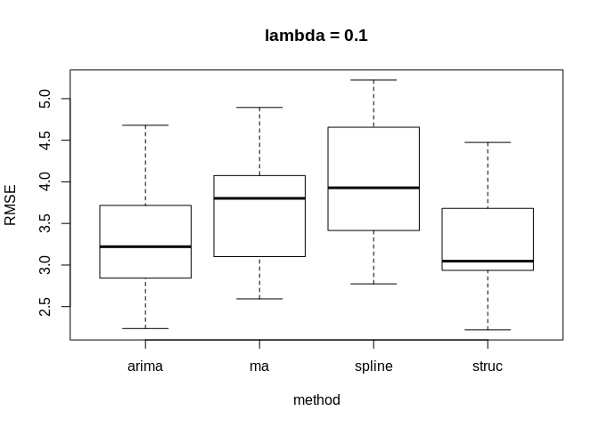

KE5105 - Building Electrical Consumption Forecasting
================

Extract, Transform and Load Data 7 - Data Imputation
====================================================

Summary of Findings
===================

-   Data imputation was performed on the 10 test periods of SDE-3 data with simulated missing completely at random (MCAR) data using :
    -   structural model with Kalman smoothing
    -   arima model with Kalman smoothing
    -   spline interpolation
    -   exponential moving average (k=4)
-   Outliers in the rmse were found in arima for lambda = 0.15
-   1-way anova test found
    -   for lambda = 0.1, no significant differences
    -   lambda = 0.15 show significant differences (arima excluded)
    -   lambda = 0.2, 0.25 show significant differences
-   Multiple pairwise t-tests found the following relationships between rmse:
    -   for lambda = 0.1, no significant differences
    -   for lambda = 0.2,
        -   spline, ma &gt; arima
        -   spline, ma &gt; struc
    -   for lambda = 0.25
        -   spline &gt; ma, arima, struc
        -   ma &gt; arima, struct
    -   for lambda = 0.15,
        -   spline &gt; struc

Load libraries
==============

``` r
library(ggplot2)
library(xts)
```

    ## Loading required package: zoo

    ## 
    ## Attaching package: 'zoo'

    ## The following objects are masked from 'package:base':
    ## 
    ##     as.Date, as.Date.numeric

``` r
library(imputeTS)
```

    ## 
    ## Attaching package: 'imputeTS'

    ## The following object is masked from 'package:zoo':
    ## 
    ##     na.locf

Load data
=========

``` r
# SDE-3 time series data
sde3_agg_df <- read.csv("/home/tkokkeng/Documents/KE5105/ETL/source/test_data/SDE-3.agg.csv", header = TRUE, stringsAsFactors = FALSE)

# A list of 10 time series datasets with simulated missing data
missing_list <- readRDS("sim_missing_data.rds")
```

``` r
length(missing_list)
```

    ## [1] 4

``` r
num_lambdas = length(missing_list)
num_datasets = length(missing_list[[1]])-1  # each list has lambda, missing1, ..., missing<n>

results = vector('list', num_lambdas * num_datasets) 
idx = 1
for (i in missing_list) {

  for (j in 1:num_datasets) {
  # test data
  data_with_na = i[[j+1]]$data
  data_true = sde3_agg_df[i[[j+1]]$row:(i[[j+1]]$row+i[[j+1]]$size-1), ]$PWM_30min_avg
  na_true = data_true[i[[j+1]]$na.ind]
  
  # Impute the missing values using structural model and Kalman smoothing
  imp_struct <- na.kalman(data_with_na)
  # Impute the missing values using ARIMA model and Kalman smoothing
  imp_arima <- na.kalman(data_with_na, model = "auto.arima")
  # Impute the missing values using spline interpolation
  imp_spline <- na.interpolation(data_with_na, option = "spline")
  # Impute the missing values using moving average
  imp_ma <- na.ma(data_with_na, k=4, weighting="exponential")  

  # Extract all the imputed na values
  na_imp_struct = imp_struct[i[[j+1]]$na.ind]
  na_imp_arima = imp_arima[i[[j+1]]$na.ind]
  na_imp_spline = imp_spline[i[[j+1]]$na.ind]
  na_imp_ma = imp_ma[i[[j+1]]$na.ind]
  
  # compute rmse
  rmse_struct = sqrt(mean((na_imp_struct - na_true)^2))
  rmse_arima = sqrt(mean((na_imp_arima - na_true)^2))
  rmse_spline = sqrt(mean((na_imp_spline - na_true)^2))
  rmse_ma = sqrt(mean((na_imp_ma - na_true)^2))
  
  #Update results
  results[[idx]] <- c(i$lambda, rmse_struct, rmse_arima, rmse_spline, rmse_ma)
  idx = idx + 1
  }
}  
```

``` r
results_df = as.data.frame(matrix(unlist(results), nrow = length(results), byrow = TRUE))
colnames(results_df) = c("lambda", "struc", "arima", "spline", "ma")
results_df
```

    ##    lambda    struc     arima   spline       ma
    ## 1    0.10 2.829634  2.807443 3.647474 3.192145
    ## 2    0.10 4.474042  4.679860 5.223742 4.893618
    ## 3    0.10 3.136898  3.531514 4.656248 3.014178
    ## 4    0.10 2.956751  2.954589 3.390722 3.903035
    ## 5    0.10 2.220438  2.236724 2.773730 2.593564
    ## 6    0.10 3.942342  3.878983 5.128324 4.075319
    ## 7    0.10 2.936134  2.842566 3.414948 3.999456
    ## 8    0.10 3.448676  3.487260 4.340201 3.700475
    ## 9    0.10 2.945728  2.894839 3.747521 3.100925
    ## 10   0.10 3.680849  3.716572 4.109754 4.090916
    ## 11   0.15 3.040418  3.112611 4.112953 3.397104
    ## 12   0.15 3.766112  3.634156 4.663877 4.170725
    ## 13   0.15 3.344001  3.254587 4.240711 3.493036
    ## 14   0.15 2.483233  2.425690 3.057363 3.190795
    ## 15   0.15 3.296549  3.266979 3.796904 4.371212
    ## 16   0.15 3.867985 33.621508 4.577163 4.156437
    ## 17   0.15 3.649309  3.642650 4.720808 4.445007
    ## 18   0.15 3.975018  4.058506 4.978139 4.319674
    ## 19   0.15 2.951397  2.944896 3.863145 3.249737
    ## 20   0.15 3.465995 18.394419 4.168654 3.912659
    ## 21   0.20 3.189121  3.218788 4.471741 3.728700
    ## 22   0.20 3.792043  3.693502 4.946259 4.618961
    ## 23   0.20 3.535940  3.638705 4.269797 4.225118
    ## 24   0.20 3.177971  3.193524 3.762257 3.769694
    ## 25   0.20 3.330130  3.352627 3.456824 4.346630
    ## 26   0.20 3.652053  3.737481 4.526180 3.948569
    ## 27   0.20 3.277709  3.222104 4.056095 4.087009
    ## 28   0.20 3.286164  3.276634 4.071703 3.732950
    ## 29   0.20 2.790145  2.863483 3.796843 3.060801
    ## 30   0.20 3.021429  3.061850 3.925037 3.328013
    ## 31   0.25 3.491700  3.455633 4.111817 3.718919
    ## 32   0.25 3.488129  3.565606 4.368962 4.132279
    ## 33   0.25 3.247407  3.050156 4.695428 3.676816
    ## 34   0.25 2.932117  2.928080 3.366188 3.618316
    ## 35   0.25 3.151198  3.128718 3.758259 3.779162
    ## 36   0.25 3.509397  3.603550 4.508359 3.796723
    ## 37   0.25 3.171379  3.111143 3.774413 3.858581
    ## 38   0.25 3.610681  3.571287 4.669490 3.847470
    ## 39   0.25 2.845315  2.787567 4.020866 2.957143
    ## 40   0.25 3.364302  3.384157 4.562236 3.748905

``` r
colMeans(results_df)
```

    ##   lambda    struc    arima   spline       ma 
    ## 0.175000 3.306896 4.430774 4.143278 3.781269

``` r
# same as apply(results_df, 2, mean)
```

``` r
apply(results_df, 2, sd)
```

    ##     lambda      struc      arima     spline         ma 
    ## 0.05661385 0.42777086 5.31982575 0.56049231 0.49283595

``` r
aggregate(results_df[, 2:5], list(lambda = results_df$lambda), mean)
```

    ##   lambda    struc    arima   spline       ma
    ## 1   0.10 3.257149 3.303035 4.043266 3.656363
    ## 2   0.15 3.384002 7.835600 4.217972 3.870639
    ## 3   0.20 3.305270 3.325870 4.128274 3.884644
    ## 4   0.25 3.281162 3.258590 4.183602 3.713431

``` r
aggregate(results_df[, 2:5], list(lambda = results_df$lambda), sd)
```

    ##   lambda     struc      arima    spline        ma
    ## 1   0.10 0.6436695  0.6965963 0.7969142 0.6783656
    ## 2   0.15 0.4633798 10.2374683 0.5600336 0.4910453
    ## 3   0.20 0.2958552  0.2845738 0.4358648 0.4669894
    ## 4   0.25 0.2574719  0.2941617 0.4508506 0.2998843

There are **outliers** in the RMSE for ARIMA imputation for test samples \#6 and \#10.

Check the outliers in the ARIMA imputation.
-------------------------------------------

``` r
num_lambdas = 1
num_datasets = 2

results = vector('list', num_lambdas * num_datasets) 
idx = 1
  #for (j in 1:num_datasets) {
  for (j in list(7, 11, 5)) {
  # test data
  data_with_na = missing_list[[2]][[j]]$data
  data_true = sde3_agg_df[missing_list[[2]][[j]]$row:(missing_list[[2]][[j]]$row+missing_list[[2]][[j]]$size-1), ]$PWM_30min_avg
  na_true = data_true[missing_list[[2]][[j]]$na.ind]
  
  # Impute the missing values using ARIMA model and Kalman smoothing
  imp_arima <- na.kalman(data_with_na, model = "auto.arima")

  # Extract all the imputed na values
  na_imp_arima = imp_arima[missing_list[[2]][[j]]$na.ind]

  # compute rmse
  rmse_arima = sqrt(mean((na_imp_arima - na_true)^2))

  #Update results
  results[[idx]] <- c(lambda=missing_list[[2]]$lambda, rmse=rmse_arima, imp=list(imp_arima), data.withNA=list(data_with_na))
  idx = idx + 1
}  
```

``` r
plotNA.imputations(x.withNA = results[[1]]$data.withNA,
                   x.withImputations = results[[1]]$imp,
                   main = "Imputated Values with High RMSE Using ARIMA Model with Kalman Smoothing",
                   ylim = c(-10, 150), cex = .1)
```


``` r
plotNA.imputations(x.withNA = results[[2]]$data.withNA,
                   x.withImputations = results[[2]]$imp,
                   main = "Poorly Imputated Values with High RMSE Using ARIMA Model with Kalman Smoothing",
                   ylim = c(-10, 100), cex = .1)
```


``` r
plotNA.imputations(x.withNA = results[[3]]$data.withNA,
                   x.withImputations = results[[3]]$imp,
                   main = "Imputated Values with Low RMSE Using ARIMA Model with Kalman Smoothing",
                   ylim = c(30, 150), cex = .1)
```


Check for significance in the difference in the means of the RMSE.
------------------------------------------------------------------

### One-way ANOVA

#### Determine whether the means from the 4 imputation methods are equal.

``` r
results_long_df <- reshape(results_df, varying = c('struc', 'arima', 'spline', 'ma'),
                           timevar = "method", v.names='RMSE',
                           times=c('struc', 'arima', 'spline', 'ma'), direction="long")
results_long_df$method <- as.factor(results_long_df$method)
head(results_long_df)
```

    ##         lambda method     RMSE id
    ## 1.struc    0.1  struc 2.829634  1
    ## 2.struc    0.1  struc 4.474042  2
    ## 3.struc    0.1  struc 3.136898  3
    ## 4.struc    0.1  struc 2.956751  4
    ## 5.struc    0.1  struc 2.220438  5
    ## 6.struc    0.1  struc 3.942342  6

``` r
for (i in list(.1, .15, .2, .25)) {
  plot(RMSE ~ method, data = results_long_df[results_long_df$lambda == i, ], main = paste("lambda =", toString(i)))
}
```



``` r
for (i in list(.1, .2, .25)) {
  cat("lambda = ", i, "\n")
  res = aov(RMSE ~ method, data = results_long_df[results_long_df$lambda == i, ])
  print(summary(res))
  cat("--------------------------------------------------------------------------------------------------------------\n")
}
```

    ## lambda =  0.1 
    ##             Df Sum Sq Mean Sq F value Pr(>F)  
    ## method       3  4.005  1.3349   2.677 0.0616 .
    ## Residuals   36 17.953  0.4987                 
    ## ---
    ## Signif. codes:  0 '***' 0.001 '**' 0.01 '*' 0.05 '.' 0.1 ' ' 1
    ## --------------------------------------------------------------------------------------------------------------
    ## lambda =  0.2 
    ##             Df Sum Sq Mean Sq F value   Pr(>F)    
    ## method       3  5.072  1.6907   11.73 1.65e-05 ***
    ## Residuals   36  5.189  0.1441                     
    ## ---
    ## Signif. codes:  0 '***' 0.001 '**' 0.01 '*' 0.05 '.' 0.1 ' ' 1
    ## --------------------------------------------------------------------------------------------------------------
    ## lambda =  0.25 
    ##             Df Sum Sq Mean Sq F value   Pr(>F)    
    ## method       3  5.713  1.9045   17.08 4.59e-07 ***
    ## Residuals   36  4.014  0.1115                     
    ## ---
    ## Signif. codes:  0 '***' 0.001 '**' 0.01 '*' 0.05 '.' 0.1 ' ' 1
    ## --------------------------------------------------------------------------------------------------------------

For lambda = .1, the anova test found **insufficient evidence** to show that the differences are significant. for lambda = .2, .25, the anova tests show **significant** differences.

For lambda = .15, exclude arima from the anova tests because it has outliers in the rmse.

``` r
res = aov(RMSE ~ method, data = results_long_df[(results_long_df$lambda == .15) & (results_long_df$method != 'arima') , ])
print(summary(res))
```

    ##             Df Sum Sq Mean Sq F value  Pr(>F)   
    ## method       2  3.510  1.7549   6.842 0.00395 **
    ## Residuals   27  6.925  0.2565                   
    ## ---
    ## Signif. codes:  0 '***' 0.001 '**' 0.01 '*' 0.05 '.' 0.1 ' ' 1

The anova test for lambda = .15 show **significant** differences between struc, spline and ma.

### Pairwise t-test for lambda .1, .2, .25 (exclude .15 due to outliers in ARIMA)

Pairwise multiple comparisons tests involve the computation of a p-value for each pair of the compared group. The p-value represents the risk of stating that an effect is statistically significant while this is not true. As the number of pairwise comparisons increases, and therefore the number of p-values, it becomes more likely to detect significant effects which are due to chance in reality.

To deal with this problem, multiple pairwise comparisons tests involve p-value corrections: p-values are penalized (= their value is increased) as the number of comparisons increase.

#### Results Summary

for lambda = 0.1, no significant differences. for lambda = 0.2, spline &gt; arima, ma &gt; arima, ma &gt; struc, spline &gt; struc for lambda = 0.25, spline &gt; ma, spline &gt; arima, ma &gt; arima, ma &gt; struc, spline &gt; struc

for lambda = .15, spline &gt; struc (arima excluded from test)

``` r
for (i in list(.1, .2, .25)) {
  cat("lambda = ", i, "\n")
  print(pairwise.t.test(results_long_df[results_long_df$lambda == i,]$RMSE,
                        results_long_df[results_long_df$lambda == i,]$method,
                        p.adjust = "bonferroni"))
  cat("--------------------------------------------------------------------------------------------------------------\n")
}
```

    ## lambda =  0.1 
    ## 
    ##  Pairwise comparisons using t tests with pooled SD 
    ## 
    ## data:  results_long_df[results_long_df$lambda == i, ]$RMSE and results_long_df[results_long_df$lambda == i, ]$method 
    ## 
    ##        arima ma   spline
    ## ma     1.00  -    -     
    ## spline 0.15  1.00 -     
    ## struc  1.00  1.00 0.11  
    ## 
    ## P value adjustment method: bonferroni 
    ## --------------------------------------------------------------------------------------------------------------
    ## lambda =  0.2 
    ## 
    ##  Pairwise comparisons using t tests with pooled SD 
    ## 
    ## data:  results_long_df[results_long_df$lambda == i, ]$RMSE and results_long_df[results_long_df$lambda == i, ]$method 
    ## 
    ##        arima   ma      spline 
    ## ma     0.01345 -       -      
    ## spline 0.00021 0.95970 -      
    ## struc  1.00000 0.00964 0.00014
    ## 
    ## P value adjustment method: bonferroni 
    ## --------------------------------------------------------------------------------------------------------------
    ## lambda =  0.25 
    ## 
    ##  Pairwise comparisons using t tests with pooled SD 
    ## 
    ## data:  results_long_df[results_long_df$lambda == i, ]$RMSE and results_long_df[results_long_df$lambda == i, ]$method 
    ## 
    ##        arima   ma    spline 
    ## ma     0.026   -     -      
    ## spline 2.3e-06 0.020 -      
    ## struc  1.000   0.038 3.7e-06
    ## 
    ## P value adjustment method: bonferroni 
    ## --------------------------------------------------------------------------------------------------------------

for lambda = .15, exclude arima from test

``` r
print(pairwise.t.test(results_long_df[(results_long_df$lambda == .15) & (results_long_df$method != "arima"),]$RMSE,
                      results_long_df[(results_long_df$lambda == .15) & (results_long_df$method != "arima"),]$method,
                      p.adjust = "bonferroni"))
```

    ## 
    ##  Pairwise comparisons using t tests with pooled SD 
    ## 
    ## data:  results_long_df[(results_long_df$lambda == 0.15) & (results_long_df$method !=  and results_long_df[(results_long_df$lambda == 0.15) & (results_long_df$method !=      "arima"), ]$RMSE and     "arima"), ]$method 
    ## 
    ##        ma     spline
    ## spline 0.4103 -     
    ## struc  0.1224 0.0031
    ## 
    ## P value adjustment method: bonferroni
