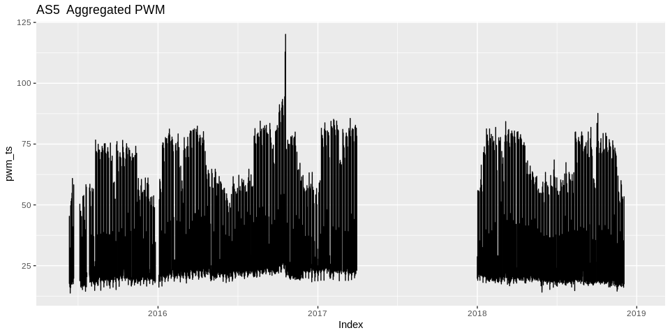
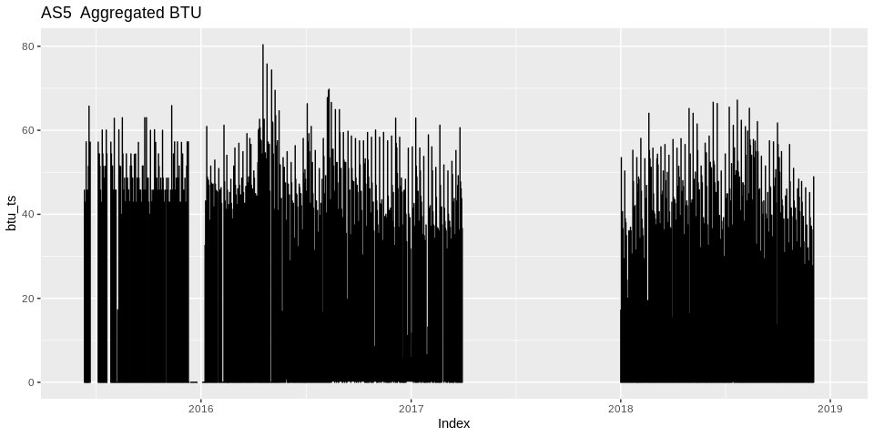
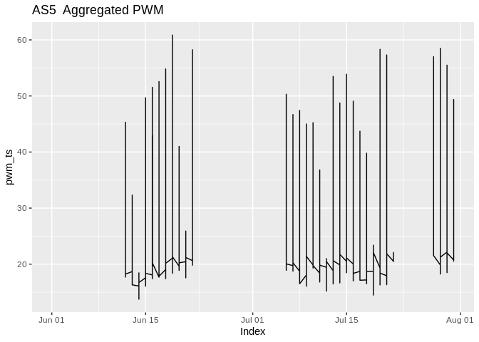
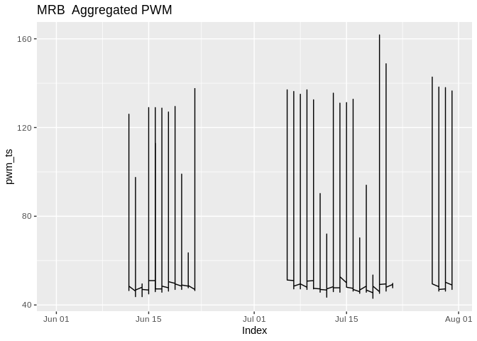
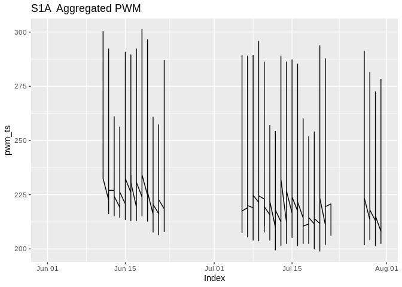
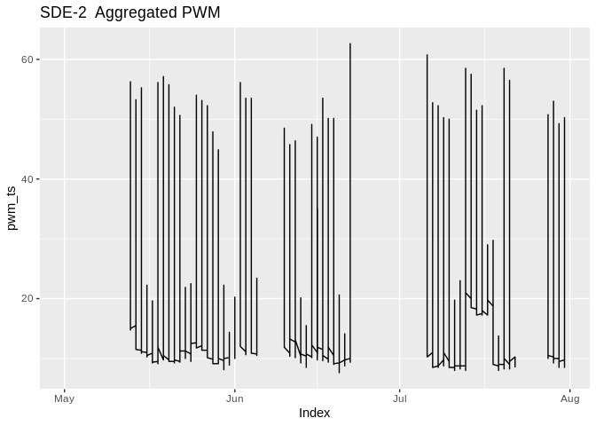

KE5105 - Building Electrical Consumption Forecasting
================

Extract, Transform and Load Data 10 - Data Imputation
=====================================================

Summary of Findings
===================

-   Create the following datasets for 4 selected buildings - AS5, MRB, S1A, SDE-2 - which have higher quality data among the 10 group 1 buildings (see jupyter notebook etl9.explore\_btu.ipynb for details) :
    -   training dataset with imputation of PWM and BTU data using structural model and Kalman smoothing (data from start date to 31/3/17, ~22 mths)
    -   validation / test dataset with imputation (1/1/18 to 30/11/18, 11 mth)

Load libraries
==============

``` r
library(ggplot2)
library(xts)
```

    ## Loading required package: zoo

    ## 
    ## Attaching package: 'zoo'

    ## The following objects are masked from 'package:base':
    ## 
    ##     as.Date, as.Date.numeric

``` r
library(imputeTS)
```

    ## 
    ## Attaching package: 'imputeTS'

    ## The following object is masked from 'package:zoo':
    ## 
    ##     na.locf

``` r
library(MissMech)

source("/home/tkokkeng/Documents/KE5105/ETL/source/R/ETL.utils.R")
```

Load data for 1 building
========================

``` r
bldg <- "AS5"
agg_df <- read.csv(paste("/home/tkokkeng/Documents/KE5105/ETL/source/processed_bldg_data/", bldg, ".csv", sep = ""),
                   header = TRUE, stringsAsFactors = FALSE)
head(agg_df)
```

Convert the Pt\_timeStamp strings to POSIX time
-----------------------------------------------

``` r
agg_df$Pt_timeStamp <- strptime(agg_df$Pt_timeStamp, format = "%Y-%m-%d %H:%M:%S", tz="GMT")
head(agg_df)
```

Plot the time series data
-------------------------

``` r
pwm_ts <- xts(agg_df$PWM_30min_avg, as.Date(agg_df$Pt_timeStamp))
autoplot(pwm_ts, ylab = "Aggregated PWM", xlab = "Time") + ggtitle(paste(bldg, " Aggregated PWM"))
```

    ## Warning: Removed 1907 rows containing missing values (geom_path).



``` r
btu_ts <- xts(agg_df$BTU_30min_avg, as.Date(agg_df$Pt_timeStamp))
autoplot(btu_ts, ylab = "Aggregated BTU", xlab = "Time") + ggtitle(paste(bldg, " Aggregated BTU"))
```

    ## Warning: Removed 1906 rows containing missing values (geom_path).



Get the boundary dates. Training data period from around May 15 to Apr 17, validation and test data period in 2018.
-------------------------------------------------------------------------------------------------------------------

``` r
min(agg_df[!is.na(agg_df$PWM_30min_avg), "Pt_timeStamp"])
```

    ## [1] "2015-06-12 08:00:00 GMT"

``` r
min(agg_df[is.na(agg_df$PWM_30min_avg) & (agg_df$Pt_timeStamp > as.POSIXct("2017-03-01 00:00:00", tz = "GMT")), "Pt_timeStamp"])
```

    ## [1] "2017-03-31 23:30:00 GMT"

``` r
min(agg_df[!is.na(agg_df$PWM_30min_avg) & (agg_df$Pt_timeStamp > as.POSIXct("2017-12-01 00:00:00", tz = "GMT")), "Pt_timeStamp"])
```

    ## [1] "2018-01-01 00:30:00 GMT"

``` r
min(agg_df[is.na(agg_df$PWM_30min_avg) & (agg_df$Pt_timeStamp > as.POSIXct("2018-11-01 00:00:00", tz = "GMT")), "Pt_timeStamp"])
```

    ## [1] "2018-11-30 23:30:00 GMT"

Check the PWM missing data for the training period.
---------------------------------------------------

``` r
statsNA(agg_df[(agg_df$Pt_timeStamp > as.POSIXct("2015-05-31 23:30:00", tz = "GMT")) &
                 (agg_df$Pt_timeStamp < as.POSIXct("2017-04-01 00:00:00", tz = "GMT")),
               "PWM_30min_avg"], bins = 22)
```

    ## [1] "Length of time series:"
    ## [1] 32160
    ## [1] "-------------------------"
    ## [1] "Number of Missing Values:"
    ## [1] 2175
    ## [1] "-------------------------"
    ## [1] "Percentage of Missing Values:"
    ## [1] "6.76%"
    ## [1] "-------------------------"
    ## [1] "Stats for Bins"
    ## [1] "  Bin 1 (1462 values from 1 to 1462) :      982 NAs (67.2%)"
    ## [1] "  Bin 2 (1462 values from 1463 to 2924) :      527 NAs (36%)"
    ## [1] "  Bin 3 (1462 values from 2925 to 4386) :      2 NAs (0.137%)"
    ## [1] "  Bin 4 (1462 values from 4387 to 5848) :      2 NAs (0.137%)"
    ## [1] "  Bin 5 (1462 values from 5849 to 7310) :      2 NAs (0.137%)"
    ## [1] "  Bin 6 (1462 values from 7311 to 8772) :      5 NAs (0.342%)"
    ## [1] "  Bin 7 (1462 values from 8773 to 10234) :      298 NAs (20.4%)"
    ## [1] "  Bin 8 (1462 values from 10235 to 11696) :      150 NAs (10.3%)"
    ## [1] "  Bin 9 (1462 values from 11697 to 13158) :      21 NAs (1.44%)"
    ## [1] "  Bin 10 (1462 values from 13159 to 14620) :      0 NAs (0%)"
    ## [1] "  Bin 11 (1462 values from 14621 to 16082) :      4 NAs (0.274%)"
    ## [1] "  Bin 12 (1462 values from 16083 to 17544) :      0 NAs (0%)"
    ## [1] "  Bin 13 (1462 values from 17545 to 19006) :      25 NAs (1.71%)"
    ## [1] "  Bin 14 (1462 values from 19007 to 20468) :      2 NAs (0.137%)"
    ## [1] "  Bin 15 (1462 values from 20469 to 21930) :      2 NAs (0.137%)"
    ## [1] "  Bin 16 (1462 values from 21931 to 23392) :      2 NAs (0.137%)"
    ## [1] "  Bin 17 (1462 values from 23393 to 24854) :      2 NAs (0.137%)"
    ## [1] "  Bin 18 (1462 values from 24855 to 26316) :      2 NAs (0.137%)"
    ## [1] "  Bin 19 (1462 values from 26317 to 27778) :      19 NAs (1.3%)"
    ## [1] "  Bin 20 (1462 values from 27779 to 29240) :      2 NAs (0.137%)"
    ## [1] "  Bin 21 (1462 values from 29241 to 30702) :      125 NAs (8.55%)"
    ## [1] "  Bin 22 (1458 values from 30703 to 32160) :      1 NAs (0.0686%)"
    ## [1] "-------------------------"
    ## [1] "Longest NA gap (series of consecutive NAs)"
    ## [1] "660 in a row"
    ## [1] "-------------------------"
    ## [1] "Most frequent gap size (series of consecutive NA series)"
    ## [1] "2 NA in a row (occuring 19 times)"
    ## [1] "-------------------------"
    ## [1] "Gap size accounting for most NAs"
    ## [1] "660 NA in a row (occuring 1 times, making up for overall 660 NAs)"
    ## [1] "-------------------------"
    ## [1] "Overview NA series"
    ## [1] "  1 NA in a row: 1 times"
    ## [1] "  2 NA in a row: 19 times"
    ## [1] "  3 NA in a row: 1 times"
    ## [1] "  4 NA in a row: 1 times"
    ## [1] "  6 NA in a row: 2 times"
    ## [1] "  9 NA in a row: 3 times"
    ## [1] "  23 NA in a row: 1 times"
    ## [1] "  77 NA in a row: 1 times"
    ## [1] "  121 NA in a row: 1 times"
    ## [1] "  296 NA in a row: 1 times"
    ## [1] "  369 NA in a row: 1 times"
    ## [1] "  544 NA in a row: 1 times"
    ## [1] "  660 NA in a row: 1 times"

Load data for 4 selected buildings
==================================

``` r
bldgs <-c("AS5", "MRB", "S1A", "SDE-2")
agg_df <- vector("list", length(bldgs))
for (i in 1:length(bldgs)) {
  agg_df[[i]] <- read.csv(paste("/home/tkokkeng/Documents/KE5105/ETL/source/processed_bldg_data/", bldgs[i], ".csv", sep = ""),
                        header = TRUE, stringsAsFactors = FALSE)
  agg_df[[i]]$Pt_timeStamp <- strptime(agg_df[[i]]$Pt_timeStamp, format = "%Y-%m-%d %H:%M:%S", tz="GMT")
}
```

Check the 1st date data is available.
-------------------------------------

``` r
mindate_with_data <- vector("list", 4)
for (i in 1:length(bldgs)) {
  mindate_with_data[[i]] <-  min(agg_df[[i]][!is.na(agg_df[[i]]$PWM_30min_avg), "Pt_timeStamp"])
  print(paste(bldgs[i], "1st data is from ", mindate_with_data[[i]], "\n"))
}
```

    ## [1] "AS5 1st data is from  2015-06-12 08:00:00 \n"
    ## [1] "MRB 1st data is from  2015-06-12 07:30:00 \n"
    ## [1] "S1A 1st data is from  2015-06-11 13:30:00 \n"
    ## [1] "SDE-2 1st data is from  2015-05-13 14:30:00 \n"

``` r
for (i in 1:length(bldgs)) {
  cat(i, bldgs[i], "\n")
  pwm_ts <- xts(agg_df[[i]][agg_df[[i]]$Pt_timeStamp < as.POSIXct("2015-08-01 00:00:00", tz = "GMT"), "PWM_30min_avg"],
                as.Date(agg_df[[i]][agg_df[[i]]$Pt_timeStamp < as.POSIXct("2015-08-01 00:00:00", tz = "GMT"), "Pt_timeStamp"]))
  print(autoplot(pwm_ts, ylab = "Aggregated PWM", xlab = "Time") + ggtitle(paste(bldgs[i], " Aggregated PWM")))
}
```

    ## 1 AS5

    ## Warning: Removed 545 rows containing missing values (geom_path).



    ## 2 MRB

    ## Warning: Removed 544 rows containing missing values (geom_path).



    ## 3 S1A

    ## Warning: Removed 509 rows containing missing values (geom_path).



    ## 4 SDE-2

    ## Warning: Removed 607 rows containing missing values (geom_path).



Check the PWM missing data for the training period.
---------------------------------------------------

``` r
for (i in 1:length(bldgs)) {
  print(paste(bldgs[i], "data from date", mindate_with_data[[i]]))
  statsNA(agg_df[[i]][(agg_df[[i]]$Pt_timeStamp >= as.POSIXct(mindate_with_data[[i]], tz = "GMT")) &
                        (agg_df[[i]]$Pt_timeStamp < as.POSIXct("2017-04-01 00:00:00", tz = "GMT")),
                      "PWM_30min_avg"], bins = 22)
  cat("\n")
}
```

    ## [1] "AS5 data from date 2015-06-12 08:00:00"
    ## [1] "Length of time series:"
    ## [1] 31616
    ## [1] "-------------------------"
    ## [1] "Number of Missing Values:"
    ## [1] 1631
    ## [1] "-------------------------"
    ## [1] "Percentage of Missing Values:"
    ## [1] "5.16%"
    ## [1] "-------------------------"
    ## [1] "Stats for Bins"
    ## [1] "  Bin 1 (1438 values from 1 to 1438) :      669 NAs (46.5%)"
    ## [1] "  Bin 2 (1438 values from 1439 to 2876) :      298 NAs (20.7%)"
    ## [1] "  Bin 3 (1438 values from 2877 to 4314) :      2 NAs (0.139%)"
    ## [1] "  Bin 4 (1438 values from 4315 to 5752) :      2 NAs (0.139%)"
    ## [1] "  Bin 5 (1438 values from 5753 to 7190) :      5 NAs (0.348%)"
    ## [1] "  Bin 6 (1438 values from 7191 to 8628) :      2 NAs (0.139%)"
    ## [1] "  Bin 7 (1438 values from 8629 to 10066) :      446 NAs (31%)"
    ## [1] "  Bin 8 (1438 values from 10067 to 11504) :      2 NAs (0.139%)"
    ## [1] "  Bin 9 (1438 values from 11505 to 12942) :      19 NAs (1.32%)"
    ## [1] "  Bin 10 (1438 values from 12943 to 14380) :      2 NAs (0.139%)"
    ## [1] "  Bin 11 (1438 values from 14381 to 15818) :      2 NAs (0.139%)"
    ## [1] "  Bin 12 (1438 values from 15819 to 17256) :      2 NAs (0.139%)"
    ## [1] "  Bin 13 (1438 values from 17257 to 18694) :      25 NAs (1.74%)"
    ## [1] "  Bin 14 (1438 values from 18695 to 20132) :      2 NAs (0.139%)"
    ## [1] "  Bin 15 (1438 values from 20133 to 21570) :      2 NAs (0.139%)"
    ## [1] "  Bin 16 (1438 values from 21571 to 23008) :      2 NAs (0.139%)"
    ## [1] "  Bin 17 (1438 values from 23009 to 24446) :      2 NAs (0.139%)"
    ## [1] "  Bin 18 (1438 values from 24447 to 25884) :      4 NAs (0.278%)"
    ## [1] "  Bin 19 (1438 values from 25885 to 27322) :      17 NAs (1.18%)"
    ## [1] "  Bin 20 (1438 values from 27323 to 28760) :      0 NAs (0%)"
    ## [1] "  Bin 21 (1438 values from 28761 to 30198) :      125 NAs (8.69%)"
    ## [1] "  Bin 22 (1418 values from 30199 to 31616) :      1 NAs (0.0705%)"
    ## [1] "-------------------------"
    ## [1] "Longest NA gap (series of consecutive NAs)"
    ## [1] "660 in a row"
    ## [1] "-------------------------"
    ## [1] "Most frequent gap size (series of consecutive NA series)"
    ## [1] "2 NA in a row (occuring 19 times)"
    ## [1] "-------------------------"
    ## [1] "Gap size accounting for most NAs"
    ## [1] "660 NA in a row (occuring 1 times, making up for overall 660 NAs)"
    ## [1] "-------------------------"
    ## [1] "Overview NA series"
    ## [1] "  1 NA in a row: 1 times"
    ## [1] "  2 NA in a row: 19 times"
    ## [1] "  3 NA in a row: 1 times"
    ## [1] "  4 NA in a row: 1 times"
    ## [1] "  6 NA in a row: 2 times"
    ## [1] "  9 NA in a row: 3 times"
    ## [1] "  23 NA in a row: 1 times"
    ## [1] "  77 NA in a row: 1 times"
    ## [1] "  121 NA in a row: 1 times"
    ## [1] "  296 NA in a row: 1 times"
    ## [1] "  369 NA in a row: 1 times"
    ## [1] "  660 NA in a row: 1 times"
    ## 
    ## [1] "MRB data from date 2015-06-12 07:30:00"
    ## [1] "Length of time series:"
    ## [1] 31617
    ## [1] "-------------------------"
    ## [1] "Number of Missing Values:"
    ## [1] 1799
    ## [1] "-------------------------"
    ## [1] "Percentage of Missing Values:"
    ## [1] "5.69%"
    ## [1] "-------------------------"
    ## [1] "Stats for Bins"
    ## [1] "  Bin 1 (1438 values from 1 to 1438) :      669 NAs (46.5%)"
    ## [1] "  Bin 2 (1438 values from 1439 to 2876) :      298 NAs (20.7%)"
    ## [1] "  Bin 3 (1438 values from 2877 to 4314) :      2 NAs (0.139%)"
    ## [1] "  Bin 4 (1438 values from 4315 to 5752) :      2 NAs (0.139%)"
    ## [1] "  Bin 5 (1438 values from 5753 to 7190) :      2 NAs (0.139%)"
    ## [1] "  Bin 6 (1438 values from 7191 to 8628) :      2 NAs (0.139%)"
    ## [1] "  Bin 7 (1438 values from 8629 to 10066) :      446 NAs (31%)"
    ## [1] "  Bin 8 (1438 values from 10067 to 11504) :      2 NAs (0.139%)"
    ## [1] "  Bin 9 (1438 values from 11505 to 12942) :      10 NAs (0.695%)"
    ## [1] "  Bin 10 (1438 values from 12943 to 14380) :      2 NAs (0.139%)"
    ## [1] "  Bin 11 (1438 values from 14381 to 15818) :      2 NAs (0.139%)"
    ## [1] "  Bin 12 (1438 values from 15819 to 17256) :      2 NAs (0.139%)"
    ## [1] "  Bin 13 (1438 values from 17257 to 18694) :      25 NAs (1.74%)"
    ## [1] "  Bin 14 (1438 values from 18695 to 20132) :      2 NAs (0.139%)"
    ## [1] "  Bin 15 (1438 values from 20133 to 21570) :      2 NAs (0.139%)"
    ## [1] "  Bin 16 (1438 values from 21571 to 23008) :      2 NAs (0.139%)"
    ## [1] "  Bin 17 (1438 values from 23009 to 24446) :      4 NAs (0.278%)"
    ## [1] "  Bin 18 (1438 values from 24447 to 25884) :      191 NAs (13.3%)"
    ## [1] "  Bin 19 (1438 values from 25885 to 27322) :      8 NAs (0.556%)"
    ## [1] "  Bin 20 (1438 values from 27323 to 28760) :      0 NAs (0%)"
    ## [1] "  Bin 21 (1438 values from 28761 to 30198) :      125 NAs (8.69%)"
    ## [1] "  Bin 22 (1419 values from 30199 to 31617) :      1 NAs (0.0705%)"
    ## [1] "-------------------------"
    ## [1] "Longest NA gap (series of consecutive NAs)"
    ## [1] "660 in a row"
    ## [1] "-------------------------"
    ## [1] "Most frequent gap size (series of consecutive NA series)"
    ## [1] "2 NA in a row (occuring 21 times)"
    ## [1] "-------------------------"
    ## [1] "Gap size accounting for most NAs"
    ## [1] "660 NA in a row (occuring 1 times, making up for overall 660 NAs)"
    ## [1] "-------------------------"
    ## [1] "Overview NA series"
    ## [1] "  1 NA in a row: 1 times"
    ## [1] "  2 NA in a row: 21 times"
    ## [1] "  6 NA in a row: 3 times"
    ## [1] "  9 NA in a row: 1 times"
    ## [1] "  23 NA in a row: 1 times"
    ## [1] "  41 NA in a row: 1 times"
    ## [1] "  77 NA in a row: 1 times"
    ## [1] "  121 NA in a row: 1 times"
    ## [1] "  142 NA in a row: 1 times"
    ## [1] "  296 NA in a row: 1 times"
    ## [1] "  369 NA in a row: 1 times"
    ## [1] "  660 NA in a row: 1 times"
    ## 
    ## [1] "S1A data from date 2015-06-11 13:30:00"
    ## [1] "Length of time series:"
    ## [1] 31653
    ## [1] "-------------------------"
    ## [1] "Number of Missing Values:"
    ## [1] 3089
    ## [1] "-------------------------"
    ## [1] "Percentage of Missing Values:"
    ## [1] "9.76%"
    ## [1] "-------------------------"
    ## [1] "Stats for Bins"
    ## [1] "  Bin 1 (1439 values from 1 to 1439) :      672 NAs (46.7%)"
    ## [1] "  Bin 2 (1439 values from 1440 to 2878) :      311 NAs (21.6%)"
    ## [1] "  Bin 3 (1439 values from 2879 to 4317) :      17 NAs (1.18%)"
    ## [1] "  Bin 4 (1439 values from 4318 to 5756) :      7 NAs (0.486%)"
    ## [1] "  Bin 5 (1439 values from 5757 to 7195) :      17 NAs (1.18%)"
    ## [1] "  Bin 6 (1439 values from 7196 to 8634) :      11 NAs (0.764%)"
    ## [1] "  Bin 7 (1439 values from 8635 to 10073) :      450 NAs (31.3%)"
    ## [1] "  Bin 8 (1439 values from 10074 to 11512) :      7 NAs (0.486%)"
    ## [1] "  Bin 9 (1439 values from 11513 to 12951) :      11 NAs (0.764%)"
    ## [1] "  Bin 10 (1439 values from 12952 to 14390) :      45 NAs (3.13%)"
    ## [1] "  Bin 11 (1439 values from 14391 to 15829) :      6 NAs (0.417%)"
    ## [1] "  Bin 12 (1439 values from 15830 to 17268) :      419 NAs (29.1%)"
    ## [1] "  Bin 13 (1439 values from 17269 to 18707) :      280 NAs (19.5%)"
    ## [1] "  Bin 14 (1439 values from 18708 to 20146) :      471 NAs (32.7%)"
    ## [1] "  Bin 15 (1439 values from 20147 to 21585) :      11 NAs (0.764%)"
    ## [1] "  Bin 16 (1439 values from 21586 to 23024) :      82 NAs (5.7%)"
    ## [1] "  Bin 17 (1439 values from 23025 to 24463) :      5 NAs (0.347%)"
    ## [1] "  Bin 18 (1439 values from 24464 to 25902) :      7 NAs (0.486%)"
    ## [1] "  Bin 19 (1439 values from 25903 to 27341) :      12 NAs (0.834%)"
    ## [1] "  Bin 20 (1439 values from 27342 to 28780) :      102 NAs (7.09%)"
    ## [1] "  Bin 21 (1439 values from 28781 to 30219) :      140 NAs (9.73%)"
    ## [1] "  Bin 22 (1434 values from 30220 to 31653) :      6 NAs (0.418%)"
    ## [1] "-------------------------"
    ## [1] "Longest NA gap (series of consecutive NAs)"
    ## [1] "673 in a row"
    ## [1] "-------------------------"
    ## [1] "Most frequent gap size (series of consecutive NA series)"
    ## [1] "2 NA in a row (occuring 39 times)"
    ## [1] "-------------------------"
    ## [1] "Gap size accounting for most NAs"
    ## [1] "673 NA in a row (occuring 1 times, making up for overall 673 NAs)"
    ## [1] "-------------------------"
    ## [1] "Overview NA series"
    ## [1] "  2 NA in a row: 39 times"
    ## [1] "  3 NA in a row: 28 times"
    ## [1] "  6 NA in a row: 1 times"
    ## [1] "  7 NA in a row: 1 times"
    ## [1] "  8 NA in a row: 1 times"
    ## [1] "  9 NA in a row: 1 times"
    ## [1] "  23 NA in a row: 1 times"
    ## [1] "  29 NA in a row: 1 times"
    ## [1] "  31 NA in a row: 1 times"
    ## [1] "  77 NA in a row: 1 times"
    ## [1] "  79 NA in a row: 1 times"
    ## [1] "  94 NA in a row: 1 times"
    ## [1] "  130 NA in a row: 1 times"
    ## [1] "  296 NA in a row: 1 times"
    ## [1] "  369 NA in a row: 1 times"
    ## [1] "  436 NA in a row: 1 times"
    ## [1] "  660 NA in a row: 1 times"
    ## [1] "  673 NA in a row: 1 times"
    ## 
    ## [1] "SDE-2 data from date 2015-05-13 14:30:00"
    ## [1] "Length of time series:"
    ## [1] 33043
    ## [1] "-------------------------"
    ## [1] "Number of Missing Values:"
    ## [1] 1947
    ## [1] "-------------------------"
    ## [1] "Percentage of Missing Values:"
    ## [1] "5.89%"
    ## [1] "-------------------------"
    ## [1] "Stats for Bins"
    ## [1] "  Bin 1 (1502 values from 1 to 1502) :      318 NAs (21.2%)"
    ## [1] "  Bin 2 (1502 values from 1503 to 3004) :      667 NAs (44.4%)"
    ## [1] "  Bin 3 (1502 values from 3005 to 4506) :      298 NAs (19.8%)"
    ## [1] "  Bin 4 (1502 values from 4507 to 6008) :      5 NAs (0.333%)"
    ## [1] "  Bin 5 (1502 values from 6009 to 7510) :      3 NAs (0.2%)"
    ## [1] "  Bin 6 (1502 values from 7511 to 9012) :      7 NAs (0.466%)"
    ## [1] "  Bin 7 (1502 values from 9013 to 10514) :      80 NAs (5.33%)"
    ## [1] "  Bin 8 (1502 values from 10515 to 12016) :      368 NAs (24.5%)"
    ## [1] "  Bin 9 (1502 values from 12017 to 13518) :      8 NAs (0.533%)"
    ## [1] "  Bin 10 (1502 values from 13519 to 15020) :      5 NAs (0.333%)"
    ## [1] "  Bin 11 (1502 values from 15021 to 16522) :      3 NAs (0.2%)"
    ## [1] "  Bin 12 (1502 values from 16523 to 18024) :      3 NAs (0.2%)"
    ## [1] "  Bin 13 (1502 values from 18025 to 19526) :      3 NAs (0.2%)"
    ## [1] "  Bin 14 (1502 values from 19527 to 21028) :      25 NAs (1.66%)"
    ## [1] "  Bin 15 (1502 values from 21029 to 22530) :      3 NAs (0.2%)"
    ## [1] "  Bin 16 (1502 values from 22531 to 24032) :      5 NAs (0.333%)"
    ## [1] "  Bin 17 (1502 values from 24033 to 25534) :      3 NAs (0.2%)"
    ## [1] "  Bin 18 (1502 values from 25535 to 27036) :      0 NAs (0%)"
    ## [1] "  Bin 19 (1502 values from 27037 to 28538) :      10 NAs (0.666%)"
    ## [1] "  Bin 20 (1502 values from 28539 to 30040) :      3 NAs (0.2%)"
    ## [1] "  Bin 21 (1502 values from 30041 to 31542) :      125 NAs (8.32%)"
    ## [1] "  Bin 22 (1501 values from 31543 to 33043) :      5 NAs (0.333%)"
    ## [1] "-------------------------"
    ## [1] "Longest NA gap (series of consecutive NAs)"
    ## [1] "659 in a row"
    ## [1] "-------------------------"
    ## [1] "Most frequent gap size (series of consecutive NA series)"
    ## [1] "3 NA in a row (occuring 19 times)"
    ## [1] "-------------------------"
    ## [1] "Gap size accounting for most NAs"
    ## [1] "659 NA in a row (occuring 1 times, making up for overall 659 NAs)"
    ## [1] "-------------------------"
    ## [1] "Overview NA series"
    ## [1] "  2 NA in a row: 4 times"
    ## [1] "  3 NA in a row: 19 times"
    ## [1] "  4 NA in a row: 1 times"
    ## [1] "  5 NA in a row: 1 times"
    ## [1] "  7 NA in a row: 1 times"
    ## [1] "  8 NA in a row: 1 times"
    ## [1] "  22 NA in a row: 1 times"
    ## [1] "  33 NA in a row: 1 times"
    ## [1] "  36 NA in a row: 1 times"
    ## [1] "  77 NA in a row: 1 times"
    ## [1] "  122 NA in a row: 1 times"
    ## [1] "  246 NA in a row: 1 times"
    ## [1] "  295 NA in a row: 1 times"
    ## [1] "  368 NA in a row: 1 times"
    ## [1] "  659 NA in a row: 1 times"

Check the BTU missing data for the training period.
---------------------------------------------------

``` r
for (i in 1:length(bldgs)) {
  print(paste(bldgs[i], "data from date", mindate_with_data[[i]]))
  statsNA(agg_df[[i]][(agg_df[[i]]$Pt_timeStamp >= as.POSIXct(mindate_with_data[[i]], tz = "GMT")) &
                        (agg_df[[i]]$Pt_timeStamp < as.POSIXct("2017-04-01 00:00:00", tz = "GMT")),
                      "BTU_30min_avg"], bins = 22)
  cat("\n")
}
```

    ## [1] "AS5 data from date 2015-06-12 08:00:00"
    ## [1] "Length of time series:"
    ## [1] 31616
    ## [1] "-------------------------"
    ## [1] "Number of Missing Values:"
    ## [1] 1618
    ## [1] "-------------------------"
    ## [1] "Percentage of Missing Values:"
    ## [1] "5.12%"
    ## [1] "-------------------------"
    ## [1] "Stats for Bins"
    ## [1] "  Bin 1 (1438 values from 1 to 1438) :      669 NAs (46.5%)"
    ## [1] "  Bin 2 (1438 values from 1439 to 2876) :      296 NAs (20.6%)"
    ## [1] "  Bin 3 (1438 values from 2877 to 4314) :      2 NAs (0.139%)"
    ## [1] "  Bin 4 (1438 values from 4315 to 5752) :      2 NAs (0.139%)"
    ## [1] "  Bin 5 (1438 values from 5753 to 7190) :      5 NAs (0.348%)"
    ## [1] "  Bin 6 (1438 values from 7191 to 8628) :      2 NAs (0.139%)"
    ## [1] "  Bin 7 (1438 values from 8629 to 10066) :      446 NAs (31%)"
    ## [1] "  Bin 8 (1438 values from 10067 to 11504) :      3 NAs (0.209%)"
    ## [1] "  Bin 9 (1438 values from 11505 to 12942) :      8 NAs (0.556%)"
    ## [1] "  Bin 10 (1438 values from 12943 to 14380) :      2 NAs (0.139%)"
    ## [1] "  Bin 11 (1438 values from 14381 to 15818) :      2 NAs (0.139%)"
    ## [1] "  Bin 12 (1438 values from 15819 to 17256) :      2 NAs (0.139%)"
    ## [1] "  Bin 13 (1438 values from 17257 to 18694) :      25 NAs (1.74%)"
    ## [1] "  Bin 14 (1438 values from 18695 to 20132) :      2 NAs (0.139%)"
    ## [1] "  Bin 15 (1438 values from 20133 to 21570) :      2 NAs (0.139%)"
    ## [1] "  Bin 16 (1438 values from 21571 to 23008) :      2 NAs (0.139%)"
    ## [1] "  Bin 17 (1438 values from 23009 to 24446) :      2 NAs (0.139%)"
    ## [1] "  Bin 18 (1438 values from 24447 to 25884) :      2 NAs (0.139%)"
    ## [1] "  Bin 19 (1438 values from 25885 to 27322) :      18 NAs (1.25%)"
    ## [1] "  Bin 20 (1438 values from 27323 to 28760) :      0 NAs (0%)"
    ## [1] "  Bin 21 (1438 values from 28761 to 30198) :      125 NAs (8.69%)"
    ## [1] "  Bin 22 (1418 values from 30199 to 31616) :      1 NAs (0.0705%)"
    ## [1] "-------------------------"
    ## [1] "Longest NA gap (series of consecutive NAs)"
    ## [1] "660 in a row"
    ## [1] "-------------------------"
    ## [1] "Most frequent gap size (series of consecutive NA series)"
    ## [1] "2 NA in a row (occuring 19 times)"
    ## [1] "-------------------------"
    ## [1] "Gap size accounting for most NAs"
    ## [1] "660 NA in a row (occuring 1 times, making up for overall 660 NAs)"
    ## [1] "-------------------------"
    ## [1] "Overview NA series"
    ## [1] "  1 NA in a row: 2 times"
    ## [1] "  2 NA in a row: 19 times"
    ## [1] "  3 NA in a row: 1 times"
    ## [1] "  6 NA in a row: 2 times"
    ## [1] "  9 NA in a row: 1 times"
    ## [1] "  10 NA in a row: 1 times"
    ## [1] "  23 NA in a row: 1 times"
    ## [1] "  77 NA in a row: 1 times"
    ## [1] "  121 NA in a row: 1 times"
    ## [1] "  294 NA in a row: 1 times"
    ## [1] "  369 NA in a row: 1 times"
    ## [1] "  660 NA in a row: 1 times"
    ## 
    ## [1] "MRB data from date 2015-06-12 07:30:00"
    ## [1] "Length of time series:"
    ## [1] 31617
    ## [1] "-------------------------"
    ## [1] "Number of Missing Values:"
    ## [1] 2201
    ## [1] "-------------------------"
    ## [1] "Percentage of Missing Values:"
    ## [1] "6.96%"
    ## [1] "-------------------------"
    ## [1] "Stats for Bins"
    ## [1] "  Bin 1 (1438 values from 1 to 1438) :      667 NAs (46.4%)"
    ## [1] "  Bin 2 (1438 values from 1439 to 2876) :      295 NAs (20.5%)"
    ## [1] "  Bin 3 (1438 values from 2877 to 4314) :      3 NAs (0.209%)"
    ## [1] "  Bin 4 (1438 values from 4315 to 5752) :      3 NAs (0.209%)"
    ## [1] "  Bin 5 (1438 values from 5753 to 7190) :      192 NAs (13.4%)"
    ## [1] "  Bin 6 (1438 values from 7191 to 8628) :      353 NAs (24.5%)"
    ## [1] "  Bin 7 (1438 values from 8629 to 10066) :      493 NAs (34.3%)"
    ## [1] "  Bin 8 (1438 values from 10067 to 11504) :      3 NAs (0.209%)"
    ## [1] "  Bin 9 (1438 values from 11505 to 12942) :      5 NAs (0.348%)"
    ## [1] "  Bin 10 (1438 values from 12943 to 14380) :      3 NAs (0.209%)"
    ## [1] "  Bin 11 (1438 values from 14381 to 15818) :      3 NAs (0.209%)"
    ## [1] "  Bin 12 (1438 values from 15819 to 17256) :      3 NAs (0.209%)"
    ## [1] "  Bin 13 (1438 values from 17257 to 18694) :      25 NAs (1.74%)"
    ## [1] "  Bin 14 (1438 values from 18695 to 20132) :      6 NAs (0.417%)"
    ## [1] "  Bin 15 (1438 values from 20133 to 21570) :      3 NAs (0.209%)"
    ## [1] "  Bin 16 (1438 values from 21571 to 23008) :      3 NAs (0.209%)"
    ## [1] "  Bin 17 (1438 values from 23009 to 24446) :      3 NAs (0.209%)"
    ## [1] "  Bin 18 (1438 values from 24447 to 25884) :      3 NAs (0.209%)"
    ## [1] "  Bin 19 (1438 values from 25885 to 27322) :      10 NAs (0.695%)"
    ## [1] "  Bin 20 (1438 values from 27323 to 28760) :      0 NAs (0%)"
    ## [1] "  Bin 21 (1438 values from 28761 to 30198) :      123 NAs (8.55%)"
    ## [1] "  Bin 22 (1419 values from 30199 to 31617) :      2 NAs (0.141%)"
    ## [1] "-------------------------"
    ## [1] "Longest NA gap (series of consecutive NAs)"
    ## [1] "659 in a row"
    ## [1] "-------------------------"
    ## [1] "Most frequent gap size (series of consecutive NA series)"
    ## [1] "3 NA in a row (occuring 17 times)"
    ## [1] "-------------------------"
    ## [1] "Gap size accounting for most NAs"
    ## [1] "659 NA in a row (occuring 1 times, making up for overall 659 NAs)"
    ## [1] "-------------------------"
    ## [1] "Overview NA series"
    ## [1] "  2 NA in a row: 1 times"
    ## [1] "  3 NA in a row: 17 times"
    ## [1] "  4 NA in a row: 1 times"
    ## [1] "  5 NA in a row: 1 times"
    ## [1] "  7 NA in a row: 1 times"
    ## [1] "  8 NA in a row: 1 times"
    ## [1] "  9 NA in a row: 1 times"
    ## [1] "  14 NA in a row: 1 times"
    ## [1] "  22 NA in a row: 1 times"
    ## [1] "  40 NA in a row: 1 times"
    ## [1] "  70 NA in a row: 1 times"
    ## [1] "  76 NA in a row: 1 times"
    ## [1] "  120 NA in a row: 1 times"
    ## [1] "  295 NA in a row: 1 times"
    ## [1] "  368 NA in a row: 1 times"
    ## [1] "  451 NA in a row: 1 times"
    ## [1] "  659 NA in a row: 1 times"
    ## 
    ## [1] "S1A data from date 2015-06-11 13:30:00"
    ## [1] "Length of time series:"
    ## [1] 31653
    ## [1] "-------------------------"
    ## [1] "Number of Missing Values:"
    ## [1] 1651
    ## [1] "-------------------------"
    ## [1] "Percentage of Missing Values:"
    ## [1] "5.22%"
    ## [1] "-------------------------"
    ## [1] "Stats for Bins"
    ## [1] "  Bin 1 (1439 values from 1 to 1439) :      669 NAs (46.5%)"
    ## [1] "  Bin 2 (1439 values from 1440 to 2878) :      298 NAs (20.7%)"
    ## [1] "  Bin 3 (1439 values from 2879 to 4317) :      2 NAs (0.139%)"
    ## [1] "  Bin 4 (1439 values from 4318 to 5756) :      2 NAs (0.139%)"
    ## [1] "  Bin 5 (1439 values from 5757 to 7195) :      2 NAs (0.139%)"
    ## [1] "  Bin 6 (1439 values from 7196 to 8634) :      2 NAs (0.139%)"
    ## [1] "  Bin 7 (1439 values from 8635 to 10073) :      446 NAs (31%)"
    ## [1] "  Bin 8 (1439 values from 10074 to 11512) :      2 NAs (0.139%)"
    ## [1] "  Bin 9 (1439 values from 11513 to 12951) :      8 NAs (0.556%)"
    ## [1] "  Bin 10 (1439 values from 12952 to 14390) :      2 NAs (0.139%)"
    ## [1] "  Bin 11 (1439 values from 14391 to 15829) :      2 NAs (0.139%)"
    ## [1] "  Bin 12 (1439 values from 15830 to 17268) :      2 NAs (0.139%)"
    ## [1] "  Bin 13 (1439 values from 17269 to 18707) :      25 NAs (1.74%)"
    ## [1] "  Bin 14 (1439 values from 18708 to 20146) :      31 NAs (2.15%)"
    ## [1] "  Bin 15 (1439 values from 20147 to 21585) :      2 NAs (0.139%)"
    ## [1] "  Bin 16 (1439 values from 21586 to 23024) :      2 NAs (0.139%)"
    ## [1] "  Bin 17 (1439 values from 23025 to 24463) :      2 NAs (0.139%)"
    ## [1] "  Bin 18 (1439 values from 24464 to 25902) :      2 NAs (0.139%)"
    ## [1] "  Bin 19 (1439 values from 25903 to 27341) :      8 NAs (0.556%)"
    ## [1] "  Bin 20 (1439 values from 27342 to 28780) :      8 NAs (0.556%)"
    ## [1] "  Bin 21 (1439 values from 28781 to 30219) :      133 NAs (9.24%)"
    ## [1] "  Bin 22 (1434 values from 30220 to 31653) :      1 NAs (0.0697%)"
    ## [1] "-------------------------"
    ## [1] "Longest NA gap (series of consecutive NAs)"
    ## [1] "660 in a row"
    ## [1] "-------------------------"
    ## [1] "Most frequent gap size (series of consecutive NA series)"
    ## [1] "2 NA in a row (occuring 19 times)"
    ## [1] "-------------------------"
    ## [1] "Gap size accounting for most NAs"
    ## [1] "660 NA in a row (occuring 1 times, making up for overall 660 NAs)"
    ## [1] "-------------------------"
    ## [1] "Overview NA series"
    ## [1] "  1 NA in a row: 1 times"
    ## [1] "  2 NA in a row: 19 times"
    ## [1] "  6 NA in a row: 2 times"
    ## [1] "  8 NA in a row: 1 times"
    ## [1] "  9 NA in a row: 1 times"
    ## [1] "  23 NA in a row: 1 times"
    ## [1] "  29 NA in a row: 1 times"
    ## [1] "  77 NA in a row: 1 times"
    ## [1] "  129 NA in a row: 1 times"
    ## [1] "  296 NA in a row: 1 times"
    ## [1] "  369 NA in a row: 1 times"
    ## [1] "  660 NA in a row: 1 times"
    ## 
    ## [1] "SDE-2 data from date 2015-05-13 14:30:00"
    ## [1] "Length of time series:"
    ## [1] 33043
    ## [1] "-------------------------"
    ## [1] "Number of Missing Values:"
    ## [1] 1947
    ## [1] "-------------------------"
    ## [1] "Percentage of Missing Values:"
    ## [1] "5.89%"
    ## [1] "-------------------------"
    ## [1] "Stats for Bins"
    ## [1] "  Bin 1 (1502 values from 1 to 1502) :      318 NAs (21.2%)"
    ## [1] "  Bin 2 (1502 values from 1503 to 3004) :      667 NAs (44.4%)"
    ## [1] "  Bin 3 (1502 values from 3005 to 4506) :      298 NAs (19.8%)"
    ## [1] "  Bin 4 (1502 values from 4507 to 6008) :      5 NAs (0.333%)"
    ## [1] "  Bin 5 (1502 values from 6009 to 7510) :      3 NAs (0.2%)"
    ## [1] "  Bin 6 (1502 values from 7511 to 9012) :      7 NAs (0.466%)"
    ## [1] "  Bin 7 (1502 values from 9013 to 10514) :      80 NAs (5.33%)"
    ## [1] "  Bin 8 (1502 values from 10515 to 12016) :      368 NAs (24.5%)"
    ## [1] "  Bin 9 (1502 values from 12017 to 13518) :      8 NAs (0.533%)"
    ## [1] "  Bin 10 (1502 values from 13519 to 15020) :      5 NAs (0.333%)"
    ## [1] "  Bin 11 (1502 values from 15021 to 16522) :      3 NAs (0.2%)"
    ## [1] "  Bin 12 (1502 values from 16523 to 18024) :      3 NAs (0.2%)"
    ## [1] "  Bin 13 (1502 values from 18025 to 19526) :      3 NAs (0.2%)"
    ## [1] "  Bin 14 (1502 values from 19527 to 21028) :      25 NAs (1.66%)"
    ## [1] "  Bin 15 (1502 values from 21029 to 22530) :      3 NAs (0.2%)"
    ## [1] "  Bin 16 (1502 values from 22531 to 24032) :      5 NAs (0.333%)"
    ## [1] "  Bin 17 (1502 values from 24033 to 25534) :      3 NAs (0.2%)"
    ## [1] "  Bin 18 (1502 values from 25535 to 27036) :      0 NAs (0%)"
    ## [1] "  Bin 19 (1502 values from 27037 to 28538) :      10 NAs (0.666%)"
    ## [1] "  Bin 20 (1502 values from 28539 to 30040) :      3 NAs (0.2%)"
    ## [1] "  Bin 21 (1502 values from 30041 to 31542) :      125 NAs (8.32%)"
    ## [1] "  Bin 22 (1501 values from 31543 to 33043) :      5 NAs (0.333%)"
    ## [1] "-------------------------"
    ## [1] "Longest NA gap (series of consecutive NAs)"
    ## [1] "659 in a row"
    ## [1] "-------------------------"
    ## [1] "Most frequent gap size (series of consecutive NA series)"
    ## [1] "3 NA in a row (occuring 19 times)"
    ## [1] "-------------------------"
    ## [1] "Gap size accounting for most NAs"
    ## [1] "659 NA in a row (occuring 1 times, making up for overall 659 NAs)"
    ## [1] "-------------------------"
    ## [1] "Overview NA series"
    ## [1] "  2 NA in a row: 4 times"
    ## [1] "  3 NA in a row: 19 times"
    ## [1] "  4 NA in a row: 1 times"
    ## [1] "  5 NA in a row: 1 times"
    ## [1] "  7 NA in a row: 1 times"
    ## [1] "  8 NA in a row: 1 times"
    ## [1] "  22 NA in a row: 1 times"
    ## [1] "  33 NA in a row: 1 times"
    ## [1] "  36 NA in a row: 1 times"
    ## [1] "  77 NA in a row: 1 times"
    ## [1] "  122 NA in a row: 1 times"
    ## [1] "  246 NA in a row: 1 times"
    ## [1] "  295 NA in a row: 1 times"
    ## [1] "  368 NA in a row: 1 times"
    ## [1] "  659 NA in a row: 1 times"

Check the PWM missing data for the validation / test period.
------------------------------------------------------------

``` r
for (i in 1:length(bldgs)) {
  cat(bldgs[i], "\n")
  statsNA(agg_df[[i]][(agg_df[[i]]$Pt_timeStamp > as.POSIXct("2017-12-31 23:30:00", tz = "GMT")) &
                        (agg_df[[i]]$Pt_timeStamp < as.POSIXct("2018-12-01 00:00:00", tz = "GMT")),
                      "PWM_30min_avg"], bins = 11)
  cat("\n")
}
```

    ## AS5 
    ## [1] "Length of time series:"
    ## [1] 16032
    ## [1] "-------------------------"
    ## [1] "Number of Missing Values:"
    ## [1] 24
    ## [1] "-------------------------"
    ## [1] "Percentage of Missing Values:"
    ## [1] "0.15%"
    ## [1] "-------------------------"
    ## [1] "Stats for Bins"
    ## [1] "  Bin 1 (1458 values from 1 to 1458) :      1 NAs (0.0686%)"
    ## [1] "  Bin 2 (1458 values from 1459 to 2916) :      4 NAs (0.274%)"
    ## [1] "  Bin 3 (1458 values from 2917 to 4374) :      2 NAs (0.137%)"
    ## [1] "  Bin 4 (1458 values from 4375 to 5832) :      2 NAs (0.137%)"
    ## [1] "  Bin 5 (1458 values from 5833 to 7290) :      2 NAs (0.137%)"
    ## [1] "  Bin 6 (1458 values from 7291 to 8748) :      2 NAs (0.137%)"
    ## [1] "  Bin 7 (1458 values from 8749 to 10206) :      2 NAs (0.137%)"
    ## [1] "  Bin 8 (1458 values from 10207 to 11664) :      1 NAs (0.0686%)"
    ## [1] "  Bin 9 (1458 values from 11665 to 13122) :      5 NAs (0.343%)"
    ## [1] "  Bin 10 (1458 values from 13123 to 14580) :      0 NAs (0%)"
    ## [1] "  Bin 11 (1452 values from 14581 to 16032) :      3 NAs (0.207%)"
    ## [1] "-------------------------"
    ## [1] "Longest NA gap (series of consecutive NAs)"
    ## [1] "2 in a row"
    ## [1] "-------------------------"
    ## [1] "Most frequent gap size (series of consecutive NA series)"
    ## [1] "2 NA in a row (occuring 11 times)"
    ## [1] "-------------------------"
    ## [1] "Gap size accounting for most NAs"
    ## [1] "2 NA in a row (occuring 11 times, making up for overall 22 NAs)"
    ## [1] "-------------------------"
    ## [1] "Overview NA series"
    ## [1] "  1 NA in a row: 2 times"
    ## [1] "  2 NA in a row: 11 times"
    ## 
    ## MRB 
    ## [1] "Length of time series:"
    ## [1] 16032
    ## [1] "-------------------------"
    ## [1] "Number of Missing Values:"
    ## [1] 35
    ## [1] "-------------------------"
    ## [1] "Percentage of Missing Values:"
    ## [1] "0.218%"
    ## [1] "-------------------------"
    ## [1] "Stats for Bins"
    ## [1] "  Bin 1 (1458 values from 1 to 1458) :      1 NAs (0.0686%)"
    ## [1] "  Bin 2 (1458 values from 1459 to 2916) :      4 NAs (0.274%)"
    ## [1] "  Bin 3 (1458 values from 2917 to 4374) :      2 NAs (0.137%)"
    ## [1] "  Bin 4 (1458 values from 4375 to 5832) :      2 NAs (0.137%)"
    ## [1] "  Bin 5 (1458 values from 5833 to 7290) :      2 NAs (0.137%)"
    ## [1] "  Bin 6 (1458 values from 7291 to 8748) :      2 NAs (0.137%)"
    ## [1] "  Bin 7 (1458 values from 8749 to 10206) :      2 NAs (0.137%)"
    ## [1] "  Bin 8 (1458 values from 10207 to 11664) :      10 NAs (0.686%)"
    ## [1] "  Bin 9 (1458 values from 11665 to 13122) :      3 NAs (0.206%)"
    ## [1] "  Bin 10 (1458 values from 13123 to 14580) :      2 NAs (0.137%)"
    ## [1] "  Bin 11 (1452 values from 14581 to 16032) :      5 NAs (0.344%)"
    ## [1] "-------------------------"
    ## [1] "Longest NA gap (series of consecutive NAs)"
    ## [1] "7 in a row"
    ## [1] "-------------------------"
    ## [1] "Most frequent gap size (series of consecutive NA series)"
    ## [1] "2 NA in a row (occuring 13 times)"
    ## [1] "-------------------------"
    ## [1] "Gap size accounting for most NAs"
    ## [1] "2 NA in a row (occuring 13 times, making up for overall 26 NAs)"
    ## [1] "-------------------------"
    ## [1] "Overview NA series"
    ## [1] "  1 NA in a row: 2 times"
    ## [1] "  2 NA in a row: 13 times"
    ## [1] "  7 NA in a row: 1 times"
    ## 
    ## S1A 
    ## [1] "Length of time series:"
    ## [1] 16032
    ## [1] "-------------------------"
    ## [1] "Number of Missing Values:"
    ## [1] 389
    ## [1] "-------------------------"
    ## [1] "Percentage of Missing Values:"
    ## [1] "2.43%"
    ## [1] "-------------------------"
    ## [1] "Stats for Bins"
    ## [1] "  Bin 1 (1458 values from 1 to 1458) :      7 NAs (0.48%)"
    ## [1] "  Bin 2 (1458 values from 1459 to 2916) :      10 NAs (0.686%)"
    ## [1] "  Bin 3 (1458 values from 2917 to 4374) :      3 NAs (0.206%)"
    ## [1] "  Bin 4 (1458 values from 4375 to 5832) :      327 NAs (22.4%)"
    ## [1] "  Bin 5 (1458 values from 5833 to 7290) :      5 NAs (0.343%)"
    ## [1] "  Bin 6 (1458 values from 7291 to 8748) :      9 NAs (0.617%)"
    ## [1] "  Bin 7 (1458 values from 8749 to 10206) :      5 NAs (0.343%)"
    ## [1] "  Bin 8 (1458 values from 10207 to 11664) :      8 NAs (0.549%)"
    ## [1] "  Bin 9 (1458 values from 11665 to 13122) :      6 NAs (0.412%)"
    ## [1] "  Bin 10 (1458 values from 13123 to 14580) :      2 NAs (0.137%)"
    ## [1] "  Bin 11 (1452 values from 14581 to 16032) :      7 NAs (0.482%)"
    ## [1] "-------------------------"
    ## [1] "Longest NA gap (series of consecutive NAs)"
    ## [1] "292 in a row"
    ## [1] "-------------------------"
    ## [1] "Most frequent gap size (series of consecutive NA series)"
    ## [1] "2 NA in a row (occuring 18 times)"
    ## [1] "-------------------------"
    ## [1] "Gap size accounting for most NAs"
    ## [1] "292 NA in a row (occuring 1 times, making up for overall 292 NAs)"
    ## [1] "-------------------------"
    ## [1] "Overview NA series"
    ## [1] "  1 NA in a row: 1 times"
    ## [1] "  2 NA in a row: 18 times"
    ## [1] "  3 NA in a row: 10 times"
    ## [1] "  4 NA in a row: 1 times"
    ## [1] "  26 NA in a row: 1 times"
    ## [1] "  292 NA in a row: 1 times"
    ## 
    ## SDE-2 
    ## [1] "Length of time series:"
    ## [1] 11664
    ## [1] "-------------------------"
    ## [1] "Number of Missing Values:"
    ## [1] 1511
    ## [1] "-------------------------"
    ## [1] "Percentage of Missing Values:"
    ## [1] "13%"
    ## [1] "-------------------------"
    ## [1] "Stats for Bins"
    ## [1] "  Bin 1 (1061 values from 1 to 1061) :      1 NAs (0.0943%)"
    ## [1] "  Bin 2 (1061 values from 1062 to 2122) :      3 NAs (0.283%)"
    ## [1] "  Bin 3 (1061 values from 2123 to 3183) :      3 NAs (0.283%)"
    ## [1] "  Bin 4 (1061 values from 3184 to 4244) :      0 NAs (0%)"
    ## [1] "  Bin 5 (1061 values from 4245 to 5305) :      5 NAs (0.471%)"
    ## [1] "  Bin 6 (1061 values from 5306 to 6366) :      3 NAs (0.283%)"
    ## [1] "  Bin 7 (1061 values from 6367 to 7427) :      3 NAs (0.283%)"
    ## [1] "  Bin 8 (1061 values from 7428 to 8488) :      0 NAs (0%)"
    ## [1] "  Bin 9 (1061 values from 8489 to 9549) :      3 NAs (0.283%)"
    ## [1] "  Bin 10 (1061 values from 9550 to 10610) :      436 NAs (41.1%)"
    ## [1] "  Bin 11 (1054 values from 10611 to 11664) :      1054 NAs (100%)"
    ## [1] "-------------------------"
    ## [1] "Longest NA gap (series of consecutive NAs)"
    ## [1] "1490 in a row"
    ## [1] "-------------------------"
    ## [1] "Most frequent gap size (series of consecutive NA series)"
    ## [1] "3 NA in a row (occuring 6 times)"
    ## [1] "-------------------------"
    ## [1] "Gap size accounting for most NAs"
    ## [1] "1490 NA in a row (occuring 1 times, making up for overall 1490 NAs)"
    ## [1] "-------------------------"
    ## [1] "Overview NA series"
    ## [1] "  1 NA in a row: 1 times"
    ## [1] "  2 NA in a row: 1 times"
    ## [1] "  3 NA in a row: 6 times"
    ## [1] "  1490 NA in a row: 1 times"

Check the BTU missing data for the validation / test period.
------------------------------------------------------------

``` r
for (i in 1:length(bldgs)) {
  cat(bldgs[i], "\n")
  statsNA(agg_df[[i]][(agg_df[[i]]$Pt_timeStamp > as.POSIXct("2017-12-31 23:30:00", tz = "GMT")) &
                        (agg_df[[i]]$Pt_timeStamp < as.POSIXct("2018-12-01 00:00:00", tz = "GMT")),
                      "BTU_30min_avg"], bins = 11)
  cat("\n")
}
```

    ## AS5 
    ## [1] "Length of time series:"
    ## [1] 16032
    ## [1] "-------------------------"
    ## [1] "Number of Missing Values:"
    ## [1] 26
    ## [1] "-------------------------"
    ## [1] "Percentage of Missing Values:"
    ## [1] "0.162%"
    ## [1] "-------------------------"
    ## [1] "Stats for Bins"
    ## [1] "  Bin 1 (1458 values from 1 to 1458) :      1 NAs (0.0686%)"
    ## [1] "  Bin 2 (1458 values from 1459 to 2916) :      4 NAs (0.274%)"
    ## [1] "  Bin 3 (1458 values from 2917 to 4374) :      2 NAs (0.137%)"
    ## [1] "  Bin 4 (1458 values from 4375 to 5832) :      2 NAs (0.137%)"
    ## [1] "  Bin 5 (1458 values from 5833 to 7290) :      4 NAs (0.274%)"
    ## [1] "  Bin 6 (1458 values from 7291 to 8748) :      2 NAs (0.137%)"
    ## [1] "  Bin 7 (1458 values from 8749 to 10206) :      4 NAs (0.274%)"
    ## [1] "  Bin 8 (1458 values from 10207 to 11664) :      1 NAs (0.0686%)"
    ## [1] "  Bin 9 (1458 values from 11665 to 13122) :      3 NAs (0.206%)"
    ## [1] "  Bin 10 (1458 values from 13123 to 14580) :      0 NAs (0%)"
    ## [1] "  Bin 11 (1452 values from 14581 to 16032) :      3 NAs (0.207%)"
    ## [1] "-------------------------"
    ## [1] "Longest NA gap (series of consecutive NAs)"
    ## [1] "2 in a row"
    ## [1] "-------------------------"
    ## [1] "Most frequent gap size (series of consecutive NA series)"
    ## [1] "2 NA in a row (occuring 12 times)"
    ## [1] "-------------------------"
    ## [1] "Gap size accounting for most NAs"
    ## [1] "2 NA in a row (occuring 12 times, making up for overall 24 NAs)"
    ## [1] "-------------------------"
    ## [1] "Overview NA series"
    ## [1] "  1 NA in a row: 2 times"
    ## [1] "  2 NA in a row: 12 times"
    ## 
    ## MRB 
    ## [1] "Length of time series:"
    ## [1] 16032
    ## [1] "-------------------------"
    ## [1] "Number of Missing Values:"
    ## [1] 32
    ## [1] "-------------------------"
    ## [1] "Percentage of Missing Values:"
    ## [1] "0.2%"
    ## [1] "-------------------------"
    ## [1] "Stats for Bins"
    ## [1] "  Bin 1 (1458 values from 1 to 1458) :      1 NAs (0.0686%)"
    ## [1] "  Bin 2 (1458 values from 1459 to 2916) :      8 NAs (0.549%)"
    ## [1] "  Bin 3 (1458 values from 2917 to 4374) :      3 NAs (0.206%)"
    ## [1] "  Bin 4 (1458 values from 4375 to 5832) :      3 NAs (0.206%)"
    ## [1] "  Bin 5 (1458 values from 5833 to 7290) :      3 NAs (0.206%)"
    ## [1] "  Bin 6 (1458 values from 7291 to 8748) :      0 NAs (0%)"
    ## [1] "  Bin 7 (1458 values from 8749 to 10206) :      3 NAs (0.206%)"
    ## [1] "  Bin 8 (1458 values from 10207 to 11664) :      2 NAs (0.137%)"
    ## [1] "  Bin 9 (1458 values from 11665 to 13122) :      4 NAs (0.274%)"
    ## [1] "  Bin 10 (1458 values from 13123 to 14580) :      0 NAs (0%)"
    ## [1] "  Bin 11 (1452 values from 14581 to 16032) :      5 NAs (0.344%)"
    ## [1] "-------------------------"
    ## [1] "Longest NA gap (series of consecutive NAs)"
    ## [1] "3 in a row"
    ## [1] "-------------------------"
    ## [1] "Most frequent gap size (series of consecutive NA series)"
    ## [1] "3 NA in a row (occuring 9 times)"
    ## [1] "-------------------------"
    ## [1] "Gap size accounting for most NAs"
    ## [1] "3 NA in a row (occuring 9 times, making up for overall 27 NAs)"
    ## [1] "-------------------------"
    ## [1] "Overview NA series"
    ## [1] "  1 NA in a row: 1 times"
    ## [1] "  2 NA in a row: 2 times"
    ## [1] "  3 NA in a row: 9 times"
    ## 
    ## S1A 
    ## [1] "Length of time series:"
    ## [1] 16032
    ## [1] "-------------------------"
    ## [1] "Number of Missing Values:"
    ## [1] 56
    ## [1] "-------------------------"
    ## [1] "Percentage of Missing Values:"
    ## [1] "0.349%"
    ## [1] "-------------------------"
    ## [1] "Stats for Bins"
    ## [1] "  Bin 1 (1458 values from 1 to 1458) :      1 NAs (0.0686%)"
    ## [1] "  Bin 2 (1458 values from 1459 to 2916) :      4 NAs (0.274%)"
    ## [1] "  Bin 3 (1458 values from 2917 to 4374) :      2 NAs (0.137%)"
    ## [1] "  Bin 4 (1458 values from 4375 to 5832) :      34 NAs (2.33%)"
    ## [1] "  Bin 5 (1458 values from 5833 to 7290) :      2 NAs (0.137%)"
    ## [1] "  Bin 6 (1458 values from 7291 to 8748) :      2 NAs (0.137%)"
    ## [1] "  Bin 7 (1458 values from 8749 to 10206) :      2 NAs (0.137%)"
    ## [1] "  Bin 8 (1458 values from 10207 to 11664) :      1 NAs (0.0686%)"
    ## [1] "  Bin 9 (1458 values from 11665 to 13122) :      3 NAs (0.206%)"
    ## [1] "  Bin 10 (1458 values from 13123 to 14580) :      0 NAs (0%)"
    ## [1] "  Bin 11 (1452 values from 14581 to 16032) :      5 NAs (0.344%)"
    ## [1] "-------------------------"
    ## [1] "Longest NA gap (series of consecutive NAs)"
    ## [1] "26 in a row"
    ## [1] "-------------------------"
    ## [1] "Most frequent gap size (series of consecutive NA series)"
    ## [1] "2 NA in a row (occuring 12 times)"
    ## [1] "-------------------------"
    ## [1] "Gap size accounting for most NAs"
    ## [1] "26 NA in a row (occuring 1 times, making up for overall 26 NAs)"
    ## [1] "-------------------------"
    ## [1] "Overview NA series"
    ## [1] "  1 NA in a row: 3 times"
    ## [1] "  2 NA in a row: 12 times"
    ## [1] "  3 NA in a row: 1 times"
    ## [1] "  26 NA in a row: 1 times"
    ## 
    ## SDE-2 
    ## [1] "Length of time series:"
    ## [1] 11664
    ## [1] "-------------------------"
    ## [1] "Number of Missing Values:"
    ## [1] 1511
    ## [1] "-------------------------"
    ## [1] "Percentage of Missing Values:"
    ## [1] "13%"
    ## [1] "-------------------------"
    ## [1] "Stats for Bins"
    ## [1] "  Bin 1 (1061 values from 1 to 1061) :      1 NAs (0.0943%)"
    ## [1] "  Bin 2 (1061 values from 1062 to 2122) :      3 NAs (0.283%)"
    ## [1] "  Bin 3 (1061 values from 2123 to 3183) :      3 NAs (0.283%)"
    ## [1] "  Bin 4 (1061 values from 3184 to 4244) :      0 NAs (0%)"
    ## [1] "  Bin 5 (1061 values from 4245 to 5305) :      5 NAs (0.471%)"
    ## [1] "  Bin 6 (1061 values from 5306 to 6366) :      3 NAs (0.283%)"
    ## [1] "  Bin 7 (1061 values from 6367 to 7427) :      3 NAs (0.283%)"
    ## [1] "  Bin 8 (1061 values from 7428 to 8488) :      0 NAs (0%)"
    ## [1] "  Bin 9 (1061 values from 8489 to 9549) :      3 NAs (0.283%)"
    ## [1] "  Bin 10 (1061 values from 9550 to 10610) :      436 NAs (41.1%)"
    ## [1] "  Bin 11 (1054 values from 10611 to 11664) :      1054 NAs (100%)"
    ## [1] "-------------------------"
    ## [1] "Longest NA gap (series of consecutive NAs)"
    ## [1] "1490 in a row"
    ## [1] "-------------------------"
    ## [1] "Most frequent gap size (series of consecutive NA series)"
    ## [1] "3 NA in a row (occuring 6 times)"
    ## [1] "-------------------------"
    ## [1] "Gap size accounting for most NAs"
    ## [1] "1490 NA in a row (occuring 1 times, making up for overall 1490 NAs)"
    ## [1] "-------------------------"
    ## [1] "Overview NA series"
    ## [1] "  1 NA in a row: 1 times"
    ## [1] "  2 NA in a row: 1 times"
    ## [1] "  3 NA in a row: 6 times"
    ## [1] "  1490 NA in a row: 1 times"

Create the following datasets for the selected buildings
========================================================

-   training dataset with imputation using structural model and Kalman smoothing (data start date to 31/3/17, ~22 mths)
-   validation / test dataset with imputation (1/1/18 to 30/11/18, 11 mth)

Imputation
----------

``` r
# Create folder for storing imputed data.
if (!dir.exists(file.path(getwd(), "data"))) {
  dir.create(file.path(getwd(), "data"))
}

# Imputation parameters
max_imp_gap <- 3
for (i in 1:length(bldgs)) {
  cat("Imputing", bldgs[i], "...\n")

  # training
  train <- agg_df[[i]][(agg_df[[i]]$Pt_timeStamp >= as.POSIXct(mindate_with_data[[i]], tz = "GMT")) &
                         (agg_df[[i]]$Pt_timeStamp < as.POSIXct("2017-04-01 00:00:00", tz = "GMT")),]
  imp_train_pwm <- imputeData(data = train$PWM_30min_avg, maxGapSize = 3)
  imp_train_btu <- imputeData(data = train$BTU_30min_avg, maxGapSize = 3)

  # Save to file.
  train$PWM_30min_avg <- imp_train_pwm
  train$BTU_30min_avg <- imp_train_btu
  write.csv(train, file = file.path(getwd(), "data", paste(bldgs[i], "_", "train", "_", "imputed", ".csv", sep = "")),
            na = "", row.names = FALSE)
  
  # validation / test
  valtest <- agg_df[[i]][(agg_df[[i]]$Pt_timeStamp > as.POSIXct("2017-12-31 23:30:00", tz = "GMT")) &
                           (agg_df[[i]]$Pt_timeStamp < as.POSIXct("2018-12-01 00:00:00", tz = "GMT")),]
  imp_valtest_pwm <- imputeData(data = valtest$PWM_30min_avg, maxGapSize = 3)
  imp_valtest_btu <- imputeData(data = valtest$BTU_30min_avg, maxGapSize = 3)

  # Save to file.
  valtest$PWM_30min_avg <- imp_valtest_pwm
  valtest$BTU_30min_avg <- imp_valtest_btu
  write.csv(valtest, file = file.path(getwd(), "data", paste(bldgs[i], "_", "valtest", "_", "imputed", ".csv", sep = "")),
            na = "", row.names = FALSE)
}
```

    ## Imputing AS5 ...
    ## Imputing MRB ...
    ## Imputing S1A ...
    ## Imputing SDE-2 ...

Check the imputation results for the training data for 1 building
-----------------------------------------------------------------

``` r
bldg <- "AS5"
bldg_df <- read.csv(file.path(getwd(), "data", paste(bldg, "_", "train", "_", "imputed", ".csv", sep = "")),
                    header = TRUE, stringsAsFactors = FALSE)
```

Compare the below with the statsNA results after line 111 (above).
------------------------------------------------------------------

``` r
statsNA(bldg_df$PWM_30min_avg, bins = 22)
```

    ## [1] "Length of time series:"
    ## [1] 31616
    ## [1] "-------------------------"
    ## [1] "Number of Missing Values:"
    ## [1] 1589
    ## [1] "-------------------------"
    ## [1] "Percentage of Missing Values:"
    ## [1] "5.03%"
    ## [1] "-------------------------"
    ## [1] "Stats for Bins"
    ## [1] "  Bin 1 (1438 values from 1 to 1438) :      669 NAs (46.5%)"
    ## [1] "  Bin 2 (1438 values from 1439 to 2876) :      296 NAs (20.6%)"
    ## [1] "  Bin 3 (1438 values from 2877 to 4314) :      0 NAs (0%)"
    ## [1] "  Bin 4 (1438 values from 4315 to 5752) :      0 NAs (0%)"
    ## [1] "  Bin 5 (1438 values from 5753 to 7190) :      0 NAs (0%)"
    ## [1] "  Bin 6 (1438 values from 7191 to 8628) :      0 NAs (0%)"
    ## [1] "  Bin 7 (1438 values from 8629 to 10066) :      446 NAs (31%)"
    ## [1] "  Bin 8 (1438 values from 10067 to 11504) :      0 NAs (0%)"
    ## [1] "  Bin 9 (1438 values from 11505 to 12942) :      15 NAs (1.04%)"
    ## [1] "  Bin 10 (1438 values from 12943 to 14380) :      0 NAs (0%)"
    ## [1] "  Bin 11 (1438 values from 14381 to 15818) :      0 NAs (0%)"
    ## [1] "  Bin 12 (1438 values from 15819 to 17256) :      0 NAs (0%)"
    ## [1] "  Bin 13 (1438 values from 17257 to 18694) :      23 NAs (1.6%)"
    ## [1] "  Bin 14 (1438 values from 18695 to 20132) :      0 NAs (0%)"
    ## [1] "  Bin 15 (1438 values from 20133 to 21570) :      0 NAs (0%)"
    ## [1] "  Bin 16 (1438 values from 21571 to 23008) :      0 NAs (0%)"
    ## [1] "  Bin 17 (1438 values from 23009 to 24446) :      0 NAs (0%)"
    ## [1] "  Bin 18 (1438 values from 24447 to 25884) :      4 NAs (0.278%)"
    ## [1] "  Bin 19 (1438 values from 25885 to 27322) :      15 NAs (1.04%)"
    ## [1] "  Bin 20 (1438 values from 27323 to 28760) :      0 NAs (0%)"
    ## [1] "  Bin 21 (1438 values from 28761 to 30198) :      121 NAs (8.41%)"
    ## [1] "  Bin 22 (1418 values from 30199 to 31616) :      0 NAs (0%)"
    ## [1] "-------------------------"
    ## [1] "Longest NA gap (series of consecutive NAs)"
    ## [1] "660 in a row"
    ## [1] "-------------------------"
    ## [1] "Most frequent gap size (series of consecutive NA series)"
    ## [1] "9 NA in a row (occuring 3 times)"
    ## [1] "-------------------------"
    ## [1] "Gap size accounting for most NAs"
    ## [1] "660 NA in a row (occuring 1 times, making up for overall 660 NAs)"
    ## [1] "-------------------------"
    ## [1] "Overview NA series"
    ## [1] "  4 NA in a row: 1 times"
    ## [1] "  6 NA in a row: 2 times"
    ## [1] "  9 NA in a row: 3 times"
    ## [1] "  23 NA in a row: 1 times"
    ## [1] "  77 NA in a row: 1 times"
    ## [1] "  121 NA in a row: 1 times"
    ## [1] "  296 NA in a row: 1 times"
    ## [1] "  369 NA in a row: 1 times"
    ## [1] "  660 NA in a row: 1 times"

Original data
-------------

``` r
agg_df[[1]][(agg_df[[1]]$Pt_timeStamp > as.POSIXct("2015-11-28 23:30:00", tz = "GMT")) &
              (agg_df[[1]]$Pt_timeStamp < as.POSIXct("2015-12-15 00:00:00", tz = "GMT")), "PWM_30min_avg"]
```

    ##   [1] 21.05 21.29 20.69 20.07 21.75 20.02 20.16 19.65 20.50 20.32 19.71
    ##  [12] 20.28 20.66 21.50 18.54 18.81 17.57 17.68 18.00 17.87 19.07 19.31
    ##  [23] 19.13 20.94 20.55 19.45 20.12 21.31 17.63 19.86 19.76 18.49 17.88
    ##  [34] 20.50 19.88 19.13 20.31 18.81 19.49 20.11 21.33 19.85 21.44 20.72
    ##  [45] 20.27 19.96 21.02 19.47 19.50 19.65 18.66 20.34 18.62 19.72 19.03
    ##  [56] 19.03 20.01 19.44 19.15 19.56 23.04 36.49 36.22 46.75 46.13 47.93
    ##  [67] 49.44 52.12 53.50 51.00 52.32 50.31 52.88 55.74 52.81 55.76 55.12
    ##  [78] 54.63 54.43 52.82 56.00 51.43 47.50 47.38 48.12 46.00 46.35 42.28
    ##  [89] 35.40 32.57 31.59 31.82 24.21 24.16 24.15    NA    NA 22.77 21.75
    ## [100] 23.03 21.97 22.56 21.81 21.61 21.99 22.69 20.78 22.18 21.18 29.36
    ## [111] 36.56 44.31 41.69 47.62 48.26 45.81 48.88 50.37 51.12 53.31 51.13
    ## [122] 50.81 56.00 54.06 55.06 50.56 53.89 50.06 52.06 47.50 47.88 44.81
    ## [133] 45.87 43.44 43.34 36.54 31.34 28.56 28.68 27.82 20.80 20.86 21.37
    ## [144] 20.37 20.57 20.69 19.31 21.06 20.53 20.01 21.05 20.28 20.72 20.65
    ## [155] 21.57 20.09 20.98 27.93 35.56 42.88 38.94 40.87 43.50 48.01 48.49
    ## [166] 48.06 45.62 45.14 49.50 52.24 51.70 50.55 51.13 49.56 48.19 47.94
    ## [177] 49.19 47.06 49.81 49.37 46.95 49.61 46.82 42.60 32.69 30.22 29.56
    ## [188] 28.25 24.77 22.91 21.75 23.07 21.62 22.91 21.62 23.16 22.49 22.07
    ## [199] 22.72 21.94 23.00 21.93 23.53 22.50 21.04 30.19 37.05 40.94 40.31
    ## [210] 44.57 54.00 51.62 52.94 52.31 50.50 53.25 50.32 50.55 61.07 57.13
    ## [221] 57.55 57.38 58.31 52.94 47.69 49.69 46.93 44.19 43.31 39.07 39.47
    ## [232] 34.19 30.71 27.62 29.44 27.51 22.30 21.22 19.75 21.50 20.26 19.90
    ## [243] 20.10 20.12 20.62 19.85 20.75 19.41 20.61 21.52 19.44 20.31 20.68
    ## [254] 27.26 34.62 43.13 43.68 41.94 45.25 43.13 47.99 50.94 49.69 51.31
    ## [265] 51.81 49.94 50.62 47.07 47.05 46.58 46.62 51.37 53.31 49.50 46.19
    ## [276] 41.51 40.18 38.37 36.82 34.06 31.38 28.37 29.06 26.18 23.25 20.92
    ## [287] 20.94 20.24 20.06 19.60 19.84 20.10 20.90 19.15 20.47 19.63 19.93
    ## [298] 20.82 19.47 19.91 19.97 25.69 22.40 32.88 33.81 33.37 37.07 37.49
    ## [309] 39.01 35.68 35.88 35.50 32.87 34.75 33.07 32.12 32.25 31.13 26.75
    ## [320] 26.05 26.13 25.88 25.00 23.75 23.74 19.94 22.00 21.85 22.10 21.12
    ## [331] 22.72 21.74 20.94 21.26 21.21 20.41 21.62 20.54 20.77 20.79 20.68
    ## [342] 20.22 20.66 21.10 20.30 19.59 20.13 20.13 19.28 21.41 18.74 17.45
    ## [353] 16.61 18.01 17.56 17.56 19.12 18.69 17.82 18.00 18.25 19.25 19.55
    ## [364] 18.07 19.56 18.19 20.44 19.69 17.12 18.62 17.76 16.94 18.74 18.00
    ## [375] 19.47 20.97 20.69 19.94 20.22 20.63 19.52 20.47 22.15 20.92 19.09
    ## [386] 19.93 20.36 20.40 18.90 20.10 19.90 20.66 19.50 19.91 20.12 19.77
    ## [397] 22.70 36.21 35.63 42.00 44.19 49.88 51.56 50.12 53.01 57.43 58.87
    ## [408] 56.94 56.31 57.07 53.63 53.87 48.74 50.01 49.37 50.57 48.68 46.88
    ## [419] 45.06 45.81 45.00 40.75 36.75 32.46 28.76 28.17 32.33 32.12 23.07
    ## [430] 21.91 21.90 22.57 21.09 22.56 20.96 21.23 22.47 20.90 21.78 21.22
    ## [441] 20.97 21.94 21.22 22.78 20.19 28.09 31.32 46.68 45.38 51.12 52.82
    ## [452] 55.81 52.43 54.69 54.82 56.00 58.88 53.18 52.56 52.88 51.62 53.56
    ## [463] 50.38 49.57 48.43 49.06 49.06 46.07 43.00 40.44 36.73 33.26 30.00
    ## [474] 28.63 32.05 31.97 23.88 23.25 22.97 22.93 22.82 22.35 22.75 21.86
    ## [485] 22.95 22.65 22.44 21.69 22.28 21.97 22.59 21.91 22.12 28.94 31.22
    ## [496] 44.19 47.19 49.25 46.30 46.19 47.82 47.49 48.45 50.00 53.87 61.06
    ## [507] 56.50 54.20 55.49 52.06 54.75 49.94 53.01 51.05 49.13 44.75 41.75
    ## [518] 35.88 35.43 30.19 28.74 27.50 29.63 29.44 22.88 21.46 22.69 20.94
    ## [529] 21.00 21.40 21.32 21.50 20.46 21.59 22.07 20.72 21.66 21.46 21.69
    ## [540] 21.53 20.95 28.96 29.34 45.31 48.07 45.87 44.12 44.50 50.82 51.31
    ## [551] 46.82 49.81 54.99 53.70 58.31 55.24 50.89 49.93 49.00 48.57 48.68
    ## [562] 45.81 43.63 42.63 40.87 35.99 35.87 32.95 27.85 27.18 25.85 28.93
    ## [573] 20.24 20.61 20.47 19.64 20.83 19.12 19.91 20.56 19.03 21.06 19.18
    ## [584] 21.03 21.38 19.22 20.92 19.65 19.94 27.96 30.60 44.51 45.00 48.86
    ## [595] 48.94 45.82 45.18 48.07 50.30 45.14 45.06 52.37 48.06 46.07 48.50
    ## [606] 48.50 46.88 45.17 47.07 47.25 43.06 37.63 38.59 38.50 35.43 34.23
    ## [617] 31.12 28.59 29.22 31.57 22.16 24.11 24.07 22.37 23.44 22.29 22.27
    ## [628] 22.97 22.53    NA    NA    NA    NA    NA    NA    NA    NA    NA
    ## [639]    NA    NA    NA    NA    NA    NA    NA    NA    NA    NA    NA
    ## [650]    NA    NA    NA    NA    NA    NA    NA    NA    NA    NA    NA
    ## [661]    NA    NA    NA    NA    NA    NA    NA    NA    NA    NA    NA
    ## [672]    NA    NA    NA    NA    NA    NA    NA    NA    NA    NA    NA
    ## [683]    NA    NA    NA    NA    NA    NA    NA    NA    NA    NA    NA
    ## [694]    NA    NA    NA    NA    NA    NA    NA    NA    NA    NA    NA
    ## [705]    NA    NA 18.87 17.68 18.13 18.31 20.30 20.13 21.13 21.20 21.55
    ## [716] 21.96 21.16 20.44 21.12 19.36 20.40 19.50 20.25 20.09 20.35 19.96
    ## [727] 19.35 20.22 20.35 19.58 20.94 19.46 21.95 27.33 27.60 45.07 45.19
    ## [738] 45.81 45.94 44.96 49.00 45.81 51.32 46.12 47.62 50.20 49.12 46.38
    ## [749] 47.37 46.56 46.94 45.99 45.57 41.56 41.38 38.06 39.69 36.50 34.41
    ## [760] 32.31 27.75 26.72 28.28 29.40 21.60 21.81 21.97 22.04

Imputed data (to compare with above)
------------------------------------

``` r
bldg_df[(bldg_df$Pt_timeStamp > as.POSIXct("2015-11-28 23:30:00", tz = "GMT")) &
          (bldg_df$Pt_timeStamp < as.POSIXct("2015-12-15 00:00:00", tz = "GMT")), "PWM_30min_avg"]
```

    ##   [1] 17.57000 17.68000 18.00000 17.87000 19.07000 19.31000 19.13000
    ##   [8] 20.94000 20.55000 19.45000 20.12000 21.31000 17.63000 19.86000
    ##  [15] 19.76000 18.49000 17.88000 20.50000 19.88000 19.13000 20.31000
    ##  [22] 18.81000 19.49000 20.11000 21.33000 19.85000 21.44000 20.72000
    ##  [29] 20.27000 19.96000 21.02000 19.47000 19.50000 19.65000 18.66000
    ##  [36] 20.34000 18.62000 19.72000 19.03000 19.03000 20.01000 19.44000
    ##  [43] 19.15000 19.56000 23.04000 36.49000 36.22000 46.75000 46.13000
    ##  [50] 47.93000 49.44000 52.12000 53.50000 51.00000 52.32000 50.31000
    ##  [57] 52.88000 55.74000 52.81000 55.76000 55.12000 54.63000 54.43000
    ##  [64] 52.82000 56.00000 51.43000 47.50000 47.38000 48.12000 46.00000
    ##  [71] 46.35000 42.28000 35.40000 32.57000 31.59000 31.82000 24.21000
    ##  [78] 24.16000 24.15000 23.36109 22.92389 22.77000 21.75000 23.03000
    ##  [85] 21.97000 22.56000 21.81000 21.61000 21.99000 22.69000 20.78000
    ##  [92] 22.18000 21.18000 29.36000 36.56000 44.31000 41.69000 47.62000
    ##  [99] 48.26000 45.81000 48.88000 50.37000 51.12000 53.31000 51.13000
    ## [106] 50.81000 56.00000 54.06000 55.06000 50.56000 53.89000 50.06000
    ## [113] 52.06000 47.50000 47.88000 44.81000 45.87000 43.44000 43.34000
    ## [120] 36.54000 31.34000 28.56000 28.68000 27.82000 20.80000 20.86000
    ## [127] 21.37000 20.37000 20.57000 20.69000 19.31000 21.06000 20.53000
    ## [134] 20.01000 21.05000 20.28000 20.72000 20.65000 21.57000 20.09000
    ## [141] 20.98000 27.93000 35.56000 42.88000 38.94000 40.87000 43.50000
    ## [148] 48.01000 48.49000 48.06000 45.62000 45.14000 49.50000 52.24000
    ## [155] 51.70000 50.55000 51.13000 49.56000 48.19000 47.94000 49.19000
    ## [162] 47.06000 49.81000 49.37000 46.95000 49.61000 46.82000 42.60000
    ## [169] 32.69000 30.22000 29.56000 28.25000 24.77000 22.91000 21.75000
    ## [176] 23.07000 21.62000 22.91000 21.62000 23.16000 22.49000 22.07000
    ## [183] 22.72000 21.94000 23.00000 21.93000 23.53000 22.50000 21.04000
    ## [190] 30.19000 37.05000 40.94000 40.31000 44.57000 54.00000 51.62000
    ## [197] 52.94000 52.31000 50.50000 53.25000 50.32000 50.55000 61.07000
    ## [204] 57.13000 57.55000 57.38000 58.31000 52.94000 47.69000 49.69000
    ## [211] 46.93000 44.19000 43.31000 39.07000 39.47000 34.19000 30.71000
    ## [218] 27.62000 29.44000 27.51000 22.30000 21.22000 19.75000 21.50000
    ## [225] 20.26000 19.90000 20.10000 20.12000 20.62000 19.85000 20.75000
    ## [232] 19.41000 20.61000 21.52000 19.44000 20.31000 20.68000 27.26000
    ## [239] 34.62000 43.13000 43.68000 41.94000 45.25000 43.13000 47.99000
    ## [246] 50.94000 49.69000 51.31000 51.81000 49.94000 50.62000 47.07000
    ## [253] 47.05000 46.58000 46.62000 51.37000 53.31000 49.50000 46.19000
    ## [260] 41.51000 40.18000 38.37000 36.82000 34.06000 31.38000 28.37000
    ## [267] 29.06000 26.18000 23.25000 20.92000 20.94000 20.24000 20.06000
    ## [274] 19.60000 19.84000 20.10000 20.90000 19.15000 20.47000 19.63000
    ## [281] 19.93000 20.82000 19.47000 19.91000 19.97000 25.69000 22.40000
    ## [288] 32.88000 33.81000 33.37000 37.07000 37.49000 39.01000 35.68000
    ## [295] 35.88000 35.50000 32.87000 34.75000 33.07000 32.12000 32.25000
    ## [302] 31.13000 26.75000 26.05000 26.13000 25.88000 25.00000 23.75000
    ## [309] 23.74000 19.94000 22.00000 21.85000 22.10000 21.12000 22.72000
    ## [316] 21.74000 20.94000 21.26000 21.21000 20.41000 21.62000 20.54000
    ## [323] 20.77000 20.79000 20.68000 20.22000 20.66000 21.10000 20.30000
    ## [330] 19.59000 20.13000 20.13000 19.28000 21.41000 18.74000 17.45000
    ## [337] 16.61000 18.01000 17.56000 17.56000 19.12000 18.69000 17.82000
    ## [344] 18.00000 18.25000 19.25000 19.55000 18.07000 19.56000 18.19000
    ## [351] 20.44000 19.69000 17.12000 18.62000 17.76000 16.94000 18.74000
    ## [358] 18.00000 19.47000 20.97000 20.69000 19.94000 20.22000 20.63000
    ## [365] 19.52000 20.47000 22.15000 20.92000 19.09000 19.93000 20.36000
    ## [372] 20.40000 18.90000 20.10000 19.90000 20.66000 19.50000 19.91000
    ## [379] 20.12000 19.77000 22.70000 36.21000 35.63000 42.00000 44.19000
    ## [386] 49.88000 51.56000 50.12000 53.01000 57.43000 58.87000 56.94000
    ## [393] 56.31000 57.07000 53.63000 53.87000 48.74000 50.01000 49.37000
    ## [400] 50.57000 48.68000 46.88000 45.06000 45.81000 45.00000 40.75000
    ## [407] 36.75000 32.46000 28.76000 28.17000 32.33000 32.12000 23.07000
    ## [414] 21.91000 21.90000 22.57000 21.09000 22.56000 20.96000 21.23000
    ## [421] 22.47000 20.90000 21.78000 21.22000 20.97000 21.94000 21.22000
    ## [428] 22.78000 20.19000 28.09000 31.32000 46.68000 45.38000 51.12000
    ## [435] 52.82000 55.81000 52.43000 54.69000 54.82000 56.00000 58.88000
    ## [442] 53.18000 52.56000 52.88000 51.62000 53.56000 50.38000 49.57000
    ## [449] 48.43000 49.06000 49.06000 46.07000 43.00000 40.44000 36.73000
    ## [456] 33.26000 30.00000 28.63000 32.05000 31.97000 23.88000 23.25000
    ## [463] 22.97000 22.93000 22.82000 22.35000 22.75000 21.86000 22.95000
    ## [470] 22.65000 22.44000 21.69000 22.28000 21.97000 22.59000 21.91000
    ## [477] 22.12000 28.94000 31.22000 44.19000 47.19000 49.25000 46.30000
    ## [484] 46.19000 47.82000 47.49000 48.45000 50.00000 53.87000 61.06000
    ## [491] 56.50000 54.20000 55.49000 52.06000 54.75000 49.94000 53.01000
    ## [498] 51.05000 49.13000 44.75000 41.75000 35.88000 35.43000 30.19000
    ## [505] 28.74000 27.50000 29.63000 29.44000 22.88000 21.46000 22.69000
    ## [512] 20.94000 21.00000 21.40000 21.32000 21.50000 20.46000 21.59000
    ## [519] 22.07000 20.72000 21.66000 21.46000 21.69000 21.53000 20.95000
    ## [526] 28.96000 29.34000 45.31000 48.07000 45.87000 44.12000 44.50000
    ## [533] 50.82000 51.31000 46.82000 49.81000 54.99000 53.70000 58.31000
    ## [540] 55.24000 50.89000 49.93000 49.00000 48.57000 48.68000 45.81000
    ## [547] 43.63000 42.63000 40.87000 35.99000 35.87000 32.95000 27.85000
    ## [554] 27.18000 25.85000 28.93000 20.24000 20.61000 20.47000 19.64000
    ## [561] 20.83000 19.12000 19.91000 20.56000 19.03000 21.06000 19.18000
    ## [568] 21.03000 21.38000 19.22000 20.92000 19.65000 19.94000 27.96000
    ## [575] 30.60000 44.51000 45.00000 48.86000 48.94000 45.82000 45.18000
    ## [582] 48.07000 50.30000 45.14000 45.06000 52.37000 48.06000 46.07000
    ## [589] 48.50000 48.50000 46.88000 45.17000 47.07000 47.25000 43.06000
    ## [596] 37.63000 38.59000 38.50000 35.43000 34.23000 31.12000 28.59000
    ## [603] 29.22000 31.57000 22.16000 24.11000 24.07000 22.37000 23.44000
    ## [610] 22.29000 22.27000 22.97000 22.53000       NA       NA       NA
    ## [617]       NA       NA       NA       NA       NA       NA       NA
    ## [624]       NA       NA       NA       NA       NA       NA       NA
    ## [631]       NA       NA       NA       NA       NA       NA       NA
    ## [638]       NA       NA       NA       NA       NA       NA       NA
    ## [645]       NA       NA       NA       NA       NA       NA       NA
    ## [652]       NA       NA       NA       NA       NA       NA       NA
    ## [659]       NA       NA       NA       NA       NA       NA       NA
    ## [666]       NA       NA       NA       NA       NA       NA       NA
    ## [673]       NA       NA       NA       NA       NA       NA       NA
    ## [680]       NA       NA       NA       NA       NA       NA       NA
    ## [687]       NA       NA       NA       NA 18.87000 17.68000 18.13000
    ## [694] 18.31000 20.30000 20.13000 21.13000 21.20000 21.55000 21.96000
    ## [701] 21.16000 20.44000 21.12000 19.36000 20.40000 19.50000 20.25000
    ## [708] 20.09000 20.35000 19.96000 19.35000 20.22000 20.35000 19.58000
    ## [715] 20.94000 19.46000 21.95000 27.33000 27.60000 45.07000 45.19000
    ## [722] 45.81000 45.94000 44.96000 49.00000 45.81000 51.32000 46.12000
    ## [729] 47.62000 50.20000 49.12000 46.38000 47.37000 46.56000 46.94000
    ## [736] 45.99000 45.57000 41.56000 41.38000 38.06000 39.69000 36.50000
    ## [743] 34.41000 32.31000 27.75000 26.72000 28.28000 29.40000 21.60000
    ## [750] 21.81000 21.97000 22.04000 20.16000 21.77000 21.32000 20.52000
    ## [757] 21.88000 19.81000 21.62000 21.07000 20.81000 21.34000 20.60000
    ## [764] 21.09000 22.25000 28.43000 29.95000 43.21000
